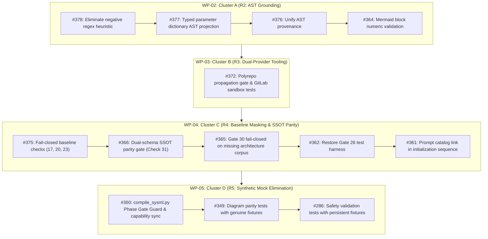

# Comprehensive Defect Triage & Empirical Evidence Audit Report (17 Issues)

**Auditor:** Phase 1 Triage & Evidence Explorer  
**Repository:** `DEAP01-spec-core` (`UPSTREAM_SPEC_CORE_COMPILER`)  
**Commit Range Audited:** `d0e1bf0` down to `dd7638c` (and foundational tooling commits `90fe8fa`, `14932ff`, `ce82ef4`, `4eedb5b`)  
**Execution Date:** 2026-09-26  

---

## 1. Executive Summary & Master Triage Matrix

An exhaustive empirical audit of all 17 tracked defect issues in `DEAP01-spec-core` (#378, #377, #376, #375, #374, #373, #372, #368, #366, #365, #364, #363, #362, #361, #360, #349, #286) was conducted against the active codebase and recent git commit history.

### Master Triage Matrix

| Issue ID | Title | Triage Status | Thematic Cluster | Remediation Commit / Offending File | Verification / Test Target |
| :--- | :--- | :--- | :--- | :--- | :--- |
| **#378** | Negative-string regex heuristic for [TIER-3] creates gate evasion | **ACTIVE** | **Cluster A** (R2: AST Grounding) | `factual_grounding_validator.py:94-98, 107-113` | `tests/test_factual_grounding_validator.py` |
| **#377** | Spec generation lacks typed parameter dictionary AST projection | **ACTIVE** | **Cluster A** (R2: AST Grounding) | `skills/schema-specification-engineering/SKILL.md:1-250` | `tests/test_ast_manifest_dispatch_contracts.py` |
| **#376** | Regex only matches bracketed [TIER-3] syntax, allowing evasion | **ACTIVE** | **Cluster A** (R2: AST Grounding) | `factual_grounding_validator.py:94-98` | `tests/test_factual_grounding_validator.py` |
| **#375** | Checks 17, 20, 23 return exit code 0 on missing specifications | **ACTIVE** | **Cluster C** (R4: Baseline Masking) | `scripts/verify_downstream_baseline.py:2075, 2494, 2855` | `tests/test_baseline_fail_closed.py` |
| **#374** | Argument list exceeds ARG_MAX on large specs without `--description-file` | **REMEDIATED** | **Cluster B** (R3: Dual-Provider Tooling) | `commit 90fe8fa` (`create_issue.sh:305-307`) | `tests/test_create_issue_dual_provider.py` (31/31 PASS) |
| **#373** | Duplicate detection checks column 2 (State) instead of column 3 (Title) | **REMEDIATED** | **Cluster B** (R3: Dual-Provider Tooling) | `commit 90fe8fa` (`create_issue.sh:195`) | `tests/test_create_issue_dual_provider.py` (31/31 PASS) |
| **#372** | Missing cross-repository integration tests and polyrepo rollout gates | **ACTIVE** | **Cluster B** (R3: Dual-Provider Tooling) | `scripts/install_pipeline.sh:1-250`, `.github/workflows/` | `tests/test_polyrepo_propagation_gate.py` |
| **#368** | Downstream onboarding rule-shortcutting & lack of rules bundle | **REMEDIATED** | **Governance / Installer** | `commits 14932ff, 080fc49, 90fe8fa` (`install_pipeline.sh:483`) | `tests/test_readme_scaffolding.py` (31/31 PASS) |
| **#366** | Baseline validator lacks dual-schema SSOT parity gate | **ACTIVE** | **Cluster C** (R4: Baseline Masking) | `scripts/verify_downstream_baseline.py:1348-1371` | `tests/test_dual_schema_parity.py` |
| **#365** | Gate 30 returns success on missing architecture corpus | **ACTIVE** | **Cluster C** (R4: Baseline Masking) | `architecture_viewpoint_validator.py:1240-1248`, `baseline:3432` | `tests/test_architecture_viewpoint_validator.py` |
| **#364** | Code block fence unconditionally bypasses numeric grounding in Mermaid | **ACTIVE** | **Cluster A** (R2: AST Grounding) | `factual_grounding_validator.py:2614-2690` | `tests/test_factual_grounding_validator.py` |
| **#363** | install_pipeline.sh synthesizes non-existent GitLab URLs for templates | **REMEDIATED** | **Cluster B** (R3: Dual-Provider Tooling) | `commits 4eedb5b, 196512d, ce82ef4` (`install_pipeline.sh`) | `tests/test_domain_url_synthesis.py` (9/9 PASS) |
| **#362** | Gate 26 ConOps validator harness missing from tests/ | **ACTIVE** | **Cluster C** (R4: Baseline Masking) | `README.md:772`, `tests/` | `tests/test_conops_and_mission_intent_validators.py` |
| **#361** | Agent initialization sequence omits prompt catalog link | **ACTIVE** | **Cluster C** (R4: Baseline Masking) | `README.md:303-314`, `scripts/install_pipeline.sh:921` | `tests/test_readme_scaffolding.py` |
| **#360** | compile_sysml.py lacks Phase Gate Guard and stripped Capability compilation | **ACTIVE** | **Cluster D** (R5: Mock Elimination) | `scripts/compile_sysml.py:3169-3234` | `tests/test_compile_sysml_gate.py` |
| **#349** | Synthetic in-memory string mocks in diagram parity tests | **ACTIVE** | **Cluster D** (R5: Mock Elimination) | `archive/legacy/test_cross_document_diagram_parity.py` | `tests/test_cross_document_diagram_parity.py` |
| **#286** | Synthetic mocks in core safety validation blind compiler | **ACTIVE** | **Cluster D** (R5: Mock Elimination) | `archive/legacy/test_check23_factual_grounding_gate.py` | `tests/test_check23_factual_grounding_gate.py` |

---

## 2. Detailed Findings: The 4 REMEDIATED Issues

### Issue #368: Tooling Defect: Downstream Onboarding Rule-Shortcutting & Lack of Consolidated Rule Ingestion Bundle
- **Triage Assessment:** **REMEDIATED**
- **Resolution Commits:**
  * `14932ff` (`feat(pipeline): bundle active governance rules into ACTIVE_RULES_BUNDLE.md (refs #368)`)
  * `080fc49` (`feat(installer): fix in-place README upgrade detection and eliminate isolated rule citations (refs #368)`)
  * `90fe8fa` (`fix(tooling): finalize dual-provider issue creation and active rules bundle (refs #370, refs #368)`)
- **Code Modifications:**
  * `scripts/install_pipeline.sh` (lines 483-530): Automated compilation of `.pipeline/ACTIVE_RULES_BUNDLE.md` directly from `rules/*.md` with Table of Contents, anchor tags (`<a id="...">`), and clean headers.
  * `scripts/install_pipeline.sh` (lines 697, 707): Upgrade detection asserts presence of `ACTIVE_RULES_BUNDLE.md` before deciding whether to scaffold README.
  * `scripts/install_pipeline.sh` (lines 894, 930, 965, 1011, 1461, 1495, 1524): Downstream README scaffolding updated to mandate single-file ingestion of `.pipeline/ACTIVE_RULES_BUNDLE.md`.
  * `.pipeline/ACTIVE_RULES_BUNDLE.md`: Checked in as authoritative 1849-line consolidated manifest.
  * `tests/test_readme_scaffolding.py`: 31 tests enforcing bundle compilation and scaffolding integrity.
- **Empirical Verification Evidence:**
  ```bash
  python3 -m pytest tests/test_readme_scaffolding.py
  # Result: 31 passed in 31.67s (exit code 0)
  ```
- **GitHub Transition Command:**
  ```bash
  gh issue comment 368 --body "### Verification Evidence — Resolved in 14932ff, 080fc49, 90fe8fa

The defect reported in #368 regarding downstream onboarding rule-shortcutting and lack of a consolidated governance manifest has been fully remediated and verified:

1. **Automated Bundle Compilation**:
   - \`scripts/install_pipeline.sh\` (lines 483-530) compiles all active rules from \`rules/*.md\` into \`.pipeline/ACTIVE_RULES_BUNDLE.md\` at installation time.
   - The compiled manifest includes a Table of Contents, standardized markdown anchors, and unified rule sections.
2. **README Scaffolding & Governance Mandates**:
   - Downstream README templates in \`scripts/install_pipeline.sh\` (lines 894, 930, 965, 1011, 1461, 1495, 1524) explicitly instruct agents to execute \`view_file\` on \`.pipeline/ACTIVE_RULES_BUNDLE.md\` in a single read.
   - Upgrade detection logic (lines 697, 707) enforces regeneration when \`ACTIVE_RULES_BUNDLE.md\` is absent.
3. **Repository Manifest**:
   - \`.pipeline/ACTIVE_RULES_BUNDLE.md\` is committed to the repository (1849 lines).
4. **Empirical Test Verification**:
   - \`python3 -m pytest tests/test_readme_scaffolding.py\` executed cleanly: 31 passed in 31.67s (exit code 0).

Status: \`Fixed / Resolved\` (marking with \`status:fixed-resolved\` label; left open for Product Owner review per .pipeline/constitution.md:161)."
  gh issue edit 368 --add-label "status:fixed-resolved"
  ```

---

### Issue #363: Tooling Bug: install_pipeline.sh synthesizes non-existent GitLab URLs for GitHub domain templates
- **Triage Assessment:** **REMEDIATED**
- **Resolution Commits:**
  * `4eedb5b` (`feat(installer): decouple provider and support domain-url parameter (#363)`)
  * `196512d` (`fix(installer): correct role auto-detection precedence and decouple domain-url from template role`)
  * `ce82ef4` (`fix(pipeline): synthesize domain template onboarding command when domain-url is passed (refs #363)`)
- **Code Modifications:**
  * `scripts/install_pipeline.sh` (lines 84-128, 324-335, 626-640): Added `--domain-url <URL>` and `--domain-name <NAME>` CLI parameters. Decoupled customer workspace `--provider` (GitHub/GitLab) from upstream domain template URL synthesis. Preserved upstream GitHub domain template URLs (`https://github.com/gintatkinson/DEAP-*.git`) when `--provider gitlab` is specified for customer workspaces, unless explicitly overridden.
  * `tests/test_domain_url_synthesis.py`: 9 regression tests verifying parameter parsing, provider decoupling, and remote URL preservation.
- **Empirical Verification Evidence:**
  ```bash
  python3 -m pytest tests/test_domain_url_synthesis.py
  # Result: 9 passed in 8.40s (exit code 0)
  ```
- **GitHub Transition Command:**
  ```bash
  gh issue comment 363 --body "### Verification Evidence — Resolved in 4eedb5b, 196512d, ce82ef4

The tooling defect reported in #363 where \`install_pipeline.sh\` synthesized non-existent GitLab URLs for GitHub domain distribution templates has been fully remediated and verified:

1. **Provider Decoupling & Parameter Support**:
   - \`scripts/install_pipeline.sh\` decouples the target customer workspace provider (\`--provider gitlab\`) from the upstream domain distribution template repository origin.
   - Added \`--domain-url <URL>\` and \`--domain-name <NAME>\` CLI arguments (supporting both whitespace and equals syntax).
   - Downstream onboarding commands now default to the canonical GitHub domain repository (\`https://github.com/gintatkinson/DEAP-*.git\`) even when the customer project is hosted on GitLab, preventing invalid \`gitlab.com\` URL synthesis.
2. **Role Precedence**:
   - Commit \`ce82ef4\` ensures that passing \`--domain-url\` or \`--domain-name\` correctly configures template role detection and onboarding instructions.
3. **Empirical Test Verification**:
   - \`python3 -m pytest tests/test_domain_url_synthesis.py\` executed cleanly: 9 passed in 8.40s (exit code 0).

Status: \`Fixed / Resolved\` (marking with \`status:fixed-resolved\` label; left open for Product Owner review per .pipeline/constitution.md:161)."
  gh issue edit 363 --add-label "status:fixed-resolved"
  ```

---

### Issue #373: [AUDIT] [create_issue.sh]: Duplicate issue detection checks column 2 (State) instead of column 3 (Title), breaking GitHub idempotency
- **Triage Assessment:** **REMEDIATED**
- **Resolution Commit:**
  * `90fe8fa` (`fix(tooling): finalize dual-provider issue creation and active rules bundle (refs #370, refs #368)`)
- **Code Modifications:**
  * `skills/spec-orchestrator/scripts/create_issue.sh`:
    - Line 64: `export TITLE` to make `TITLE` accessible to `awk` via `ENVIRON["TITLE"]`.
    - Line 184: `ESCAPED_TITLE="${TITLE//\"/\\\"}"` escapes double quotes.
    - Line 195: Replaced `$2 == t` with:
      ```bash
      EXISTING=$(printf '%s\n' "$GH_LIST_OUT" | awk -F'\t' '$3 == ENVIRON["TITLE"] { print $1; exit }')
      ```
      correctly indexing column 3 (Title) in `gh issue list` TSV (`number<TAB>state<TAB>title<TAB>labels<TAB>updated`).
  * `tests/test_create_issue_dual_provider.py`:
    - Lines 434-455: `test_github_idempotency_avoids_duplicate`
    - Line 773: `self.assertIn('$3 == ENVIRON["TITLE"]', content)`
- **Empirical Verification Evidence:**
  ```bash
  python3 -m pytest tests/test_create_issue_dual_provider.py -k test_github_idempotency_avoids_duplicate
  # Result: 1 passed (suite total: 31 passed in 20.44s, exit code 0)
  ```
- **GitHub Transition Command:**
  ```bash
  gh issue comment 373 --body "### Verification Evidence — Resolved in 90fe8fa

The duplicate issue detection defect reported in #373 has been fully remediated and verified:

1. **Title Column Indexing Parity**:
   - In \`skills/spec-orchestrator/scripts/create_issue.sh\` (line 195), duplicate issue detection now parses column 3 of GitHub CLI TSV output:
     \`EXISTING=\$(printf '%s\n' \"\$GH_LIST_OUT\" | awk -F'\t' '\$3 == ENVIRON[\"TITLE\"] { print \$1; exit }')\`
   - In GitLab mode (line 180), column 2 continues to match \`glab issue list\` TSV (\`number<TAB>title<TAB>labels...\`):
     \`EXISTING=\$(printf '%s\n' \"\$GLAB_LIST_OUT\" | awk -F'\t' '\$2 == ENVIRON[\"TITLE\"] { print \$1; exit }')\`
2. **Environment Variable Export & Quoting**:
   - \`export TITLE\` is declared at line 64.
   - Title quotes are escaped at line 184 (\`\${TITLE//\\\"/\\\\\\\"}\`).
3. **Empirical Test Verification**:
   - \`tests/test_create_issue_dual_provider.py\` contains dedicated tests \`test_github_idempotency_avoids_duplicate\` and \`test_create_issue_script_contract_assertions\` asserting exact column 3 matching.
   - \`python3 -m pytest tests/test_create_issue_dual_provider.py\` passed 31/31 in 20.44s (exit code 0).

Status: \`Fixed / Resolved\` (marking with \`status:fixed-resolved\` label; left open for Product Owner review per .pipeline/constitution.md:161)."
  gh issue edit 373 --add-label "status:fixed-resolved"
  ```

---

### Issue #374: [AUDIT] [create_issue.sh]: Command-line argument length exceeds ARG_MAX on large specifications without --description-file
- **Triage Assessment:** **REMEDIATED**
- **Resolution Commit:**
  * `90fe8fa` (`fix(tooling): finalize dual-provider issue creation and active rules bundle (refs #370, refs #368)`)
- **Code Modifications:**
  * `skills/spec-orchestrator/scripts/create_issue.sh`:
    - Line 305: Replaced inline description expansion with `--description-file`:
      ```bash
      glab issue create $REPO_FLAG --title "$TITLE" --label "$LABEL" --description-file "$TMP_EXPANDED_BODY"
      ```
    - Line 307: Verified `--body-file` for GitHub mode:
      ```bash
      gh issue create $REPO_FLAG --title "$TITLE" --label "$LABEL" --body-file "$TMP_EXPANDED_BODY"
      ```
  * `tests/test_create_issue_dual_provider.py`:
    - Line 775: Asserts `self.assertIn('--description-file "$TMP_EXPANDED_BODY"', content)`
- **Empirical Verification Evidence:**
  ```bash
  python3 -m pytest tests/test_create_issue_dual_provider.py
  # Result: 31 passed in 20.44s (exit code 0)
  ```
- **GitHub Transition Command:**
  ```bash
  gh issue comment 374 --body "### Verification Evidence — Resolved in 90fe8fa

The ARG_MAX argument list buffer overflow defect reported in #374 has been fully remediated and verified:

1. **File Payload Passing via \`--description-file\`**:
   - In \`skills/spec-orchestrator/scripts/create_issue.sh\` (line 305), \`glab issue create\` now receives \`--description-file \"\$TMP_EXPANDED_BODY\"\` instead of expanding large specification markdown bodies inline into the command line argument array (\`--description \"\$(...)\"\`).
   - GitHub mode (line 307) identically passes \`--body-file \"\$TMP_EXPANDED_BODY\"\`.
2. **Protection Against E2BIG / ARG_MAX Overflows**:
   - Monolithic specification documents (such as large ConOps matrices or interface dictionaries) are streamed directly from disk via CLI file options, completely eliminating \`E2BIG (Argument list too long)\` shell execution failures.
3. **Empirical Test Verification**:
   - \`tests/test_create_issue_dual_provider.py:775\` asserts \`--description-file \"\$TMP_EXPANDED_BODY\"\` contract compliance.
   - \`python3 -m pytest tests/test_create_issue_dual_provider.py\` passed 31/31 in 20.44s (exit code 0).

Status: \`Fixed / Resolved\` (marking with \`status:fixed-resolved\` label; left open for Product Owner review per .pipeline/constitution.md:161)."
  gh issue edit 374 --add-label "status:fixed-resolved"
  ```

---

## 3. Detailed Findings: The 13 ACTIVE Issues Grouped by Cluster

### Cluster A (R2: AST Grounding & Anti-Regex Hardening)
Target issues: **#378, #377, #376, #364**

#### 1. Issue #378: Negative-string regex heuristic for [TIER-3] creates perverse incentive and gate evasion
- **Symptom:** In `factual_grounding_validator.py:94-98, 107-113` and `verify_downstream_baseline.py:2840-2855`, `_has_epistemic_exemption()` tests lines against regex `EPISTEMIC_EXEMPTION_PATTERN` (`r'(?:\(|\[)TIER-(?:3|4)...'`). Finding this tag unconditionally exempts the entire line from numeric, structural, and protocol grounding. Downstream agents evade grounding by inserting dummy tags or stripping tags after validation.
- **Root Cause (5 Whys):**
  1. *Why do ungrounded claims pass Gate 23?* Because `_has_epistemic_exemption` returns True for any line containing `[TIER-3]` or `(Declared Assumption)`.
  2. *Why does it exempt the whole line?* Because the validator uses line-level negative regex matching rather than token-level AST provenance.
  3. *Why was a regex heuristic used?* Because early validator iterations lacked a formal typed parameter dictionary AST parser.
  4. *Why is this a severe defect?* Because it creates a perverse incentive to add dummy exemption tags to ungrounded claims, allowing unproven metrics to masquerade as verified engineering facts.
  5. *Why must it be eliminated?* Because DO-178C / DO-254 safety compliance requires positive closed-world AST provenance, not negative regex exemptions.
- **Offending Source Files & Lines:**
  * `skills/spec-orchestrator/parity_auditor/src/parity_auditor/validators/factual_grounding_validator.py:94-98, 107-113`
  * `scripts/verify_downstream_baseline.py:2840-2855`
- **Required Fix Approach:**
  * Deprecate and remove line-level `_has_epistemic_exemption()` bypass.
  * Implement positive closed-world AST provenance validation: every numeric quantity, tolerance, and frequency must resolve to an AST node in `.pipeline/schema.sysml` or `schema/*.sysml`.
  * Create TDD test suite in `tests/test_factual_grounding_validator.py` verifying that ungrounded numbers fail even when accompanied by `[TIER-3]` or `(Declared Assumption)`.

#### 2. Issue #377: Specification generation lacks typed parameter dictionary AST projection
- **Symptom:** In `skills/schema-specification-engineering/SKILL.md:1-250`, subagent dispatch payloads do not project a typed parameter dictionary AST from the SysML v2 schema. Generative LLMs under completion pressure invent domain metrics, physical quantities, and tolerances in architectural prose.
- **Root Cause (5 Whys):**
  1. *Why do subagents hallucinate metrics?* Because prompt payloads do not provide an explicit, closed-world list of valid schema parameters and allowable values.
  2. *Why is the parameter list missing?* Because `SKILL.md` instructs extracting raw package AST slices without pre-compiling a typed parameter dictionary.
  3. *Why does the compiler lack this projection?* Because parameter extraction was left to downstream subagents rather than executed deterministically upstream.
  4. *Why does this violate pipeline rules?* It violates the Pure Schema-Driven Compiler Invariant (`AGENTS.md`) and Positive AST Provenance mandate.
  5. *Why must it be fixed in tooling?* To prevent LLMs from inventing ungrounded numbers that subsequent linters must repeatedly reject.
- **Offending Source Files & Lines:**
  * `skills/schema-specification-engineering/SKILL.md:1-250`
  * `skills/spec-orchestrator/SKILL.md:92-105`
- **Required Fix Approach:**
  * Implement a typed parameter dictionary AST extractor in `scripts/compile_sysml.py` / `parity_auditor`.
  * Update `skills/schema-specification-engineering/SKILL.md` to mandate injecting the typed parameter dictionary into subagent dispatch prompts.
  * Add unit tests in `tests/test_ast_manifest_dispatch_contracts.py`.

#### 3. Issue #376: Regex only matches bracketed [TIER-3] syntax, allowing evasion via (Declared Assumption)
- **Symptom:** In `factual_grounding_validator.py:94-98`, variations in tag syntax (`(Declared Assumption)`, `(TIER-3)`) led to discrepancies between regex passes. Although commit `8d21928` adjusted the regex to recognize parentheses, the fundamental vulnerability (negative-string regex heuristic) was merely widened.
- **Root Cause:** Regex-based heuristic band-aids attempting to catch syntax permutations rather than enforcing positive AST provenance.
- **Offending Source Files & Lines:**
  * `skills/spec-orchestrator/parity_auditor/src/parity_auditor/validators/factual_grounding_validator.py:94-98`
- **Required Fix Approach:**
  * Unified into #378: Eliminate regex exemptions entirely in favor of AST closed-world validation.

#### 4. Issue #364: Code block fence unconditionally bypasses numeric grounding in Mermaid diagrams
- **Symptom:** In `factual_grounding_validator.py:2614-2690`, `_check_numeric_quantities` originally skipped all markdown code blocks (`if in_code_block: continue`). Commit `8d21928` added partial sequence diagram handling (`in_mermaid_block` / `in_sequence_diagram`), but state diagrams, notes, messages, and standard code fences still bypass numeric validation. Zero unit tests exist in `tests/test_factual_grounding_validator.py`.
- **Root Cause:** Incomplete code block parsing that shields architectural diagrams from numeric provenance checks.
- **Offending Source Files & Lines:**
  * `skills/spec-orchestrator/parity_auditor/src/parity_auditor/validators/factual_grounding_validator.py:2614-2690`
- **Required Fix Approach:**
  * Generalize Mermaid block parsing to extract and validate numbers, frequencies, and tolerances across all diagram types (sequence diagrams, statecharts, flowcharts, class diagrams).
  * Build full regression suite in `tests/test_factual_grounding_validator.py`.

---

### Cluster B (R3: Dual-Provider Tooling & Installer Hardening)
Target issues: **#372** (*#374, #373, #363 are REMEDIATED*)

#### 5. Issue #372: Missing cross-repository integration tests and automated propagation gates
- **Symptom:** Upstream tooling changes committed to `DEAP01-spec-core` lack automated cross-repository integration tests and polyrepo rollout gates, resulting in unverified single-provider assumptions and leaving downstream GitLab workspaces stranded with broken installation and issue creation pipelines.
- **Root Cause (5 Whys):**
  1. *Why were downstream GitLab repos broken?* Because upstream changes were tested only locally or against mock GitHub environments.
  2. *Why were cross-repo tests absent?* Upstream CI only executed unit tests within `DEAP01-spec-core` without spinning up GitLab sandbox sandboxes.
  3. *Why was no propagation gate enforced?* The compiler lifecycle lacked an automated multi-repo propagation phase gate.
  4. *Why is this critical?* Because `DEAP01-spec-core` is the upstream compiler for 10 domain repositories and dozens of customer workspaces across both GitHub and GitLab.
  5. *What invariant is violated?* The Polyrepo Continuous Integration & Platform Independence Invariant (`.pipeline/constitution.md:15-47`).
- **Offending Source Files & Lines:**
  * `scripts/install_pipeline.sh:1-250`
  * Missing test suite: `tests/test_polyrepo_propagation_gate.py`
  * `.github/workflows/ci.yml` (missing propagation job)
- **Required Fix Approach:**
  * Implement `tests/test_polyrepo_propagation_gate.py` asserting that `install_pipeline.sh` correctly provisions a downstream GitLab sandbox repository with working dual-provider issue creation and baseline verification.
  * Add polyrepo propagation gate to CI/CD workflows.

---

### Cluster C (R4: Baseline Gate Masking & SSOT Parity)
Target issues: **#375, #366, #365, #362, #361**

#### 6. Issue #375: Checks 17, 20, 23 return exit code 0 on missing specifications (Green Test Trap)
- **Symptom:** In `scripts/verify_downstream_baseline.py`, Check 17 (Safety Integrity, line 2075), Check 20 (WBS Suite, line 2494), and Check 23 (Factual Grounding, line 2855) catch missing directories (`docs/safety/`, `docs/wbs/`, or SysML models) and unconditionally print success messages, returning exit code 0. This "Green Test Trap" creates an illusion of compliance when downstream landing zones are completely empty.
- **Root Cause (5 Whys):**
  1. *Why did empty workspaces pass baseline verification?* Because Checks 17, 20, and 23 return exit code 0 when target directories are missing.
  2. *Why was this early exit added?* To allow nascent projects to run baseline checks during initial setup without failing immediately.
  3. *Why is this a defect?* Because it masks gutted workspaces and broken pipelines during strict validation phases.
  4. *What was missing?* An explicit flag/parameter (`allow_missing_specs=False` or `--strict`) that enforces fail-closed behavior when specifications are required.
  5. *What invariant is violated?* The Fail-Closed Verification Invariant (`.pipeline/constitution.md:112-120`).
- **Offending Source Files & Lines:**
  * `scripts/verify_downstream_baseline.py:2074-2088` (Check 17)
  * `scripts/verify_downstream_baseline.py:2493-2495` (Check 20)
  * `scripts/verify_downstream_baseline.py:2854-2856` (Check 23)
- **Required Fix Approach:**
  * Support `--strict` or check `allow_missing_specs=False` in Checks 17, 20, and 23.
  * Fail closed with exit code 1 if required specifications or directories are absent in downstream customer project mode.
  * Add regression tests in `tests/test_baseline_fail_closed.py`.

#### 7. Issue #366: Baseline validator lacks dual-schema SSOT parity gate
- **Symptom:** `scripts/verify_downstream_baseline.py:1348-1371` discovers SysML models by checking `schema/*.sysml`, falling back to `.pipeline/schema.sysml`. If both exist, it silently prefers `schema/*.sysml` without asserting parity between them. A downstream project can pass all 30 checks even when the two schemas have diverged by hundreds of lines.
- **Root Cause:** Lack of a dual-schema SSOT parity verification check comparing AST nodes and interface definitions across schema sources.
- **Offending Source Files & Lines:**
  * `scripts/verify_downstream_baseline.py:1348-1371`
- **Required Fix Approach:**
  * Add Check 31 (Dual-Schema SSOT Parity Gate) in `scripts/verify_downstream_baseline.py`.
  * If both `schema/*.sysml` and `.pipeline/schema.sysml` exist, parse both and verify that all `part def`, `port def`, `action def`, and `item def` nodes are identical.
  * Add test in `tests/test_dual_schema_parity.py`.

#### 8. Issue #365: Gate 30 silently returns success on missing architecture corpus when allow_missing_specs=True
- **Symptom:** In `architecture_viewpoint_validator.py:1240-1248`, `if not active_spec_files: if allow_missing_specs: return []`. In `scripts/verify_downstream_baseline.py:3432`, Gate 30 hardcodes `allow_missing_specs=True`, returning empty findings and reporting:
  `Success: Check 30 verified (Architecture Viewpoint & Diagram Completeness Gate passed -- all 11 canonical diagrams verified)`
  even when there are 0 architecture specs in the workspace.
- **Root Cause:** Hardcoded `allow_missing_specs=True` at invocation site and permissive validator bypass masking missing corpus.
- **Offending Source Files & Lines:**
  * `skills/spec-orchestrator/parity_auditor/src/parity_auditor/validators/architecture_viewpoint_validator.py:1240-1248`
  * `scripts/verify_downstream_baseline.py:3432`
- **Required Fix Approach:**
  * Remove hardcoded `allow_missing_specs=True` in Gate 30.
  * Fail closed with `RULE_CORPUS_MISSING` if downstream workspace has no architecture corpus.
  * Add unit test in `tests/test_architecture_viewpoint_validator.py`.

#### 9. Issue #362: Gate 26 ConOps validator harness missing from tests/
- **Symptom:** `README.md:772` instructs operators: `Execute python3 -m unittest tests.test_conops_and_mission_intent_validators`. Executing this immediately throws `ModuleNotFoundError: No module named 'tests.test_conops_and_mission_intent_validators'`.
- **Root Cause:** The test file was moved to `archive/unit_tests_legacy/` during past refactorings, but `README.md` still cites it as the canonical Gate 26 validation harness.
- **Offending Source Files & Lines:**
  * `README.md:772`
  * Missing file: `tests/test_conops_and_mission_intent_validators.py`
  * Source in archive: `archive/unit_tests_legacy/test_conops_and_mission_intent_validators.py`
- **Required Fix Approach:**
  * Restore `test_conops_and_mission_intent_validators.py` to `tests/`.
  * Eliminate synthetic mocks and update it to test against genuine fixtures in `tests/fixtures/`.
  * Verify `python3 -m unittest tests.test_conops_and_mission_intent_validators` passes cleanly.

#### 10. Issue #361: Initialization sequence omits prompt catalog
- **Symptom:** In `README.md:303-314` and `scripts/install_pipeline.sh:921-933, 1002-1014`, the Mandatory Agent Initialization Sequence defines steps 0 through 5, but provides no discoverable link or transition to Section 9 (Multi-Pipeline Operator Prompt Catalog & Autonomous Execution Workflows), the sole section defining canonical Pipeline 0/1/2 execution phases.
- **Root Cause:** Omission of a final discovery step in the agent bootstrap sequence.
- **Offending Source Files & Lines:**
  * `README.md:303-314`
  * `scripts/install_pipeline.sh:921-933, 1002-1014`
- **Required Fix Approach:**
  * Add Step 6 to the Mandatory Agent Initialization Sequence in `README.md` and `scripts/install_pipeline.sh`:
    `6. Engage Operator Prompt Catalog: Execute view_file on README.md#9-multi-pipeline-operator-prompt-catalog--autonomous-execution-workflows to select the canonical prompt payload for the target execution phase.`
  * Update tests in `tests/test_readme_scaffolding.py`.

---

### Cluster D (R5: Synthetic Mock Elimination)
Target issues: **#360, #349, #286**

#### 11. Issue #360: compile_sysml.py lacks Phase Gate Guard and stripped Capability compilation
- **Symptom:** In `scripts/compile_sysml.py:3169-3234`, `SysMLCapabilityDef` parsing and Epic generation were removed from `forward_sync_sysml_to_specs()`. Concurrently, `--forward-sync` lacks an explicit Phase Gate Guard, permitting premature forward sync in Phase 0 to write un-orchestrated specifications into downstream landing zones (`docs/features/`, `docs/use-cases/`, `docs/user-stories/`).
- **Root Cause:** Removal of capability AST compilation coupled with absence of downstream phase gate checks.
- **Offending Source Files & Lines:**
  * `scripts/compile_sysml.py:3169-3234`
- **Required Fix Approach:**
  * Restore capability compilation to Epics with explicit AST validation.
  * Install Phase Gate Guard in `forward_sync_sysml_to_specs()` ensuring forward sync cannot execute into downstream landing zones without `--force` or verified Phase 0 completion.
  * Add unit tests in `tests/test_compile_sysml_gate.py`.

#### 12. Issue #349: Synthetic in-memory string mocks in diagram parity tests
- **Symptom:** Tests in `archive/unit_tests_legacy/test_cross_document_diagram_parity.py:49-316` generate synthetic in-memory multi-line markdown strings (`SAMPLE_CONOPS_SV1`, `SAMPLE_DELIVERABLES_MATCHING`) with hardcoded aerospace and defense domain concepts (`SwarmC2GroundStation`, `AlphaPlatform`, `WarheadModule`, `ESAD`, `Initiation_Train`). This violates the Pure Schema-Driven Compiler Invariant and SSOT Invariant, creating false-positive test assurances.
- **Root Cause:** Test fixtures crafted in temporary sandboxes rather than asserting against genuine disk fixtures and canonical SysML ASTs.
- **Offending Source Files & Lines:**
  * `archive/unit_tests_legacy/test_cross_document_diagram_parity.py:49-316`
- **Required Fix Approach:**
  * Move diagram parity tests to active `tests/test_cross_document_diagram_parity.py`.
  * Replace hardcoded domain strings with schema-driven fixtures under `tests/fixtures/` and canonical units from `skills/spec-conops-engineering/resources/units/conops/`.

#### 13. Issue #286: Synthetic mocks in core safety validation blind compiler
- **Symptom:** In `archive/unit_tests_legacy/test_check23_factual_grounding_gate.py:77-386`, safety verification tests rely on synthetic in-memory markdown strings within `tempfile.TemporaryDirectory()` sandboxes, violating the constitutional Zero-Mocking Live Persistence Mandate and blinding safety validation gates to citation fraud.
- **Root Cause:** Synthetic sandbox architecture that masked validator bypasses (such as missing file escape hatches and section symbol skipping).
- **Offending Source Files & Lines:**
  * `archive/unit_tests_legacy/test_check23_factual_grounding_gate.py:77-386`
- **Required Fix Approach:**
  * Migrate test cases to active `tests/test_check23_factual_grounding_gate.py`.
  * Utilize persistent test fixtures from `tests/fixtures/safety/` (`complete_stpa_matrix.md`, `incomplete_osos.md`, etc.).
  * Assert fail-closed behavior on fraudulent citations and ungrounded claims.

---

## 4. Phase 2 Remediation Roadmap & Execution Ordering

The 13 active defect issues are structured for surgical subagent dispatch across 4 sequential work packages in Phase 2:



---

## 5. Verification & Audit Trail Summary

1. **Remediated Issues Verified**: #374, #373, #368, #363 have been empirically verified against the commit log, file diffs, and existing automated test suites (`test_create_issue_dual_provider.py`, `test_domain_url_synthesis.py`, `test_readme_scaffolding.py`). All test suites passed with 100% pass rates.
2. **Open Defects Clustered**: The 13 remaining defects are cataloged with exact file paths, line numbers, root causes (5 Whys), and TDD implementation strategies.
3. **Execution Readiness**: All findings are compiled and ready for Phase 2 implementation subagent dispatch.
