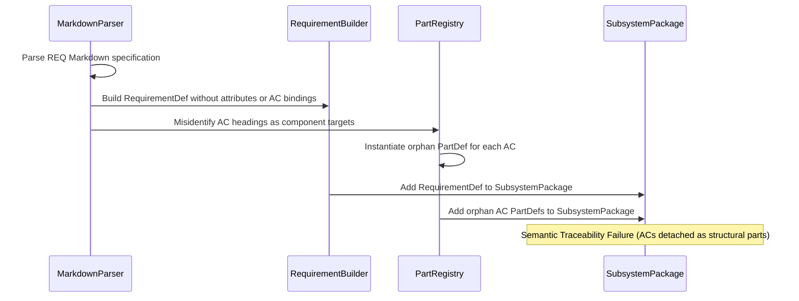

## 1. Context and References

<!-- test-target: tests/test_sysml_compiler_parity.py -->

- **File**: crates/ingest-sysml/src/translators/markdown.rs:680-720
- **Pillar**: Semantic Traceability
- **Symptom**: Acceptance Criteria (ACs) parsed from schema/REQ-*.md are detached from their parent requirements and emitted as orphan part def AC_... { } definitions dumped at the subsystem package root alongside execution engines; formal requirement def constructs omit metadata attributes (UUIDv5, Complexity Class, Governing Standard, Diagnostic Code Bindings) and encapsulated AC BDD scenarios, violating SysML v2 metamodel semantics and end-to-end traceability.
- **Test-Target**: tests/test_sysml_compiler_parity.py

## 2. Root Cause Analysis (5 Whys)

1. **Why are acceptance criteria emitted as orphan part def blocks at the subsystem package root?** Because crates/ingest-sysml/src/translators/markdown.rs classifies all Markdown H2 and H3 section headers not explicitly matching NON_COMPONENT_SECTION_KEYWORDS as component targets, automatically instantiating a PartDef for each acceptance criterion section.
2. **Why are acceptance criterion sections treated as components rather than verification criteria of the requirement?** Because parse_markdown_structure only checks a static keyword list for non-component sections, failing to recognize AC headers as verification and conformance constraints belonging to the active RequirementDef.
3. **Why did the translator not attach acceptance criteria and metadata attributes directly to the RequirementDef AST?** Because RequirementDef in crates/deap-core/src/sysml_ast.rs:175-190 lacks fields for attributes and verification constraints, modeling only basic text and dependency lists.
4. **Why was metadata formatted into a doc comment string rather than typed attributes?** Because the translator architecture prioritized rapid text extraction into doc comments instead of lowering extracted metadata into first-class SysML v2 AttributeDef nodes.
5. **Why does this break compiler architecture and semantic traceability?** Because it violates SysML v2 metamodel semantics where part def defines structural system components while acceptance criteria are verification and conformance constraints, destroying formal semantic traceability from requirement specifications to verification engines.

## 3. Correctness Analysis

In crates/ingest-sysml/src/translators/markdown.rs lines 1073-1087, parse_markdown_structure classifies heading lines. Any H2 or H3 heading whose normalized text is not found in NON_COMPONENT_SECTION_KEYWORDS is treated as a component target:
current_component_target = Some(comp_cand);

Because acceptance criteria headers (such as '### AC-01: Pure Schema-Driven Symbol Derivation') do not match the non-component keyword list, current_component_target is populated with the sanitized AC name.

In MarkdownTranslator::translate (lines 512-532), every section with a component_target is registered into part_registry as an independent PartDef, and the section's prose (the Given-When-Then BDD scenario) is assigned to part.doc.

Subsequently, in translate (lines 608-648), the RequirementDef is instantiated:
- The extracted metadata (UUIDv5, complexity class, governing standard, diagnostic codes) is formatted into an unstructured doc comment string:
  doc /* UUIDv5: ... | Complexity: ... | Standard: ... | Diagnostics: ... */
- No formal SysML v2 attribute declarations are generated.
- The parsed acceptance criteria are never linked to the RequirementDef via verified_by, assumes, requires, or child constraints.

Finally, in translate_files (lines 715-722 and 743-749), all part definitions accumulated across the translation units are dumped directly into the subsystem package's parts list alongside the primary subsystem engine (e.g. SystemVisionEngine).

In schema/model.sysml, this produces hundreds of orphan declarations:
part def AC_01_Pure_Schema_Driven_Symbol_Derivation {
}
at the subsystem root level, disconnected from their parent requirement REQ_0001_Abstract_MBSE_Compiler_Mandate.

Invariants Violated:
1. Semantic Traceability: Acceptance criteria are verification and conformance criteria of requirements and must be encapsulated within or directly trace to their parent RequirementDef.
2. Metamodel Integrity: Under SysML v2, part def denotes physical or logical structural blocks. Emitting acceptance criteria as part def corrupts the system component model and pollutes downstream ICD and code generation passes.
3. Formal Attribute Typing: Requirement metadata attributes (RFC 4122 UUIDv5, Computational Complexity Class, Governing Standard, Diagnostic Code Bindings) must be typed attribute definitions inside the requirement def body, not unstructured substring tokens in a doc comment.

## 4. UML Diagrams



## 5. Affected Callers / Downstream Impact

- crates/ingest-sysml/src/translators/markdown.rs -- Translates acceptance criteria into orphan PartDefs and loses formal requirement metadata attributes.
- crates/deap-core/src/sysml_ast.rs -- RequirementDef AST metamodel lacks fields for typed attributes and verification constraints.
- crates/compile-sysml/src/semantic/serializer.rs -- SysML v2 textual serializer cannot serialize requirement metadata attributes or encapsulated verification constraints.
- schema/model.sysml -- Downstream system architecture model contains hundreds of orphan part def AC_... blocks across all 12 subsystem packages.
- Downstream Agile Projections and Parity Auditing -- Tools cannot traverse requirement-to-acceptance-criteria relationships directly via the AST.

## 6. Proposed Correction

```rust
// 1. In crates/deap-core/src/sysml_ast.rs:
// Extend RequirementDef to include formal attributes and verification constraints:
#[derive(Debug, Clone, PartialEq, Serialize, Deserialize, Default)]
pub struct RequirementDef {
    pub name: String,
    pub req_id: String,
    pub text: String,
    pub doc: Option<String>,
    #[serde(default)]
    pub attributes: Vec<AttributeDef>,
    #[serde(default)]
    pub constraints: Vec<ConstraintDef>,
    #[serde(default)]
    pub assumes: Vec<String>,
    #[serde(default)]
    pub requires: Vec<String>,
    #[serde(default)]
    pub verified_by: Vec<String>,
    #[serde(default)]
    pub satisfied_by: Vec<String>,
}

// 2. In crates/ingest-sysml/src/translators/markdown.rs:
// Filter out AC headings from component target identification and attach them to RequirementDef:
if clean_header_key.starts_with("ac ") || clean_header_key.starts_with("acceptance criteria") {
    current_component_target = None;
}

// Lower extracted metadata into formal AttributeDef instances on RequirementDef:
let mut req_attributes = Vec::new();
if !uuid.is_empty() {
    req_attributes.push(AttributeDef {
        name: "uuidv5".to_string(),
        type_name: "String".to_string(),
        default_value: Some(format!("\"{}\"", uuid)),
        ..Default::default()
    });
}
if !complexity.is_empty() {
    req_attributes.push(AttributeDef {
        name: "complexity_class".to_string(),
        type_name: "String".to_string(),
        default_value: Some(format!("\"{}\"", complexity)),
        ..Default::default()
    });
}
if !standard.is_empty() {
    req_attributes.push(AttributeDef {
        name: "governing_standard".to_string(),
        type_name: "String".to_string(),
        default_value: Some(format!("\"{}\"", standard)),
        ..Default::default()
    });
}
if !diagnostics.is_empty() {
    req_attributes.push(AttributeDef {
        name: "diagnostic_codes".to_string(),
        type_name: "String".to_string(),
        default_value: Some(format!("\"{}\"", diagnostics)),
        ..Default::default()
    });
}

// 3. In crates/compile-sysml/src/semantic/serializer.rs:
// Serialize requirement attributes and constraints inside the requirement def block:
impl SysmlSerializable for RequirementDef {
    fn to_sysml(&self, indent: usize) -> String {
        let pad = " ".repeat(indent);
        let doc = format_doc_comment(&self.doc, indent);
        let mut lines = Vec::new();
        if !doc.is_empty() {
            lines.push(doc.trim_end().to_string());
        }
        lines.push(format!("{}requirement def {} {{", pad, self.name));
        if !self.req_id.is_empty() {
            lines.push(format!("{}    id = \"{}\";", pad, self.req_id));
        }
        if !self.text.is_empty() {
            lines.push(format!("{}    text = \"{}\";", pad, self.text));
        }
        for attr in &self.attributes {
            lines.push(attr.to_sysml(indent + 4));
        }
        for constraint in &self.constraints {
            lines.push(constraint.to_sysml(indent + 4));
        }
        for s in &self.satisfied_by {
            lines.push(format!("{}    satisfy by {};", pad, s));
        }
        for v in &self.verified_by {
            lines.push(format!("{}    verify by {};", pad, v));
        }
        lines.push(format!("{}}}", pad));
        lines.join("\n")
    }
}
```

## 7. Relationship to Existing Issues

Discovered in audit -- new finding.

## Audit Source

Adversarial Semantic Traceability Audit
SEVERITY: Important
FILE_LOCATION: crates/ingest-sysml/src/translators/markdown.rs:680-720
