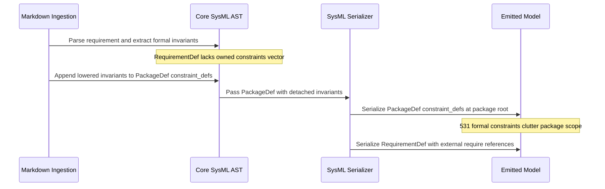

## 1. Context and References

<!-- test-target: scripts/verify_downstream_baseline.py -->

- **File**: `schema/model.sysml:37-176`
- **Pillar**: Semantic Traceability
- **Symptom**: In `schema/model.sysml`, 531 `constraint def Invariant_REQ_XXXX_...` statements are emitted at the package root level of each subsystem package, outside of and preceding the `requirement def` blocks that define them, separating mathematical invariant formulas and their doc comments from their enclosing requirement classifiers.
- **Test-Target**: `scripts/verify_downstream_baseline.py`

## 2. Root Cause Analysis (5 Whys)

1. **Why are 531 formal invariant constraints emitted at the root level of subsystem packages in `schema/model.sysml`?** Because the SysML serializer emits `PackageDef.constraint_defs` at package scope prior to emitting `PackageDef.requirement_defs`.
2. **Why are the formal invariant definitions placed in `PackageDef.constraint_defs` rather than on the requirement entities?** Because `RequirementDef` in `crates/deap-core/src/sysml_ast.rs` lacks a `pub constraints: Vec<ConstraintDef>` field to hold owned constraint definitions.
3. **Why does the ingestion translator route lowered invariants to `PackageDef.constraint_defs`?** Because `crates/ingest-sysml/src/translators/markdown.rs` extracts invariant math blocks from requirement markdown specifications and appends them to package-level collections instead of encapsulating them within the lowered `RequirementDef`.
4. **Why was `RequirementDef` modeled without an owned constraints collection?** Because initial AST modeling treated requirements merely as textual metadata containers with `requires` string references, overlooking that SysML v2 / KerML classifies `requirement def` as a specialized classifier capable of directly owning formal constraint definitions and assertions.
5. **Why is package-level invariant emission a semantic traceability defect?** Because emitting 40-50 top-level constraints before requirements appear pollutes subsystem package namespaces and decouples mathematical invariant formulas from the requirement classifiers that govern them.

## 3. Correctness Analysis

In `crates/ingest-sysml/src/translators/markdown.rs:1052-1061`, formal invariant constraints are extracted from specification markdown files via `extract_formal_invariants`. Because `RequirementDef` in `crates/deap-core/src/sysml_ast.rs:177-196` lacks a `constraints: Vec<ConstraintDef>` field, the translator appends each invariant directly to `pkg.constraint_defs` at line 1059. During multi-file translation aggregation in `translate_files` (`crates/ingest-sysml/src/translators/markdown.rs:1151-1157`), these constraints are collected into `subsystem_constraints` and assigned to `PackageDef.constraint_defs` at lines 1219-1221.

When serializing to canonical SysML v2 textual notation in `crates/compile-sysml/src/semantic/serializer.rs:424-429`, `PackageDef::to_sysml` iterates over `self.constraint_defs` before `self.requirement_defs`. Consequently, all 531 `constraint def Invariant_REQ_XXXX_...` statements across the 12 subsystem packages in `schema/model.sysml` are emitted at the package root level, separated from the requirement definitions that govern them. Subsystem packages (e.g. `Subsystem_1_System_Vision` at lines 37-176) are cluttered with 40-50 top-level constraints before requirements or structural parts appear.

Furthermore, `RequirementDef::to_sysml` in `crates/compile-sysml/src/semantic/serializer.rs:182-218` only serializes `require` reference names, unable to serialize encapsulated constraint definitions within the requirement block.

Invariant Violated: In OMG SysML v2 and KerML specifications, a `requirement def` is a specialized classifier capable of owning formal constraint definitions and assertions directly within its body. Scattering constraints into package-level namespaces violates the Pure Schema-Driven Metamodel Alignment and Semantic Traceability Invariants by severing the co-location of formal mathematical invariants and their governing requirements.

## 4. UML Diagrams



## 5. Affected Callers / Downstream Impact

Subsystem Packages in schema/model.sysml -- All 12 subsystem packages are cluttered with 40-50 top-level constraints preceding requirement and part definitions, obscuring package structure.
Downstream Formal Verification Solvers -- Model checkers and analysis engines traversing RequirementDef AST nodes cannot evaluate owned formal invariants directly, requiring indirect joins against package-level constraint tables.
Downstream Specification Projections -- Document generators and agile projection engines cannot co-locate formal invariant expressions and doc comments within requirement blocks without custom cross-referencing logic.

## 6. Proposed Correction

```rust
// 1. crates/deap-core/src/sysml_ast.rs: Add owned constraints to RequirementDef
#[derive(Debug, Clone, PartialEq, Serialize, Deserialize, Default)]
pub struct RequirementDef {
    pub name: String,
    pub req_id: String,
    pub text: String,
    pub doc: Option<String>,
    #[serde(default)]
    pub attributes: Vec<AttributeDef>,
    #[serde(default)]
    pub constraints: Vec<ConstraintDef>,
    #[serde(default)]
    pub assumes: Vec<String>,
    #[serde(default)]
    pub requires: Vec<String>,
    #[serde(default)]
    pub verified_by: Vec<String>,
    #[serde(default)]
    pub satisfied_by: Vec<String>,
    #[serde(default)]
    pub derived_from: Vec<String>,
    #[serde(default)]
    pub derives: Vec<String>,
}

// 2. crates/compile-sysml/src/semantic/serializer.rs: Serialize owned constraints inside RequirementDef body
impl SysmlSerializable for RequirementDef {
    fn to_sysml(&self, indent: usize) -> String {
        let pad = " ".repeat(indent);
        let doc = format_doc_comment(&self.doc, indent);
        let mut lines = Vec::new();
        if !doc.is_empty() {
            lines.push(doc.trim_end().to_string());
        }
        lines.push(format!("{}requirement def {} {{", pad, self.name));
        if !self.req_id.is_empty() {
            lines.push(format!("{}    id = \"{}\";", pad, self.req_id));
        }
        if !self.text.is_empty() {
            lines.push(format!("{}    text = \"{}\";", pad, self.text));
        }
        for a in &self.attributes {
            lines.push(a.to_sysml(indent + 4));
        }
        for c in &self.constraints {
            lines.push(c.to_sysml(indent + 4));
        }
        for a in &self.assumes {
            lines.push(format!("{}    assume {};", pad, a));
        }
        for r in &self.requires {
            lines.push(format!("{}    require {};", pad, r));
        }
        for d in &self.derived_from {
            lines.push(format!("{}    derived from {};", pad, d));
        }
        for v in &self.verified_by {
            lines.push(format!("{}    verify by {};", pad, v));
        }
        for s in &self.satisfied_by {
            lines.push(format!("{}    satisfy by {};", pad, s));
        }
        lines.push(format!("{}}}", pad));
        lines.join("\n")
    }
}

// 3. crates/ingest-sysml/src/translators/markdown.rs: Encapsulate formal invariants within RequirementDef
let formal_invariants = extract_formal_invariants(content, &num_str);
let mut req_constraints = Vec::new();
let mut requires = Vec::new();
for inv in formal_invariants {
    if !requires.contains(&inv.name) {
        requires.push(inv.name.clone());
    }
    req_constraints.push(inv);
}

let req_def = RequirementDef {
    name: req_name,
    req_id: req_id.clone(),
    text: normative_text,
    doc: Some(doc_str),
    attributes: req_attributes,
    constraints: req_constraints,
    requires,
    derived_from,
    verified_by,
    satisfied_by: vec![sub_meta.engine_name],
    ..Default::default()
};
```

## 7. Relationship to Existing Issues

Discovered in audit -- new finding.

## Audit Source

Adversarial Semantic Traceability Audit
SEVERITY: Important
FILE_LOCATION: schema/model.sysml:37-176
