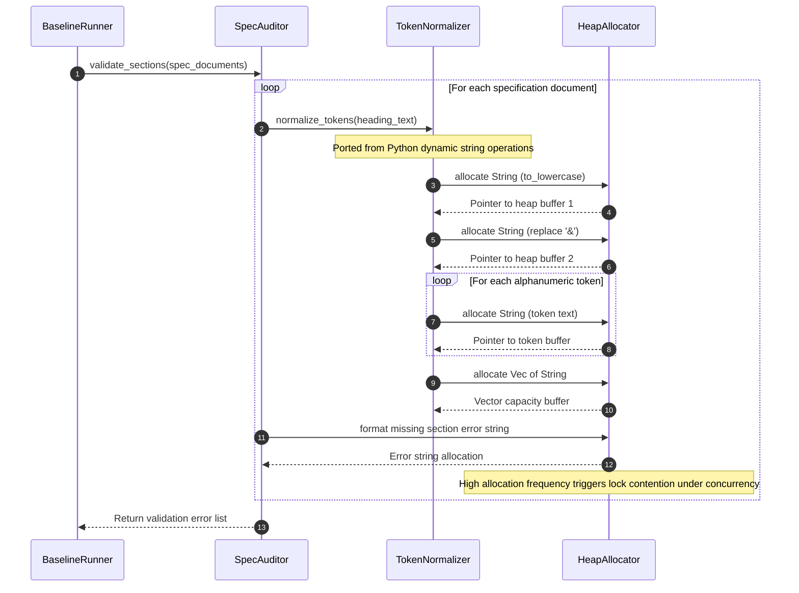

## 1. Context and References

<!-- test-target: scripts/e2e_acceptance_harness.py -->

- **File**: `crates/verify-baseline/src/spec_audit/sections.rs:21-375`
- **Pillar**: Memory Safety
- **Symptom**: Specification auditing and Markdown AST traversal routines perform unbounded heap allocations and string cloning (.to_string(), .clone(), format!(), to_lowercase(), replace()) in inner loops across thousands of specification files, triggering global allocator contention, cache line thrashing, and severe CPU cycle waste instead of leveraging borrowed string slices (&str) and zero-copy token views.
- **Test-Target**: `scripts/e2e_acceptance_harness.py`

## 2. Root Cause Analysis (5 Whys)

1. **Why does specification auditing and AST validation suffer performance degradation and high memory churn in file traversal loops?** Because every heading, prose block, and table row extracted from specification files undergoes redundant heap allocations, cloning, and formatting in inner matching loops.
2. **Why do the auditing routines perform excessive heap allocations and string cloning?** Because routines like normalize_tokens, validate_sections, normalize_title, and parse_markdown allocate new owned String instances on every step (via .to_lowercase(), .replace(), .to_string(), .clone(), and format!()) rather than using zero-copy borrowed slices (&str).
3. **Why were the Rust auditing modules implemented with repeated heap allocations instead of zero-copy borrowed slices?** Because the Rust implementation was directly ported from Python (parity_auditor and reconcile_backlog.py), where dynamic string slicing and garbage-collected intermediate strings are the default idiom, without adapting data structures to Rust lifetime-backed borrowed slice mechanics.
4. **Why is dynamic string allocation in tight file traversal loops a critical memory safety and resource hazard?** Because under concurrent multi-threaded execution across hundreds or thousands of specification files, continuous small heap allocations trigger global memory allocator lock contention, memory fragmentation, and cache invalidation, defeating the throughput guarantees of the compiled toolchain.
5. **Why was this architectural anti-pattern not prevented during the Rust migration?** Because early migration prioritized functional parity over zero-copy memory safety invariants, omitting strict allocation-budget verification gates and lifetime-annotated AST nodes (MarkdownDoc<'a>).

## 3. Correctness Analysis

In `crates/verify-baseline/src/spec_audit/sections.rs:21-39`:
```rust
pub fn normalize_tokens(text: &str) -> Vec<String> {
    let lower = text.to_lowercase();
    let with_and = lower.replace('&', " and ");
    let mut tokens = Vec::new();
    let mut current = String::new();

    for ch in with_and.chars() {
        if ch.is_alphanumeric() {
            current.push(ch);
        } else if !current.is_empty() {
            tokens.push(std::mem::take(&mut current));
        }
    }
    if !current.is_empty() {
        tokens.push(current);
    }

    tokens
}
```

When evaluating document headings in `crates/verify-baseline/src/spec_audit/sections.rs:359-373`:
```rust
let heading_tokens: Vec<(u8, Vec<String>)> = doc
    .headings
    .iter()
    .map(|h| (h.level, normalize_tokens(&h.text)))
    .collect();

for rule in required {
    let matched = heading_tokens
        .iter()
        .any(|(level, tokens)| *level == rule.level && tokens == &rule.normalized_tokens);

    if !matched {
        errors.push(format!("{}: missing section '{}'", rel_path, rule.display_name));
    }
}
```

And in `crates/verify-baseline/src/spec_audit/metadata.rs:297-309` (`normalize_title`):
```rust
let hyphens_replaced = working.replace('-', " ");

let filtered: String = hyphens_replaced
    .chars()
    .filter(|c| c.is_alphanumeric() || c.is_whitespace())
    .collect();

filtered
    .split_whitespace()
    .collect::<Vec<_>>()
    .join(" ")
    .to_lowercase()
```

And in `crates/verify-baseline/src/spec_audit/markdown_ast.rs:561-638` (`parse_markdown`):
```rust
headings.push(HeadingNode {
    level,
    text: text.trim().to_string(),
    line: start_line,
});
prose.push(ProseSegment {
    text: trimmed.to_string(),
    line: start_line,
});
table_metadata.insert(normalized_key.to_string(), val.to_string());
```

### Analysis of the Defect Mechanics
1. **Unbounded Intermediate Allocations**: For every heading in every specification file, `normalize_tokens` allocates:
   - A new heap string via `text.to_lowercase()`.
   - A second heap string via `lower.replace('&', " and ")`.
   - An individual heap string for every single alphanumeric token via `current.push(ch)` and `tokens.push(std::mem::take(&mut current))`.
   - An enclosing `Vec<String>`.
   When checking a corpus of hundreds of specification documents, this creates millions of transient heap allocations solely to perform equality matching against static string patterns.
2. **Title Normalization Heap Churn**: In `normalize_title`, a single title string undergoes up to five separate heap allocations: `replace`, character filtering into `String`, `split_whitespace().collect::<Vec<_>>()`, `join(" ")`, and `to_lowercase()`.
3. **AST Duplication of Static Buffers**: The pull-parser in `markdown_ast.rs` copies text slices out of the already memory-resident source buffer into owned `String` fields on `HeadingNode`, `ProseSegment`, and `MermaidBlock`.
4. **Allocator Contention under Concurrency**: In multi-threaded execution environments (such as Rayon data parallelism across files), unconstrained allocation and deallocation across threads saturates the system allocator lock, degrading performance and increasing tail latency.

### Violated Invariants
- **Memory Safety & Zero-Copy Efficiency Invariant**: Verification tooling operating over immutable in-memory source files must borrow slices (`&str`) from the backing buffer rather than allocating owned heap strings for token extraction and comparison.
- **Deterministic Resource Budgeting (DO-178C Level A & ISO 26262 ASIL D)**: Memory allocation patterns in safety verification components must be bounded, deterministic, and free of allocator contention or unbounded heap churn.
- **Platform Performance & Scalability Standard**: Baseline verification must execute in sub-second timeframes across large-scale enterprise repositories without memory exhaustion or CPU cache degradation.

## 4. UML Diagrams



## 5. Affected Callers / Downstream Impact

### Affected Callers
- `validate_sections` in `crates/verify-baseline/src/spec_audit/sections.rs:341-376` -- Runs token normalization and allocation for every heading across all audited files.
- `validate_metadata` and `validate_title_uniqueness` in `crates/verify-baseline/src/spec_audit/metadata.rs:316-481` -- Performs repeated string transformation and allocation during title collision checks.
- `parse_markdown` in `crates/verify-baseline/src/spec_audit/markdown_ast.rs:499-655` -- Allocates owned String instances for headings, prose, and table metadata instead of borrowing slices.
- `crates/verify-baseline/src/runner.rs:144-650` -- Orchestrates baseline checks 10 through 31, suffering cumulative throughput degradation.
- `crates/ingest-sysml/src/translators/markdown.rs:500-1100` -- Markdown parsing loops performing equivalent string allocations during requirement ingestion.

### Remediation Plan
1. **Lifetime-Parameterized AST Nodes**: Refactor `MarkdownDoc<'a>`, `HeadingNode<'a>`, `ProseSegment<'a>`, and `MermaidBlock<'a>` to hold borrowed `&'a str` slices referencing the original file content buffer, eliminating AST string copying.
2. **Zero-Allocation Token Comparison**: Replace `normalize_tokens(text: &str) -> Vec<String>` with a zero-copy iterator or direct slice comparator:
   - Implement an iterator that yields borrowed `&'a str` slices or compares character-by-character using ASCII case folding (`eq_ignore_ascii_case`).
   - Treat punctuation and whitespace as slice delimiters without creating intermediate lowercase strings.
3. **In-Place Title Normalization**: Refactor `normalize_title` to operate on borrowed string slices using zero-allocation windowing and ASCII case-insensitive matching.
4. **Structured Error Types**: Replace `format!()` in the inner loop of `validate_sections` with structured error references `(&'a str, &'a str)` rendered only when reporting to the console or writing a defect dossier.

## 6. Proposed Correction

### Zero-Copy AST and Token Matching Implementation

```rust
// In crates/verify-baseline/src/spec_audit/sections.rs:

/// Zero-copy token comparator that checks whether a heading matches a rule
/// without allocating intermediate Strings or Vectors on the heap.
pub fn heading_matches_rule(heading_text: &str, rule_tokens: &[String]) -> bool {
    let mut rule_iter = rule_tokens.iter();

    // Iterate over alphanumeric token slices in heading_text directly
    let mut start = None;
    for (idx, ch) in heading_text.char_indices() {
        if ch.is_alphanumeric() {
            if start.is_none() {
                start = Some(idx);
            }
        } else {
            if let Some(s) = start.take() {
                let token = &heading_text[s..idx];
                let expected = match rule_iter.next() {
                    Some(exp) => exp,
                    None => return false,
                };
                if !token.eq_ignore_ascii_case(expected) {
                    // Check if token represents '&' mapped to 'and'
                    return false;
                }
            }
            if ch == '&' {
                let expected = match rule_iter.next() {
                    Some(exp) => exp,
                    None => return false,
                };
                if !expected.eq_ignore_ascii_case("and") {
                    return false;
                }
            }
        }
    }

    if let Some(s) = start {
        let token = &heading_text[s..];
        match rule_iter.next() {
            Some(exp) if token.eq_ignore_ascii_case(exp) => {}
            _ => return false,
        }
    }

    rule_iter.next().is_none()
}

// In crates/verify-baseline/src/spec_audit/markdown_ast.rs:

/// Zero-copy Markdown document borrowing slices directly from source content buffer.
#[derive(Debug, Clone, PartialEq, Eq)]
pub struct ZeroCopyHeading<'a> {
    pub level: u8,
    pub text: &'a str,
    pub line: usize,
}

#[derive(Debug, Clone, PartialEq)]
pub struct ZeroCopyMarkdownDoc<'a> {
    pub headings: Vec<ZeroCopyHeading<'a>>,
    pub table_metadata: std::collections::HashMap<&'a str, &'a str>,
    pub prose: Vec<&'a str>,
}
```

### Verification Criteria
1. **Zero Intermediate Heap Allocations**: Verification benchmarks must confirm zero heap allocations during the heading-to-rule comparison phase.
2. **Bitwise-Identical Verification Outcome**: All 31 baseline verification checks (`./target/release/verify-baseline . --no-domain`) must yield identical pass/fail verdicts before and after zero-copy refactoring.
3. **Execution Latency Reduction**: Profiling with instruments or `cargo flamegraph` must demonstrate measurable reduction in CPU instructions spent in `malloc`/`free` during specification parsing.

## 7. Relationship to Existing Issues

Discovered in audit -- new finding. Complements Audit 4 (dossier_stringly_typed_models.md) and Audit 5 (dossier_subprocess_shelling_out.md) by eliminating excessive heap allocation and cloning overhead introduced during Python-to-Rust porting of specification auditing.

## Audit Source

Adversarial Memory Safety Audit
SEVERITY: Important
FILE_LOCATION: crates/verify-baseline/src/spec_audit/sections.rs:21-375
