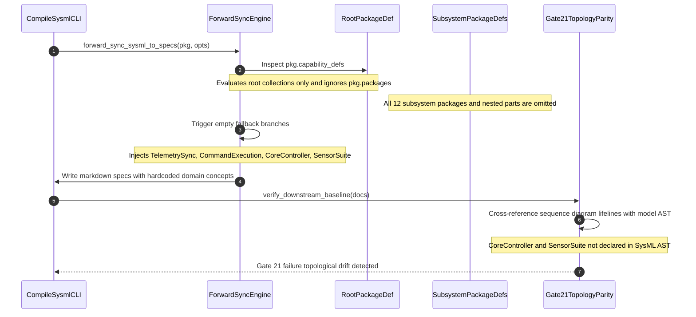

## 1. Context and References

<!-- test-target: scripts/e2e_acceptance_harness.py -->

- **File**: `crates/compile-sysml/src/sync/forward.rs:58-340`
- **Pillar**: Semantic Traceability
- **Symptom**: Forward synchronization only inspects root collections omitting all 12 subsystem packages, and injects hardcoded fallback domain concepts ("TelemetrySync", "CommandExecution", "ExecuteAutonomousMission", "CoreController", "SensorSuite", "OperatorConsole") that violate the Pure Schema-Driven Compiler Invariant and trigger topological drift under Gate 21.
- **Test-Target**: `scripts/e2e_acceptance_harness.py`

## 2. Root Cause Analysis (5 Whys)

1. **Why does forward synchronization generate specifications with ungrounded aerospace entities and drop subsystem specifications?** Because forward_sync_sysml_to_specs invokes hardcoded fallback branches that inject static string literals when root collections are empty, while completely ignoring pkg.packages.
2. **Why are the root collections empty when synchronizing valid multi-package models?** Because forward_sync_sysml_to_specs only inspects top-level collections in root PackageDef and performs zero recursive traversal or aggregation of nested subpackages in pkg.packages.
3. **Why does the forward sync engine inject static domain concepts as fallbacks instead of deriving from AST nodes or failing closed?** Because fallback branches in lines 58-68, 78, 218-233, 323-340, and 435 were hardcoded with drone/flight archetype placeholders rather than enforcing deterministic schema-driven derivation.
4. **Why does injecting these fallback concepts violate compiler invariants?** Because the DEAP constitution and Gate 21 mandate zero hardcoded domain concepts and require all sequence diagram lifelines and flowchart nodes to resolve to declared structural AST classifiers.
5. **Why was this architectural defect not prevented?** Because the forward sync engine lacked recursive AST package aggregation routines, lacked schema-driven generic fallback generators, and lacked automated semantic gate validation asserting zero topological drift against arbitrary user schemas.

## 3. Correctness Analysis

In `crates/compile-sysml/src/sync/forward.rs:43-468`, `forward_sync_sysml_to_specs(pkg: &PackageDef, opts: &ForwardSyncOptions)` is responsible for compiling SysML v2 AST models into canonical Agile markdown specifications (`docs/epics/`, `docs/features/`, `docs/user-stories/`, `docs/use-cases/`, and `docs/safety/`).

However, the current implementation exhibits two severe semantic traceability defects:

1. **Shallow Subpackage Omission**:
In modular SysML v2 models (such as those generated by `crates/ingest-sysml` or specified in `schema/model.sysml`), subsystems and their structural elements are modeled within nested subpackages (`pkg.packages`). At lines 57, 128, 217, 322, and 418, `forward_sync_sysml_to_specs` inspects only the root `pkg` collections (`pkg.capability_defs`, `pkg.part_defs`, `pkg.interaction_defs`, `pkg.use_case_defs`). It performs no recursive descent or flattening of `pkg.packages`. Consequently, all 12 subsystem packages and all of their declared parts, capabilities, and actions are completely omitted during forward synchronization.

2. **Hardcoded Fallback Domain Concepts (Zero Hardcoded Domain Concepts Invariant Violation)**:
Because subpackages are not traversed, the root collections (`pkg.capability_defs`, `pkg.interaction_defs`, `pkg.use_case_defs`) evaluate as empty. Instead of failing closed or deterministically deriving specifications from AST part definitions across packages, the engine branches into fallback generators that inject static domain concepts:
- Lines 58-68: Synthesizes capability docs claiming "Autonomous operational capability management for {} subsystem".
- Line 78: Subsystem defaults to `"CoreController"`.
- Lines 218-233: Injects `"TelemetrySync"` (with lifelines `"SensorSuite"` and `"CoreController"`, message `"ProcessSensorStream"`, trigger `"PeriodicTelemetryTimer"`) and `"CommandExecution"` (with lifelines `"OperatorConsole"` and `"CoreController"`, message `"SendMissionPlan"`, trigger `"OperatorCommandEvent"`).
- Lines 238-240: Lifelines default to `["OperatorConsole", "CoreController"]`.
- Lines 323-340: Injects `"ExecuteAutonomousMission"` (actor `"OperatorConsole"`, subject `"CoreController"`) and `"HandleSafetyFailsafe"` (actor `"CoreController"`, subject `"SafetyWatchdog"`).
- Line 350: Subject defaults to `"CoreController"`.
- Line 352: Actors default to `["OperatorConsole"]`.
- Line 435: Safety constraints table hardcodes `"The system shall maintain flight parameters within certified limits | CoreController | UCA-001"`.

This directly violates the Pure Schema-Driven Compiler Invariant (.pipeline/constitution.md lines 48-52), which states:
"The pipeline is an abstract compiler and verification framework. Agents are strictly forbidden from inventing, proposing, or hardcoding domain-specific concepts into pipeline logic or templates. All specification generation derives exclusively and deterministically from AST nodes present in user-provided schemas in schema/."

Furthermore, under Check 21 (Semantic Diagram-to-AST Topology Parity Gate in crates/verify-baseline/src/checks/parity_gates.rs:71-140 and .pipeline/constitution.md line 79), every sequence diagram lifeline must resolve to an instance of a defined logical Class or Component in the structural model AST. Because entities such as CoreController, SensorSuite, and OperatorConsole are synthesized string literals not declared in the input SysML AST, Check 21 detects topological drift and baseline verification fails closed.

## 4. UML Diagrams



## 5. Affected Callers / Downstream Impact

- `crates/compile-sysml/src/sync/forward.rs` -- Forward sync engine silently drops all 12 subsystem packages and injects synthetic aerospace domain concepts into markdown specifications.
- `crates/compile-sysml/src/main.rs:245` -- Invoking `compile-sysml --forward-sync` generates specifications and diagrams with undeclared actors and components.
- `crates/verify-baseline/src/checks/parity_gates.rs:71` (Check 21) -- Fails closed due to topological drift between generated diagram lifelines and AST definitions.
- Downstream Agile and MBSE specifications (`docs/epics/`, `docs/features/`, `docs/user-stories/`, `docs/use-cases/`, `docs/safety/`) -- Subsystem specifications are lost, and generated specifications are polluted with fictional domain concepts.

## 6. Proposed Correction

```rust
// In crates/compile-sysml/src/sync/forward.rs:

/// Recursively collects all packages (root and nested subpackages) from a PackageDef.
fn collect_all_packages<'a>(pkg: &'a PackageDef, out: &mut Vec<&'a PackageDef>) {
    out.push(pkg);
    for sub in &pkg.packages {
        collect_all_packages(sub, out);
    }
}

pub fn forward_sync_sysml_to_specs(
    pkg: &PackageDef,
    opts: &ForwardSyncOptions,
) -> Result<HashMap<String, String>, String> {
    let mut all_packages = Vec::new();
    collect_all_packages(pkg, &mut all_packages);

    // Aggregate all structural elements across all subsystem packages
    let mut all_parts = Vec::new();
    let mut all_capabilities = Vec::new();
    let mut all_interactions = Vec::new();
    let mut all_use_cases = Vec::new();

    for p in &all_packages {
        all_parts.extend(p.part_defs.clone());
        all_capabilities.extend(p.capability_defs.clone());
        all_interactions.extend(p.interaction_defs.clone());
        all_use_cases.extend(p.use_case_defs.clone());
    }

    // Epics derived strictly from declared capabilities or parts (with generic naming)
    if all_capabilities.is_empty() {
        for part in &all_parts {
            all_capabilities.push(deap_core::sysml_ast::CapabilityDef {
                name: format!("{}Capability", part.name),
                doc: Some(format!("Operational capability management for {} component", part.name)),
                subsystem: Some(part.name.clone()),
                description: Some(format!("Operational capability management for {} component", part.name)),
                ..Default::default()
            });
        }
    }

    // Eliminate hardcoded domain strings ("CoreController", "SensorSuite", "OperatorConsole")
    // Derive lifelines, subjects, and actors deterministically from declared parts in all_parts:
    let default_subject = all_parts.first().map(|p| p.name.clone()).unwrap_or_else(|| pkg.name.clone());

    // Generate specifications purely from aggregated AST nodes without hardcoded drone concepts...
    // ...
}
```

## 7. Relationship to Existing Issues

Discovered in audit -- new finding.

## Audit Source

Adversarial Semantic Traceability Audit
SEVERITY: Important
FILE_LOCATION: crates/compile-sysml/src/sync/forward.rs:58-340
