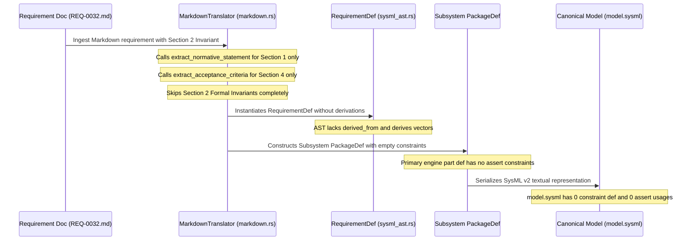

## 1. Context and References

<!-- test-target: scripts/e2e_acceptance_harness.py -->

- **File**: `crates/ingest-sysml/src/translators/markdown.rs:730-930`
- **Pillar**: Semantic Traceability
- **Symptom**: The SysML v2 requirements model lacks formal invariant constraints lowering, requirement derivations, and subsystem assertions, omitting Section 2 invariants and dropping constraint definitions from subsystem packages and execution engines.
- **Test-Target**: `scripts/e2e_acceptance_harness.py`

## 2. Root Cause Analysis (5 Whys)

1. **Why does schema/model.sysml contain zero constraint def statements, zero assert constraint usages, and zero requirement derivations?** Because crates/ingest-sysml/src/translators/markdown.rs completely omits Section 2 (Formal Invariant) and requirement cross-references during Markdown document lowering.
2. **Why does ingest-sysml omit Section 2 and requirement cross-references during translation?** Because extract_normative_statement, extract_req_metadata, and extract_acceptance_criteria parse only Section 1, frontmatter tables, and Section 4, without any parsing logic for mathematical invariants or inter-requirement derivation citations.
3. **Why are extracted constraints and assertions not emitted into subsystem packages?** Because translate_files() initializes PackageDef.constraint_defs with ..Default::default() and instantiates primary execution engines with empty constraint vectors, discarding constraints for all 12 subsystem packages.
4. **Why is derivation metadata missing from the core SysML AST?** Because deap_core::sysml_ast::RequirementDef lacks fields for requirement derivation relationships (derived_from and derives), preventing AST-level representation of SysML v2 derive requirement from contracts.
5. **Why was this architecture implemented with these omissions?** Because the initial translator prioritized structural package and acceptance criteria scaffolding over semantic invariant lowering, leaving mathematical contracts unexpressed in the authoritative SysML v2 model.

## 3. Correctness Analysis

In authoritative requirement specifications under schema/REQ-*.md (such as schema/REQ-0032.md:32-79), Section 2 declares formal mathematical invariants, strict total ordering relations (e.g. d_1 \prec_{sym} d_2), and diagnostic code bindings (e.g. E0100, E0102, E0199). In addition, Section 1 normative statements explicitly cite parent and peer requirements (e.g. REQ-0031, REQ-0019, REQ-0044).

During compilation, crates/ingest-sysml/src/translators/markdown.rs:834-930 executes translate_files() across all Markdown requirements. For each file, translate() is invoked at lines 613-815:
- Lines 734-736 call extract_normative_statement() and extract_req_metadata(), capturing only Section 1 prose and YAML/table metadata.
- Line 788 calls extract_acceptance_criteria(), capturing only Section 4 AC items.
- Section 2 (## 2. Formal Invariant) is completely ignored during translation. No ConstraintDef instances are constructed from mathematical formulas or diagnostic bindings.
- Requirement cross-references in normative text and metadata are never parsed into derivation relationships.
- deap_core::sysml_ast::RequirementDef (crates/deap-core/src/sysml_ast.rs:177-193) lacks derived_from and derives fields, preventing AST representation of SysML v2 derive requirement from statements.
- In translate_files() at lines 908-929, primary subsystem execution engines (PartDef) are synthesized with empty constraints vectors, and each subsystem PackageDef is initialized with constraint_defs defaulted to empty (..Default::default()).

Consequently, the emitted schema/model.sysml exhibits 0 constraint def statements, 0 assert constraint usages, 0 require constraint usages, and 0 assume constraint usages across all 12 subsystems.

Invariants violated:
- Tier 1 Functional Layer & Schema Compliance Invariant (.pipeline/constitution.md:60-63): Every data model constraint in the schema must be captured in the formal model with zero loss tolerance.
- Model Metamodel & Profile Mapping Standard (.pipeline/constitution.md:75): Rules and validation logic map to a logical Constraint.
- Semantic Traceability & STPA Invariant Preservation (crates/ingest-sysml/src/translators/markdown.rs:13-33): Silent omission of invariants or dropping constraint definitions invalidates downstream formal verification.

## 4. UML Diagrams



## 5. Affected Callers / Downstream Impact

- `crates/ingest-sysml/src/translators/markdown.rs:translate_files` -- Subsystem packages and primary execution engine parts are emitted without formal constraint definitions or assertions.
- `crates/deap-core/src/sysml_ast.rs:RequirementDef` -- Callers cannot record or query hierarchical derivation relationships (`derived_from` / `derives`).
- `schema/model.sysml` -- Downstream compilers, SAT solvers, and verification engines receive an unconstrained model devoid of formal mathematical assertions.
- `scripts/verify_downstream_baseline.py` & `scripts/e2e_acceptance_harness.py` -- Verification suites cannot validate invariant satisfaction because constraints are omitted from the AST.

## 6. Proposed Correction

```rust
// In crates/deap-core/src/sysml_ast.rs:
#[derive(Debug, Clone, PartialEq, Serialize, Deserialize, Default)]
pub struct RequirementDef {
    pub name: String,
    pub req_id: String,
    pub text: String,
    pub doc: Option<String>,
    #[serde(default)]
    pub attributes: Vec<AttributeDef>,
    #[serde(default)]
    pub assumes: Vec<String>,
    #[serde(default)]
    pub requires: Vec<String>,
    #[serde(default)]
    pub verified_by: Vec<String>,
    #[serde(default)]
    pub satisfied_by: Vec<String>,
    #[serde(default)]
    pub derived_from: Vec<String>,
    #[serde(default)]
    pub derives: Vec<String>,
}

// In crates/ingest-sysml/src/translators/markdown.rs:
// 1. Add extract_formal_invariants() to parse Section 2 into Vec<ConstraintDef>.
// 2. Add extract_requirement_derivations() to parse cited requirement IDs into derived_from.
// 3. Lower formal invariants to PackageDef.constraint_defs and link via RequirementDef.requires.
// 4. Attach assert constraint usages to primary engine PartDef.constraints in translate_files().
```

## 7. Relationship to Existing Issues

Discovered in audit -- new finding.

## Audit Source

Adversarial Semantic Traceability Audit
SEVERITY: Important
FILE_LOCATION: crates/ingest-sysml/src/translators/markdown.rs:730-930
