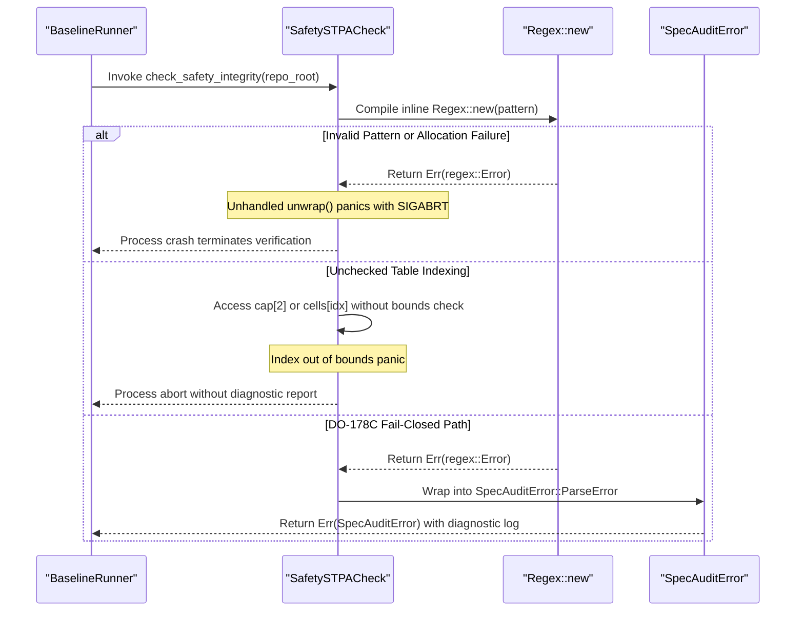

## 1. Context and References

<!-- test-target: scripts/e2e_acceptance_harness.py -->

- **File**: `crates/verify-baseline/src/checks/safety_stpa.rs:47-495`
- **Pillar**: Memory Safety
- **Symptom**: Baseline verification check functions execute over 30 instances of inline Regex::new().unwrap() and unchecked indexing translated from Python, causing unhandled panics that crash the verification runner and violate DO-178C Level A and ISO 26262 ASIL D fail-closed error handling invariants.
- **Test-Target**: `scripts/e2e_acceptance_harness.py`

## 2. Root Cause Analysis (5 Whys)

1. **Why does verify-baseline abort with an unhandled panic during baseline verification?** Because baseline check functions in crates/verify-baseline/src/checks/ execute inline Regex::new().unwrap() and unchecked indexing on parsed table structures.
2. **Why do check functions invoke .unwrap() on regex compilation and collection indexing?** Because legacy Python dynamic checking scripts were ported to Rust by directly substituting Python dynamic expressions with unchecked .unwrap() invocations.
3. **Why is inline regex compilation with .unwrap() unacceptable in baseline checks?** Because DO-178C Level A and ISO 26262 ASIL D safety standards mandate fail-closed error handling where malformed expressions or documents produce structured diagnostics rather than process crashes.
4. **Why are regex patterns compiled repeatedly with .unwrap() on every check invocation instead of cached safely?** Because verify-baseline lacked centralized static regex initialization and shared error boundaries, recompiling identical regexes on each execution pass.
5. **Why were unhandled panics and missing error types not eliminated during initial porting?** Because the initial port prioritized rapid syntactic migration over DO-178C/ISO 26262 zero-panic invariants and omitted Result<T, SpecAuditError> propagation across check modules.

## 3. Correctness Analysis

In `crates/verify-baseline/src/checks/safety_stpa.rs:47-495`, `crates/verify-baseline/src/checks/structural.rs:64-70, 137-141`, `crates/verify-baseline/src/checks/parity_gates.rs:86-87`, and `crates/verify-baseline/src/checks/wbs_integrity.rs:99-102`:

1. Inline Regex Compilation Panics:
Inside check routines, regular expressions are repeatedly constructed inline using `Regex::new(...).unwrap()`. Specifically:
- `safety_stpa.rs:47`: `let fmeca_header_re = Regex::new(r"(?i)failure\s+mode|fmeca").unwrap();`
- `safety_stpa.rs:177-180`: four inline regexes compiled on every invocation of `check_failure_dimension_coverage`
- `safety_stpa.rs:239-261`: six inline regexes compiled on every invocation of `check_uca_categories`
- `safety_stpa.rs:375-489`: over 15 inline regexes compiled on every invocation of `check_safety_integrity`
- `structural.rs:64-70`: six regexes compiled on every invocation of `check_upstream_blueprint_cleanliness`
- `structural.rs:137-141`: inline regex compiled on every invocation of `check_domain_agnostic_ast_cleanliness`
- `parity_gates.rs:86-87`: inline regexes compiled on every invocation of `check_cross_discipline_parity`
- `wbs_integrity.rs:99-102`: inline regex compiled on every invocation of `check_wbs_suite_integrity`

If any regex pattern contains an invalid character class, unsupported syntax, or allocation failure under memory pressure, `Regex::new()` returns `Err(regex::Error)`. The trailing `.unwrap()` triggers a panic (`core::panicking::panic`), which aborts the entire verification runner process.

2. Unchecked Python-to-Rust Dynamic Indexing:
In `safety_stpa.rs:87-130`, markdown table columns and rows are parsed using direct slicing and unchecked indexing (`cells[idx]`). In `wbs_integrity.rs:102`, regex captures are accessed directly via indexing (`&cap[2]`). If a markdown table row contains irregular column delimiters or a capture group fails to match, direct indexing panics with an out-of-bounds index error rather than failing closed with a structured diagnostic.

3. Invariants Violated:
- DO-178C Level A and ISO 26262 ASIL D Fail-Closed Invariant: Safety-critical verification systems must fail closed and emit structured diagnostic errors. Crashing via unhandled panics violates assurance integrity.
- Zero-Panic Invariant: Production verification pathways must not contain unhandled `.unwrap()` or `.expect()` calls that can abort the process on malformed input.
- Unified SpecAuditError Model: All errors must be modeled in `Result<T, SpecAuditError>` as defined in `crates/verify-baseline/src/spec_audit/mod.rs:28-38`.
- Resource and Lifecycle Determinism: Recompiling 30+ regex instances inside loops on every check pass causes repeated heap allocation and CPU churn, violating deterministic resource lifecycle constraints.

## 4. UML Diagrams



## 5. Affected Callers / Downstream Impact

- Affected Callers:
  - `runner::run` in `crates/verify-baseline/src/runner.rs` -- The coordinator runner executes baseline checks. An unhandled panic halts execution prematurely, masking subsequent check failures and corrupting exit codes.
  - `check_safety_integrity` in `crates/verify-baseline/src/checks/safety_stpa.rs` -- STPA and safety checks crash unexpectedly when inspecting non-standard or malformed safety documentation.
  - `check_dual_schema_ssot_parity` in `crates/verify-baseline/src/checks/parity_gates.rs` -- Dual-schema verification aborts if regular expressions encounter unexpected characters.
  - `check_upstream_blueprint_cleanliness` and `check_domain_agnostic_ast_cleanliness` in `crates/verify-baseline/src/checks/structural.rs` -- Blueprint and AST cleanliness gates panic on regex failures.
  - `check_wbs_suite_integrity` in `crates/verify-baseline/src/checks/wbs_integrity.rs` -- WBS verification panics when processing broken or unescaped markdown links.
  - Continuous Integration and Certification Pipeline -- CI test runners crash with exit code 101 instead of generating structured compliance summaries.

- Remediation Plan:
  1. Centralize and safely initialize static regex instances using `std::sync::OnceLock<Regex>` to compile patterns once at startup without panics.
  2. Implement fail-closed helper routines returning `Result<&'static Regex, SpecAuditError>` to handle initialization failures gracefully.
  3. Replace direct capture group and slice indexing (`cap[2]`, `cells[idx]`) with safe accessors (`cap.get(2)`, `cells.get(idx)`).
  4. Convert all check functions to return `Result<T, SpecAuditError>` to maintain clean diagnostic error propagation into `runner.rs`.

## 6. Proposed Correction

```rust
// In crates/verify-baseline/src/checks/safety_stpa.rs:

use std::sync::OnceLock;
use crate::spec_audit::SpecAuditError;
use regex::Regex;

// 1. Safe static regex initialization using OnceLock
static RE_FMECA_HEADER: OnceLock<Result<Regex, String>> = OnceLock::new();
static RE_INTERFACE: OnceLock<Result<Regex, String>> = OnceLock::new();
static RE_NOT_PROVIDING: OnceLock<Result<Regex, String>> = OnceLock::new();

fn get_fmeca_header_re() -> Result<&'static Regex, SpecAuditError> {
    RE_FMECA_HEADER
        .get_or_init(|| {
            Regex::new(r"(?i)failure\s+mode|fmeca").map_err(|e| e.to_string())
        })
        .as_ref()
        .map_err(|e| SpecAuditError::ParseError(format!("Failed to compile FMECA regex: {}", e)))
}

// 2. Safe table parsing without unchecked indexing or unwrap()
pub fn parse_fmeca_table_safe(content: &str) -> Result<FmecaData, SpecAuditError> {
    let mut data = FmecaData::default();
    let header_re = get_fmeca_header_re()?;
    let lines: Vec<&str> = content.lines().collect();

    for line in lines {
        let trimmed = line.trim();
        if trimmed.starts_with('|') && header_re.is_match(trimmed) {
            let cells: Vec<String> = trimmed
                .split('|')
                .map(|s| s.trim().to_string())
                .collect();

            // Safe bounded access replacing direct indexing
            if let Some(first_cell) = cells.get(1) {
                if !first_cell.is_empty() {
                    let mut row = FmecaRow::default();
                    row.id = first_cell.clone();
                    data.rows.push(row);
                    data.total_rows += 1;
                }
            }
        }
    }
    Ok(data)
}
```

### Verification Criteria

1. Zero instances of `Regex::new().unwrap()` in `crates/verify-baseline/src/checks/`.
2. Safe accessors (`get()`, `match`, `if let`) replace all direct capture/cell index access.
3. All baseline check errors propagate as `Result<T, SpecAuditError>` without crashing.
4. Baseline verification passes cleanly: `./target/release/verify-baseline . --no-domain`.

## 7. Relationship to Existing Issues

Discovered in audit -- new finding.

## Audit Source

Adversarial Memory Safety Audit
SEVERITY: Critical
FILE_LOCATION: crates/verify-baseline/src/checks/safety_stpa.rs:47-495
