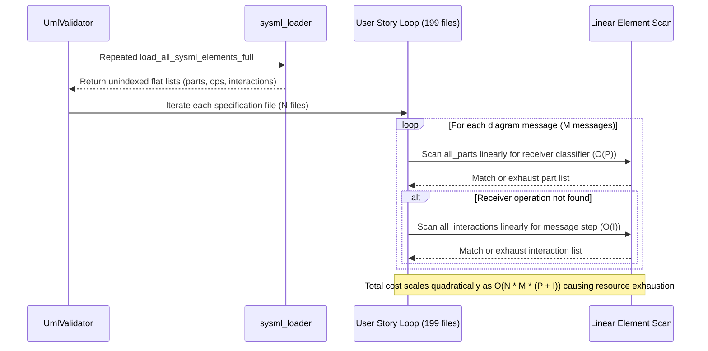

## 1. Context and References

<!-- test-target: scripts/e2e_acceptance_harness.py -->

- **File**: `skills/spec-orchestrator/parity_auditor/src/parity_auditor/validators/uml.py:1406-1535`
- **Pillar**: Resource Lifecycle
- **Symptom**: Linearly iterating through all parsed SysML model elements (parts, actions, operations, interactions) for every sequence diagram message across 199 specification files creates an unbounded O(N x M x (P + I)) bottleneck and excessive heap allocations, which must be resolved by pre-indexing symbols into O(1) hash structures.
- **Test-Target**: `scripts/e2e_acceptance_harness.py`

## 2. Root Cause Analysis (5 Whys)

1. **Why does UML and sequence lifeline auditing degrade drastically under scale across 199 files?** Because validating every message and lifeline performs unindexed linear scans across all parsed SysML parts, actions, operations, and interactions.
2. **Why are searches across model elements performed linearly?** Because _load_all_sysml_elements_full returns raw flat lists without pre-building hash-indexed symbol tables or cached lookup indices.
3. **Why are flat lists retained during validation?** Because the Python prototype prioritized simple procedural collection in _collect_all_sysml_elements over indexed symbol resolution and name deduplication.
4. **Why does this compound into quadratic O(N x M) complexity?** Because for each specification document N and each sequence message M, the validator iterates through every part P and interaction I, repeating nested loops and regex searches up to N * M * (P + I) times.
5. **Why was this resource lifecycle defect not caught earlier?** Because early test fixtures contained small, single-file SysML models where quadratic scans exhibited negligible latency, masking the CPU churn and redundant allocation that dominates multi-subsystem downstream customer workspaces.

## 3. Correctness Analysis

In `skills/spec-orchestrator/parity_auditor/src/parity_auditor/validators/uml.py` and `skills/spec-orchestrator/parity_auditor/src/parity_auditor/utils/sysml_loader.py`:

1. **Redundant Disk I/O and Repeated Full-AST Parsing**:
At lines 1406, 1550, and 1663 of `uml.py`, `_load_all_sysml_elements_full(repo, schemas_dir)` is invoked independently by:
- `validate_user_story_interactions_and_lifelines` (Check 20, line 1406)
- `validate_safety_invariants_and_rta_constraints` (Check 21, line 1550)
- `validate_acceptance_criteria_and_test_cases` (Check 22, line 1663)

In each invocation, lines 249-274 open and read all `.sysml` files in the repository from disk and invoke `SysMLParser.parse_text` anew, traversing the AST via `_collect_all_sysml_elements` to flatten elements into raw Python lists: `all_pkgs`, `all_parts`, `all_caps`, `all_actions`, `all_ops`, `all_interactions`, `all_constraints`, `all_test_cases`, and `all_requirements`. The parser never caches the parsed models across checks, tripling disk I/O and parser workload.

2. **Quadratic O(N x M x (P + I)) Message-to-Classifier Verification**:
In `validate_user_story_interactions_and_lifelines` (lines 1437-1515):
- The outer loop iterates over every Markdown document in `docs/user-stories` ($N \approx 199$ files).
- For each document, it parses all Mermaid sequence diagrams and iterates over each message ($M$ messages per diagram).
- At line 1492, if receiver classifier methods are not satisfied by `global_classes`, the validator initiates a linear scan:
```python
for part in all_parts:
    if getattr(part, "name", None) == rx_cls:
        part_ops = [getattr(op, "name", None) for op in (getattr(part, "operations", []) or [])]
        part_acts = [getattr(act, "name", None) for act in (getattr(part, "actions", []) or [])]
        if op_name in part_ops or op_name in part_acts:
            cls_has_method = True
            break
```
For each part $P$ in `all_parts`, this loop performs string lookups, and upon matching the classifier name, dynamically allocates two temporary Python lists (`part_ops` and `part_acts`) on the heap for every single message.
- If not matched, line 1502 initiates a secondary linear scan:
```python
for inter in all_interactions:
    inter_msgs = getattr(inter, "messages", []) or []
    inter_trgs = getattr(inter, "triggers", []) or []
    if op_name in inter_msgs or op_name in inter_trgs:
        cls_has_method = True
        break
```
This iterates over all $I$ interactions in `all_interactions`, again allocating throwaway lists in hot loop cycles.

3. **Quadratic Document Regex Sweeps**:
At line 1517:
```python
for inter in all_interactions:
    inter_name = getattr(inter, "name", "")
    if not inter_name:
        continue
    if fm and isinstance(fm, dict) and fm.get("interaction") == inter_name:
        covered_interactions.add(inter_name)
    elif re.search(rf"\b(?:interaction|Interaction|SysML\s+Interaction\s+Def)\s*:?\s*`?{re.escape(inter_name)}`?\b", content):
        covered_interactions.add(inter_name)
```
For every user story document $N$, the validator iterates through all interactions $I$, compiling and executing a dynamic regular expression over the entire multi-kilobyte document content. This requires $N \times I$ full-text regex evaluations.

4. **Linear Constraint Matching**:
In `validate_safety_invariants_and_rta_constraints` (lines 1607-1629):
For every discovered Unsafe Control Action (UCA), the validator linearly scans all `assert_constraints` ($U \times C$ iterations), executing multiple case-insensitive substring checks across `c_name`, `c_doc`, and `c_expr`.

5. **Resource Lifecycle & Compiler Invariants Violated**:
- **Resource Lifecycle Invariant**: Verification algorithms operating on repository scale must not trigger unbounded quadratic execution times, excessive memory allocations, or garbage collector churn.
- **Pure Schema-Driven Compiler Invariant**: Core compiler and verification passes must utilize standard pre-indexed symbol tables (`HashMap<&str, SymbolInfo>` and `HashSet<&str>`) with $O(1)$ lookup guarantees rather than ad-hoc nested loops over raw AST vectors.
- **Single Source of Truth (SSOT) Performance Mandate**: Baseline verification gates (`verify-baseline`) must scale linearly with workspace size to enable rapid CI/CD feedback cycles.

## 4. UML Diagrams



## 5. Remediation Plan

1. **Affected Callers and Downstream Impact**:
- `skills/spec-orchestrator/parity_auditor/src/parity_auditor/validators/uml.py` -- Suffers high execution latency and memory churn when evaluating large customer workspaces containing hundreds of user story specifications.
- `skills/spec-orchestrator/parity_auditor/src/parity_auditor/utils/sysml_loader.py` -- Lacks a memoization and symbol table pre-indexing interface.
- `crates/verify-baseline` and `crates/compile-sysml` -- Native Rust baseline auditor must adopt pre-indexed symbol structures during porting to guarantee sub-second verification across arbitrary workspace sizes.
- CI/CD Pipelines -- Verification timeouts and worker throttling caused by repeated quadratic scans across 199+ specification files.

2. **Remediation Plan**:
- **Phase 1: Cached Model Repository**: Update `_load_all_sysml_elements_full` to cache parsed AST elements across validator passes, ensuring schema files are read and parsed exactly once per session.
- **Phase 2: Pre-Indexed Symbol Tables**:
  - Replace flat `all_parts` list lookups with a `SymbolTable` containing `parts_by_name: Dict[str, PartSymbol]`, where `PartSymbol` pre-indexes `operations: Set[str]` and `actions: Set[str]`. This enables $O(1)$ receiver classifier resolution and $O(1)$ operation membership checking without temporary list allocations.
  - Pre-index `all_interactions` into `interactions_by_name: Dict[str, InteractionSymbol]`, where `InteractionSymbol` stores `messages: Set[str]` and `triggers: Set[str]`.
  - Compile a single unified regex alternation for all interaction names or extract interaction tokens during markdown tokenization, reducing $N \times I$ document sweeps to a single $O(N)$ pass.
- **Phase 3: Native Rust Architecture**:
  - Implement a zero-copy `SysmlSymbolTable<'a>` in Rust using `HashMap<&'a str, PartSymbol<'a>>` and `HashSet<&'a str>` referencing borrowed AST slices from `deap_core::sysml_ast`.
  - Provide $O(1)$ amortized queries for lifelines, message operations, and safety assertion bindings.

## 6. Verification Criteria

```rust
// Proposed pre-indexed SymbolTable for native Rust baseline auditor:
// crates/compile-sysml/src/analysis/symbol_table.rs

use std::collections::{HashMap, HashSet};
use deap_core::sysml_ast::{PackageDef, PartDef, InteractionDef, ConstraintDef};

#[derive(Debug, Default)]
pub struct PartSymbol<'a> {
    pub name: &'a str,
    pub operations: HashSet<&'a str>,
    pub actions: HashSet<&'a str>,
}

#[derive(Debug, Default)]
pub struct InteractionSymbol<'a> {
    pub name: &'a str,
    pub steps: HashSet<&'a str>,
}

#[derive(Debug, Default)]
pub struct SysmlSymbolTable<'a> {
    pub parts: HashMap<&'a str, PartSymbol<'a>>,
    pub interactions: HashMap<&'a str, InteractionSymbol<'a>>,
    pub assertion_constraints: HashMap<&'a str, &'a ConstraintDef>,
}

impl<'a> SysmlSymbolTable<'a> {
    /// Build pre-indexed O(1) lookup tables from parsed SysML package AST
    pub fn build(pkg: &'a PackageDef) -> Self {
        let mut table = Self::default();

        for part in &pkg.part_defs {
            let mut sym = PartSymbol {
                name: &part.name,
                operations: HashSet::with_capacity(part.operations.len()),
                actions: HashSet::with_capacity(part.actions.len()),
            };
            for op in &part.operations {
                sym.operations.insert(&op.name);
            }
            for act in &part.actions {
                sym.actions.insert(&act.name);
            }
            table.parts.insert(&part.name, sym);
        }

        for inter in &pkg.interaction_defs {
            let mut isym = InteractionSymbol {
                name: &inter.name,
                steps: HashSet::with_capacity(inter.messages.len() + inter.triggers.len()),
            };
            for msg in &inter.messages {
                isym.steps.insert(msg.as_str());
            }
            for trg in &inter.triggers {
                isym.steps.insert(trg.as_str());
            }
            table.interactions.insert(&inter.name, isym);
        }

        for c in &pkg.constraint_defs {
            if c.is_assertion {
                table.assertion_constraints.insert(&c.name, c);
            }
        }

        table
    }

    /// O(1) check if receiver classifier exposes the given operation or action
    pub fn classifier_has_operation(&self, receiver: &str, operation: &str) -> bool {
        if let Some(part) = self.parts.get(receiver) {
            part.operations.contains(operation) || part.actions.contains(operation)
        } else {
            false
        }
    }

    /// O(1) check if message exists within any declared interaction flow
    pub fn is_interaction_step(&self, step: &str) -> bool {
        self.interactions.values().any(|i| i.steps.contains(step))
    }
}
```

Verification Criteria:
1. **O(1) Symbol Resolution Gate**: Lifeline and sequence diagram message validation resolves receiver parts and operations in $O(1)$ amortized lookup time rather than linear scans over `all_parts`.
2. **Zero Redundant Disk I/O Gate**: All `.sysml` schema files are parsed exactly once per validation run, sharing immutable symbol table state across Checks 20, 21, and 22.
3. **Zero Heap Churn Gate**: Per-message validation executes with zero throwaway heap list allocations (`part_ops`, `part_acts`, `inter_msgs`).
4. **Baseline Conformance Gate**: `./target/release/verify-baseline . --no-domain` completes with all 31 checks passing cleanly.
5. **Specification Scale Gate**: End-to-end specification audit over 199 files completes with execution time scaling strictly linearly ($O(N)$) with document count.

## 7. Relationship to Existing Issues

Discovered in audit -- new finding. Complements Issue #9 (Dual-Schema SSOT Parity & KerML Identifier Invariant), Issue #97 (Cited Research Inventory & Declared-Total Population Register Models), Issue #98 (Coverage-Digest & Obligation-Witness Models), and ongoing compiler performance optimizations across the Rust toolchain.

## Audit Source

Adversarial Resource Lifecycle Audit
SEVERITY: Important
FILE_LOCATION: skills/spec-orchestrator/parity_auditor/src/parity_auditor/validators/uml.py:1406-1535
