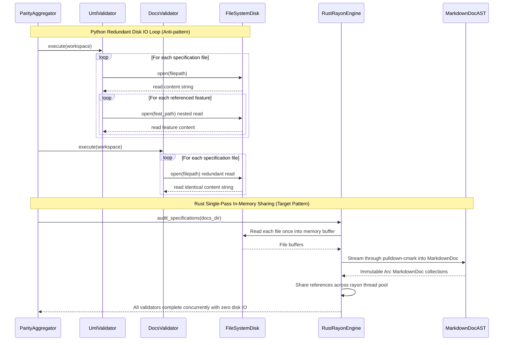

## 1. Context and References

<!-- test-target: scripts/e2e_acceptance_harness.py -->

- **File**: `skills/spec-orchestrator/parity_auditor/src/parity_auditor/validators/uml.py:251-1702`
- **Pillar**: Resource Lifecycle
- **Symptom**: Python specification validators repeatedly perform redundant disk file I/O by opening and re-reading markdown files in hot loops across 35+ validation passes, creating severe I/O bottlenecks and file descriptor churn instead of reading each file once into memory, streaming through pulldown-cmark into MarkdownDoc once, and sharing AST references across parallel threads via rayon.
- **Test-Target**: `scripts/e2e_acceptance_harness.py`

## 2. Root Cause Analysis (5 Whys)

1. **Why does executing specification parity auditing degrade severely in performance as the specification repository grows?** Because each validator independently scans workspace directories and opens every Markdown specification file from disk on every invocation.
2. **Why do validators independently open and read the same files from disk?** Because validators in parity_auditor/validators/*.py are architected as decoupled standalone scripts that receive only workspace paths rather than a shared in-memory document model.
3. **Why do cross-referencing validators perform nested disk reads?** Because validators like UmlValidator inspect linkages by executing os.walk and re-reading referenced feature and scenario files inside inner loops, multiplying disk operations quadratically.
4. **Why was no unified in-memory document cache or AST abstraction implemented in Python?** Because initial auditing scripts were designed for rapid ad-hoc validation of small document collections where disk caching and operating system page cache masking obscured redundant I/O costs.
5. **Why must this architecture be replaced in the native Rust toolchain?** Because scaling to large-scale Model-Based Systems Engineering repositories requires single-pass disk I/O, streaming zero-copy CommonMark AST extraction via pulldown-cmark, and lock-free thread-safe AST sharing across parallel rayon worker threads.

## 3. Correctness Analysis

In `skills/spec-orchestrator/parity_auditor/src/parity_auditor/validators/uml.py:251-1702` and `skills/spec-orchestrator/parity_auditor/src/parity_auditor/aggregator.py:69-120`, specification validators execute redundant, nested disk read loops across the entire specification suite:

1. **Repetitive Top-Level File Ingestion**:
Across all 35+ validators registered in `AGGREGATING_VALIDATORS` (including `UmlValidator`, `DocsValidator`, `DocMetadataValidator`, `LinkValidator`, `SpecValidator`, `MermaidSyntaxValidator`, `KaTeXValidator`, `SourceReferenceValidator`, `SchemaCardinalityValidator`, `BehavioralValidator`, `SemanticProseInvariantValidator`, `FactualGroundingValidator`, and `StandardsAndMeasurementValidator`), each validator independently iterates over `docs/epics/`, `docs/features/`, `docs/user-stories/`, and `docs/use-cases/`. For every file, each validator issues `with open(filepath, "r", encoding="utf-8") as f: content = f.read()`. In a repository with 500 specification documents, running the validator suite triggers upwards of 17,500 individual synchronous file open, read, decode, and close syscall sequences.

2. **Quadratic Nested Disk I/O Loops**:
Within `UmlValidator` (`uml.py`), cross-specification consistency checks repeatedly re-read target files from disk inside nested loops:
- At `uml.py:251-253`: `with open(sf, "r", encoding="utf-8") as file: content = file.read()` reads scenario files during class mapping.
- At `uml.py:376-378`: `with open(filepath, "r", encoding="utf-8") as f: content = f.read()` reads feature files for operation checks.
- At `uml.py:441-443`: `with open(filepath, "r", encoding="utf-8") as f: content = f.read()` re-reads features for statechart models.
- At `uml.py:595-597`: `with open(filepath, "r", encoding="utf-8") as f: content = f.read()` reads user stories for actor definitions.
- At `uml.py:741-755`: During Epic constraint tallying, the validator executes `for root, _, files in os.walk(repo.workspace_dir):` to find referenced features, and executes `with open(feat_path, "r", encoding="utf-8") as f: feat_content = f.read()`. For an Epic referencing 15 Features across 12 Subsystems, this creates an O(N * M) disk walk and read explosion inside an inner loop.
- At `uml.py:822-824`: `with open(filepath, "r", encoding="utf-8") as f: content = f.read()` reads use cases for lifeline resolution.
- At `uml.py:1307-1309`: `with open(ep_path, "r", encoding="utf-8") as f: content = f.read()` opens every epic to extract class diagram blocks.
- At `uml.py:1440-1442`: `with open(filepath, "r", encoding="utf-8") as f: content = f.read()` re-reads use cases for sequence diagram actors.
- At `uml.py:1587-1589`: `with open(sc_path, "r", encoding="utf-8") as f: sc_content = f.read()` re-reads scenario files during sequence message validation.
- At `uml.py:1702-1704`: `with open(filepath, "r", encoding="utf-8") as f: content = f.read()` reads use cases for component diagram lifelines.

3. **Memory Churn and Deserialization Overhead**:
Each file read generates temporary heap strings and regex tokens that are dropped immediately after each single-pass validation check. Python's global interpreter lock (GIL) and lack of thread-safe AST sharing prevent parallelizing these passes without multiprocess spawning, which further multiplies disk I/O and process IPC overhead.

4. **Violated Engineering Invariants**:
- Resource Lifecycle Pillar Invariant (`skills/adversarial-code-auditor/SKILL.md:30`): Synchronous redundant I/O, file descriptor churn, and GC churn from repetitive allocations in hot execution loops are prohibited.
- Compiler Performance & Assurance Architecture Mandate (Subsystem 12 / REQ-0012, REQ-0061): Scalable compiler passes must operate on unified in-memory intermediate representations rather than repeatedly thrashing disk storage.
- Zero-Copy Streaming CommonMark Parsing Invariant (`crates/verify-baseline/src/spec_audit/markdown_ast.rs:1-10`): Ingestion and auditing must stream through `pulldown-cmark` into `MarkdownDoc` once and share immutable references across threads.

## 4. UML Diagrams



## 5. Affected Callers / Downstream Impact

- `skills/spec-orchestrator/parity_auditor/src/parity_auditor/aggregator.py` -- Executes 35+ validators sequentially, magnifying disk I/O overhead by opening each workspace file up to 35+ times.
- `skills/spec-orchestrator/parity_auditor/src/parity_auditor/validators/uml.py` -- Nested `os.walk` and `open()` loops create quadratic I/O complexity during feature constraint tallying and diagram verification.
- `skills/spec-orchestrator/parity_auditor/src/parity_auditor/validators/docs.py`, `doc_metadata_validator.py`, `link_validator.py`, `spec_validator.py`, `mermaid_syntax_validator.py`, `katex_validator.py`, `cardinality_validator.py` -- Each re-reads workspace directories from disk rather than consuming shared document models.
- `crates/verify-baseline/src/runner.rs` and `crates/verify-baseline/src/spec_audit/` -- Rust verification toolchain must implement single-pass in-memory AST caching to prevent porting this architectural anti-pattern.
- CI/CD & Baseline Verification Latency -- Causes severe pipeline runtime degradation and intermittent I/O throttling when running under restricted container environments.
- Remediation Plan:
  1. Single-Pass File Ingestion: In the native Rust baseline verification runner (`crates/verify-baseline/src/spec_audit/`), discover all specification Markdown files in a single directory pass and read each file from disk into memory exactly once.
  2. Zero-Copy Streaming AST Extraction: Stream each in-memory file buffer through `pulldown-cmark` into a structured, lightweight `MarkdownDoc` (`crates/verify-baseline/src/spec_audit/markdown_ast.rs`) that indexes headings, frontmatter, table metadata, prose segments, and diagram blocks.
  3. Parallel Thread-Safe Reference Sharing via Rayon: Package parsed `MarkdownDoc` instances into an indexed collection (`HashMap<PathBuf, Arc<MarkdownDoc>>` or `Vec<(PathBuf, MarkdownDoc)>`) and distribute validation passes across CPU cores using `rayon::prelude::*` parallel iterators (`par_iter()`).
  4. Cross-Reference In-Memory Lookups: Replace all nested `open()` calls and disk traversals in relationship validators (realization matrices, feature constraints, trace links) with fast in-memory map lookups against pre-parsed `MarkdownDoc` ASTs.

## 6. Proposed Correction

```rust
use crate::spec_audit::markdown_ast::{parse_markdown, MarkdownDoc};
use crate::spec_audit::SpecAuditError;
use rayon::prelude::*;
use std::collections::HashMap;
use std::fs;
use std::path::{Path, PathBuf};
use std::sync::Arc;

/// In-memory cache holding parsed MarkdownDoc ASTs for the entire specification suite.
#[derive(Debug, Clone, Default)]
pub struct SpecDocRegistry {
    pub docs: HashMap<PathBuf, Arc<MarkdownDoc>>,
}

impl SpecDocRegistry {
    /// Ingests all Markdown specifications in a single pass from disk,
    /// streaming each through pulldown-cmark into a MarkdownDoc AST once,
    /// and sharing immutable references across rayon worker threads.
    pub fn load_from_dir<P: AsRef<Path>>(root: P) -> Result<Self, SpecAuditError> {
        let root_path = root.as_ref();
        let mut file_paths = Vec::new();

        // 1. Single directory walk collecting candidate specification paths
        for entry in walkdir::WalkDir::new(root_path)
            .into_iter()
            .filter_map(|e| e.ok())
            .filter(|e| e.path().extension().map_or(false, |ext| ext == "md"))
        {
            file_paths.push(entry.into_path());
        }

        // 2. Parallel single-pass disk I/O and streaming pulldown-cmark AST extraction via rayon
        let parsed_entries: Vec<(PathBuf, Arc<MarkdownDoc>)> = file_paths
            .par_iter()
            .map(|path| -> Result<(PathBuf, Arc<MarkdownDoc>), SpecAuditError> {
                let content = fs::read_to_string(path)?;
                let doc = parse_markdown(&content)?;
                Ok((path.clone(), Arc::new(doc)))
            })
            .collect::<Result<Vec<_>, _>>()?;

        let mut docs = HashMap::with_capacity(parsed_entries.len());
        for (path, doc) in parsed_entries {
            docs.insert(path, doc);
        }

        Ok(Self { docs })
    }

    /// Executes all specification quality gates concurrently using rayon parallel iterators,
    /// sharing in-memory AST references with zero redundant disk file I/O.
    pub fn execute_parallel_audit(&self) -> Vec<SpecAuditError> {
        self.docs
            .par_iter()
            .flat_map(|(path, doc)| {
                let mut findings = Vec::new();
                if let Err(e) = crate::spec_audit::metadata::validate_metadata(path, doc) {
                    findings.push(e);
                }
                findings
            })
            .collect()
    }
}
```

Verification Criteria:
- Verification Criterion 1 (Single-Pass Disk I/O): Every specification file on disk is read exactly once during audit execution. Zero repeated `File::open` or `fs::read` operations occur during validation.
- Verification Criterion 2 (In-Memory AST Sharing): All audit passes (sections, metadata, diagrams, traceability) operate on pre-parsed `MarkdownDoc` instances shared via immutable references (`&MarkdownDoc` or `Arc<MarkdownDoc>`).
- Verification Criterion 3 (Parallel Rayon Execution): Auditing passes over specification collections leverage `rayon::iter::IntoParallelRefIterator` (`par_iter()`) for multi-core scaling with zero file system lock contention.
- Verification Criterion 4 (Baseline Conformance): `./target/release/verify-baseline . --no-domain` completes with all checks passing cleanly.

## 7. Relationship to Existing Issues

Discovered in audit -- new finding. Complements Issue #97 (Cited Research Inventory & Declared-Total Population Register Models), Issue #98 (Coverage-Digest & Obligation-Witness Models), and ongoing architectural refactoring to unify compiler verification around deap_core and verify-baseline.

## Audit Source

Adversarial Resource Lifecycle Audit
SEVERITY: Important
FILE_LOCATION: skills/spec-orchestrator/parity_auditor/src/parity_auditor/validators/uml.py:251-1702
