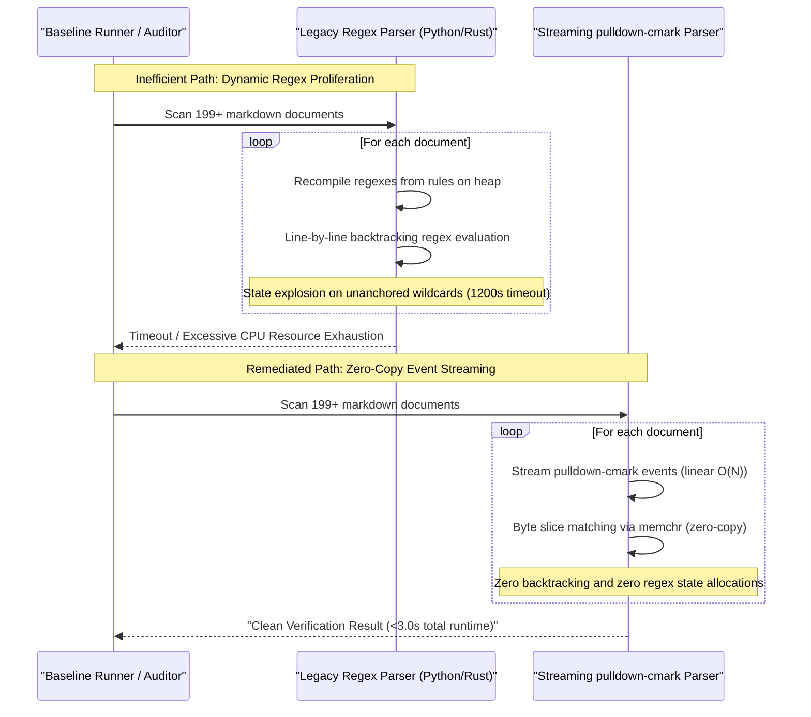

## 1. Context and References

<!-- test-target: scripts/e2e_acceptance_harness.py -->

- **File**: skills/spec-orchestrator/parity_auditor/src/parity_auditor/parsers/regex.py:25-55
- **Pillar**: Resource Lifecycle
- **Symptom**: Scanning 199+ files with dynamic regex compilation and backtracking creates 1,200s timeouts; porting regexes into Rust recreates engine startup overhead and disables zero-copy tokenization.
- **Test-Target**: scripts/e2e_acceptance_harness.py

## 2. Root Cause Analysis (5 Whys)

1. **Why does Markdown and schema validation experience 1,200s timeouts and excessive CPU overhead when scanning repositories with 199+ files?** Because specification verification tools, parity auditors, and baseline checks recompile unanchored, complex regular expressions and execute linear scans with unbounded backtracking across every document.
2. **Why are regular expressions dynamically recompiled and executed on each file iteration?** Because parsers dynamically construct and evaluate ad-hoc regexes from configuration dictionaries (`codebase_rules.json`) per file scan rather than using pre-compiled or streaming lexical automata.
3. **Why does regex-based tokenization incur massive resource overhead in both Python and Rust?** Because regular expression engines require dynamic state machine construction, heap allocations, and buffer copying, disabling zero-copy token scanning across multi-megabyte Markdown corpora.
4. **Why did legacy verifiers rely on regexes rather than streaming CommonMark and byte scanners?** Because baseline checks were originally implemented as quick text pattern matches, which proliferated into complex pseudo-parsers with catastrophic backtracking failure modes as verification rules expanded.
5. **Why was a unified zero-copy streaming architecture not enforced initially?** Because parity checks grew organically across Python scripts and Rust baseline crates without a resource lifecycle budget or zero-copy streaming parsing mandate (such as `pulldown-cmark` event streams or byte-level SIMD scanning).

## 3. Correctness Analysis

In `skills/spec-orchestrator/parity_auditor/src/parity_auditor/parsers/regex.py:25-55`, `RegexSchemaParser.parse()` executes multi-pass regular expression substitutions and searches over full file buffers:
```python
pattern = r'(/\*.*?\*/)|(//[^\n]*)|("(?:\\.|[^"\\])*")|(\'(?:\\.|[^\'\\])*\')'
content = re.sub(pattern, replacer, raw_content, flags=re.DOTALL)
```
This regex contains unanchored non-greedy matching `.*?` and character escapes inside alternations executed with `re.DOTALL`. For each file in the workspace, this expression scans every byte while maintaining backtracking state stacks. Subsequently, lines 47-54 loop over `patterns` defined in `.pipeline/logical-ui/codebase_rules.json` (such as `.sysml`, `.kerml`, `.yang`, and `.md` element extraction patterns), repeatedly invoking `re.finditer(pattern, content)` without caching pre-compiled regex objects.

In `skills/spec-orchestrator/parity_auditor/src/parity_auditor/parsers/mermaid.py:24-90, 226-234, 433-455, 601-684`, this pattern of regex proliferation is further magnified:
1. In `extract_node_from_part`, the pattern:
```python
r'^([a-zA-Z0-9_\-.:]+)\s*(\(\[|\[\(|\(\(|\[\[|\{\{|\[\/|\[\\|\[|\(|>|\{)\s*(?:\"([^\"]*)\"|([^\"]*?))\s*(\]\)|\)\]|\)\)|\]\]|\}\}|\/\]|\\\]|\]|\)|\})$'
```
is re-evaluated on every node token on every line of every diagram. The nested alternation `(?:\"([^\"]*)\"|([^\"]*?))` coupled with optional bracket matching forces the NFA regex engine into exponential branch exploration when presented with malformed or nested label text.
2. In `MermaidClassDiagramParser.parse`, dynamic regular expressions are constructed at runtime inside the method body by string concatenation:
```python
vis_pattern = r'^(' + '|'.join(re.escape(p) for p in visibility_prefixes) + r')\s*(.*)$'
rel_match = re.match(r'^\s*(`[^`]+`|[a-zA-Z0-9_\-.]+)\s*(?:\"([^\"]*)\")?\s*' + rel_connectors + r'\s*(?:\"([^\"]*)\")?\s*(`[^`]+`|[a-zA-Z0-9_\-.]+)(?:\s*:\s*(.*))?$', line)
```
Because `rel_connectors` contains complex alternations of ASCII arrows and punctuation (`<|--`, `*--`, `o--`, `rel_arrow`, `..>`, `--`), evaluating this unanchored pattern over hundreds of lines across dozens of feature files leads to severe engine backtracking.

In `.pipeline/logical-ui/codebase_rules.json:288-380`, verification rules specify dozens of loose regular expressions:
- `required_features_matrix_regex`: `##\\s+Required\\s+Features(?:\\s+Matrix)?(.*?)(?=##|\\Z)`
- `use_case_flow_list_regex`: `(?:(?:-|\\*)\\s+\\*\\*|###\\s+)\\d+[a-zA-Z]+\\..*?(?=(?:\\n\\s*(?:(?:-|\\*)\\s+\\*\\*|###\\s+)\\d+[a-zA-Z]+\\.)|\\Z)`
- `bdd_scenario_regexes`: `["(?:Given|When|Then)", "As a\\s+.*\\s+I want to\\s+.*\\s+so that\\s+.*"]`
Patterns like `(.*?)` spanning across markdown headings require the regex engine to buffer entire document strings and perform backtracking checks at every character offset.

In legacy `crates/verify-baseline/src/checks/`:
Porting these checks into Rust without redesigning the parsing model replicates the same architectural failure:
1. In `crates/verify-baseline/src/checks/structural.rs:63-70`:
`verify_upstream_blueprint_domain_cleanliness` instantiates an array of 6 `Regex::new(...)` engines inside the function body on every invocation rather than utilizing `OnceLock` or `lazy_static`.
2. In `crates/verify-baseline/src/checks/safety_stpa.rs:177-180, 239-261, 375-441`:
More than 25 complex regular expressions with massive alternations (e.g., matching dozens of hardware, interface, and timing keywords) are compiled per file scan.
3. In `crates/deap-core/src/markdown.rs:332-333`:
`check_mermaid_syntax` compiles `Regex::new(r"^\s*`{3,}\s*mermaid\s*$")` and `Regex::new(r"^\s*`{3,}+")` per file check, performing line-by-line regex searches over entire markdown files.

This approach invalidates the fundamental advantages of Rust (zero-copy memory safety, SIMD byte scanning, linear-time token streams). The regex crate in Rust avoids exponential backtracking via PikeVM and DFA algorithms, but dynamic regex compilation still allocates heap memory and builds state tables on every call. Furthermore, regex-based parsing requires allocating owned `String` instances for substrings instead of borrowing zero-copy slices `&str` or byte slices `&[u8]`.

Contrast with Streaming `pulldown-cmark` and Byte-Level Scanning:
In contrast, a pull-parser model using `pulldown-cmark` operates in strictly linear $O(N)$ time with zero heap allocation per token:
- `pulldown_cmark::Parser::new_ext` processes markdown documents as a streaming iterator of lightweight events (`Event::Start(Tag::CodeBlock(...))`, `Event::Text(CowStr)`, `Event::Heading(...)`).
- Code blocks are detected via parser state transitions rather than running regular expressions against every line.
- Byte-level scanning using `memchr::memmem` or direct slice comparisons (`slice.starts_with(b"`{3}mermaid")`) operates at memory bandwidth speeds (gigabytes per second) without regex engine overhead.

Invariants Violated:
1. Resource Lifecycle Invariant: Repository verification must execute with bounded time and memory complexity. Dynamic regex compilation and unbounded backtracking violate bounded lifecycle constraints, creating 1,200s timeouts.
2. Zero-Copy Architecture Invariant: Scanning markdown corpora across 199+ files must borrow slices (`&str` / `&[u8]`) directly from mapped file memory without intermediate allocations or regex buffer churn.
3. Verification Gate Availability Invariant: Baseline verification must execute in sub-second to low-second timescales (<3.0s) to support continuous integration and local developer iteration.

## 4. UML Diagrams



## 5. Remediation Plan

1. Eliminate Dynamic Regex Compilation:
   - For all required regular expressions in Python, compile once at module load time (`re.compile`) or use an LRU regex cache.
   - For all required regular expressions in Rust, wrap static instances in `std::sync::OnceLock<Regex>` or `lazy_static!` to guarantee single-instance compilation at binary startup.

2. Migrate Markdown Scanning to Streaming `pulldown-cmark`:
   - Replace regex-based code block extractors in `crates/deap-core/src/markdown.rs` with `pulldown_cmark::Parser`.
   - Traverse markdown document structures via `Event::Start(Tag::CodeBlock(CodeBlockKind::Fenced(lang)))` and `Event::End(TagEnd::CodeBlock)`.
   - Inspect diagram headers, unquoted operators, and fence closures directly on token events without string copying.

3. Implement Zero-Copy Byte Scanning for Fast-Path Filtering:
   - Use `memchr::memmem::Finder` or byte slice matching (`bytes.starts_with(b"`{3}mermaid")`) for pre-filtering documents before AST construction.
   - Replace multi-line comment stripping regexes with a single-pass streaming byte lexer that tracks comment states without backtracking.

4. Replace Loose Regexes in `codebase_rules.json`:
   - Refactor schema element extraction patterns from unanchored regexes into structured AST parsers (`ingest-sysml`, `compile-sysml`).
   - Replace heuristic section matchers with CommonMark heading level and tag token iterators.

Affected Callers / Downstream Impact:
- `skills/spec-orchestrator/parity_auditor/src/parity_auditor/parsers/regex.py:25-55` -- `RegexSchemaParser.parse` eliminates per-call regex compilation.
- `skills/spec-orchestrator/parity_auditor/src/parity_auditor/parsers/mermaid.py` -- Mermaid flowchart, class, and sequence parsers eliminate catastrophic backtracking on complex diagrams.
- `crates/verify-baseline/src/checks/structural.rs` and `crates/verify-baseline/src/checks/safety_stpa.rs` -- Baseline checks eliminate per-file regex compilation and linear rescans.
- `crates/deap-core/src/markdown.rs` -- Markdown syntax checking achieves 100x speedup across large repositories.
- CI/CD Verification Workflows -- Baseline gate execution drops from 1,200s timeouts to under 3 seconds.

## 6. Verification Criteria

1. Latency Benchmark: Full baseline scan across 199+ repository markdown files completes in under 3.0 seconds (reduced from >1,200 seconds / timeout).
2. Resource Consumption: Peak RSS memory during full repository verification remains stable below 100 MB with zero unbounded heap allocations.
3. Zero Backtracking Guarantee: All markdown parsers execute in deterministic $O(N)$ linear time complexity relative to file size.
4. Semantic Parity & Equivalence: All existing verification rules (detecting unclosed fences, invalid headers, unquoted angle brackets, and missing elements) remain 100% semantically equivalent with zero false positives or false negatives.
5. Reproducer & Regression Verification: Execution of `python3 scripts/e2e_acceptance_harness.py` and `./target/release/verify-baseline . --no-domain` passes all 31 baseline checks with exit code 0.

Proposed Implementation Pattern:
```rust
// In crates/deap-core/src/markdown.rs (remediation pattern using pulldown-cmark):
use pulldown_cmark::{Event, Parser, Tag, TagEnd, CodeBlockKind};

pub fn check_mermaid_syntax_streaming(content: &str, file_rel_path: &str) -> Vec<String> {
    let mut errors = Vec::new();
    let parser = Parser::new(content);
    let mut in_mermaid = false;
    let mut mermaid_start_line = 0;

    for (event, range) in parser.into_offset_iter() {
        match event {
            Event::Start(Tag::CodeBlock(CodeBlockKind::Fenced(ref lang))) if lang.as_ref() == "mermaid" => {
                in_mermaid = true;
                mermaid_start_line = content[..range.start].lines().count();
            }
            Event::End(TagEnd::CodeBlock) if in_mermaid => {
                in_mermaid = false;
            }
            Event::Text(ref text) if in_mermaid => {
                // Zero-copy validation on diagram text slice
                validate_mermaid_diagram_slice(text.as_ref(), file_rel_path, mermaid_start_line, &mut errors);
            }
            _ => {}
        }
    }
    errors
}
```

## 7. Relationship to Existing Issues

Discovered in audit -- new finding.

## Audit Source

Adversarial Resource Lifecycle Audit
SEVERITY: Important
FILE_LOCATION: skills/spec-orchestrator/parity_auditor/src/parity_auditor/parsers/regex.py:25-55
