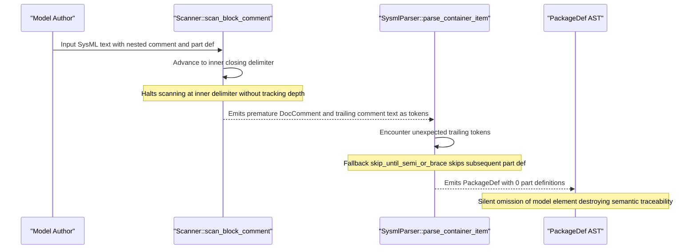

## 1. Context and References

<!-- test-target: tests/test_sysml_compiler_parity.py -->

- **File**: `crates/compile-sysml/src/lexer/scanner.rs:180-220`
- **Pillar**: Semantic Traceability
- **Symptom**: Lexical scanner terminates nested block comments prematurely and unconditionally emits non-doc block comments as DocComment, while single-quoted unrestricted names are misclassified as StringLit; this truncates the token stream, silently drops downstream structural elements from the AST, and breaks semantic traceability.
- **Test-Target**: `tests/test_sysml_compiler_parity.py`

## 2. Root Cause Analysis (5 Whys)

1. **Why does a SysML v2 model with nested block comments fail compilation or silently drop structural elements?** Because scan_block_comment halts at the first closing comment delimiter without tracking comment nesting depth, emitting the remainder of the outer comment as raw tokens that fail parser statements and trigger skip_until_semi_or_brace.
2. **Why does scan_block_comment fail to track nesting depth?** Because the scanner implements a flat while loop matching !self.starts_with("*/"), violating OMG SysML v2 and KerML specification clause 7.2.2.3 which mandates support for nested block comments.
3. **Why are non-normative block comments emitted as TokenKind::DocComment?** Because scan_block_comment unconditionally wraps extracted comment text into TokenKind::DocComment, polluting element doc fields and preventing skip_trivia from discarding non-doc commentary.
4. **Why are single-quoted identifiers rejected by the parser?** Because scan_string treats single quotation marks identically to double quotes, classifying unrestricted SysML v2 identifiers as TokenKind::StringLit rather than TokenKind::Ident.
5. **Why did the test suite fail to catch these lexer failures?** Because test_scan_doc_comment only exercises an isolated single-line doc comment pattern on an unnested comment, lacking assertions for nested comments, unrestricted names, and non-doc commentary, thereby violating semantic traceability between defect invariants and test coverage.

## 3. Correctness Analysis

In crates/compile-sysml/src/lexer/scanner.rs lines 181-214, scan_block_comment scans block comments:
Lines 186-192 execute a flat loop checking !self.is_at_end() && !self.starts_with("*/"). When encountering nested block comments permitted by OMG SysML v2 and KerML 1.0 clause 7.2.2.3 (such as commenting out deprecated subsystem blocks containing internal doc comments), the loop encounters the inner closing delimiter and exits immediately. Lines 198-200 advance past the inner closing delimiter. The trailing commentary of the outer block comment is returned to next_token(). The scanner parses words in the remaining commentary as identifiers and punctuation as operators.

When the downstream parser in crates/compile-sysml/src/parser/grammar.rs lines 261-264 attempts to parse container items, unexpected trailing tokens hit the default fallback branch:
self.skip_until_semi_or_brace();
This consumes all tokens until the next semicolon or brace, completely discarding valid downstream declarations (such as part def, port def, or requirement def). This produces models with 0 structural elements or silently missing components, invalidating model coverage and semantic traceability.

Furthermore, line 211 unconditionally instantiates TokenKind::DocComment(comment_text). SysML v2 distinguishes between general commentary and element documentation. Emitting all block comments as DocComment attaches developer scratch comments or license notices to subsequent AST nodes via take_doc_comment().

Finally, in lines 216-255, scan_string consumes single-quoted literals and emits TokenKind::StringLit(value). Under KerML clause 7.2.2.2 (Identification), single quotes represent unrestricted names (identifiers containing spaces, colons, or dashes). When parsed by SysmlParser, constructs such as part def 'Flight Control Computer' trigger fatal syntax errors: Expected identifier, found 'StringLit("Flight Control Computer")'.

Invariants Violated:
1. Semantic Traceability Invariant: The compiler must faithfully ingest and preserve SysML v2 model elements without silent omission caused by lexical misclassification or delimiter mistracking.
2. KerML Clause 7.2.2.3 Comment Specification: Block comments must support arbitrary nesting depth without premature termination.
3. KerML Clause 7.2.2.2 Identification Specification: Single-quoted strings represent unrestricted names and must be tokenized as identifiers.
4. Pure Schema-Driven Compiler Invariant: Downstream model-based synthesis and STPA generation depend on 100% complete AST representations without missing structural nodes.

## 4. UML Diagrams



## 5. Affected Callers / Downstream Impact

- crates/compile-sysml/src/lexer/scanner.rs:181-220 -- scan_block_comment and scan_string truncate token streams and misclassify tokens.
- crates/compile-sysml/src/parser/grammar.rs:100-268 -- parse_container_item drops definitions when trailing comment text produces unexpected tokens.
- crates/compile-sysml/src/main.rs -- CLI invocations (--compile, --stpa-transpile, --forward-sync, --reverse-sync) drop model elements or fail on valid SysML v2 models.
- Downstream Safety and Specification Artifacts (docs/safety/STPA_MATRIX.md, docs/features/) -- Truncated AST models result in missing safety constraints, unrepresented part definitions, and broken requirement traceability.
- Downstream Baseline Verification (crates/verify-baseline Check 31 Dual-Schema Parity) -- Fails when compiled schema digest reflects missing model elements.

## 6. Proposed Correction

```rust
// In crates/compile-sysml/src/lexer/scanner.rs:

// 1. Support nested block comments with depth tracking:
fn scan_block_comment(&mut self, is_doc: bool, start: usize, line: usize, col: usize) -> Result<Token, String> {
    self.advance(); // /
    self.advance(); // *
    let content_start = self.cursor;
    let mut depth: usize = 1;

    while !self.is_at_end() && depth > 0 {
        if self.starts_with("/*") {
            depth += 1;
            self.advance();
            self.advance();
        } else if self.starts_with("*/") {
            depth -= 1;
            self.advance();
            self.advance();
            if depth == 0 {
                break;
            }
        } else {
            if self.peek() == '
' {
                self.line += 1;
                self.col = 0;
            }
            self.advance();
        }
    }

    if depth > 0 {
        return Err(format!("Unclosed block comment starting at {}:{}", line, col));
    }

    let content_end = self.cursor - 2; // Exclude closing */
    let raw = &self.source[content_start..content_end];
    let cleaned = raw.trim();

    if is_doc {
        let comment_text = if cleaned.starts_with("doc") && (cleaned.len() == 3 || cleaned[3..].chars().next().map_or(false, |c| c.is_whitespace() || c == ':')) {
            cleaned[3..].trim_start_matches(|c: char| c.is_whitespace() || c == ':').trim().to_string()
        } else {
            cleaned.to_string()
        };
        Ok(Token::new(
            TokenKind::DocComment(comment_text),
            Span::new(start, self.cursor, line, col),
        ))
    } else {
        Ok(Token::new(
            TokenKind::LineComment(cleaned.to_string()),
            Span::new(start, self.cursor, line, col),
        ))
    }
}

// 2. Tokenize single-quoted unrestricted names as TokenKind::Ident in scan_string:
fn scan_string(&mut self, quote: char, start: usize, line: usize, col: usize) -> Result<Token, String> {
    self.advance(); // opening quote
    let mut value = String::new();

    while !self.is_at_end() && self.peek() != quote {
        let ch = self.peek();
        if ch == '\' {
            self.advance();
            if self.is_at_end() {
                return Err(format!("Unterminated escape in string literal at {}:{}", line, col));
            }
            match self.advance() {
                'n' => value.push('
'),
                'r' => value.push('
'),
                't' => value.push('	'),
                '\' => value.push('\'),
                '"' => value.push('"'),
                ''' => value.push('''),
                escaped => value.push(escaped),
            }
        } else {
            if ch == '
' {
                self.line += 1;
                self.col = 0;
            }
            value.push(ch);
            self.advance();
        }
    }

    if self.is_at_end() {
        return Err(format!("Unclosed string literal starting at {}:{}", line, col));
    }

    self.advance(); // closing quote
    let kind = if quote == ''' {
        TokenKind::Ident(value)
    } else {
        TokenKind::StringLit(value)
    };

    Ok(Token::new(
        kind,
        Span::new(start, self.cursor, line, col),
    ))
}
```

## 7. Relationship to Existing Issues

Discovered in audit -- new finding.

## Audit Source

Adversarial Semantic Traceability Audit
SEVERITY: Important
FILE_LOCATION: crates/compile-sysml/src/lexer/scanner.rs:180-220
