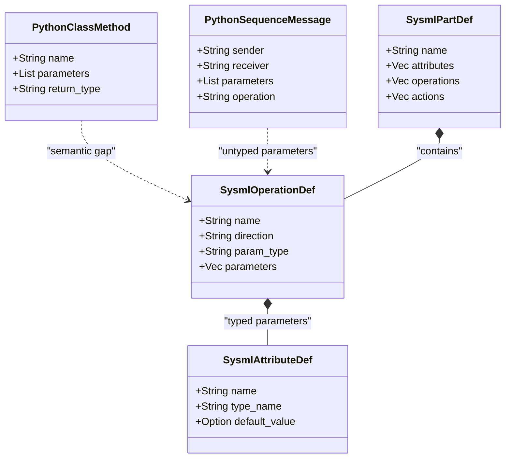

## 1. Context and References

<!-- test-target: scripts/e2e_acceptance_harness.py -->

- **File**: `skills/spec-orchestrator/parity_auditor/src/parity_auditor/core/models.py:207-295`
- **Pillar**: Semantic Traceability
- **Symptom**: Specification parity auditor represents structural AST elements, operations, parameters, and diagram interactions using stringly-typed dynamic dictionaries (dict[str, Any], Dict[str, Optional[str]]) and ad-hoc tuples instead of binding to strongly-typed SysML v2 AST models (PackageDef, PartDef, AttributeDef, OperationDef, ActionDef, StateDef, TransitionDef), causing semantic impedance mismatch, loss of compile-time verification, and architectural divergence when porting auditing gates to Rust.
- **Test-Target**: `scripts/e2e_acceptance_harness.py`

## 2. Root Cause Analysis (5 Whys)

1. **Why does the specification parity auditor fail to establish verifiable semantic traceability between Agile markdown specifications and SysML v2 models?** Because diagram and specification parsers store model elements in untyped dict[str, Any] collections, loose string mappings, and unstructured tuples instead of binding to a unified AST definition.
2. **Why do the models and parsers rely on untyped dictionaries and stringly-typed data structures?** Because Python dataclasses in models.py (such as ClassMethod, SequenceMessage, and ResearchInventoryDocument) and regex parsers in parsers/mermaid.py were implemented as ad-hoc text extractors that decompose diagrams into dynamic string maps rather than formal domain AST nodes.
3. **Why is using dynamic string dictionaries problematic for compiler verification and Rust porting?** Because dynamic dictionaries lose field typing, allow silent omission of required attributes, require error-prone string key lookups, and cannot map onto the strongly-typed deap_core::sysml_ast representations (PackageDef, PartDef, AttributeDef, OperationDef, ActionDef, StateDef, TransitionDef).
4. **Why does this impedance mismatch undermine the Model-Based Systems Engineering (MBSE) compiler architecture?** Because the DEAP architecture establishes SysML v2 as the Single Source of Truth (SSOT), requiring all specifications and diagram semantics to project deterministically from and reconcile into the formal KerML/SysML v2 AST without semantic drift or ungrounded attributes.
5. **Why was this architectural defect not resolved earlier?** Because early prototype tooling treated Markdown diagrams as disposable presentation artifacts rather than executable semantic projections of the SysML v2 AST, and lacked a unified cross-language AST binding layer shared between Python parity auditing and the Rust compiler toolchain.

## 3. Correctness Analysis

In `skills/spec-orchestrator/parity_auditor/src/parity_auditor/core/models.py:207-295` and `skills/spec-orchestrator/parity_auditor/src/parity_auditor/parsers/mermaid.py`, diagram representations and specification metadata are implemented using dynamically-typed Python dataclasses and loose dictionary structures:

1. **Untyped Parameter Bags and Dynamic Dictionaries in Models**:
- At `models.py:220`, `ClassMethod.parameters` is declared as `List[Dict[str, Optional[str]]]`. Parameter names and types are stored in ad-hoc dictionary objects without structured schema validation.
- At `models.py:264`, `SequenceMessage.parameters` is similarly typed as `List[Dict[str, Optional[str]]]`.
- At `models.py:267`, `SequenceMessage.fragment_context` is stored as an untyped `List[Dict[str, str]]`.
- At `models.py:300`, `FeatureFile.frontmatter` is typed as `Dict[str, Any]`.
- At `models.py:312`, `323`, `335`, `345`, `350`, `355`, records in `ResearchInventoryDocument` rely on `Dict[str, str]` and `Dict[str, Any]` for raw attributes, metadata, and gap analysis.

2. **Ad-hoc Tuple Returns and Anonymous Dictionaries in Parsers**:
- In `parsers/mermaid.py:46-47`, `extract_node_from_part` returns an untyped 3-tuple `(node_id, shape, label)` or `(part, None, None)`.
- In `parsers/mermaid.py:53-89`, `parse_connection_line` returns raw 4-tuples `(src, tgt, style, label)`.
- In `parsers/mermaid.py:312-320`, `parse_method_signature` creates raw dictionary literals `{"name": p_parts[0].strip(), "type": p_parts[1].strip()}`.
- In `parsers/mermaid.py:530-536`, `parse_lifeline_label` returns raw 2-tuples `(inst_name, class_name)`.
- In `parsers/mermaid.py:580-585`, `parse_sequence_message_text` returns an untyped dictionary `{"operation": operation, "parameters": parameters, "assignment": assignment, "raw": text}`.
- In `parsers/mermaid.py:405`, `415`, `720-724`, parsing stacks push anonymous dictionaries `{"type": "namespace", "name": ns_name}` and `{"type": f.type, "guard": f.branches[-1].guard}`.

3. **Impedance Mismatch with Authoritative SysML v2 AST**:
In `crates/deap-core/src/sysml_ast.rs`, the authoritative compiler core defines strongly-typed AST nodes:
- `PackageDef`: Root container containing typed vectors of `part_defs`, `port_defs`, `action_defs`, `operation_defs`, `state_defs`, and `use_case_defs`.
- `PartDef`: Structural classifier containing strongly-typed child collections (`attributes: Vec<AttributeDef>`, `actions: Vec<ActionDef>`, `operations: Vec<OperationDef>`, `states: Vec<StateDef>`, `ports: Vec<PortDef>`).
- `AttributeDef`: Formally typed property definition with `name`, `type_name`, `default_value: Option<String>`, and `doc: Option<String>`.
- `OperationDef`: Formally typed method signature with `name`, `direction`, `param_type`, `return_type: Option<String>`, and `parameters: Vec<AttributeDef>`.
- `ActionDef`: Behavioral activity definition with `in_params: Vec<AttributeDef>`, `out_params: Vec<AttributeDef>`, and `parameters: Vec<AttributeDef>`.
- `StateDef` and `TransitionDef`: Discrete event state machine nodes with strongly-typed triggers, guards, entry/exit actions, and hierarchical substates.

4. **Violated Compiler Invariants**:
This design directly violates the Pure Schema-Driven Compiler Invariant (.pipeline/constitution.md:48-52) and the Semantic Traceability & SSOT Parity Invariant (.pipeline/constitution.md:79-112, Check 21 & Check 25).
By decomposing Markdown diagrams into dynamic string dictionaries rather than binding to `sysml_ast` structures:
- Type safety is lost: any typos in dictionary keys (e.g. `param["type"]` vs `param["param_type"]`) fail silently or raise runtime KeyErrors.
- Rust porting is impeded: developers translating Python code to Rust are forced to use `HashMap<String, serde_json::Value>` or unstructured tuples, defeating Rust type-checking and bypassing `deap_core::sysml_ast`.
- Parity verification degrades: because the auditor models do not conform to the AST schema, checking diagram-to-model consistency requires lossy translation heuristics rather than structural equality.

## 4. UML Diagrams



## 5. Affected Callers / Downstream Impact

- `skills/spec-orchestrator/parity_auditor/src/parity_auditor/core/models.py` -- Data structures like `ClassMethod`, `ClassAttribute`, and `SequenceMessage` discard type definitions, leading to runtime dictionary lookups and potential `KeyError` or attribute omission during specification validation.
- `skills/spec-orchestrator/parity_auditor/src/parity_auditor/parsers/mermaid.py` -- Parsers extract diagram elements into unstructured tuples and dictionary payloads, preventing compile-time syntax validation.
- `crates/verify-baseline` and `crates/compile-sysml` -- When migrating parity auditing logic and baseline checks from Python to Rust, the impedance mismatch forces unprincipled dynamic translations (`serde_json::Value` or `HashMap<String, String>`) rather than binding directly to `deap_core::sysml_ast`.
- Downstream Spec Verification & Audit Reports -- Cross-document parity checks (Check 21 and Check 25) face false positives or false negatives because diagram parameters, types, and constraints cannot be verified directly against formal `AttributeDef`, `OperationDef`, or `StateDef` AST entities.
- Remediation Plan:
  1. Replace dynamic dictionaries in `models.py` with strongly-typed dataclasses mirroring `deap_core::sysml_ast` (`AttributeDef`, `OperationDef`, `PartDef`, `ActionDef`, `StateDef`, `TransitionDef`).
  2. Refactor `parsers/mermaid.py` to construct typed AST nodes directly, replacing ad-hoc tuple returns and raw dictionary mappings.
  3. In Rust compiler and baseline verification crates (`crates/compile-sysml`, `crates/verify-baseline`), provide native diagram parsers that output `deap_core::sysml_ast` types directly.
  4. Enforce end-to-end round-trip semantic fidelity between SysML v2 schemas and specification diagrams.

## 6. Proposed Correction

```python
# Proposed strongly-typed model definition in skills/spec-orchestrator/parity_auditor/src/parity_auditor/core/models.py
# Aligning directly with crates/deap-core/src/sysml_ast.rs:

from dataclasses import dataclass, field
from typing import List, Optional

@dataclass
class AstAttributeDef:
    name: str
    type_name: str = "String"
    default_value: Optional[str] = None
    doc: Optional[str] = None

@dataclass
class AstOperationDef:
    name: str
    direction: str = "inout"
    param_type: str = ""
    return_type: Optional[str] = None
    doc: Optional[str] = None
    parameters: List[AstAttributeDef] = field(default_factory=list)

@dataclass
class AstTransitionDef:
    name: Optional[str] = None
    source: Optional[str] = None
    target: Optional[str] = None
    trigger: Optional[str] = None
    guard: Optional[str] = None
    effect: Optional[str] = None
    doc: Optional[str] = None

@dataclass
class AstStateDef:
    name: str
    doc: Optional[str] = None
    entry_action: Optional[str] = None
    do_action: Optional[str] = None
    exit_action: Optional[str] = None
    transitions: List[AstTransitionDef] = field(default_factory=list)
    sub_states: List['AstStateDef'] = field(default_factory=list)

@dataclass
class AstPartDef:
    name: str
    doc: Optional[str] = None
    is_def: bool = True
    type_name: Optional[str] = None
    attributes: List[AstAttributeDef] = field(default_factory=list)
    operations: List[AstOperationDef] = field(default_factory=list)
    states: List[AstStateDef] = field(default_factory=list)
```

Verification Criteria:
- Verification Criterion 1 (Static Type Safety): Core diagram models must not contain untyped `dict[str, Any]` or `Dict[str, Optional[str]]` parameter bags.
- Verification Criterion 2 (SysML AST Schema Parity): Audited class methods, attributes, state machines, and sequence messages map 1:1 onto `deap_core::sysml_ast` (`PackageDef`, `PartDef`, `AttributeDef`, `OperationDef`, `ActionDef`, `StateDef`, `TransitionDef`).
- Verification Criterion 3 (Acceptance Testing): Semantic acceptance testing via `scripts/e2e_acceptance_harness.py` passes with zero reliance on unstructured dictionary parsing.
- Verification Criterion 4 (Baseline Conformance): `./target/release/verify-baseline . --no-domain` completes with all checks passing.

## 7. Relationship to Existing Issues

Discovered in audit -- new finding. Complements Issue #97 (Cited Research Inventory & Declared-Total Population Register Models), Issue #98 (Coverage-Digest & Obligation-Witness Models), and ongoing architectural refactoring to unify compiler verification around deap_core::sysml_ast.

## Audit Source

Adversarial Semantic Traceability Audit
SEVERITY: Important
FILE_LOCATION: skills/spec-orchestrator/parity_auditor/src/parity_auditor/core/models.py:207-295
