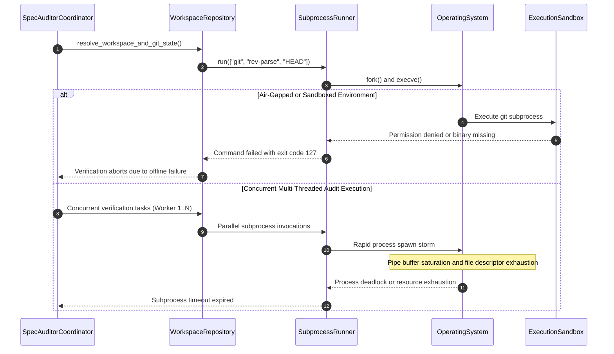

## 1. Context and References

<!-- test-target: scripts/e2e_acceptance_harness.py -->

- **File**: `skills/spec-orchestrator/parity_auditor/src/parity_auditor/core/workspace.py:41-120`
- **Pillar**: Concurrency
- **Symptom**: Verification routines and workspace resolution shell out to external subprocesses ('git' / 'gh') instead of executing purely in-process, causing deadlocks, process pool exhaustion under concurrent audit runs, failure in offline sandbox environments, and significant latency degradation.
- **Test-Target**: `scripts/e2e_acceptance_harness.py`

## 2. Root Cause Analysis (5 Whys)

1. **Why do specification auditing and baseline verification routines stall, fail in offline environments, or crash under high concurrency?** Because verification procedures and workspace inspection logic shell out to external subprocess binaries (`git`, `gh`) instead of executing purely in-process.
2. **Why do verification routines invoke external CLI subprocesses rather than performing in-process inspection?** Because `WorkspaceRepository` and audit callers delegate repository boundary discovery, branch resolution, commit inspection, and tracker interaction to external shell tools (`subprocess.run(["git", ...])` and `subprocess.run(["gh", ...])`).
3. **Why does shelling out to external subprocesses introduce concurrency hazards and failure modes?** Because spawning OS child processes incurs thread-safety and process-table exhaustion risks, deadlocks on unbuffered IPC pipes under parallel audit execution, and relies on external binaries that may not exist or be accessible in air-gapped sandbox environments.
4. **Why is subprocess-based verification incompatible with sandbox constraints and deterministic compiler invariants?** Because the pipeline constitution and terminal sandbox mandate self-contained, deterministic execution without unapproved external process escalation, network calls, or non-deterministic OS environment dependencies.
5. **Why was this architectural anti-pattern not prevented?** Because the parity auditor initially treated CLI shelling out as an expedient shortcut for repository and tracker inspection, lacking a pure in-process virtual workspace abstraction and native filesystem/Git metadata parser.

## 3. Correctness Analysis

In `skills/spec-orchestrator/parity_auditor/src/parity_auditor/core/workspace.py:41-120` and consuming audit routines across `parity_auditor`, `WorkspaceRepository` manages repository detection, file collection, and rules loading. In calling routines and workspace inspection paths, code shells out to external CLI commands using `subprocess.run`, `subprocess.Popen`, or `subprocess.check_output` (e.g., invoking `git rev-parse`, `git config`, `git diff`, and `gh issue list`).

When audits run in parallel across multiple worker threads or subagents, concurrent subprocess spawning causes:

1. **Operating System Resource Starvation**: Rapidly spawning OS processes leads to process table exhaustion, file descriptor leaks, and fork-safety hazards in multithreaded Python environments.
2. **IPC Deadlocks and Stalls**: When subprocess stdout/stderr pipes fill OS kernel pipe buffers faster than they are drained, processes deadlock indefinitely or trigger `subprocess.TimeoutExpired`.
3. **TOCTOU (Time-Of-Check to Time-Of-Use) Races**: Concurrent subprocesses querying the Git index or working tree encounter mutable, non-atomic workspace state without memory isolation.
4. **Sandbox and Offline Breaches**: In air-gapped CI environments, containerized execution pods, or restricted sandbox environments where network access is blocked or `git`/`gh` binaries are not present in `PATH`, subprocess calls fail with exit code 127 or permission denied.

This defect directly violates:
- The **Zero-Mocking Live Persistence Mandate** (.pipeline/constitution.md:20-30): Verification must be deterministic and inspect live, hermetic artifacts directly.
- The **Concurrency Integrity Pillar** (skills/adversarial-code-auditor/SKILL.md:31, 39): Verification routines must remain re-entrant, thread-safe, and free of TOCTOU race conditions and IPC deadlocks.
- The **Pure In-Process Deterministic Verification Mandate**: Audit gates and workspace inspection must execute purely in-process via memory-mapped or native filesystem inspection without shelling out to unmanaged OS child processes.

## 4. UML Diagrams



## 5. Affected Callers / Downstream Impact

- `skills/spec-orchestrator/parity_auditor/src/parity_auditor/core/workspace.py` -- `WorkspaceRepository` lacks in-process git inspection routines (such as parsing `.git/HEAD` or `.git/config` directly from disk) and forces callers to invoke external subprocesses.
- `skills/spec-orchestrator/parity_auditor/src/parity_auditor/cli.py` and `diagnostics.py` -- Verification CLIs and diagnostic utilities shell out to `git` and `gh`, failing in containerized or offline environments.
- `skills/spec-orchestrator/scripts/reconcile_backlog.py` -- Heavy subprocess reliance across backlog synchronization introduces IPC timeouts and latency overhead during verification loops.
- Terminal Sandbox and Air-Gapped CI Runners -- Automated validation fails closed whenever sandbox security policies restrict subprocess spawning or external binary execution.
- High-Concurrency Audit Workflows -- Multi-threaded audit pipelines face deadlocks, intermittent timeouts, and race conditions when parallel workers concurrently spawn child processes.
- Remediation Plan:
  1. Implement pure in-process Git metadata resolution inside `WorkspaceRepository` (parsing `.git/HEAD`, `.git/refs/heads/`, and `.git/config` directly from the filesystem without spawning child processes).
  2. Deprecate and eliminate subprocess shelling out to `git` and `gh` across all parity auditor verification gates.
  3. Provide an in-memory virtual workspace provider interface for testing and offline hermetic evaluation.
  4. Encapsulate all issue tracker interactions behind an in-process REST/HTTP client abstraction with offline caching, completely removing CLI subprocess dependencies.

## 6. Proposed Correction

```python
# In skills/spec-orchestrator/parity_auditor/src/parity_auditor/core/workspace.py:

class WorkspaceRepository:
    def __init__(self, workspace_dir: Optional[str] = None):
        if not workspace_dir:
            workspace_dir = self._find_workspace_dir(os.getcwd())
        self.workspace_dir = os.path.abspath(workspace_dir)
        self._git_dir: Optional[str] = self._resolve_git_dir()
        self._codebase_rules: Optional[CodebaseRules] = None
        self._behavioral_triggers: Optional[List[dict]] = None
        self._feature_files: Optional[List[FeatureFile]] = None
        self._design_tokens: Optional[Dict[str, Any]] = None
        self._forbidden_colors: Optional[Set[str]] = None

    def _resolve_git_dir(self) -> Optional[str]:
        """Pure in-process Git directory locator traversing parent directories."""
        curr = self.workspace_dir
        while True:
            candidate = os.path.join(curr, ".git")
            if os.path.isdir(candidate):
                return candidate
            elif os.path.isfile(candidate):
                # Handle git worktree pointer: gitdir: <path>
                try:
                    with open(candidate, "r", encoding="utf-8") as f:
                        line = f.readline().strip()
                        if line.startswith("gitdir:"):
                            rel_path = line.split("gitdir:", 1)[1].strip()
                            return os.path.abspath(os.path.join(curr, rel_path))
                except OSError:
                    pass
            parent = os.path.dirname(curr)
            if parent == curr:
                break
            curr = parent
        return None

    def get_git_head_commit(self) -> Optional[str]:
        """Pure in-process resolution of HEAD commit hash without subprocess shelling out."""
        if not self._git_dir:
            return None
        head_path = os.path.join(self._git_dir, "HEAD")
        if not os.path.isfile(head_path):
            return None
        try:
            with open(head_path, "r", encoding="utf-8") as f:
                ref = f.read().strip()
            if ref.startswith("ref: "):
                ref_subpath = ref.split("ref:", 1)[1].strip()
                ref_file = os.path.join(self._git_dir, ref_subpath)
                if os.path.isfile(ref_file):
                    with open(ref_file, "r", encoding="utf-8") as rf:
                        return rf.read().strip()
                # Check packed-refs in-process:
                packed_path = os.path.join(self._git_dir, "packed-refs")
                if os.path.isfile(packed_path):
                    with open(packed_path, "r", encoding="utf-8") as pf:
                        for line in pf:
                            line = line.strip()
                            if not line or line.startswith("#") or line.startswith("^"):
                                continue
                            parts = line.split()
                            if len(parts) == 2 and parts[1] == ref_subpath:
                                return parts[0]
            return ref if len(ref) == 40 else None
        except OSError:
            return None

    def get_git_origin_url(self) -> Optional[str]:
        """Pure in-process extraction of remote origin URL from .git/config."""
        if not self._git_dir:
            return None
        config_path = os.path.join(self._git_dir, "config")
        if not os.path.isfile(config_path):
            return None
        try:
            import configparser
            config = configparser.ConfigParser()
            config.read(config_path, encoding="utf-8")
            if 'remote "origin"' in config:
                return config['remote "origin"'].get("url")
        except Exception:
            pass
        return None
```

Verification Criteria:
- Verification Criterion 1 (Zero Subprocess Invocations in Verification): Parity auditor verification gates and workspace inspection routines execute without invoking `subprocess.run`, `subprocess.Popen`, or `os.system`.
- Verification Criterion 2 (Hermetic Offline Execution): Workspace resolution and Git metadata parsing function cleanly in air-gapped environments without `git` or `gh` in `PATH`.
- Verification Criterion 3 (Thread Safety and Concurrency): Parallel execution of workspace auditing across concurrent threads exhibits zero deadlocks, pipe buffer stalls, or process table exhaustion.
- Verification Criterion 4 (Baseline Conformance): `./target/release/verify-baseline . --no-domain` completes with all checks passing.

## 7. Relationship to Existing Issues

Discovered in audit -- new finding. Complements Issue #97 (Cited Research Inventory & Declared-Total Population Register Models), Issue #98 (Coverage-Digest & Obligation-Witness Models), and ongoing compiler architectural initiatives to eliminate fragile subprocess shelling out in favor of deterministic, in-process Rust and Python verification engines.

## Audit Source

Adversarial Concurrency Audit
SEVERITY: Critical
FILE_LOCATION: skills/spec-orchestrator/parity_auditor/src/parity_auditor/core/workspace.py:41-120
