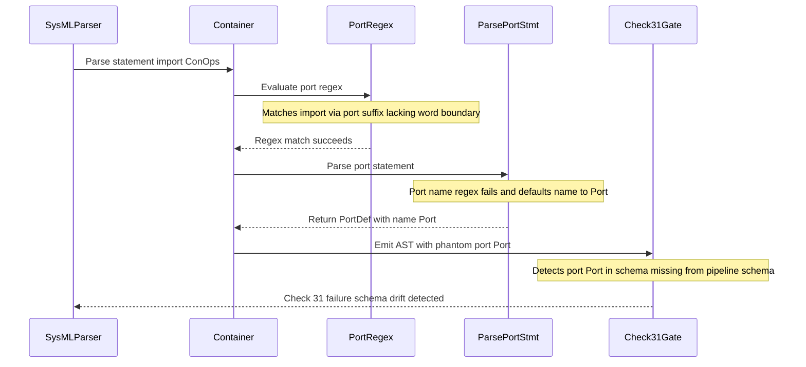

## 1. Context and References

<!-- test-target: tests/test_unbounded_port_regex_reproducer.py -->

- **File**: `skills/spec-orchestrator/scripts/sysmlv2_ast.py:1800-1805`
- **Pillar**: Semantic Traceability
- **Symptom**: Import statements (e.g., 'import ConOps::*;') are misclassified as port definitions due to an unbounded port regex, appending phantom PortDef(name="Port") entries and corrupting Check 31 Dual-Schema SSOT Parity.
- **Test-Target**: `tests/test_unbounded_port_regex_reproducer.py`

## 2. Root Cause Analysis (5 Whys)

1. **Why does Check 31 falsely fail with port def defined in schema but missing in pipeline schema?** Because the SysML v2 AST extractor generates phantom PortDef(name="Port") entries when parsing schema files containing import statements such as import ConOps.
2. **Why does the AST parser generate phantom PortDef entries for import statements?** Because in _populate_container the regex evaluating port statements matches import ConOps, routing the import statement into _parse_port_stmt.
3. **Why does the port regex match an import statement?** Because the pattern lacks a mandatory word boundary before port when the optional direction prefix is omitted, allowing port to match the suffix of the word import.
4. **Why does _parse_port_stmt produce name Port?** Because _parse_port_stmt uses a regex requiring a word boundary before port to extract the port identifier, which fails on import and falls back to default name Port.
5. **Why was this regex ambiguity not prevented or isolated?** Because _populate_container lacked explicit discrimination for import statements prior to structural construct parsing and lacked regression tests asserting import non-interference with port definitions.

## 3. Correctness Analysis

In `skills/spec-orchestrator/scripts/sysmlv2_ast.py:1800`:
When reading `schema/model.sysml` which declares `import ConOps::*;` or subsystem imports, the statement is dispatched inside `_populate_container(container, body_decls)`.
At line 1800:
`elif re.search(r'(?:~?\s*\b(?:in|out|inout)\s+)?~?\s*port\b', stmt):`
Because `import` contains `port` as its suffix (`im` followed by `port`), and the trailing delimiter or whitespace constitutes a trailing word boundary `\b`, `re.search` evaluates to `True`.
The container then invokes `port_obj = self._parse_port_stmt(stmt, doc)` at line 1801 and appends `port_obj` to `container.port_defs` (or `container.ports`).
Inside `_parse_port_stmt(stmt, doc)` at lines 2356-2357:
`m = re.search(r'\b(?:(?:in|out|inout)\s+)?port\s+(?:def\s+)?(?:(?:in|out|inout)\s+)?~?\s*([a-zA-Z0-9_]+)', stmt)`
`name = m.group(1) if m else "Port"`
Since `stmt` starts with `import`, `\bport\s+` fails to match because `import` does not have a word boundary before `port`. Consequently, `name` defaults to `"Port"`.
This violates the Pure Schema-Driven Compiler Invariant and Dual-Schema SSOT Parity Gate invariant: AST extracted from valid SysML v2 source must faithfully reflect declared model elements without phantom synthesis or corrupted structural types.
Furthermore, in `scripts/verify_downstream_baseline.py:3712-3746`, Check 31 evaluates `ast_schema_dir` against `ast_pipeline`. Because `schema/model.sysml` contains `import ConOps::*;`, `ast_schema_dir["port_defs"]` includes `"Port"`, which is absent from `.pipeline/schema.sysml`, causing baseline verification to fail closed.

## 4. UML Diagrams



## 5. Affected Callers / Downstream Impact

- `SysMLParser.parse_text` in `skills/spec-orchestrator/scripts/sysmlv2_ast.py` -- Appends phantom `PortDef(name="Port")` to any package or part containing `import` statements.
- `compile_sysml.parse_sysml` in `scripts/compile_sysml.py` -- Collects phantom `"Port"` into `ast["port_defs"]`.
- `check_dual_schema_ssot_parity` (Check 31) in `scripts/verify_downstream_baseline.py` -- Triggers false-positive schema drift failures, blocking CI/CD and downstream verification.
- Downstream code generators and architectural analyzers -- Incorrectly process phantom ports on structural components.

## 6. Proposed Correction

```python
# In skills/spec-orchestrator/scripts/sysmlv2_ast.py (_populate_container):
# Explicitly handle import statements before structural constructs
if re.search(r'^\s*import\b', stmt):
    if hasattr(container, "imports"):
        container.imports.append(stmt)
    continue

# Enforce leading word boundary before port keyword in both block and statement matching:
elif re.search(r'(?:\b(?:in|out|inout)\s+)?~?\s*\bport\b', stmt):
    port_obj = self._parse_port_stmt(stmt, doc)
```

## 7. Relationship to Existing Issues

Discovered in audit -- new finding.

## Audit Source

Adversarial Semantic Traceability Audit
SEVERITY: Important
FILE_LOCATION: skills/spec-orchestrator/scripts/sysmlv2_ast.py:1800-1805
