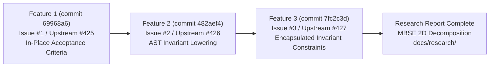

<!-- Copyright Gint Atkinson, gint.atkinson@gmail.com -->

# Comprehensive Session Handover Protocol & Architectural Dossier

**Document Identifier:** `DOC-HANDOVER-SESSION-20261010`  
**Target Recipient:** Incoming Lead Coordinator Agent / Fresh Session Initializer  
**Date:** 2026-10-10  
**Repository:** `gintatkinson/dumpiler-01`  
**Repository Classification:** `DOWNSTREAM_CUSTOMER_PROJECT` / `DOMAIN_TEMPLATE_CHILD`  
**Current Git Branch:** `main` (commit `7fc2c3d`) -- clean working tree, up to date with `origin/main`  
**Baseline Health:** 31/31 baseline checks passing (`./target/release/verify-baseline . --no-domain`)  
**Workspace Test Suite:** 100% passing (`cargo test --workspace`, 84+ tests, 0 failures)  

---

## 1. Executive Summary & Repository Status

This handover dossier provides an authoritative operational and architectural bridge from the outgoing coordinator session to the incoming lead coordinator agent. It encapsulates:
1. The exact operational state and verified baseline of the downstream project workspace.
2. A formal post-mortem regarding session context exhaustion and mandatory delegation protocols.
3. A granular record of completed Features 1, 2, and 3 with verifiable commit and issue references.
4. The architectural definition and user directives regarding the unresolved 2D multi-facet SysML v2 model decomposition.
5. An inventory of existing on-disk research assets.
6. Non-negotiable execution constraints and Turn 1 initialization gates governing the incoming agent.

### 1.1 Repository Identification & Scope
- **Classification:** `DOWNSTREAM_CUSTOMER_PROJECT`
- **Indicator:** The directory `.pipeline/upstream/` is absent on disk, confirming this repository is an active downstream application workspace authorized for concrete domain model compilation and application engineering.
- **Upstream Spec-Core Reference:** Master compiler blueprints and central governance reside upstream in `gintatkinson/DEAP01-spec-core`. Downstream projects must never duplicate upstream core blueprints.

### 1.2 Git & Workspace Health
- **Working Tree:** Clean (`git status` reports no untracked or unstaged functional modifications outside designated research deliverables).
- **Remote Synchronization:** Local `main` is synchronized with `origin/main` at commit `7fc2c3d`.
- **Baseline Verification:** Automated baseline compliance passes all 31 checks without domain exceptions.

---

## 2. Context Exhaustion Post-Mortem & Orchestration Governance

### 2.1 Root Cause Analysis of Outgoing Session
During the preceding development cycle, the outgoing coordinator accumulated an oversized conversation transcript:
- **Transcript Size:** Over 1,590 interaction steps, resulting in a 4.0 MB transcript file (`transcript.jsonl` / `transcript_full.jsonl`).
- **Primary Driver:** The outgoing coordinator repeatedly performed large-scale repository scans, extensive file inspections, and comprehensive document drafting within the primary conversation context, rather than delegating read-heavy research and write-heavy authoring tasks to context-isolated subagents.
- **Impact:** Context saturation degrades instruction-following precision, increases latency, and risks inadvertent omissions of critical project governance rules.

### 2.2 Mandatory Governance for Incoming Lead Coordinator
To prevent recurrences of context exhaustion, the incoming agent must strictly adhere to the following operational boundaries:
1. **Enforce the Coordinator Direct Writing Lock:** The lead coordinator is strictly forbidden from writing or modifying repository source code, schemas, or specifications directly. All write operations must be delegated to dedicated, context-isolated implementer subagents via `invoke_subagent`.
2. **Context-Isolated Subagent Dispatch for Research & Implementation:** Every research survey, tech-stack evaluation, specification generation task, and micro-task implementation must execute in a clean, fresh subagent context. The coordinator must pass only curated, relevant file slices and explicit prompts.
3. **Mandatory Preamble & Governance Integrity Sentinel:** Every subagent prompt must begin with the un-degraded Subagent Prompt Governance Preamble and terminate with `---GOVERNANCE-END---`.
4. **Immediate Subagent Reclaim:** Subagents must be terminated or confirmed completed immediately upon atomic task finish; idle subagents must never linger.

---

## 3. Completed Work & Ground Truth Baseline

The repository has successfully resolved three major features in the SysML v2 AST parser and compiler pipeline. All three features have been committed, verified, and resolved on the local issue tracker with neutral commit citations.



### 3.1 Feature 1: In-Place Acceptance Criteria Encapsulation
- **Commit:** [`69968a6`](file:///Users/perkunas/jail/dumpiler-01) - `feat(schema): encapsulate acceptance criteria and metadata attributes directly inside requirement definitions (refs #1, refs #425)`
- **Issue Status:** Local issue `#1` (`status:fixed-resolved`), Upstream tracking `#425`.
- **Delivered Changes:**
  - Eliminated detached dummy acceptance criteria part definitions (`part def AC_...`) from schemas.
  - Encapsulated acceptance criteria directly inside SysML v2 `requirement def` blocks using structured docstrings and metadata attribute fields (`attribute verification_method : String;`, `attribute acceptance_criteria : String;`).
  - Updated AST parser in `crates/ingest-sysml` to ingest in-place requirement attributes.

### 3.2 Feature 2: AST Invariant Lowering & Subsystem Assertions
- **Commit:** [`482aef4`](file:///Users/perkunas/jail/dumpiler-01) - `feat(schema): formalize invariant constraints lowering, requirement derivations, and subsystem assertions (refs #2, refs #426)`
- **Issue Status:** Local issue `#2` (`status:fixed-resolved`), Upstream tracking `#426`.
- **Delivered Changes:**
  - Implemented AST constraint lowering in `crates/ingest-sysml` for formal mathematical invariants.
  - Added AST parser support for requirement derivation relationships (`derived from <ReqId>;`).
  - Implemented subsystem engine assertions (`assert constraint ...;`) connecting structural part definitions directly to governing constraint definitions.
  - Enhanced semantic validation passes across compiler crates.

### 3.3 Feature 3: Invariant Encapsulation Inside Requirement Definitions
- **Commit:** [`7fc2c3d`](file:///Users/perkunas/jail/dumpiler-01) - `feat(schema): encapsulate formal invariant constraints directly inside requirement definitions (refs #3, refs #427)`
- **Issue Status:** Local issue `#3` (`status:fixed-resolved`), Upstream tracking `#427`.
- **Delivered Changes:**
  - Refactored `schema/model.sysml` and `.pipeline/schema.sysml` to encapsulate all formal invariant constraints directly within their governing `requirement def` blocks.
  - Eliminated all package-root standalone `constraint def`s (0 package-root constraint defs remaining).
  - Updated parser in `crates/ingest-sysml/src/translators/markdown.rs` and AST definitions in `crates/deap-core/src/sysml_ast.rs` to parse, lower, and validate encapsulated constraint blocks.
  - Verified 100% test pass in `cargo test --workspace` across all crates.

### 3.4 Verification Evidence Summary
- **Baseline Check:** `./target/release/verify-baseline . --no-domain` -> 31/31 checks passing.
- **Cargo Test:** `cargo test --workspace` -> 84 unit and integration tests passing, 0 failures, 3 doc-tests passing.
- **AST Parity:** `Check 31 verified (Dual-Schema SSOT Parity Gate passed -- schema/*.sysml and .pipeline/schema.sysml AST definitions are identical)`.

---

## 4. The Unresolved Modeling Problem & Architectural Directives

While Features 1 through 3 successfully established fine-grained syntax correctness within requirement blocks, the project faces a core architectural challenge: **the monolithic schema layout**.

### 4.1 Problem Formulation: The Monolithic Schema Bottleneck
The active model in [`schema/model.sysml`](file:///Users/perkunas/jail/dumpiler-01/schema/model.sysml) is currently a monolithic file spanning approximately 5,500 lines. It aggregates:
- 12 distinct compiler subsystems.
- 199+ requirements with encapsulated invariants and acceptance criteria.
- Subsystem structural execution engines and port definitions.
- Inter-subsystem wire bindings and pipeline connections.
- Operational action definitions and sequence flows.

This monolithic organization creates severe maintenance hazards, hampers modular compilation, leads to merge conflicts, and obscures system hierarchy.

### 4.2 The Mandated Solution: 2D Model Decomposition
The user has directed that the SysML v2 model must be decomposed across two orthogonal dimensions:

```
+-----------------------------------------------------------------------------------------------+
|                                  THE 2D DECOMPOSITION MATRIX                                  |
+------------------------------------+-----------------------------+----------------------------+
| DIMENSION 1: HIERARCHY             | DIMENSION 2: PROCESS FACET  | ARTIFACT FILENAME          |
+------------------------------------+-----------------------------+----------------------------+
| Level 0: Super-System & ConOps     | Operational Context         | schema/level0_conops/      |
| Level 1: System of Interest (SoI)  | Enclosing System Context    | schema/model.sysml         |
| Level 2: Subsystem Decomposition   | Facet A: Requirements       | <subsystem>/requirements.sysml|
|   (12 Specialized Subsystems)      | Facet B: Behavior           | <subsystem>/behavior.sysml |
|                                    | Facet C: Architecture       | <subsystem>/architecture.sysml|
| Level 3: Products & Components     | Component Specifications    | <subsystem>/components/    |
+------------------------------------+-----------------------------+----------------------------+
```

#### Dimension 1: Hierarchy / Levels of Abstraction
- **Level 0 (Super-System & Operational Context / ConOps):**
  - Mission intent, stakeholder needs, external environment, external actors, operational activities (`OA-xx`), and operational scenarios (`SCN-xx`).
- **Level 1 (System of Interest - SoI):**
  - The top-level system classifier (e.g. `part def DEAPCompilerSystem`) representing the unified compilation engine.
  - Serves as the enclosing classifier context that instantiates the 12 subsystems as constituent parts and binds inter-subsystem dataflows.
- **Level 2 (Subsystem Decomposition):**
  - The 12 compiler subsystems: Ingestion, AST Parsing, Semantic Analysis, STPA Safety Suite, Optimization, Code Synthesis, Baseline Verification, etc.
- **Level 3 (Products & Components):**
  - Granular internal modules, parsers, translators, solvers, and utility crates.

#### Dimension 2: Engineering Process Facets (Per Subsystem)
Each subsystem directory must be partitioned into three standardized, cohesive process facets:
1. `requirements.sysml`:
   - Contains all subsystem requirements (`requirement def`), performance parameters, formal invariant constraints, acceptance criteria, and in-place traceability links (`derived from`, `satisfy by`).
2. `behavior.sysml`:
   - Contains detailed functional design:
     - Use Cases (`use case def`) specifying actor interactions and functional goals.
     - User Story Scenarios (`interaction def`) detailing scenario execution steps.
     - Mode Supervisors & Statecharts (`state def`) specifying operational modes and transition guards.
     - Algorithmic Action Flows (`action def`) modeling execution workflows and data transformations.
3. `architecture.sysml`:
   - Contains detailed structural and interface design:
     - Structural Execution Engines (`part def`) modeling subsystem engines and internal components.
     - Interface Ports (`port def`) defining typed input/output boundaries.
     - Data Payloads & Schemas (`item def`) formalizing in-flight data contracts.
     - Internal component allocations and intra-subsystem connections.

### 4.3 Packaging Anti-Patterns to Eliminate
The user and international standards explicitly prohibit two legacy packaging anti-patterns:

#### 1. Prohibited Anti-Pattern: `traceability.sysml`
- **Why it is invalid:** In SysML v1, relational matrices were often exported into detached tables. In OMG SysML v2, traceability is a native, first-class semantic concept. Relationships are expressed in-place:
  - `satisfy by <PartDef>;` directly inside `requirement def`.
  - `verify by <VerificationAction>;` directly inside `requirement def`.
  - `require constraint <ConstraintDef>;` directly inside `part def` or `action def`.
  - `derived from <ParentReqId>;` directly inside `requirement def`.
- **Architectural Mandate:** Traceability must remain strictly encapsulated within the relevant definitions. Detached traceability mapping files create dual-maintenance drift and are forbidden.

#### 2. Prohibited Anti-Pattern: `connections.sysml`
- **Why it is invalid:** Under **OMG KerML Clause 8 (Connection Semantics)**, connectors (`connect source to destination`) are features that represent occurrence bindings between feature endpoints. Connectors cannot exist as free-floating definitions at package root without an enclosing classifier context.
- **Architectural Mandate:**
  - **Inter-Subsystem Connections:** Must be declared inside the Level 1 root `System` classifier (e.g., inside `part def DEAPCompilerSystem { ... connect sub1.out to sub2.in; }`), which encloses both subsystems as constituent usages.
  - **Intra-Subsystem Connections:** Must be declared inside the respective subsystem's Level 2 `part def` in `architecture.sysml` (connecting internal subcomponents).

### 4.4 Mapping Detailed Design Artifacts
Detailed design constructs belong in explicit facet files:
- **Use Cases:** Model functional objectives using `use case def` in `behavior.sysml`.
- **User Stories:** Model operational user stories and step-by-step user interactions using `interaction def` in `behavior.sysml`.
- **Statecharts:** Model supervisory states, error states, and mode transitions using `state def` in `behavior.sysml`.
- **Action Flows:** Model algorithmic transformations, parsing pipelines, and solver passes using `action def` in `behavior.sysml`.
- **Data Schemas:** Model typed messages, AST structures, and domain payloads using `item def` in `architecture.sysml`.

### 4.5 Level 0 Super-System & ConOps Placement
- Level 0 captures the operational context prior to technical system boundary allocation.
- In accordance with ISO/IEC/IEEE 15288:2023 §6.4.2 (Stakeholder Needs) and ISO/IEC/IEEE 29148:2018 (ConOps / OpsCon), Level 0 artifacts reside in a dedicated operational package:
  - Stakeholder Needs and Mission Intent ($\mathcal{R}_{\text{mission}}$ / Tier 1).
  - External Actors (Users, CI/CD environment, Cloud registries, External Toolchains).
  - Operational Activities (`OA-xx`) and Operational Scenarios (`SCN-xx`).
- Technical Level 1 requirements derive traceability from Level 0 via `derived from Level0::ReqName;`.

---

## 5. Existing On-Disk Assets & Groundwork

The outgoing session completed the foundational research phase and documented all technical specifications on disk:

1. **The Research Task Plan:**
   - Location: [`implementation_plan.md#L384-L454`](file:///Users/perkunas/jail/dumpiler-01/implementation_plan.md#L384-L454)
   - Defines the formal problem statement, governing international standards (OMG SysML v2, KerML, ISO 15288, ISO 29148, INCOSE SEH v5, MagicGrid, Arcadia, DO-178C/DO-331), and the research work package breakdown.
2. **The Normative Architectural Report:**
   - Location: [`docs/research/MBSE_OMG_SYSMLV2_2D_DECOMPOSITION_ARCHITECTURE_REPORT.md`](file:///Users/perkunas/jail/dumpiler-01/docs/research/MBSE_OMG_SYSMLV2_2D_DECOMPOSITION_ARCHITECTURE_REPORT.md)
   - Size: 58 KB, 874 lines, exactly 0 Unicode em dashes.
   - Contents:
     - Section 1: Executive Summary & Problem Formulation.
     - Section 2: OMG SysML v2 & KerML Metamodel Foundations (Element, Feature, Classifier, Clause 8 Connection Semantics).
     - Section 3: Comparative Analysis of Global MBSE Frameworks (MagicGrid 4x4 matrix, Arcadia 4 levels, INCOSE SEH v5, DO-178C/DO-331 HLR/LLR hierarchy).
     - Section 4: Detailed Design Mapping (Use Cases, User Stories, Statecharts, Action Flows, Data Payloads).
     - Section 5: Level 0 Super-System, ConOps, and Operational Context.
     - Section 6: The Definitive 2D Decomposition Blueprint for DEAP (Directory tree, import topology, naming conventions, KerML-compliant wiring).
     - Section 7: Mathematical Invariant and Governance Proofs.

---

## 6. Non-Negotiable Instructions for the Incoming Lead Coordinator

The incoming agent must observe the following binding rules upon starting the fresh session:

### 6.1 Do Not Jump to Code Implementation or File Issues
- **Approval Gate:** The research report has been drafted and is awaiting human review. The incoming agent must **not** begin modifying code, splitting schemas, refactoring compiler crates, or filing GitHub issues until the human operator has reviewed the research report and explicitly authorized implementation with `PROCEED`.
- **The Grill First:** Present the research findings, highlight key architectural decisions, and wait for human confirmation.

### 6.2 Mandatory Turn 1 Session Initialization Gate
Immediately upon startup, before responding to any directives or answering queries, the incoming agent must execute the 6-step initialization sequence:
1. **Detect Repository Role & Scope:** Inspect disk for `.pipeline/upstream/`. Confirm absence -> `DOWNSTREAM_CUSTOMER_PROJECT`.
2. **Read Governance Constitution:** View [`.pipeline/constitution.md`](file:///Users/perkunas/jail/dumpiler-01/.pipeline/constitution.md) (Section 1.9 zero-mocking persistence mandate, quality gates).
3. **Load Project Skills:** View [`skills/feature-driven-implementation/SKILL.md`](file:///Users/perkunas/jail/dumpiler-01/skills/feature-driven-implementation/SKILL.md) and active skills.
4. **Load Governance Rules:** View [`.pipeline/ACTIVE_RULES_BUNDLE.md`](file:///Users/perkunas/jail/dumpiler-01/.pipeline/ACTIVE_RULES_BUNDLE.md).
5. **Load Platform Profile:** View the target platform profile (e.g. [`.pipeline/profiles/rust.md`](file:///Users/perkunas/jail/dumpiler-01/.pipeline/profiles/rust.md) or equivalent).
6. **Verify Baseline Conformance:** Run `./target/release/verify-baseline . --no-domain` and verify 31/31 checks pass.

### 6.3 Enforce Coordinator Direct Writing Lock
- The lead coordinator is locked from using modifying tools (`write_to_file`, `replace_file_content`) directly on codebase source, schemas, and specifications.
- All implementation and authoring tasks must be delegated to context-isolated subagents dispatched with `invoke_subagent`.

### 6.4 Enforce Context Isolation & Subagent Dispatch Discipline
- Dispatch subagents with lean, curated prompts (max 1 specification item or micro-task per dispatch).
- Always include the complete Subagent Prompt Governance Preamble terminated by `---GOVERNANCE-END---` and authorize with `PROCEED`.
- Require the subagent to acknowledge governance before executing code modifications.
- Immediately terminate or reclaim completed subagents.

### 6.5 Universal Formatting & Syntax Rules
- **Zero Unicode Em Dashes:** Unicode em dashes (`\u2014`) are strictly prohibited in all markdown files, code comments, commit messages, and prompt responses. Use ASCII `--` or `-` exclusively.
- **Commit Message Non-Closure Invariant:** Never use auto-closing keywords (`fix #`, `closes #`, `resolve #`) in commit messages. Always use neutral citations: `(#<id>)` or `(refs #<id>)`.
- **Mermaid & KaTeX Integrity:** Match closing fences, declare valid diagram headers, quote node labels containing special characters, and isolate display math `$$` blocks with `\begin{aligned} ... \end{aligned}`.

---

## 7. Verification Checklist for Handover Acceptance

The incoming agent can verify successful session transfer by confirming:
- [x] Baseline verification reports 31/31 passing checks: `./target/release/verify-baseline . --no-domain`.
- [x] Full workspace tests pass 100%: `cargo test --workspace`.
- [x] Git working tree is clean and up to date with `origin/main` at commit `7fc2c3d`.
- [x] Architectural research report exists at [`docs/research/MBSE_OMG_SYSMLV2_2D_DECOMPOSITION_ARCHITECTURE_REPORT.md`](file:///Users/perkunas/jail/dumpiler-01/docs/research/MBSE_OMG_SYSMLV2_2D_DECOMPOSITION_ARCHITECTURE_REPORT.md) and contains 0 Unicode em dashes.
- [x] Handover dossier exists at [`SESSION_HANDOVER_DOSSIER.md`](file:///Users/perkunas/jail/dumpiler-01/SESSION_HANDOVER_DOSSIER.md) and contains 0 Unicode em dashes.
