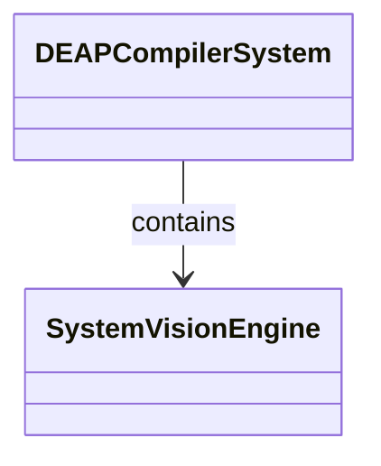
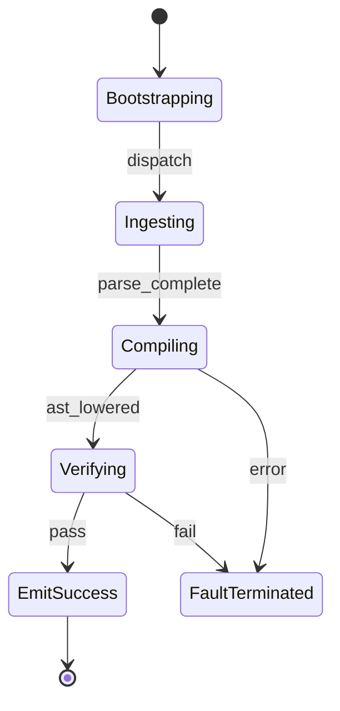

# Epic 01: System Architecture and Compiler Primacy

## Metadata
| Attribute | Specification Detail |
| :--- | :--- |
| **Title** | Epic 01: System Architecture and Compiler Primacy |
| **Version** | 1.0.0 |
| **Date** | 2026-10-10 |
| **Type** | epic |
| **Package** | DEAP_Compiler_System |
| **Subsystem** | System Architecture |
| **Issue ID** | #101 |
| **Generation Mode** | subagent |

## 1. Context
System-level architecture definition establishing compiler primacy, component interconnection, and pure schema-driven lowering guarantees across the DEAP framework.

## 2. Requirements & Checklist
- [ ] #10 - Feature 01: [ConOps] Human Engineer Interface
- [ ] #11 - Feature 02: [ConOps] CI Continuous Integration Runner
- [ ] #12 - Feature 03: [ConOps] Remote Artifact Registry Interface
- [ ] #13 - Feature 04: [ConOps] Downstream Application Host Interface
- [ ] #14 - Feature 05: [Architecture] DEAP Compiler System Architecture

### Associated Use Cases & User Stories

#### Associated Use Cases
*To be populated after Phase 3*

#### Associated User Stories
*To be populated after Phase 3*

## 3. Architecture
Top-level structural decomposition interconnecting external ConOps operational actors with the core compiler engine and downstream projection adapters.

## 4. Operational Considerations
Deterministic compilation passes, continuous integration execution gates, and reproducible artifact delivery.

## 5. Security & Governance
Zero-mocking persistence mandate, strict platform isolation, and zero hardcoded domain concepts.

## 6. Source References
Authoritative architecture definitions and normative systems engineering standards:
- Schema SSOT Architecture: `schema/model.sysml`
- ConOps Operational Activities: `schema/conops/activities.sysml`
- Normative Systems Engineering Standard: ISO/IEC/IEEE 15288:2023 §6.4.3 Architecture Definition Process

The system architecture and formal verification invariants derive from `schema/model.sysml` pursuant to ISO/IEC/IEEE 15288.

## System-Level UML Class Diagram

## System State Machine Diagram

