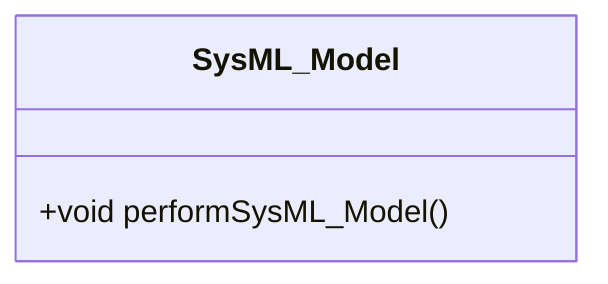

# Epic 01: SysML_Model

## Metadata
| Attribute | Specification Detail |
| :--- | :--- |
| **Title** | Epic 01: SysML_Model |
| **Version** | 1.0.0 |
| **Date** | 2026-10-10 |
| **Type** | epic |
| **Subsystem** | SysML_Model |
| **Generation Mode** | subagent |

## Subsystem Capability Allocations

| Capability | Subsystem | Description |
| :--- | :--- | :--- |
| **SysML_Model** | SysML_Model | Subsystem specification for SysML_Model |

## Architectural Context

