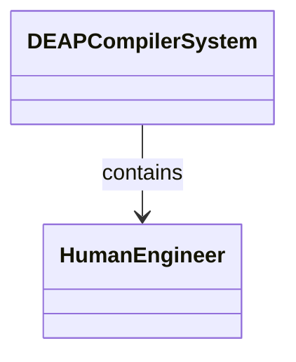
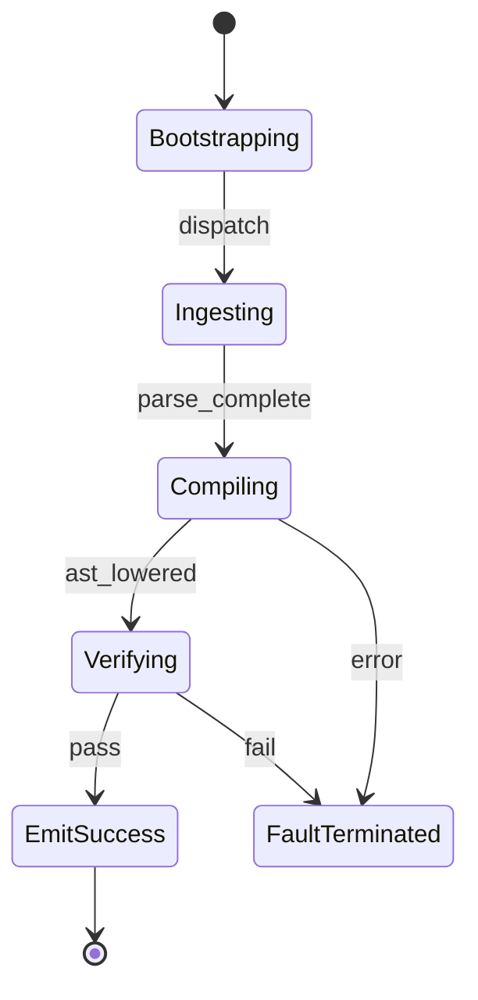

# Epic 02: Concept of Operations Operational Activities

## Metadata
| Attribute | Specification Detail |
| :--- | :--- |
| **Title** | Epic 02: Concept of Operations Operational Activities |
| **Version** | 1.0.0 |
| **Date** | 2026-10-10 |
| **Type** | epic |
| **Package** | ConOps |
| **Subsystem** | ConOps |
| **Issue ID** | #102 |
| **Generation Mode** | subagent |

## 1. Context
Concept of Operations specifications detailing external actor interactions, operational activities OA-01 through OA-06, and lifecycle execution modes.

### Gate 24 Operational Allocations
- /// OperationalAllocation: [OA-01] Universal Ingestion Engine
- /// OperationalAllocation: [OA-02] Node Arena AST Graph Engine
- /// OperationalAllocation: [OA-03] Grammar Lowering Engine
- /// OperationalAllocation: [OA-04] Safety Assurance Engine
- /// OperationalAllocation: [OA-05] Agile Projection Engine
- /// OperationalAllocation: [OA-06] Compiler Assurance Engine

## 2. Requirements & Checklist
- [ ] #10 - Feature 01: [ConOps] Human Engineer Interface
- [ ] #11 - Feature 02: [ConOps] CI Continuous Integration Runner
- [ ] #12 - Feature 03: [ConOps] Remote Artifact Registry Interface
- [ ] #13 - Feature 04: [ConOps] Downstream Application Host Interface
- [ ] #14 - Feature 05: [Architecture] DEAP Compiler System Architecture

### Associated Use Cases & User Stories

#### Associated Use Cases
*To be populated after Phase 3*

#### Associated User Stories
*To be populated after Phase 3*

## 3. Architecture
External operational interfaces binding human systems engineers and continuous integration runners to the compiler lifecycle.

## 4. Operational Considerations
Operator command dispatch, automated verification pipelines, and remote registry artifact synchronization.

## 5. Security & Governance
Operational integrity boundaries, tamper-resistant artifact registration, and failure mode containment.

## 6. Source References
Authoritative operational concepts and systems engineering standards:
- ConOps Operational Activities: `schema/conops/activities.sysml`
- ConOps External Actors: `schema/conops/actors.sysml`
- Normative Systems Engineering Standard: ISO/IEC/IEEE 29148:2018 §6.4.2 Concept of Operations

Operational activity definitions and actor models derive from `schema/conops/activities.sysml` pursuant to ISO/IEC/IEEE 29148.

## System-Level UML Class Diagram

## System State Machine Diagram

