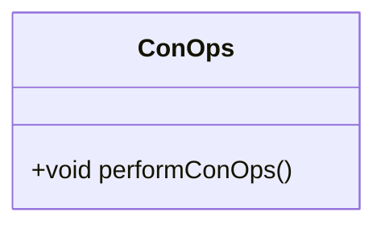

# Epic 02: ConOps

## Metadata
| Attribute | Specification Detail |
| :--- | :--- |
| **Title** | Epic 02: ConOps |
| **Version** | 1.0.0 |
| **Date** | 2026-10-10 |
| **Type** | epic |
| **Subsystem** | ConOps |
| **Generation Mode** | subagent |

## Subsystem Capability Allocations

| Capability | Subsystem | Description |
| :--- | :--- | :--- |
| **ConOps** | ConOps | ConOps Level 0 Operational Activities |

## Architectural Context

