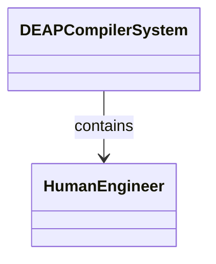
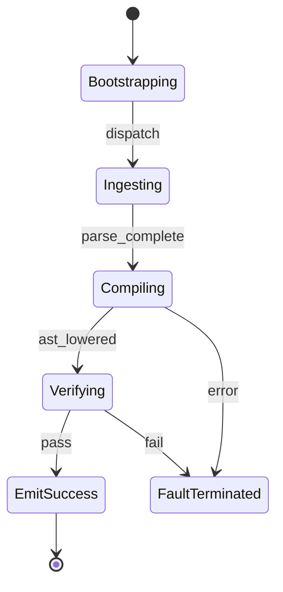

# Epic 02: Concept of Operations Operational Activities

## Metadata
| Attribute | Specification Detail |
| :--- | :--- |
| **Title** | Epic 02: Concept of Operations Operational Activities |
| **Version** | 1.0.0 |
| **Date** | 2026-10-10 |
| **Type** | epic |
| **Package** | ConOps |
| **Subsystem** | ConOps |
| **Issue ID** | #102 |
| **Generation Mode** | subagent |

## 1. Context
Concept of Operations specifications detailing external actor interactions, operational activities OA-01 through OA-06, and lifecycle execution modes.

### Gate 24 Operational Allocations
- /// OperationalAllocation: [OA-01] Universal Ingestion Engine
- /// OperationalAllocation: [OA-02] Node Arena AST Graph Engine
- /// OperationalAllocation: [OA-03] Grammar Lowering Engine
- /// OperationalAllocation: [OA-04] Safety Assurance Engine
- /// OperationalAllocation: [OA-05] Agile Projection Engine
- /// OperationalAllocation: [OA-06] Compiler Assurance Engine

## 2. Requirements & Checklist
- [ ] #10 - Feature 01: [ConOps] Human Engineer Interface
- [ ] #11 - Feature 02: [ConOps] CI Continuous Integration Runner
- [ ] #12 - Feature 03: [ConOps] Remote Artifact Registry Interface
- [ ] #13 - Feature 04: [ConOps] Downstream Application Host Interface
- [ ] #14 - Feature 05: [Architecture] DEAP Compiler System Architecture

### Associated Use Cases & User Stories

#### Associated Use Cases
- [ ] #95 - [Use Case 01: System Vision and Schema Ingestion Workflow](../use-cases/UC-01-System_Vision_and_Schema_Ingestion_Workflow.md)
- [ ] #96 - [Use Case 02: Grammar Lowering and AST Construction Workflow](../use-cases/UC-02-Grammar_Lowering_and_AST_Construction_Workflow.md)
- [ ] #97 - [Use Case 03: Safety Assurance and STPA Verification Workflow](../use-cases/UC-03-Safety_Assurance_and_STPA_Verification_Workflow.md)
- [ ] #98 - [Use Case 04: Downstream Specification and Backlog Projection Workflow](../use-cases/UC-04-Downstream_Specification_and_Backlog_Projection_Workflow.md)
- [ ] #99 - [Use Case 05: Multi-Target CodeGen and Simulation Synthesis Workflow](../use-cases/UC-05-Multi_Target_CodeGen_and_Simulation_Synthesis_Workflow.md)
- [ ] #100 - [Use Case 06: Baseline Conformance and Diagnostic Triage Workflow](../use-cases/UC-06-Baseline_Conformance_and_Diagnostic_Triage_Workflow.md)

#### Associated User Stories
- [ ] #89 - [User Story 01: Ingest OEM Documentation and Schema Artifacts](../user-stories/US-01-Ingest_OEM_Artifacts.md)
- [ ] #90 - [User Story 02: Parse SysML v2 AST and Construct Arena Graph](../user-stories/US-02-Parse_SysML_AST.md)
- [ ] #91 - [User Story 03: Validate Model Semantics and Typing Constraints](../user-stories/US-03-Validate_Model_Semantics.md)
- [ ] #92 - [User Story 04: Transpile Safety Assurance and STPA Matrices](../user-stories/US-04-Transpile_Safety_Artifacts.md)
- [ ] #93 - [User Story 05: Synthesize Downstream Agile Backlog Projections](../user-stories/US-05-Synthesize_Downstream_Projections.md)
- [ ] #94 - [User Story 06: Verify Multi-File Baseline Parity and Governance Gates](../user-stories/US-06-Verify_Baseline_Parity.md)

## 3. Architecture
External operational interfaces binding human systems engineers and continuous integration runners to the compiler lifecycle.

## 4. Operational Considerations
Operator command dispatch, automated verification pipelines, and remote registry artifact synchronization.

## 5. Security & Governance
Operational integrity boundaries, tamper-resistant artifact registration, and failure mode containment.

## 6. Source References
Authoritative operational concepts and systems engineering standards:
- ConOps Operational Activities: `schema/conops/activities.sysml`
- ConOps External Actors: `schema/conops/actors.sysml`
- Normative Systems Engineering Standard: ISO/IEC/IEEE 29148:2018 §6.4.2 Concept of Operations

Operational activity definitions and actor models derive from `schema/conops/activities.sysml` pursuant to ISO/IEC/IEEE 29148.

## System-Level UML Class Diagram

## System State Machine Diagram

