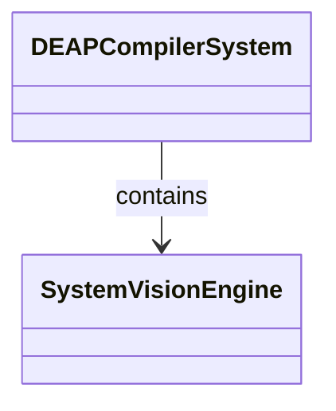
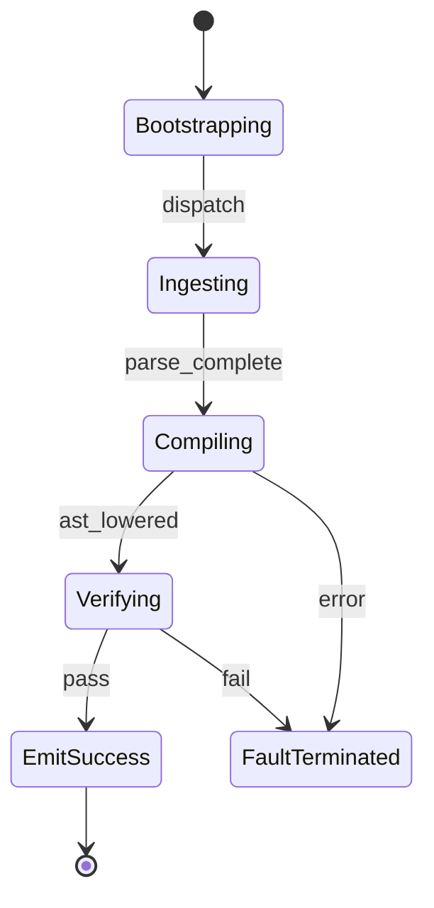

# Epic 03: Subsystem 1 System Vision

## Metadata
| Attribute | Specification Detail |
| :--- | :--- |
| **Title** | Epic 03: Subsystem 1 System Vision |
| **Version** | 1.0.0 |
| **Date** | 2026-10-10 |
| **Type** | epic |
| **Package** | Subsystem_1_System_Vision |
| **Subsystem** | System Vision |
| **Issue ID** | #103 |
| **Generation Mode** | subagent |

## 1. Context
Subsystem specification for System Vision (Subsystem_1_System_Vision) establishing architectural layout, mathematical invariants, algorithmic complexity bounds, and verification criteria.

## 2. Requirements & Checklist
- [ ] #15 - Feature 06: [System Vision] System Vision Engine
- [ ] #16 - Feature 07: [System Vision] Normative Statement
- [ ] #17 - Feature 08: [System Vision] Formal Invariant
- [ ] #18 - Feature 09: [System Vision] Complexity Bounds
- [ ] #19 - Feature 10: [System Vision] Conformance Criteria

### Associated Use Cases & User Stories

#### Associated Use Cases
- None directly allocated (operational behavior allocated at system ConOps level in Epic 02)

#### Associated User Stories
- None directly allocated (operational behavior allocated at system ConOps level in Epic 02)

## 3. Architecture
Subsystem structural composition, port allocations, and directional data connectors realized by SystemVisionEngine.

## 4. Operational Considerations
Deterministic compilation passes, error containment, and provable polynomial complexity execution.

## 5. Security & Governance
Safety-critical invariant satisfaction, formal trace matrix closure, and zero hardcoded domain semantics.

## 6. Source References
Authoritative subsystem specifications and normative systems engineering standards:
- System Architecture Model: `schema/model.sysml`
- Subsystem Specification Model: `schema/subsystems/subsystem_01_system_vision/architecture.sysml`
- Subsystem Requirements Model: `schema/subsystems/subsystem_01_system_vision/requirements.sysml`
- Normative Systems Engineering Standard: ISO/IEC/IEEE 15288:2023 §6.4.3 Architecture Definition Process

Subsystem architectural composition and formal invariants derive from `schema/model.sysml` pursuant to ISO/IEC/IEEE 15288.

## System-Level UML Class Diagram

## System State Machine Diagram

