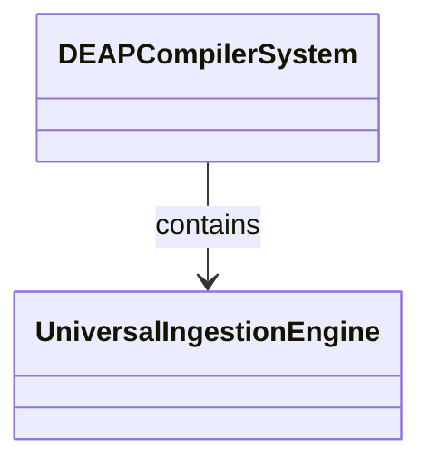
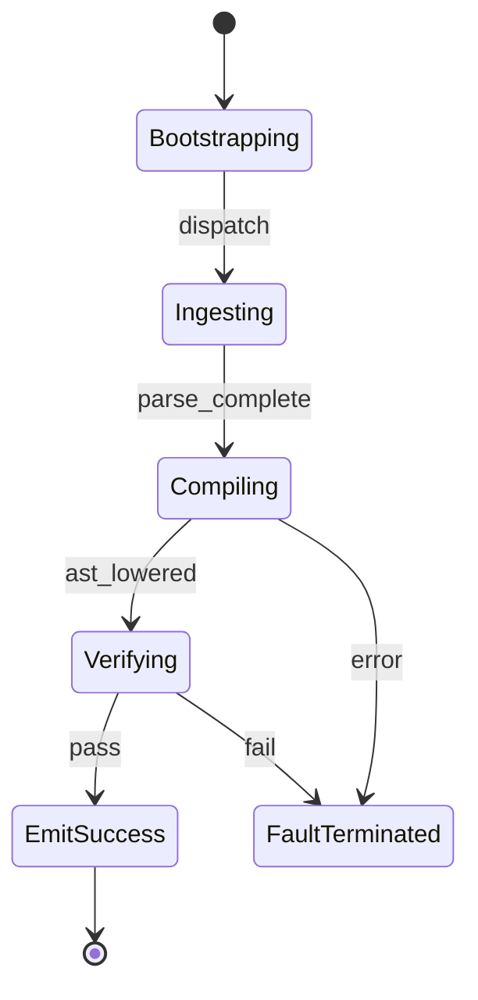

# Epic 04: Subsystem 2 Universal Schema Ingestion Engine

## Metadata
| Attribute | Specification Detail |
| :--- | :--- |
| **Title** | Epic 04: Subsystem 2 Universal Schema Ingestion Engine |
| **Version** | 1.0.0 |
| **Date** | 2026-10-10 |
| **Type** | epic |
| **Package** | Subsystem_2_Universal_Schema_Ingestion_Engine |
| **Subsystem** | Universal Ingestion |
| **Issue ID** | #104 |
| **Generation Mode** | subagent |

## 1. Context
Subsystem specification for Universal Ingestion (Subsystem_2_Universal_Schema_Ingestion_Engine) establishing architectural layout, mathematical invariants, algorithmic complexity bounds, and verification criteria.

## 2. Requirements & Checklist
- [ ] #20 - Feature 11: [Universal Ingestion] Universal Ingestion Engine
- [ ] #21 - Feature 12: [Universal Ingestion] Normative Statement
- [ ] #22 - Feature 13: [Universal Ingestion] Formal Invariant
- [ ] #23 - Feature 14: [Universal Ingestion] Complexity Bounds
- [ ] #24 - Feature 15: [Universal Ingestion] Conformance Criteria

### Associated Use Cases & User Stories

#### Associated Use Cases
- [ ] #95 - [Use Case 01: System Vision and Schema Ingestion Workflow](../use-cases/UC-01-System_Vision_and_Schema_Ingestion_Workflow.md)

#### Associated User Stories
- [ ] #89 - [User Story 01: Ingest OEM Documentation and Schema Artifacts](../user-stories/US-01-Ingest_OEM_Artifacts.md)

## 3. Architecture
Subsystem structural composition, port allocations, and directional data connectors realized by UniversalIngestionEngine.

## 4. Operational Considerations
Deterministic compilation passes, error containment, and provable polynomial complexity execution.

## 5. Security & Governance
Safety-critical invariant satisfaction, formal trace matrix closure, and zero hardcoded domain semantics.

## 6. Source References
Authoritative subsystem specifications and normative systems engineering standards:
- System Architecture Model: `schema/model.sysml`
- Subsystem Specification Model: `schema/subsystems/subsystem_02_universal_schema_ingestion_engine/architecture.sysml`
- Subsystem Requirements Model: `schema/subsystems/subsystem_02_universal_schema_ingestion_engine/requirements.sysml`
- Normative Systems Engineering Standard: ISO/IEC/IEEE 15288:2023 §6.4.3 Architecture Definition Process

Subsystem architectural composition and formal invariants derive from `schema/model.sysml` pursuant to ISO/IEC/IEEE 15288.

## System-Level UML Class Diagram

## System State Machine Diagram

