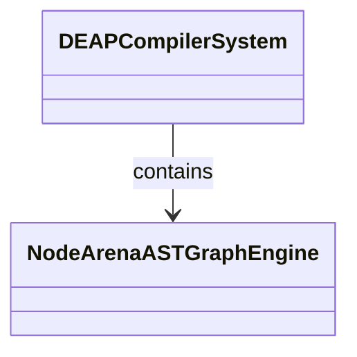
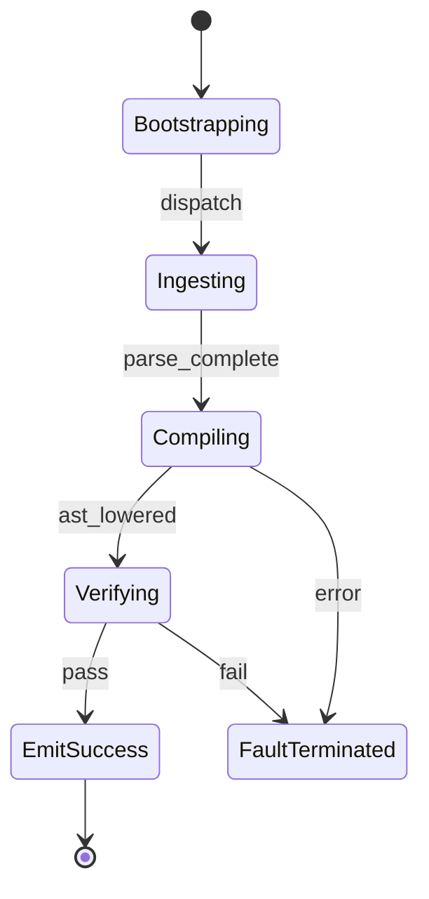

# Epic 05: Subsystem 3 Core Metamodel Node Arena

## Metadata
| Attribute | Specification Detail |
| :--- | :--- |
| **Title** | Epic 05: Subsystem 3 Core Metamodel Node Arena |
| **Version** | 1.0.0 |
| **Date** | 2026-10-10 |
| **Type** | epic |
| **Package** | Subsystem_3_Core_Metamodel_Node_Arena |
| **Subsystem** | Node Arena AST Graph |
| **Issue ID** | #105 |
| **Generation Mode** | subagent |

## 1. Context
Subsystem specification for Node Arena AST Graph (Subsystem_3_Core_Metamodel_Node_Arena) establishing architectural layout, mathematical invariants, algorithmic complexity bounds, and verification criteria.

## 2. Requirements & Checklist
- [ ] #25 - Feature 16: [Node Arena AST Graph] Node Arena AST Graph Engine
- [ ] #26 - Feature 17: [Node Arena AST Graph] Normative Statement
- [ ] #27 - Feature 18: [Node Arena AST Graph] Formal Invariant
- [ ] #28 - Feature 19: [Node Arena AST Graph] Complexity Bounds
- [ ] #29 - Feature 20: [Node Arena AST Graph] Conformance Criteria

### Associated Use Cases & User Stories

#### Associated Use Cases
- None directly allocated (operational behavior allocated at system ConOps level in Epic 02)

#### Associated User Stories
- [ ] #90 - [User Story 02: Parse SysML v2 AST and Construct Arena Graph](../user-stories/US-02-Parse_SysML_AST.md)

## 3. Architecture
Subsystem structural composition, port allocations, and directional data connectors realized by NodeArenaASTGraphEngine.

## 4. Operational Considerations
Deterministic compilation passes, error containment, and provable polynomial complexity execution.

## 5. Security & Governance
Safety-critical invariant satisfaction, formal trace matrix closure, and zero hardcoded domain semantics.

## 6. Source References
Authoritative subsystem specifications and normative systems engineering standards:
- System Architecture Model: `schema/model.sysml`
- Subsystem Specification Model: `schema/subsystems/subsystem_03_core_metamodel_node_arena/architecture.sysml`
- Subsystem Requirements Model: `schema/subsystems/subsystem_03_core_metamodel_node_arena/requirements.sysml`
- Normative Systems Engineering Standard: ISO/IEC/IEEE 15288:2023 §6.4.3 Architecture Definition Process

Subsystem architectural composition and formal invariants derive from `schema/model.sysml` pursuant to ISO/IEC/IEEE 15288.

## System-Level UML Class Diagram

## System State Machine Diagram

