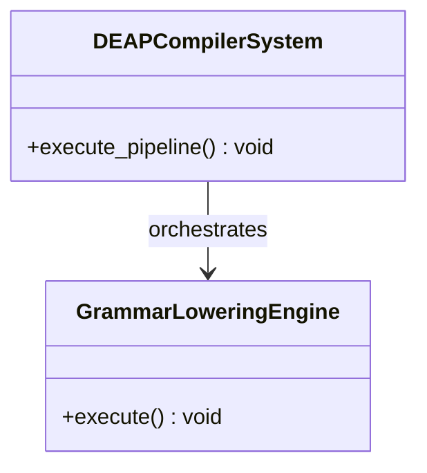
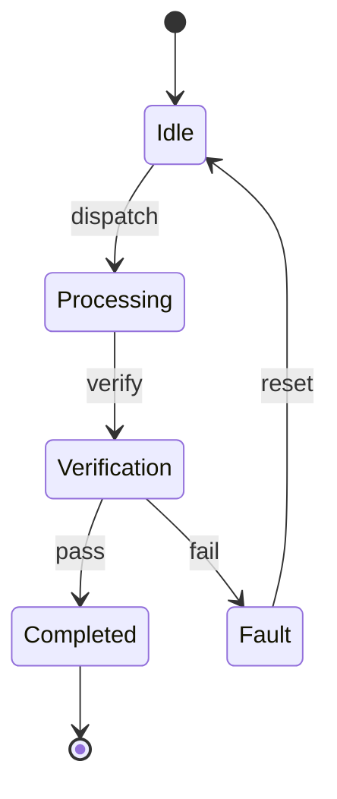

# Epic 06: Subsystem_4_Complete_SysMLv2_KerML_Grammar

## Metadata
| Attribute | Specification Detail |
| :--- | :--- |
| **Title** | Epic 06: Subsystem_4_Complete_SysMLv2_KerML_Grammar |
| **Version** | 1.0.0 |
| **Date** | 2026-10-10 |
| **Type** | epic |
| **Subsystem** | Subsystem_4_Complete_SysMLv2_KerML_Grammar |
| **Generation Mode** | subagent |

## 1. Context
Structural Architecture for Subsystem 4 Complete SysMLv2 KerML Grammar

## 2. Requirements & Checklist
- [ ] REQ-EPIC-06-01: Subsystem capability implementation for Subsystem_4_Complete_SysMLv2_KerML_Grammar.
- [ ] REQ-EPIC-06-02: Semantic verification and conformance against schema definitions.

### Associated Use Cases & User Stories

#### Associated Use Cases
*To be populated after Phase 3*

#### Associated User Stories
*To be populated after Phase 3*

## 3. Architecture
Subsystem architectural layout and component allocation for Subsystem_4_Complete_SysMLv2_KerML_Grammar.

## 4. Operational Considerations
Operational lifecycle, deterministic lowering execution, and error handling policies for Subsystem_4_Complete_SysMLv2_KerML_Grammar.

## 5. Security & Governance
Safety-critical invariants, access governance, and zero-hardcoded domain rule adherence.

## 6. Source References
Schema source definitions in `schema/subsystems/` and system architecture in `schema/model.sysml`.

## System-Level UML Class Diagram

## System State Machine Diagram

