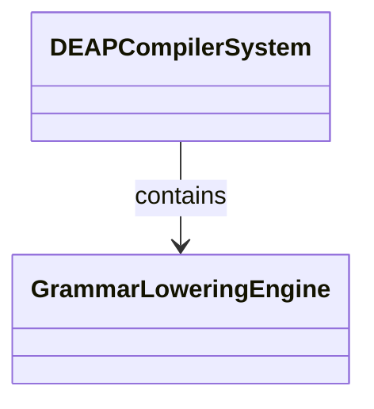
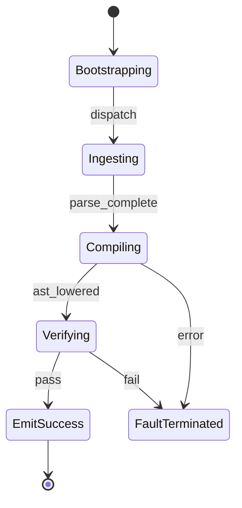

# Epic 06: Subsystem 4 Complete SysMLv2 KerML Grammar

## Metadata
| Attribute | Specification Detail |
| :--- | :--- |
| **Title** | Epic 06: Subsystem 4 Complete SysMLv2 KerML Grammar |
| **Version** | 1.0.0 |
| **Date** | 2026-10-10 |
| **Type** | epic |
| **Package** | Subsystem_4_Complete_SysMLv2_KerML_Grammar |
| **Subsystem** | Grammar Lowering |
| **Issue ID** | #106 |
| **Generation Mode** | subagent |

## 1. Context
Subsystem specification for Grammar Lowering (Subsystem_4_Complete_SysMLv2_KerML_Grammar) establishing architectural layout, mathematical invariants, algorithmic complexity bounds, and verification criteria.

## 2. Requirements & Checklist
- [ ] #30 - Feature 21: [Grammar Lowering] Grammar Lowering Engine
- [ ] #31 - Feature 22: [Grammar Lowering] Normative Statement
- [ ] #32 - Feature 23: [Grammar Lowering] Formal Invariant
- [ ] #33 - Feature 24: [Grammar Lowering] Complexity Bounds
- [ ] #34 - Feature 25: [Grammar Lowering] Conformance Criteria

### Associated Use Cases & User Stories

#### Associated Use Cases
*To be populated after Phase 3*

#### Associated User Stories
*To be populated after Phase 3*

## 3. Architecture
Subsystem structural composition, port allocations, and directional data connectors realized by GrammarLoweringEngine.

## 4. Operational Considerations
Deterministic compilation passes, error containment, and provable polynomial complexity execution.

## 5. Security & Governance
Safety-critical invariant satisfaction, formal trace matrix closure, and zero hardcoded domain semantics.

## 6. Source References
Authoritative subsystem specifications and normative systems engineering standards:
- System Architecture Model: `schema/model.sysml`
- Subsystem Specification Model: `schema/subsystems/subsystem_04_complete_sysmlv2_kerml_grammar/architecture.sysml`
- Subsystem Requirements Model: `schema/subsystems/subsystem_04_complete_sysmlv2_kerml_grammar/requirements.sysml`
- Normative Systems Engineering Standard: ISO/IEC/IEEE 15288:2023 §6.4.3 Architecture Definition Process

Subsystem architectural composition and formal invariants derive from `schema/model.sysml` pursuant to ISO/IEC/IEEE 15288.

## System-Level UML Class Diagram

## System State Machine Diagram

