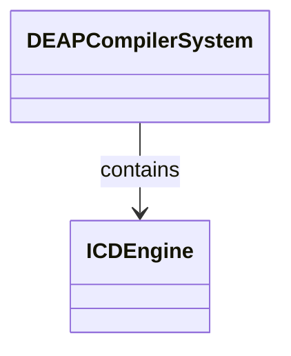
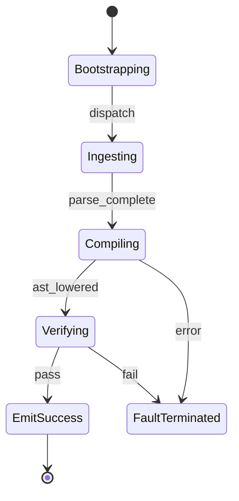

# Epic 10: Subsystem 8 Level 1C ICD Interconnect Contracts

## Metadata
| Attribute | Specification Detail |
| :--- | :--- |
| **Title** | Epic 10: Subsystem 8 Level 1C ICD Interconnect Contracts |
| **Version** | 1.0.0 |
| **Date** | 2026-10-10 |
| **Type** | epic |
| **Package** | Subsystem_8_Level_1C_ICD_Interconnect_Contracts |
| **Subsystem** | ICD Interconnect |
| **Issue ID** | #110 |
| **Generation Mode** | subagent |

## 1. Context
Subsystem specification for ICD Interconnect (Subsystem_8_Level_1C_ICD_Interconnect_Contracts) establishing architectural layout, mathematical invariants, algorithmic complexity bounds, and verification criteria.

## 2. Requirements & Checklist
- [ ] #50 - Feature 41: [ICD Interconnect] ICD Interconnect Engine
- [ ] #51 - Feature 42: [ICD Interconnect] Normative Statement
- [ ] #52 - Feature 43: [ICD Interconnect] Formal Invariant
- [ ] #53 - Feature 44: [ICD Interconnect] Complexity Bounds
- [ ] #54 - Feature 45: [ICD Interconnect] Conformance Criteria

### Associated Use Cases & User Stories

#### Associated Use Cases
- None directly allocated (operational behavior allocated at system ConOps level in Epic 02)

#### Associated User Stories
- None directly allocated (operational behavior allocated at system ConOps level in Epic 02)

## 3. Architecture
Subsystem structural composition, port allocations, and directional data connectors realized by ICDEngine.

## 4. Operational Considerations
Deterministic compilation passes, error containment, and provable polynomial complexity execution.

## 5. Security & Governance
Safety-critical invariant satisfaction, formal trace matrix closure, and zero hardcoded domain semantics.

## 6. Source References
Authoritative subsystem specifications and normative systems engineering standards:
- System Architecture Model: `schema/model.sysml`
- Subsystem Specification Model: `schema/subsystems/subsystem_08_level_1c_icd_interconnect_contracts/architecture.sysml`
- Subsystem Requirements Model: `schema/subsystems/subsystem_08_level_1c_icd_interconnect_contracts/requirements.sysml`
- Normative Systems Engineering Standard: ISO/IEC/IEEE 15288:2023 §6.4.3 Architecture Definition Process

Subsystem architectural composition and formal invariants derive from `schema/model.sysml` pursuant to ISO/IEC/IEEE 15288.

## System-Level UML Class Diagram

## System State Machine Diagram

