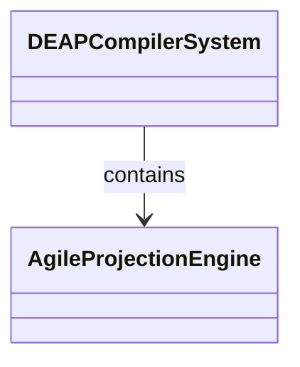
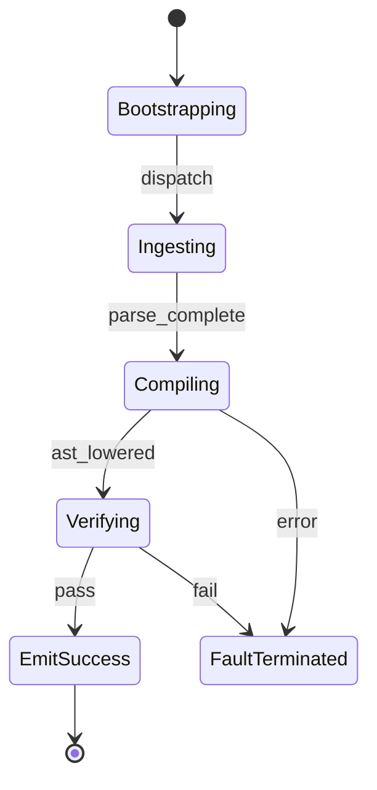

# Epic 11: Subsystem 9 Downstream Specification Projections

## Metadata
| Attribute | Specification Detail |
| :--- | :--- |
| **Title** | Epic 11: Subsystem 9 Downstream Specification Projections |
| **Version** | 1.0.0 |
| **Date** | 2026-10-10 |
| **Type** | epic |
| **Package** | Subsystem_9_Downstream_Specification_Projections |
| **Subsystem** | Downstream Projections |
| **Issue ID** | #111 |
| **Generation Mode** | subagent |

## 1. Context
Subsystem specification for Downstream Projections (Subsystem_9_Downstream_Specification_Projections) establishing architectural layout, mathematical invariants, algorithmic complexity bounds, and verification criteria.

## 2. Requirements & Checklist
- [ ] #55 - Feature 46: [Downstream Projections] Agile Projection Engine
- [ ] #56 - Feature 47: [Downstream Projections] Normative Statement
- [ ] #57 - Feature 48: [Downstream Projections] Formal Invariant
- [ ] #58 - Feature 49: [Downstream Projections] Complexity Bounds
- [ ] #59 - Feature 50: [Downstream Projections] Conformance Criteria

### Associated Use Cases & User Stories

#### Associated Use Cases
*To be populated after Phase 3*

#### Associated User Stories
*To be populated after Phase 3*

## 3. Architecture
Subsystem structural composition, port allocations, and directional data connectors realized by AgileProjectionEngine.

## 4. Operational Considerations
Deterministic compilation passes, error containment, and provable polynomial complexity execution.

## 5. Security & Governance
Safety-critical invariant satisfaction, formal trace matrix closure, and zero hardcoded domain semantics.

## 6. Source References
Authoritative subsystem specifications and normative systems engineering standards:
- System Architecture Model: `schema/model.sysml`
- Subsystem Specification Model: `schema/subsystems/subsystem_09_downstream_specification_projections/architecture.sysml`
- Subsystem Requirements Model: `schema/subsystems/subsystem_09_downstream_specification_projections/requirements.sysml`
- Normative Systems Engineering Standard: ISO/IEC/IEEE 15288:2023 §6.4.3 Architecture Definition Process

Subsystem architectural composition and formal invariants derive from `schema/model.sysml` pursuant to ISO/IEC/IEEE 15288.

## System-Level UML Class Diagram

## System State Machine Diagram

