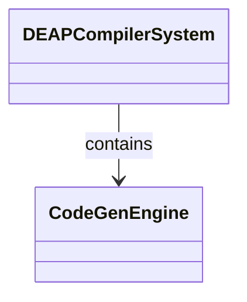
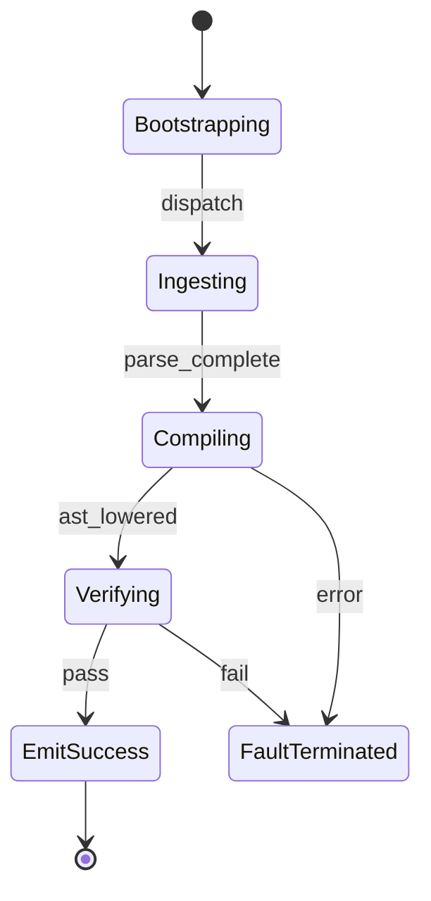

# Epic 12: Subsystem 10 Multi Target CodeGen Simulation Bindings

## Metadata
| Attribute | Specification Detail |
| :--- | :--- |
| **Title** | Epic 12: Subsystem 10 Multi Target CodeGen Simulation Bindings |
| **Version** | 1.0.0 |
| **Date** | 2026-10-10 |
| **Type** | epic |
| **Package** | Subsystem_10_Multi_Target_CodeGen_Simulation_Bindings |
| **Subsystem** | Multi-Target CodeGen |
| **Issue ID** | #112 |
| **Generation Mode** | subagent |

## 1. Context
Subsystem specification for Multi-Target CodeGen (Subsystem_10_Multi_Target_CodeGen_Simulation_Bindings) establishing architectural layout, mathematical invariants, algorithmic complexity bounds, and verification criteria.

## 2. Requirements & Checklist
- [ ] #60 - Feature 51: [Multi-Target CodeGen] CodeGen Engine
- [ ] #61 - Feature 52: [Multi-Target CodeGen] Normative Statement
- [ ] #62 - Feature 53: [Multi-Target CodeGen] Formal Invariant
- [ ] #63 - Feature 54: [Multi-Target CodeGen] Complexity Bounds
- [ ] #64 - Feature 55: [Multi-Target CodeGen] Conformance Criteria

### Associated Use Cases & User Stories

#### Associated Use Cases
- [ ] #99 - [Use Case 05: Multi-Target CodeGen and Simulation Synthesis Workflow](../use-cases/UC-05-Multi_Target_CodeGen_and_Simulation_Synthesis_Workflow.md)

#### Associated User Stories
- None directly allocated (operational behavior allocated at system ConOps level in Epic 02)

## 3. Architecture
Subsystem structural composition, port allocations, and directional data connectors realized by CodeGenEngine.

## 4. Operational Considerations
Deterministic compilation passes, error containment, and provable polynomial complexity execution.

## 5. Security & Governance
Safety-critical invariant satisfaction, formal trace matrix closure, and zero hardcoded domain semantics.

## 6. Source References
Authoritative subsystem specifications and normative systems engineering standards:
- System Architecture Model: `schema/model.sysml`
- Subsystem Specification Model: `schema/subsystems/subsystem_10_multi_target_codegen_simulation_bindings/architecture.sysml`
- Subsystem Requirements Model: `schema/subsystems/subsystem_10_multi_target_codegen_simulation_bindings/requirements.sysml`
- Normative Systems Engineering Standard: ISO/IEC/IEEE 15288:2023 §6.4.3 Architecture Definition Process

Subsystem architectural composition and formal invariants derive from `schema/model.sysml` pursuant to ISO/IEC/IEEE 15288.

## System-Level UML Class Diagram

## System State Machine Diagram

