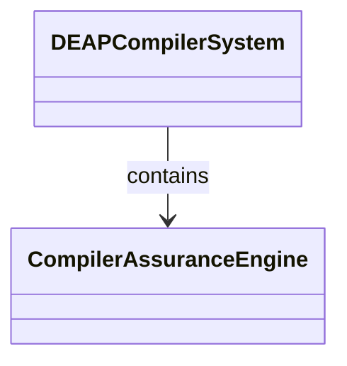
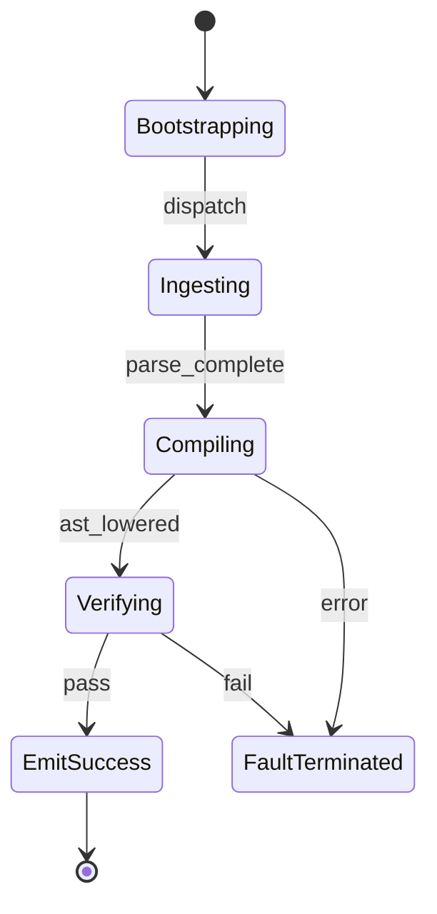

# Epic 14: Subsystem 12 Compiler Performance CLI Assurance

## Metadata
| Attribute | Specification Detail |
| :--- | :--- |
| **Title** | Epic 14: Subsystem 12 Compiler Performance CLI Assurance |
| **Version** | 1.0.0 |
| **Date** | 2026-10-10 |
| **Type** | epic |
| **Package** | Subsystem_12_Compiler_Performance_CLI_Assurance |
| **Subsystem** | Compiler Performance |
| **Issue ID** | #114 |
| **Generation Mode** | subagent |

## 1. Context
Subsystem specification for Compiler Performance (Subsystem_12_Compiler_Performance_CLI_Assurance) establishing architectural layout, mathematical invariants, algorithmic complexity bounds, and verification criteria.

## 2. Requirements & Checklist
- [ ] #70 - Feature 61: [Compiler Performance] Compiler Assurance Engine
- [ ] #71 - Feature 62: [Compiler Performance] Normative Statement
- [ ] #72 - Feature 63: [Compiler Performance] Formal Invariant
- [ ] #73 - Feature 64: [Compiler Performance] Complexity Bounds
- [ ] #74 - Feature 65: [Compiler Performance] Conformance Criteria

### Associated Use Cases & User Stories

#### Associated Use Cases
- [ ] #100 - [Use Case 06: Baseline Conformance and Diagnostic Triage Workflow](../use-cases/UC-06-Baseline_Conformance_and_Diagnostic_Triage_Workflow.md)

#### Associated User Stories
- [ ] #94 - [User Story 06: Verify Multi-File Baseline Parity and Governance Gates](../user-stories/US-06-Verify_Baseline_Parity.md)

## 3. Architecture
Subsystem structural composition, port allocations, and directional data connectors realized by CompilerAssuranceEngine.

## 4. Operational Considerations
Deterministic compilation passes, error containment, and provable polynomial complexity execution.

## 5. Security & Governance
Safety-critical invariant satisfaction, formal trace matrix closure, and zero hardcoded domain semantics.

## 6. Source References
Authoritative subsystem specifications and normative systems engineering standards:
- System Architecture Model: `schema/model.sysml`
- Subsystem Specification Model: `schema/subsystems/subsystem_12_compiler_performance_cli_assurance/architecture.sysml`
- Subsystem Requirements Model: `schema/subsystems/subsystem_12_compiler_performance_cli_assurance/requirements.sysml`
- Normative Systems Engineering Standard: ISO/IEC/IEEE 15288:2023 §6.4.3 Architecture Definition Process

Subsystem architectural composition and formal invariants derive from `schema/model.sysml` pursuant to ISO/IEC/IEEE 15288.

## System-Level UML Class Diagram

## System State Machine Diagram

