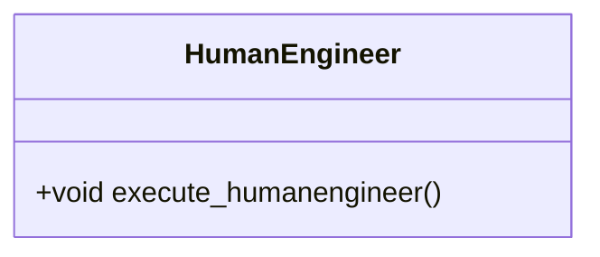

# Feature 01: HumanEngineer Architecture & Control

## Metadata
| Attribute | Specification Detail |
| :--- | :--- |
| **Title** | Feature 01: HumanEngineer |
| **Version** | 1.0.0 |
| **Date** | 2026-10-10 |
| **Type** | feature |
| **Part** | HumanEngineer |
| **Generation Mode** | subagent |

## Architectural Structure

## Logical Operations & Interface Messages
- `+execute_humanengineer() : void` - Executes operations for HumanEngineer

## Interface Requirements
### 1. Payload Schema
Formal schema and interface definition for HumanEngineer.

### 2. Validation & Constraints
Formal constraints and invariants enforced by HumanEngineer.
