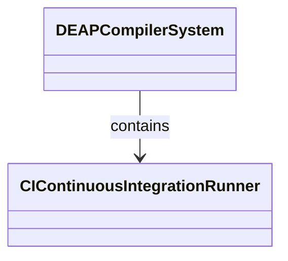

# Feature 02: [ConOps] CI Continuous Integration Runner

## Metadata
| Attribute | Specification Detail |
| :--- | :--- |
| **Title** | Feature 02: [ConOps] CI Continuous Integration Runner |
| **Version** | 1.0.0 |
| **Date** | 2026-10-10 |
| **Type** | feature |
| **Part** | CIContinuousIntegrationRunner |
| **Subsystem** | ConOps |
| **Issue ID** | #11 |
| **Generation Mode** | subagent |

## UML Class Diagram



## Interface Requirements
### 1. Test Data Shape
```json
{
  "part": "CIContinuousIntegrationRunner",
  "status": "nominal"
}
```

### 2. Validation & Constraints
Formal constraints and invariant guarantees enforced by CIContinuousIntegrationRunner.

### 3. Visual Layout & Arrangement
Logical layout, viewport containment, and container structure for CIContinuousIntegrationRunner conforming to platform design tokens. Container boundaries enforce `@container` isolation rules.

### 4. Interactive Flow & States
Operational lifecycle events and discrete state transitions for CIContinuousIntegrationRunner.

### Layer 1: Domain State & Signal Model
Domain state vector representing CIContinuousIntegrationRunner status, AST references, and typed signal models.

### Layer 2: Logic & Safety State Management
Deterministic state machine solver and safety monitor logic for CIContinuousIntegrationRunner.

### Layer 3: Presentation & Actuator Interface Binding
Presentation interface binding and diagnostic event routing for CIContinuousIntegrationRunner.

## Acceptance Criteria (BDD)
- [ ] AC-01: Given valid schema source S, When compiler parses input, Then lowers AST with positive provenance.
- [ ] AC-02: Given formal constraints, When semantic validator executes, Then asserts invariant satisfaction.
- [ ] AC-03: Given malformed inputs, When error recovery activates, Then emits structured diagnostics without panic.
- [ ] AC-04: Given repeated compilation passes, When executed on identical sources, Then outputs are bitwise deterministic.

## Source References
Formal component specifications and normative systems engineering requirements:
- ConOps Operational Actors: `schema/conops/actors.sysml`
- ConOps Operational Activities: `schema/conops/activities.sysml`
- Normative Systems Engineering Standard: ISO/IEC/IEEE 29148:2018 §6.4.2 Concept of Operations

Component behavior and interface definitions derive from `schema/model.sysml` pursuant to ISO/IEC/IEEE 15288.
