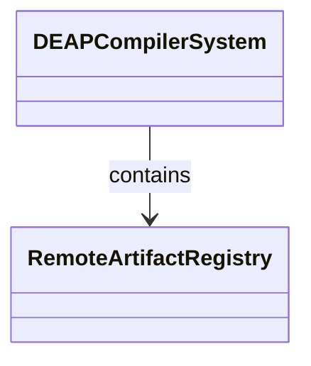

# Feature 03: [Con Ops] RemoteArtifactRegistry

## Metadata
| Attribute | Specification Detail |
| :--- | :--- |
| **Title** | Feature 03: [Con Ops] RemoteArtifactRegistry |
| **Version** | 1.0.0 |
| **Date** | 2026-10-10 |
| **Type** | feature |
| **Part** | RemoteArtifactRegistry |
| **Subsystem** | Con Ops |
| **Issue ID** | #12 |
| **Generation Mode** | subagent |

## UML Class Diagram


```mermaid
classDiagram
    class DEAPCompilerSystem
    class RemoteArtifactRegistry
    DEAPCompilerSystem --> RemoteArtifactRegistry : contains
```

## Interface Requirements
### 1. Test Data Shape
```json
{
  "$schema": "https://json-schema.org/draft/2020-12/schema",
  "title": "RemoteArtifactRegistryPayloadSchema",
  "type": "object",
  "properties": {
    "part": {
      "type": "string",
      "const": "RemoteArtifactRegistry"
    },
    "status": {
      "type": "string",
      "enum": ["nominal", "degraded", "fault"]
    }
  },
  "required": [
    "part",
    "status"
  ],
  "additionalProperties": false
}
```

### 2. Validation & Constraints
Formal constraints and invariant guarantees enforced by RemoteArtifactRegistry.

### 3. Visual Layout & Arrangement
Logical layout, viewport containment, and container structure for RemoteArtifactRegistry conforming to platform design tokens. Container boundaries enforce @container isolation rules.

### 4. Interactive Flow & States
Operational lifecycle events and discrete state transitions for RemoteArtifactRegistry.

### Layer 1: Domain State & Signal Model
Domain state vector representing RemoteArtifactRegistry status, AST references, and typed signal models.

### Layer 2: Logic & Safety State Management
Deterministic state machine solver and safety monitor logic for RemoteArtifactRegistry.

### Layer 3: Presentation & Actuator Interface Binding
Presentation interface binding and diagnostic event routing for RemoteArtifactRegistry.

## Acceptance Criteria (BDD)
- [ ] AC-01: Given initialized execution environment, When RemoteArtifactRegistry processes inputs, Then state invariants are satisfied.
- [ ] AC-02: Given boundary conditions across interface ports, When RemoteArtifactRegistry validates payloads, Then conformant outputs are emitted.
- [ ] AC-03: Given exceptional or malformed input events, When RemoteArtifactRegistry detects anomalies, Then error recovery activates safely without panic.
- [ ] AC-04: Given repeated execution passes with identical inputs, When RemoteArtifactRegistry executes deterministically, Then outputs are bitwise reproducible.

## Source References
Formal component specifications and normative systems engineering requirements:
- ConOps Operational Actors: `schema/conops/actors.sysml`
- ConOps Operational Activities: `schema/conops/activities.sysml`
- Normative Systems Engineering Standard: ISO/IEC/IEEE 29148:2018 §6.4.2 Concept of Operations

Component behavior and interface definitions derive from `schema/model.sysml` pursuant to ISO/IEC/IEEE 15288.
