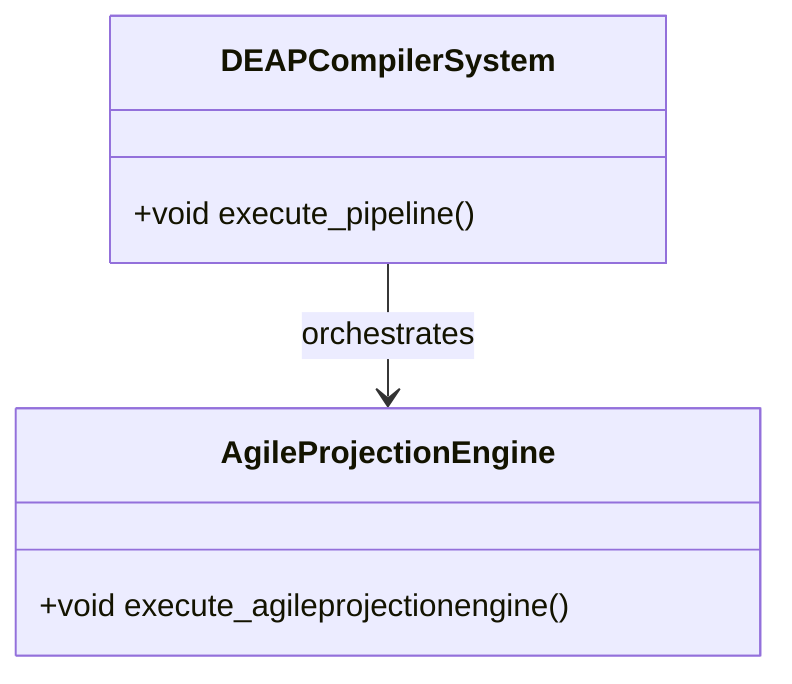

# Feature 46: AgileProjectionEngine Architecture & Control

## Metadata
| Attribute | Specification Detail |
| :--- | :--- |
| **Title** | Feature 46: AgileProjectionEngine |
| **Version** | 1.0.0 |
| **Date** | 2026-10-10 |
| **Type** | feature |
| **Part** | AgileProjectionEngine |
| **Generation Mode** | subagent |

## UML Class Diagram



## Logical Operations & Interface Messages
- `+execute_agileprojectionengine() : void` - Executes operations for AgileProjectionEngine

## Interface Requirements
### 1. Test Data Shape
```json
{
  "part": "AgileProjectionEngine",
  "status": "nominal"
}
```

### 2. Validation & Constraints
Formal constraints and invariants enforced by AgileProjectionEngine.

### 3. Visual Layout & Arrangement
Logical layout, viewport containment, and container structure for AgileProjectionEngine.

### 4. Interactive Flow & States
Interactive operational sequences and discrete state transitions for AgileProjectionEngine.
