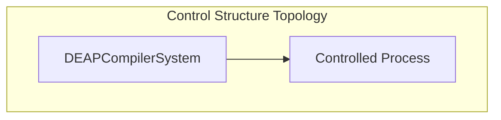

# System Losses, Hazards & Control Structure Topology

## System Losses

| Loss ID | Description |
| :--- | :--- |
| L-1 | Loss of safe function of DEAPCompilerSystem |

## System Hazards

| Hazard ID | Associated Control Action | Controller |
| :--- | :--- | :--- |
| H-1 | OA_01_Ingest_OEM_Artifacts | DEAPCompilerSystem |
| H-2 | OA_02_Parse_SysML_AST | DEAPCompilerSystem |
| H-3 | OA_03_Validate_Model_Semantics | DEAPCompilerSystem |
| H-4 | OA_04_Transpile_Safety_Artifacts | DEAPCompilerSystem |
| H-5 | OA_05_Synthesize_Downstream_Projections | DEAPCompilerSystem |
| H-6 | OA_06_Verify_Baseline_Parity | DEAPCompilerSystem |

## Hierarchical Control Structure Topology

