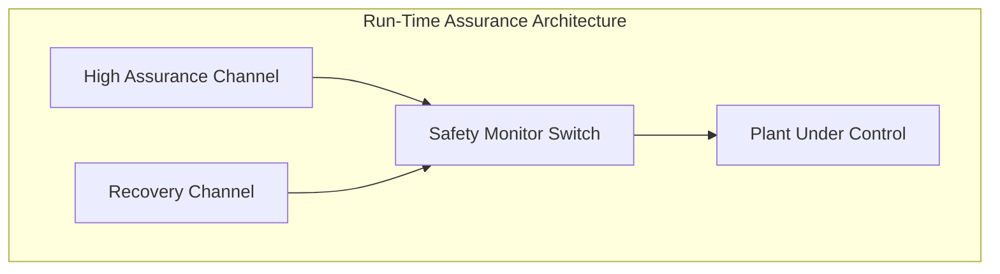

# Run-Time Assurance Architecture & Formal Proof Suite

## Simplex Run-Time Assurance Topology



## Formal Proof Suite

## Theorem T-01 -- Kinetic Energy Dissipation Bound

### Formal Theorem Statement

$$ E_{\mathrm{density}} \le E_{\mathrm{limit}} $$

### Symbolic Derivation

$$
\begin{aligned}
    v_{\mathrm{term}} &= \sqrt{ \frac{K_f \cdot M \cdot g}{\rho \cdot C_d \cdot A_d} } \\
    E_{\mathrm{impact}} &= \frac{M \cdot M \cdot g}{\rho \cdot C_d \cdot A_d} \\
    E_{\mathrm{density}} &= \frac{E_{\mathrm{impact}}}{A_f} \\
\end{aligned}
$$

### Parameter Definitions & Engineering Units Table

| Symbol | Description | Value | Engineering Unit |
| :--- | :--- | :--- | :--- |
| K_f | Dimensionless kinetic term factor | PENDING_PARAMETER | - |
| M | System total mass | PENDING_PARAMETER | kg |
| g | Gravitational acceleration | PENDING_PARAMETER | m/s |
| rho | Ambient medium density | PENDING_PARAMETER | kg per cubic metre |
| C_d | Aerodynamic drag coefficient | PENDING_PARAMETER | - |
| A_d | Deceleration projected area | PENDING_PARAMETER | square metre |
| A_f | Frontal impact cross-section area | PENDING_PARAMETER | square metre |
| E_limit | Regulatory energy density ceiling | PENDING_PARAMETER | J per square metre |

### Step-by-Step Numerical Proof Evaluation

$$
\begin{aligned}
    v_{\mathrm{term}} &= \sqrt{ (PENDING_PARAMETER \cdot PENDING_PARAMETER \cdot PENDING_PARAMETER) / (PENDING_PARAMETER \cdot PENDING_PARAMETER \cdot PENDING_PARAMETER) } \\
    E_{\mathrm{impact}} &= (PENDING_PARAMETER \cdot PENDING_PARAMETER \cdot PENDING_PARAMETER) / (PENDING_PARAMETER \cdot PENDING_PARAMETER \cdot PENDING_PARAMETER) \\
    E_{\mathrm{density}} &= E_{\mathrm{impact}} / PENDING_PARAMETER \le PENDING_PARAMETER \\
\end{aligned}
$$

### SLDV Temporal Assertion Binding

```matlab
sldv.assert( (ImpactEnergyDensity <= PENDING_PARAMETER), 'Bind_KINETIC_ENERGY_DISSIPATION_BOUND' );
```

## Theorem T-02 -- Containment Reach Bound

### Formal Theorem Statement

$$ R_{\mathrm{glide}} \le R_{\mathrm{bound}} - R_{\mathrm{buffer}} $$

### Symbolic Derivation

$$
\begin{aligned}
    t_{\mathrm{glide}} &= \frac{H_a}{V_{\mathrm{sink}}} \\
    R_{\mathrm{air}} &= H_a \cdot (L/D)_{\mathrm{max}} \\
    R_{\mathrm{drift}} &= V_{\mathrm{wind}} \cdot t_{\mathrm{glide}} \\
    R_{\mathrm{glide}} &= R_{\mathrm{air}} + R_{\mathrm{drift}} \\
\end{aligned}
$$

### Parameter Definitions & Engineering Units Table

| Symbol | Description | Value | Engineering Unit |
| :--- | :--- | :--- | :--- |
| H_a | Initial altitude above reference plane | PENDING_PARAMETER | m |
| (L/D)_max | Maximum lift-to-drag ratio | PENDING_PARAMETER | - |
| V_sink | Minimum sink rate | PENDING_PARAMETER | m/s |
| V_wind | Wind drift component | PENDING_PARAMETER | m/s |
| R_bound | Operational containment radius | PENDING_PARAMETER | m |
| R_buffer | Contingency buffer radius | PENDING_PARAMETER | m |

### Step-by-Step Numerical Proof Evaluation

$$
\begin{aligned}
    t_{\mathrm{glide}} &= PENDING_PARAMETER / PENDING_PARAMETER \\
    R_{\mathrm{air}} &= PENDING_PARAMETER \cdot PENDING_PARAMETER \\
    R_{\mathrm{drift}} &= PENDING_PARAMETER \cdot t_{\mathrm{glide}} \\
    R_{\mathrm{glide}} &= R_{\mathrm{air}} + R_{\mathrm{drift}} \le PENDING_PARAMETER - PENDING_PARAMETER \\
\end{aligned}
$$

### SLDV Temporal Assertion Binding

```matlab
sldv.assert( (GlideDistance <= (ContainmentRadius - ContingencyBuffer)), 'Bind_CONTAINMENT_REACH_BOUND' );
```

## Theorem T-03 -- Barrier Forward Invariance Bound

### Formal Theorem Statement

$$ \dot{B}(\mathbf{x}, \mathbf{u}) + \gamma(B(\mathbf{x})) \ge B_{\mathrm{min}} $$

### Symbolic Derivation

$$
\begin{aligned}
    B(\mathbf{x}) &= d_b \cdot d_b - \|\mathbf{p} - \mathbf{p}_c\| \cdot \|\mathbf{p} - \mathbf{p}_c\| - \frac{\|\mathbf{v}\| \cdot \|\mathbf{v}\|}{K_f \cdot a_{\mathrm{max}}} \\
    \dot{B}(\mathbf{x}, \mathbf{u}) &= -K_f \cdot (\mathbf{p} - \mathbf{p}_c)^T \mathbf{v} + \frac{\mathbf{v}^T \mathbf{u}}{a_{\mathrm{max}}} \\
    \dot{B} + \gamma B &= \dot{B} + \gamma_s \cdot B(\mathbf{x}) \\
\end{aligned}
$$

### Parameter Definitions & Engineering Units Table

| Symbol | Description | Value | Engineering Unit |
| :--- | :--- | :--- | :--- |
| d_b | Containment boundary radius | PENDING_PARAMETER | m |
| p-p_c | Current radial offset from centre | PENDING_PARAMETER | m |
| v | Ground speed magnitude | PENDING_PARAMETER | m/s |
| a_max | Maximum certified acceleration | PENDING_PARAMETER | m/s |
| gamma_s | Extended class-K linear gain | PENDING_PARAMETER | per second |
| K_f | Dimensionless kinetic term factor | PENDING_PARAMETER | - |

### Step-by-Step Numerical Proof Evaluation

$$
\begin{aligned}
    B(\mathbf{x}) &= PENDING_PARAMETER \cdot PENDING_PARAMETER - PENDING_PARAMETER \cdot PENDING_PARAMETER - (PENDING_PARAMETER \cdot PENDING_PARAMETER) / (PENDING_PARAMETER \cdot PENDING_PARAMETER) \\
    \dot{B} &= -PENDING_PARAMETER \cdot PENDING_PARAMETER \cdot PENDING_PARAMETER + PENDING_PARAMETER \cdot (PENDING_PARAMETER/PENDING_PARAMETER) \\
    \dot{B} + \gamma B &= \dot{B} + PENDING_PARAMETER \cdot B(\mathbf{x}) \ge B_{\mathrm{min}} \\
\end{aligned}
$$

### SLDV Temporal Assertion Binding

```matlab
sldv.assert( (BarrierValue >= BarrierFloor) && (BarrierDerivative + BarrierGain * BarrierValue >= BarrierFloor), 'Bind_BARRIER_FORWARD_INVARIANCE_BOUND' );
```

## Theorem T-04 -- Exponential Discharge Bound

### Formal Theorem Statement

$$ V_e(t) = V_a \cdot \exp\left( -\frac{t}{R_b \cdot C_s} \right) \le V_{\mathrm{safe}} $$

### Symbolic Derivation

$$
\begin{aligned}
    \tau_{\mathrm{bleed}} &= R_b \cdot C_s \\
    V_e(t) &= V_a \cdot \exp\left( -\frac{t}{\tau_{\mathrm{bleed}}} \right) \\
    t_{\mathrm{safe}} &= \tau_{\mathrm{bleed}} \cdot \ln\left( \frac{V_a}{V_{\mathrm{safe}}} \right) \\
\end{aligned}
$$

### Parameter Definitions & Engineering Units Table

| Symbol | Description | Value | Engineering Unit |
| :--- | :--- | :--- | :--- |
| V_a | Initial fully charged potential | PENDING_PARAMETER | V |
| V_safe | Non-hazardous potential ceiling | PENDING_PARAMETER | V |
| R_b | Bleed-down resistance | PENDING_PARAMETER | ohm |
| C_s | Energy storage capacitance | PENDING_PARAMETER | F |

### Step-by-Step Numerical Proof Evaluation

$$
\begin{aligned}
    \tau_{\mathrm{bleed}} &= PENDING_PARAMETER \cdot PENDING_PARAMETER \\
    t_{\mathrm{safe}} &= \tau_{\mathrm{bleed}} \cdot \ln(PENDING_PARAMETER/PENDING_PARAMETER) \\
    V_e(t_{\mathrm{safe}}) &= PENDING_PARAMETER \cdot \exp(-t_{\mathrm{safe}}/\tau_{\mathrm{bleed}}) \le PENDING_PARAMETER \\
\end{aligned}
$$

### SLDV Temporal Assertion Binding

```matlab
sldv.assert( implies(DeactivationCommandActive && (ElapsedTime >= TauBleed), (StoredPotential <= PENDING_PARAMETER)), 'Bind_EXPONENTIAL_DISCHARGE_BOUND' );
```

## Theorem T-05 -- Energy Balance Separation Bound

### Formal Theorem Statement

$$ V_{\mathrm{sep}} = \sqrt{ \frac{K_f}{M} \left( W_{\mathrm{drive}} - W_{\mathrm{friction}} \right) } \ge V_{\mathrm{stall}} $$

### Symbolic Derivation

$$
\begin{aligned}
    W_{\mathrm{drive}} &= P_r \cdot A_p \cdot x_s \\
    W_{\mathrm{friction}} &= \mu_k \cdot M \cdot g \cdot \cos(\theta_s) \cdot x_s \\
    V_{\mathrm{sep}} &= \sqrt{ \frac{K_f \cdot (W_{\mathrm{drive}} - W_{\mathrm{friction}})}{M} } \\
\end{aligned}
$$

### Parameter Definitions & Engineering Units Table

| Symbol | Description | Value | Engineering Unit |
| :--- | :--- | :--- | :--- |
| P_r | Mean drive pressure | PENDING_PARAMETER | Pa |
| A_p | Drive piston cross-section area | PENDING_PARAMETER | square metre |
| x_s | Acceleration stroke length | PENDING_PARAMETER | m |
| M | System total mass | PENDING_PARAMETER | kg |
| mu_k | Kinetic friction coefficient | PENDING_PARAMETER | - |
| theta_s | Stroke incline angle | PENDING_PARAMETER | deg |
| V_stall | Minimum stall velocity | PENDING_PARAMETER | m/s |
| K_f | Dimensionless kinetic term factor | PENDING_PARAMETER | - |
| g | Gravitational acceleration | PENDING_PARAMETER | m/s |

### Step-by-Step Numerical Proof Evaluation

$$
\begin{aligned}
    W_{\mathrm{drive}} &= PENDING_PARAMETER \cdot PENDING_PARAMETER \cdot PENDING_PARAMETER \\
    W_{\mathrm{friction}} &= PENDING_PARAMETER \cdot PENDING_PARAMETER \cdot PENDING_PARAMETER \cdot \cos(PENDING_PARAMETER) \cdot PENDING_PARAMETER \\
    V_{\mathrm{sep}} &= \sqrt(PENDING_PARAMETER \cdot (W_{\mathrm{drive}} - W_{\mathrm{friction}})/PENDING_PARAMETER) \ge PENDING_PARAMETER \\
\end{aligned}
$$

### SLDV Temporal Assertion Binding

```matlab
sldv.assert( implies(SeparationTrigger, (ReleaseSpeed >= PENDING_PARAMETER)), 'Bind_ENERGY_BALANCE_SEPARATION_BOUND' );
```

## Theorem T-06 -- Link Margin Lower Bound

### Formal Theorem Statement

$$ \mathrm{LM} = P_{\mathrm{rx}} - P_{\mathrm{sens}} \ge \mathrm{LM}_{\mathrm{min}} $$

### Symbolic Derivation

$$
\begin{aligned}
    \mathrm{FSPL} &= L_f \cdot \left( \log(D) + \log(f) + \log(F_c) \right) \\
    P_{\mathrm{rx}} &= P_{\mathrm{tx}} + G_{\mathrm{tx}} + G_{\mathrm{rx}} - \mathrm{FSPL} - L_{\mathrm{misc}} \\
    \mathrm{LM} &= P_{\mathrm{rx}} - P_{\mathrm{sens}} \\
\end{aligned}
$$

### Parameter Definitions & Engineering Units Table

| Symbol | Description | Value | Engineering Unit |
| :--- | :--- | :--- | :--- |
| P_tx | Transmitter output power | PENDING_PARAMETER | dBm |
| G_tx | Transmitter antenna gain | PENDING_PARAMETER | dBi |
| G_rx | Receiver antenna gain | PENDING_PARAMETER | dBi |
| f | Carrier frequency | PENDING_PARAMETER | Hz |
| D | Maximum standoff distance | PENDING_PARAMETER | m |
| L_misc | Insertion and atmospheric loss | PENDING_PARAMETER | dB |
| P_sens | Receiver detection sensitivity | PENDING_PARAMETER | dBm |
| LM_min | Minimum required link margin | PENDING_PARAMETER | dB |
| L_f | Dimensionless decibel scaling factor | PENDING_PARAMETER | - |
| F_c | Dimensionless propagation geometry factor | PENDING_PARAMETER | - |

### Step-by-Step Numerical Proof Evaluation

$$
\begin{aligned}
    \mathrm{FSPL} &= PENDING_PARAMETER \cdot ( \log(PENDING_PARAMETER) + \log(PENDING_PARAMETER) + \log(PENDING_PARAMETER) ) \\
    P_{\mathrm{rx}} &= PENDING_PARAMETER + PENDING_PARAMETER + PENDING_PARAMETER - \mathrm{FSPL} - PENDING_PARAMETER \\
    \mathrm{LM} &= P_{\mathrm{rx}} - PENDING_PARAMETER \ge PENDING_PARAMETER \\
\end{aligned}
$$

### SLDV Temporal Assertion Binding

```matlab
sldv.assert( (LinkMargin >= PENDING_PARAMETER), 'Bind_LINK_MARGIN_LOWER_BOUND' );
```

## Theorem T-07 -- Energy Reserve and Thermal Budget Bound

### Formal Theorem Statement

$$ \mathrm{SoC}(t) \ge \mathrm{SoC}_{\mathrm{crit}} \; \wedge \; T_{\mathrm{cell}}(t) \le T_{\mathrm{max}} $$

### Symbolic Derivation

$$
\begin{aligned}
    E_{\mathrm{rtl}} &= \left( \frac{D}{V_{\mathrm{cruise}}} \right) \cdot \left( P_{\mathrm{prop}} + P_{\mathrm{av}} \right) \\
    \mathrm{SoC}_{\mathrm{crit}} &= \frac{E_{\mathrm{rtl}} + E_{\mathrm{abort}}}{E_{\mathrm{total}}} \\
    \Delta T &= \frac{I_b \cdot I_b \cdot R_i}{h \cdot A_p} \\
    T_{\mathrm{cell,max}} &= T_{\mathrm{amb}} + \Delta T \\
\end{aligned}
$$

### Parameter Definitions & Engineering Units Table

| Symbol | Description | Value | Engineering Unit |
| :--- | :--- | :--- | :--- |
| E_total | Total energy storage capacity | PENDING_PARAMETER | J |
| P_prop | Steady-state propulsion power | PENDING_PARAMETER | W |
| P_av | Avionics power consumption | PENDING_PARAMETER | W |
| V_cruise | Cruise speed | PENDING_PARAMETER | m/s |
| D | Standoff distance to recovery point | PENDING_PARAMETER | m |
| E_abort | Emergency abort energy reserve | PENDING_PARAMETER | J |
| I_b | Storage discharge current | PENDING_PARAMETER | A |
| R_i | Internal resistance | PENDING_PARAMETER | ohm |
| h_A_p | Convective dissipation product | PENDING_PARAMETER | W per K |
| T_amb | Ambient temperature | PENDING_PARAMETER | degC |
| T_max | Maximum certified temperature | PENDING_PARAMETER | degC |

### Step-by-Step Numerical Proof Evaluation

$$
\begin{aligned}
    t_{\mathrm{rtl}} &= PENDING_PARAMETER/PENDING_PARAMETER \\
    E_{\mathrm{rtl}} &= t_{\mathrm{rtl}} \cdot (PENDING_PARAMETER + PENDING_PARAMETER) \\
    \mathrm{SoC}_{\mathrm{crit}} &= (E_{\mathrm{rtl}} + PENDING_PARAMETER)/PENDING_PARAMETER \\
    \Delta T &= (PENDING_PARAMETER \cdot PENDING_PARAMETER \cdot PENDING_PARAMETER)/PENDING_PARAMETER \\
    T_{\mathrm{cell,max}} &= PENDING_PARAMETER + \Delta T \le PENDING_PARAMETER \\
\end{aligned}
$$

### SLDV Temporal Assertion Binding

```matlab
sldv.assert( (ReserveState >= DynamicReserveThreshold) && (CellTemperature <= PENDING_PARAMETER), 'Bind_ENERGY_RESERVE_THERMAL_BUDGET' );
```

## Theorem T-08 -- Separation and Miss Distance Bound

### Formal Theorem Statement

$$ d_{\mathrm{CPA}} \ge D_{\mathrm{mod}} \; \vee \; H_{\mathrm{sep}} \ge H_{\mathrm{thresh}} $$

### Symbolic Derivation

$$
\begin{aligned}
    d_{\mathrm{evade}} &= \frac{a_{\mathrm{evade}}}{K_f} \cdot t_m \cdot t_m \\
    t_m &= \tau_{\mathrm{thresh}} \\
    d_{\mathrm{CPA}} &= d_{\mathrm{evade}} \\
\end{aligned}
$$

### Parameter Definitions & Engineering Units Table

| Symbol | Description | Value | Engineering Unit |
| :--- | :--- | :--- | :--- |
| D_mod | Horizontal well-clear boundary | PENDING_PARAMETER | m |
| H_thresh | Vertical well-clear boundary | PENDING_PARAMETER | m |
| tau_thresh | Warning time threshold | PENDING_PARAMETER | s |
| v_rel | Maximum relative velocity | PENDING_PARAMETER | m/s |
| a_evade | Certified evasive acceleration | PENDING_PARAMETER | m/s |
| K_f | Dimensionless kinetic term factor | PENDING_PARAMETER | - |

### Step-by-Step Numerical Proof Evaluation

$$
\begin{aligned}
    t_{\mathrm{maneuver}} &= PENDING_PARAMETER \\
    d_{\mathrm{evade}} &= (PENDING_PARAMETER/PENDING_PARAMETER) \cdot PENDING_PARAMETER \cdot PENDING_PARAMETER \\
    d_{\mathrm{evade}} &\ge PENDING_PARAMETER \\
\end{aligned}
$$

### SLDV Temporal Assertion Binding

```matlab
sldv.assert( (HorizontalSeparationAtCPA >= PENDING_PARAMETER) || (VerticalSeparationAtCPA >= PENDING_PARAMETER), 'Bind_SEPARATION_MISS_DISTANCE_BOUND' );
```

## Theorem T-09 -- Loading Ceiling and Field of View Bound

### Formal Theorem Statement

$$ q(t) \le q_{\mathrm{limit}} \; \wedge \; \eta_{\mathrm{LOS}}(t) \le \theta_{\mathrm{FOV}} $$

### Symbolic Derivation

$$
\begin{aligned}
    q_{\mathrm{max}} &= \frac{M \cdot g \cdot \sin(\theta_d)}{C_d \cdot S_r} \\
    V_{\mathrm{dive}} &= \sqrt{ \frac{K_f \cdot q_{\mathrm{max}}}{\rho} } \\
    \eta_{\mathrm{LOS}} &= \arctan\left( \frac{r_{\perp}}{r_{\parallel}} \right) \\
\end{aligned}
$$

### Parameter Definitions & Engineering Units Table

| Symbol | Description | Value | Engineering Unit |
| :--- | :--- | :--- | :--- |
| M | Terminal dive mass | PENDING_PARAMETER | kg |
| theta_d | Maximum dive path angle | PENDING_PARAMETER | deg |
| C_d | High-speed drag coefficient | PENDING_PARAMETER | - |
| S_r | Reference surface area | PENDING_PARAMETER | square metre |
| rho | Ambient medium density | PENDING_PARAMETER | kg per cubic metre |
| q_limit | Aeroelastic dynamic pressure limit | PENDING_PARAMETER | Pa |
| theta_FOV | Sensor half-angle field of view | PENDING_PARAMETER | deg |
| g | Gravitational acceleration | PENDING_PARAMETER | m/s |
| K_f | Dimensionless kinetic term factor | PENDING_PARAMETER | - |

### Step-by-Step Numerical Proof Evaluation

$$
\begin{aligned}
    q_{\mathrm{max}} &= (PENDING_PARAMETER \cdot PENDING_PARAMETER \cdot \sin(PENDING_PARAMETER))/(PENDING_PARAMETER \cdot PENDING_PARAMETER) \\
    V_{\mathrm{dive}} &= \sqrt((PENDING_PARAMETER \cdot q_{\mathrm{max}})/PENDING_PARAMETER) \\
    q_{\mathrm{max}} &\le PENDING_PARAMETER \\
    \eta_{\mathrm{LOS}} &\le PENDING_PARAMETER \\
\end{aligned}
$$

### SLDV Temporal Assertion Binding

```matlab
sldv.assert( (DynamicPressure <= PENDING_PARAMETER) && (LineOfSightTrackError <= PENDING_PARAMETER), 'Bind_LOADING_CEILING_FOV_BOUND' );
```

## Theorem T-10 -- Markov Reliability Bound

### Formal Theorem Statement

$$ P_{\mathrm{cat}}(T) < \epsilon_{\mathrm{target}} $$

### Symbolic Derivation

$$
\begin{aligned}
    P_{\mathrm{cat}}(T) &= \int_{t_a}^{T} \lambda_c \cdot P_{\mathrm{single}}(t) \, dt \\
    P_{\mathrm{cat}}(T) &\approx \frac{\lambda_p \cdot \lambda_c}{\mu_r} \cdot T \\
\end{aligned}
$$

### Parameter Definitions & Engineering Units Table

| Symbol | Description | Value | Engineering Unit |
| :--- | :--- | :--- | :--- |
| lambda_p | Primary channel failure rate | PENDING_PARAMETER | per hour |
| lambda_c | Secondary channel common-cause rate | PENDING_PARAMETER | per hour |
| mu_r | Reconfiguration switch rate | PENDING_PARAMETER | per hour |
| T | Single mission operating duration | PENDING_PARAMETER | hr |
| epsilon_target | Target catastrophic failure ceiling | PENDING_PARAMETER | per operating hour |

### Step-by-Step Numerical Proof Evaluation

$$
\begin{aligned}
    P_{\mathrm{cat}} &= (PENDING_PARAMETER \cdot PENDING_PARAMETER)/PENDING_PARAMETER \cdot PENDING_PARAMETER \\
    P_{\mathrm{cat}} &\le PENDING_PARAMETER \\
\end{aligned}
$$

### SLDV Temporal Assertion Binding

```matlab
sldv.assert( (CatastrophicFailureProbability <= PENDING_PARAMETER), 'Bind_MARKOV_RELIABILITY_BOUND' );
```

