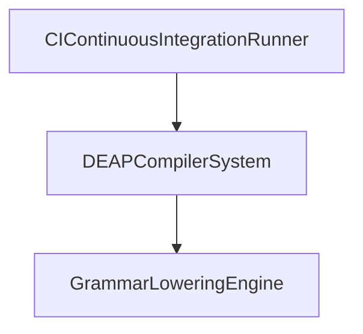

# Use Case 02: Grammar Lowering and AST Construction Workflow

## Metadata
| Attribute | Specification Detail |
| :--- | :--- |
| **Title** | Use Case 02: Grammar Lowering and AST Construction Workflow |
| **Version** | 1.0.0 |
| **Date** | 2026-10-10 |
| **Type** | use-case |
| **Use Case Def** | UC_02_Grammar_Lowering_and_AST_Construction |
| **Subject** | GrammarLoweringEngine |
| **Actors** | CIContinuousIntegrationRunner |
| **Issue ID** | #96 |
| **Generation Mode** | subagent |

## UML Diagrams

## 1. Actors
- `CIContinuousIntegrationRunner`

## 2. Preconditions
- The compiler execution environment is initialized in nominal operational state.
- Authoritative input schema files exist with read access.

## 3. Trigger
- Operator or continuous integration pipeline invokes compilation workflow command.

## 4. Main Success Scenario
1. Actor `CIContinuousIntegrationRunner` initiates workflow execution.
2. System `DEAPCompilerSystem` parses input model definitions and dispatches task to `GrammarLoweringEngine`.
3. Component `GrammarLoweringEngine` processes structural elements and validates semantic constraints.
4. System verifies invariant satisfaction and completes workflow execution.

## 5. Alternate and Exception Flows
- 5a. Syntax or semantic parsing error detected:
  - System captures error location and emits structured diagnostic error catalog entries.
  - Execution halts gracefully without crashing or corrupting working tree state.

## 6. Postconditions
- All semantic models and generated artifacts satisfy formal invariant requirements.
- Output artifacts are deterministically emitted with bitwise reproducibility.

## 8. Realization Matrix
| Specification Item | Type | Link / Reference |
| :--- | :--- | :--- |
| **#90** | User Story | [User Story 02: Parse SysML v2 AST and Construct Arena Graph](../user-stories/US-02-Parse_SysML_AST.md) |
| **#25** | Feature | [Feature 16: [Node Arena AST Graph] Node Arena AST Graph Engine](../features/FEAT-16-NodeArenaASTGraphEngine.md) |

## Source References
Use case operational flows and lifecycle activity references:
- ConOps Operational Activities: `schema/conops/activities.sysml`
- System Architecture Model: `schema/model.sysml`
- Normative Systems Engineering Standard: ISO/IEC/IEEE 29148:2018 §6.4.2 Concept of Operations

Operational use case realization and traceability links derive from `schema/conops/activities.sysml` pursuant to ISO/IEC/IEEE 29148.
