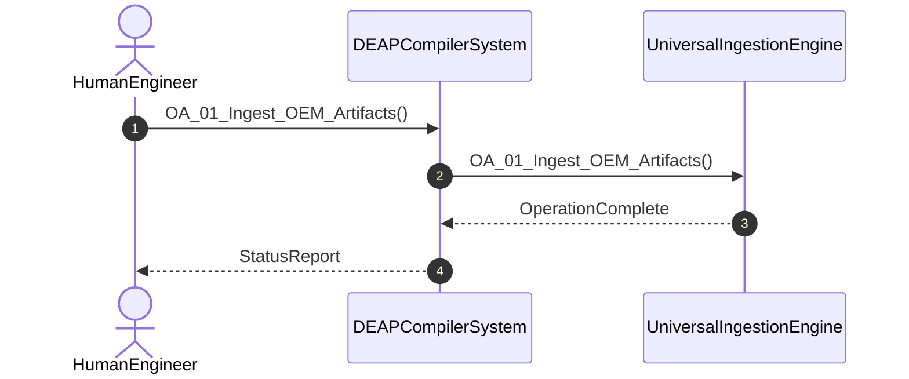

# User Story 01: Ingest OEM Documentation and Schema Artifacts

## Metadata
| Attribute | Specification Detail |
| :--- | :--- |
| **Title** | User Story 01: Ingest OEM Documentation and Schema Artifacts |
| **Version** | 1.0.0 |
| **Date** | 2026-10-10 |
| **Type** | user-story |
| **Interaction** | OA_01_Ingest_OEM_Artifacts |
| **Subject** | UniversalIngestionEngine |
| **Issue ID** | #89 |
| **Generation Mode** | subagent |

## UML Sequence Diagram

## Acceptance Criteria (BDD)
- [ ] AC-US-01-01: Given operational environment initialized, When OA_01_Ingest_OEM_Artifacts executes, Then UniversalIngestionEngine processes the AST within defined latency envelope.
- [ ] AC-US-01-02: Given formal constraints, When semantic validator executes, Then asserts invariant satisfaction.
- [ ] AC-US-01-03: Given malformed inputs, When error recovery activates, Then emits structured diagnostics without panic.

## Required Features
- [ ] #10 - Feature 01: [ConOps] Human Engineer Interface
- [ ] #15 - Feature 06: [System Vision] System Vision Engine
- [ ] #20 - Feature 11: [Universal Ingestion] Universal Ingestion Engine

## Source References
Operational concept definitions and system sequence interaction models:
- ConOps Operational Activities: `schema/conops/activities.sysml`
- System Architecture Model: `schema/model.sysml`
- Normative Systems Engineering Standard: ISO/IEC/IEEE 29148:2018 §6.4.2 Concept of Operations

Authoritative user story flows and interaction lifelines derive from `schema/conops/activities.sysml` pursuant to ISO/IEC/IEEE 29148.
