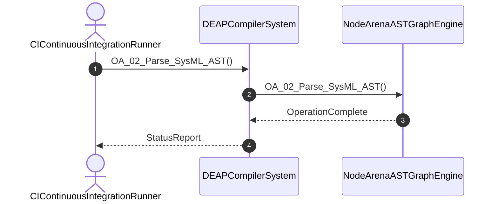

# User Story 02: Parse SysML v2 AST and Construct Arena Graph

## Metadata
| Attribute | Specification Detail |
| :--- | :--- |
| **Title** | User Story 02: Parse SysML v2 AST and Construct Arena Graph |
| **Version** | 1.0.0 |
| **Date** | 2026-10-10 |
| **Type** | user-story |
| **Interaction** | OA_02_Parse_SysML_AST |
| **Subject** | NodeArenaASTGraphEngine |
| **Issue ID** | #90 |
| **Generation Mode** | subagent |

## UML Sequence Diagram

## Acceptance Criteria (BDD)
- [ ] AC-US-02-01: Given operational environment initialized, When OA_02_Parse_SysML_AST executes, Then NodeArenaASTGraphEngine processes the AST within defined latency envelope.
- [ ] AC-US-02-02: Given formal constraints, When semantic validator executes, Then asserts invariant satisfaction.
- [ ] AC-US-02-03: Given malformed inputs, When error recovery activates, Then emits structured diagnostics without panic.

## Required Features
- [ ] #11 - [Feature 02: [ConOps] CI Continuous Integration Runner](../features/FEAT-02-CIContinuousIntegrationRunner.md) (continuous integration pipeline execution and trigger)
- [ ] #25 - [Feature 16: [Node Arena AST Graph] Node Arena AST Graph Engine](../features/FEAT-16-NodeArenaASTGraphEngine.md) (arena graph construction and node allocation)
- [ ] #30 - [Feature 21: [Grammar Lowering] Grammar Lowering Engine](../features/FEAT-21-GrammarLoweringEngine.md) (SysML grammar lowering into arena representation)

## Source References
Operational concept definitions and system sequence interaction models:
- ConOps Operational Activities: `schema/conops/activities.sysml`
- System Architecture Model: `schema/model.sysml`
- Normative Systems Engineering Standard: ISO/IEC/IEEE 29148:2018 §6.4.2 Concept of Operations

Authoritative user story flows and interaction lifelines derive from `schema/conops/activities.sysml` pursuant to ISO/IEC/IEEE 29148.
