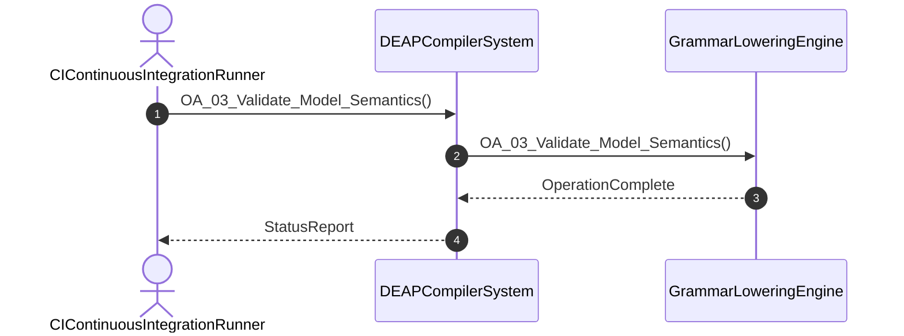

# User Story 03: Validate Model Semantics and Typing Constraints

## Metadata
| Attribute | Specification Detail |
| :--- | :--- |
| **Title** | User Story 03: Validate Model Semantics and Typing Constraints |
| **Version** | 1.0.0 |
| **Date** | 2026-10-10 |
| **Type** | user-story |
| **Interaction** | OA_03_Validate_Model_Semantics |
| **Subject** | GrammarLoweringEngine |
| **Issue ID** | #91 |
| **Generation Mode** | subagent |

## UML Sequence Diagram

## Acceptance Criteria (BDD)
- [ ] AC-US-03-01: Given operational environment initialized, When OA_03_Validate_Model_Semantics executes, Then GrammarLoweringEngine processes the AST within defined latency envelope.
- [ ] AC-US-03-02: Given formal constraints, When semantic validator executes, Then asserts invariant satisfaction.
- [ ] AC-US-03-03: Given malformed inputs, When error recovery activates, Then emits structured diagnostics without panic.

## Required Features
- [ ] #11 - [Feature 02: [ConOps] CI Continuous Integration Runner](../features/FEAT-02-CIContinuousIntegrationRunner.md) (automated pipeline runner for semantic validation)
- [ ] #35 - [Feature 26: [Physical Metrology Flow] Physical Metrology Flow Engine](../features/FEAT-26-MetrologyFlowEngine.md) (metrology flow validation and dimensional checks)
- [ ] #40 - [Feature 31: [State Solvers] State Machine Solver Engine](../features/FEAT-31-StateMachineSolverEngine.md) (state machine constraints and solver verification)

## Source References
Operational concept definitions and system sequence interaction models:
- ConOps Operational Activities: `schema/conops/activities.sysml`
- System Architecture Model: `schema/model.sysml`
- Normative Systems Engineering Standard: ISO/IEC/IEEE 29148:2018 §6.4.2 Concept of Operations

Authoritative user story flows and interaction lifelines derive from `schema/conops/activities.sysml` pursuant to ISO/IEC/IEEE 29148.
