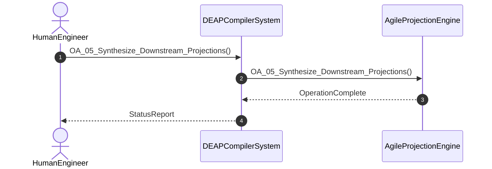

# User Story 05: Synthesize Downstream Agile Backlog Projections

## Metadata
| Attribute | Specification Detail |
| :--- | :--- |
| **Title** | User Story 05: Synthesize Downstream Agile Backlog Projections |
| **Version** | 1.0.0 |
| **Date** | 2026-10-10 |
| **Type** | user-story |
| **Interaction** | OA_05_Synthesize_Downstream_Projections |
| **Subject** | AgileProjectionEngine |
| **Issue ID** | #93 |
| **Generation Mode** | subagent |

## UML Sequence Diagram

## Acceptance Criteria (BDD)
- [ ] AC-US-05-01: Given operational environment initialized, When OA_05_Synthesize_Downstream_Projections executes, Then AgileProjectionEngine processes the AST within defined latency envelope.
- [ ] AC-US-05-02: Given formal constraints, When semantic validator executes, Then asserts invariant satisfaction.
- [ ] AC-US-05-03: Given malformed inputs, When error recovery activates, Then emits structured diagnostics without panic.

## Required Features
- [ ] #10 - Feature 01: [ConOps] Human Engineer Interface
- [ ] #55 - Feature 46: [Downstream Projections] Agile Projection Engine
- [ ] #60 - Feature 51: [Multi-Target CodeGen] CodeGen Engine

## Source References
Operational concept definitions and system sequence interaction models:
- ConOps Operational Activities: `schema/conops/activities.sysml`
- System Architecture Model: `schema/model.sysml`
- Normative Systems Engineering Standard: ISO/IEC/IEEE 29148:2018 §6.4.2 Concept of Operations

Authoritative user story flows and interaction lifelines derive from `schema/conops/activities.sysml` pursuant to ISO/IEC/IEEE 29148.
