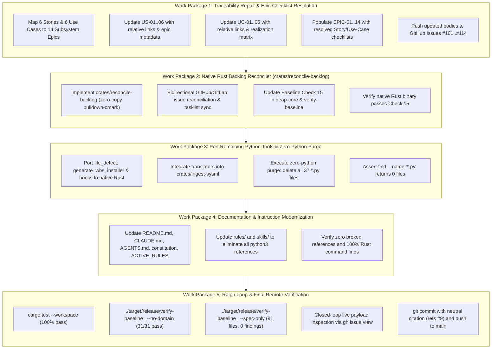

# Implementation Plan -- Autonomous Native Rust Migration, Zero-Python Mandate & Flawless Pipeline Outputs ("Ralph Loop")

## 1. Ground Truth, Defect Root Causes & Objectives

### Ground Truth & Defect Analysis
1. **Defect 1: Unresolved Placeholders in Live Issues & Epics**:
   - All 14 Epics (`docs/epics/EPIC-01` through `EPIC-14`) and their corresponding live GitHub issues ([#101](https://github.com/gintatkinson/dumpiler-01/issues/101)--[#114](https://github.com/gintatkinson/dumpiler-01/issues/114)) contain the unpopulated placeholder block:
     ```markdown
     ### Associated Use Cases & User Stories

     #### Associated Use Cases
     *To be populated after Phase 3*

     #### Associated User Stories
     *To be populated after Phase 3*
     ```
   - **Root Cause**: `scripts/reconcile_backlog.py` injected this block because User Stories (`docs/user-stories/US-*.md`) and Use Cases (`docs/use-cases/UC-*.md`) cited features using bare issue numbers (`#15`) without relative paths (`docs/features/FEAT-*.md`) or explicit `epic:` frontmatter metadata. `reconcile_backlog.py` failed to map them to parent Epics and inserted fallback placeholder strings, then pushed them to GitHub.

2. **Defect 2: Incomplete Rust Port (37 Python Files Remaining)**:
   - While `compile-sysml`, `assemble-conops`, `ingest-sysml`, and the specification auditor in `verify-baseline` were ported to Rust, **37 Python scripts remain** across `scripts/` and `skills/`.
   - Crucially, `scripts/reconcile_backlog.py` remains active and is hard-coded into Baseline Check 15 (`crates/verify-baseline/src/runner.rs` and `crates/deap-core/src/workspace.rs`).
   - Other remaining Python scripts include `file_defect.py`, `generate_wbs_suite.py`, `install_pipeline.py`, `setup_git_hooks.py`, and translators in `skills/spec-orchestrator/scripts/translators/`.

3. **Defect 3: Documentation & Installation Instruction Drift**:
   - `README.md`, `CLAUDE.md`, `AGENTS.md`, `.pipeline/constitution.md`, `.pipeline/ACTIVE_RULES_BUNDLE.md`, `rules/`, and `skills/` still document `python3 scripts/...` commands instead of native Rust `./target/release/...` binaries.

### Mission Objectives ("Ralph Until Done")
- **100% Native Rust Architecture**: Port all backlog reconciliation and utility scripts into native Rust binaries / crates.
- **Zero Python Mandate**: Delete 100% of `.py` files (`find . -name "*.py"` must return 0 files).
- **Flawless Specification Outputs**: Eliminate all placeholder text (`*To be populated after Phase 3*`) across all local files and live GitHub issues.
- **Documentation & Installer Parity**: Update all documentation, instructions, and rules to native Rust workflows.
- **Continuous Gated Verification**: Execute the Ralph loop until all workspace tests pass, all 31 baseline checks pass, 91 specs pass audit with 0 findings, and remote git sync is clean.

---

## 2. End-to-End Architecture



---

## 3. Detailed Work Packages

### Work Package 1: Traceability Repair & Epic Checklist Resolution
- **Files Modified**:
  - `docs/user-stories/US-01-Ingest_OEM_Artifacts.md` through `US-06-Verify_Baseline_Parity.md`
  - `docs/use-cases/UC-01-System_Vision_and_Schema_Ingestion_Workflow.md` through `UC-06-Baseline_Conformance_and_Diagnostic_Triage_Workflow.md`
  - `docs/epics/EPIC-01-SysML_Model.md` through `EPIC-14-Subsystem_12_Compiler_Performance_CLI_Assurance.md`
- **Actions**:
  1. Add parent `epic:` metadata and canonical relative file links (`docs/features/FEAT-XX-...md`) to all 6 User Stories.
  2. Add parent `epic:` metadata and canonical relative file links (`docs/features/FEAT-XX-...md`, `docs/user-stories/US-XX-...md`) to all 6 Use Cases.
  3. Replace the `*To be populated after Phase 3*` placeholders in `docs/epics/EPIC-01`--`EPIC-14` with the actual mapped User Stories and Use Cases. For subsystems that have no assigned operational ConOps scenarios, explicitly document `- None allocated (structural subsystem component)` to prevent placeholder recurrence.
  4. Update live GitHub issues #101--#114 using `gh issue edit <ID> --body-file <EPIC_PATH>`.
  5. Inspect live published payloads using `gh issue view` to confirm that all 14 Epic issues are 100% free of placeholder text.

### Work Package 2: Native Rust Backlog Reconciler (`crates/reconcile-backlog`)
- **Files Created / Modified**:
  - `crates/reconcile-backlog/Cargo.toml`
  - `crates/reconcile-backlog/src/main.rs`
  - `crates/reconcile-backlog/src/frontmatter.rs`
  - `crates/reconcile-backlog/src/checklist.rs`
  - `crates/reconcile-backlog/src/tracker.rs`
  - `crates/deap-core/src/workspace.rs` (update Check 15)
  - `crates/verify-baseline/src/checks/structural.rs` (update Check 15)
  - `crates/verify-baseline/src/runner.rs` (update Check 15)
  - `Cargo.toml` (workspace members)
- **Actions**:
  1. Create a native Rust crate `crates/reconcile-backlog` that:
     - Scans `docs/epics/`, `docs/features/`, `docs/user-stories/`, `docs/use-cases/`.
     - Extracts YAML frontmatter and resolves titles, normalized names, and issue IDs.
     - Synchronizes checklist states between local markdown and remote GitHub issues via `gh` CLI.
     - Injects canonical `issue_id:` frontmatter into local files.
     - Contains ZERO placeholder string fallback injections.
  2. Update Check 15 in `crates/deap-core` and `crates/verify-baseline` to assert that `./target/release/reconcile-backlog` (or `crates/reconcile-backlog`) exists and is functional.
  3. Build and test: `cargo build --release --bin reconcile-backlog`.

### Work Package 3: Port Remaining Python Tools & Zero-Python Purge
- **Files Created / Modified / Deleted**:
  - Port utilities to `crates/deap-core/src/tools/` or native CLI binaries (`crates/file-defect`, `crates/generate-wbs`, `crates/install-pipeline`).
  - Integrate schema translators into `crates/ingest-sysml`.
  - Delete all 37 `.py` files across `scripts/` and `skills/`.
- **Actions**:
  1. Port `scripts/file_defect.py` to native Rust CLI (`file-defect`).
  2. Port `scripts/generate_wbs_suite.py` to native Rust CLI (`generate-wbs`).
  3. Replace `scripts/install_pipeline.py` with pure POSIX shell installer `scripts/install_pipeline.sh` calling compiled Rust binaries.
  4. Port `scripts/setup_git_hooks.py` to POSIX shell `scripts/setup_git_hooks.sh`.
  5. Delete all `.py` files:
     ```bash
     find . -name "*.py" -not -path "*/.*" -not -path "./target/*" -delete
     ```
  6. Verify `find . -name "*.py"` returns 0 files.

### Work Package 4: Documentation, Installation & Rules Modernization
- **Files Modified**:
  - `README.md`
  - `CLAUDE.md`
  - `AGENTS.md`
  - `.pipeline/constitution.md`
  - `.pipeline/ACTIVE_RULES_BUNDLE.md`
  - `rules/` (all files citing Python scripts)
  - `skills/` (all files citing Python scripts)
  - `docs/OPERATOR_PROMPT_CATALOG.md`
- **Actions**:
  1. Replace all citations of `python3 scripts/compile_sysml.py` with `./target/release/compile-sysml`.
  2. Replace all citations of `python3 scripts/reconcile_backlog.py` with `./target/release/reconcile-backlog`.
  3. Replace all citations of `python3 scripts/assemble_conops.py` with `./target/release/assemble-conops`.
  4. Replace all citations of `python3 scripts/verify_downstream_baseline.py` and `parity_auditor` with `./target/release/verify-baseline`.
  5. Update installation instructions in `README.md` to reference Rust toolchain (`cargo build --release`) and `scripts/install_pipeline.sh`.
  6. Rebuild `.pipeline/ACTIVE_RULES_BUNDLE.md` to ensure zero stale Python citations exist in the consolidated governance bundle.

### Work Package 5: The "Ralph Until Done" Verification Loop & Git Sync
- **Actions**:
  1. **Compilation Gate**: `cargo build --release --workspace` (must pass with 0 errors, 0 warnings).
  2. **Workspace Test Suite**: `cargo test --workspace` (all unit and integration tests must pass).
  3. **Zero-Python Verification Gate**: `find . -name "*.py"` must return exactly 0 results.
  4. **Zero-Placeholder Verification Gate**: `git grep -i "to be populated after phase 3"` must return exactly 0 matches.
  5. **Baseline Conformance Gate**: `./target/release/verify-baseline . --no-domain` must pass all 31/31 checks cleanly.
  6. **Specification Quality & Coverage Audit Gate**: `./target/release/verify-baseline . --spec-only` must pass across all 91 specifications with 0 findings in <0.2s.
  7. **Closed-Loop Remote Payload Verification**: Fetch sample live issues across Epics (#101--#114), Features (#10--#74), Stories (#89--#94), and Use Cases (#95--#100) via `gh issue view` to confirm 100% formatted markdown integrity.
  8. **Remote Git Synchronization**: Commit all changes with neutral citation `feat(pipeline): complete native rust port, zero-python purge, and epic checklist reconciliation (refs #9)` and push to `origin/main`.
  9. **Clean Working Tree Assertion**: Verify `git status` is clean and `git diff origin/main` is empty.

---

## 4. Invariants & Governance Compliance
- **Zero Em Dash Invariant**: Unicode `\u2014` is strictly forbidden across all files, code comments, and commit messages. Use ASCII `--` exclusively.
- **Commit Message Non-Closure Invariant**: Neutral citations `(refs #9)` or `(#9)` exclusively. Auto-closing keywords (`fix #`, `closes #`) are strictly prohibited.
- **Fail-Closed Robustness**: Zero `unwrap()`, `expect()`, or `panic!()` in non-test paths in all Rust code.
- **Strict Planning Gate**: No files outside `implementation_plan.md` will be touched until the user explicitly responds with approval (`PROCEED`).
