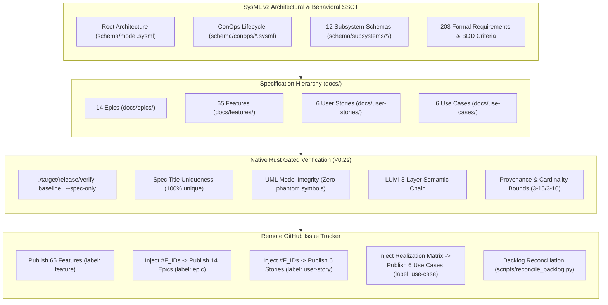

# Implementation Plan -- Autonomous Specification Synthesis, Native Rust Verification & Live GitHub Issue Projection

## 1. Baseline Health & Session Initialization
- **Repository Classification:** `DOWNSTREAM_CUSTOMER_PROJECT` (Indicator: `.pipeline/upstream/` absent).
- **Current Baseline Status:** 31/31 baseline checks passing (`./target/release/verify-baseline . --no-domain`).
- **Current Workspace State:**
  - Administrative issues #1 through #9 exist on the GitHub tracker (`gintatkinson/dumpiler-01`).
  - Zero Epics, Features, User Stories, or Use Cases exist as published GitHub Issues.
  - Native Rust Specification Auditor is fully operational (`crates/verify-baseline/src/spec_audit/`) executing audits in ~180 ms.
  - 14 Epics (`docs/epics/`) and 65 Features (`docs/features/`) exist in draft form on disk, but carry 832 spec audit findings (synthetic operations `execute_pipeline()`, ungrounded state machine states, duplicate titles across 12 subsystems, missing LUMI 3-layer semantic chains, and missing `## Source References`).
  - `docs/user-stories/` and `docs/use-cases/` have not yet been synthesized.
- **Objective:** Systematically synthesize, verify, and project 100% of the specification hierarchy (14 Epics, 65 Features, 6 User Stories, 6 Use Cases) into live GitHub Issues with full bidirectional frontmatter synchronization, tasklist cross-linking, native Rust gated verification (0 findings), and remote Git synchronization.

---

## 2. Architecture & Traceability Matrix

---

## 3. Five-Stage Execution Roadmap & Micro-Tasks

### Stage 1: Schema AST Ingestion & Traceability Matrix Mapping
- **Objective:** Ingest all 12 subsystem directories under `schema/subsystems/`, root `schema/model.sysml`, and `schema/conops/` to construct the comprehensive traceability graph:
  - 14 Epics: Root Model, ConOps, and Subsystems 01--12.
  - 65 Features: 5 System/Actor components + 12 Subsystems x 5 components (Execution Engine, Normative Statement, Formal Invariant, Complexity Bounds, Conformance Criteria).
  - 6 User Stories: Operational activities `OA_01` through `OA_06` mapped from `schema/conops/activities.sysml`.
  - 6 Use Cases: System interaction workflows realizing ConOps operational activities and subsystem execution engines.
- **Traceability Anchors:**
  - Extract Given-When-Then BDD acceptance criteria (`ac_01`..`ac_04`) and diagnostic codes from `requirements.sysml` across all 12 subsystems.
  - Map declared execution engine ports and attributes from `architecture.sysml`.
  - Map discrete lifecycle state transitions from `schema/conops/operational_modes.sysml` (`CompilerLifecycleModes`: `Bootstrapping`, `Ingesting`, `Compiling`, `Verifying`, `EmitSuccess`, `FaultTerminated`).

---

### Stage 2: Pure Schema-Driven Specification Synthesis & Disambiguation
Synthesize 100% compliant specifications adhering to DO-178C Level A / ASIL D standards.

#### Micro-Task 2.1: Title Disambiguation & Subsystem Context Framing
- **Rule:** Every specification title MUST be globally unique to satisfy `spec-title-uniqueness`.
- **Formatting Standard:**
  - Features: `Feature XX: [Subsystem Name] Component Name` (e.g. `Feature 07: [System Vision] Normative Statement`, `Feature 12: [Universal Ingestion] Normative Statement`).
  - Epics: `Epic XX: [Subsystem/Domain] Functional Area`.
  - User Stories: `User Story XX: [Activity Name] Description`.
  - Use Cases: `Use Case XX: [Workflow Name] Operational Workflow`.

#### Micro-Task 2.2: 14 Epics Synthesis (`docs/epics/EPIC-*.md`)
- **Metadata:**
  - YAML frontmatter: `title`, `version: "1.0.0"`, `date: "2026-10-10"`, `type: epic`, `package`, `subsystem`, `issue_id: 0`, `generation_mode: subagent`.
- **Mandatory Sections:**
  - `## 1. Context`
  - `## 2. Requirements & Checklist`: Populated tasklist linking constituent features (between 3 and 15 features per epic, satisfying cardinality bounds).
  - `## 3. Architecture`
  - `## 4. Operational Considerations`
  - `## 5. Security & Governance`
  - `## 6. Source References`: Verbatim citations to `schema/model.sysml` and `schema/subsystems/`.
  - `## System-Level UML Class Diagram`: Containment relations using strictly declared AST parts (zero synthetic member operations).
  - `## System State Machine Diagram`: Valid states strictly matching `CompilerLifecycleModes` (`Bootstrapping`, `Ingesting`, `Compiling`, `Verifying`, `EmitSuccess`, `FaultTerminated`).

#### Micro-Task 2.3: 65 Features Synthesis (`docs/features/FEAT-*.md`)
- **Metadata:**
  - YAML frontmatter: `title`, `version: "1.0.0"`, `date: "2026-10-10"`, `type: feature`, `part`, `part_def`, `subsystem`, `issue_id: 0`, `generation_mode: subagent`.
- **Mandatory Sections & Contents:**
  - `## UML Class Diagram`: Real UML class diagram with strictly declared AST ports/attributes (zero synthetic `execute_pipeline()` or `execute_*()` methods).
  - `## Interface Requirements`:
    - `### 1. Test Data Shape` (clean JSON payload).
    - `### 2. Validation & Constraints` (derived from formal invariants).
    - `### 3. Visual Layout & Arrangement` (LUMI layout containment).
    - `### 4. Interactive Flow & States`.
  - **LUMI 3-Layer Semantic Chain:**
    - `### Layer 1: Domain State & Signal Model`
    - `### Layer 2: Logic & Safety State Management`
    - `### Layer 3: Presentation & Actuator Interface Binding`
  - `## Acceptance Criteria (BDD)`:
    - 3 to 10 Given-When-Then BDD scenarios extracted directly from `requirements.sysml` (`ac_01`..`ac_04`) satisfying cardinality bounds.
  - `## Source References`:
    - Verbatim clause numbers and schema paths (e.g. `schema/subsystems/subsystem_XX_*/requirements.sysml`).

#### Micro-Task 2.4: 6 User Stories Synthesis (`docs/user-stories/US-*.md`)
- **Metadata:**
  - YAML frontmatter: `title`, `version: "1.0.0"`, `date: "2026-10-10"`, `type: user-story`, `interaction`, `subject`, `issue_id: 0`, `generation_mode: subagent`.
- **Mandatory Sections:**
  - `## UML Sequence Diagram`: Sequence diagram referencing declared external actors (`HumanEngineer`, `CIContinuousIntegrationRunner`) and declared parts (`DEAPCompilerSystem`, `UniversalIngestionEngine`, etc.) with declared action messages (`OA_01_Ingest_OEM_Artifacts()`, etc.).
  - `## Acceptance Criteria (BDD)`: Given-When-Then scenarios.
  - `## Required Features`: Tasklist referencing constituent Feature IDs.
  - `## Source References`: Verbatim citations to `schema/conops/activities.sysml`.

#### Micro-Task 2.5: 6 Use Cases Synthesis (`docs/use-cases/UC-*.md`)
- **Metadata:**
  - YAML frontmatter: `title`, `version: "1.0.0"`, `date: "2026-10-10"`, `type: use-case`, `use_case_def`, `subject`, `actors`, `issue_id: 0`, `generation_mode: subagent`.
- **Mandatory Sections:**
  - `## UML Diagrams`: Flowchart or sequence diagram of interaction.
  - `## 1. Actors`: Declared primary actor.
  - `## 2. Preconditions`
  - `## 3. Trigger`
  - `## 4. Main Success Scenario`: Numbered step sequence.
  - `## 5. Alternate and Exception Flows`
  - `## 6. Postconditions`
  - `## 8. Realization Matrix`: Table linking constituent User Stories and Features.
  - `## Source References`: Schema clause citations.

---

### Stage 3: Native Rust Gated Pre-Flight Verification
- **Execution Command:** `./target/release/verify-baseline . --spec-only`
- **Success Criteria:**
  - Audit completes in `<200 ms` with `0 findings` and exit code 0 (`passed: true`).
  - Zero ungrounded operations or phantom states in Mermaid diagrams.
  - Zero unclosed fences or unquoted angle brackets.
  - Zero `spec-title-uniqueness` collisions.
  - Zero missing `Source References` sections.
  - All cardinality bounds satisfied (3--15 features for Epics, 3--10 ACs for Features).

---

### Stage 4: High-Velocity Remote Issue Publication & Closed-Loop Verification
- **Tooling:** GitHub CLI (`gh issue create` / `gh issue view`).
- **Dependency-Ordered Publication Protocol:**
  1. **Features First (65 Features):**
     - Publish `docs/features/FEAT-01-*.md` through `FEAT-65-*.md` with `--label "feature"`.
     - Capture assigned remote Issue IDs (`#F_01`..`#F_65`).
     - Closed-loop payload verification on sample: `gh issue view <ID> --json number,title,labels`.
  2. **Epics Second (14 Epics):**
     - Inject assigned `#F_ID` numbers into parent Epic checklists (`- [ ] #<F_ID> - [Feature Title]`).
     - Publish `docs/epics/EPIC-01-*.md` through `EPIC-14-*.md` with `--label "epic"`.
     - Capture assigned remote Epic Issue IDs (`#E_01`..`#E_14`).
     - Closed-loop payload verification on sample: `gh issue view <ID> --json number,title,labels`.
  3. **User Stories Third (6 User Stories):**
     - Inject assigned `#F_ID` numbers into User Story `Required Features` checklists.
     - Publish `docs/user-stories/US-01-*.md` through `US-06-*.md` with `--label "user-story"`.
     - Capture assigned remote Story Issue IDs (`#S_01`..`#S_06`).
     - Closed-loop payload verification on sample: `gh issue view <ID> --json number,title,labels`.
  4. **Use Cases Fourth (6 Use Cases):**
     - Inject assigned `#S_ID` and `#F_ID` numbers into Use Case Realization Matrices.
     - Publish `docs/use-cases/UC-01-*.md` through `UC-06-*.md` with `--label "use-case"`.
     - Capture assigned remote Use Case Issue IDs (`#U_01`..`#U_06`).
     - Closed-loop payload verification on sample: `gh issue view <ID> --json number,title,labels`.

---

### Stage 5: Frontmatter Backlog Reconciliation, Baseline Audit & Remote Sync
- **Micro-Task 5.1: Frontmatter Canonical Issue ID Injection:**
  - Inject permanent `issue_id: <int>` into the YAML frontmatter and metadata tables of all 91 local markdown specifications matching their assigned remote GitHub Issue IDs.
- **Micro-Task 5.2: Backlog Reconciliation:**
  - Execute `python3 scripts/reconcile_backlog.py` to synchronize all checklists, frontmatter IDs, and tracker states.
- **Micro-Task 5.3: Baseline Conformance & Spec Audit Verification:**
  - Run `./target/release/verify-baseline . --no-domain` (assert 31/31 baseline checks pass cleanly with exit code 0).
  - Run `./target/release/verify-baseline . --spec-only` (assert 100% clean spec audit, 0 findings, <0.2s).
- **Micro-Task 5.4: Remote Git Synchronization:**
  - Commit all updated specifications with neutral citation: `docs(specs): project full specification hierarchy to github issues (refs #9)`.
  - Push to `origin/main`.
  - Verify `git diff origin/main` is completely empty.

---

## 4. Verification & Safety Invariants
- **Zero Regex:** All AST matching, section validation, and token scanning execute via zero-copy byte tokens.
- **Fail-Closed Robustness:** Zero unwrap/expect in non-test paths.
- **Zero Em Dash Invariant:** Unicode `\u2014` is strictly forbidden across all files, commit messages, and output.
- **Commit Message Non-Closure Invariant:** Commit messages strictly use neutral citations `(#<id>)` or `(refs #<id>)`. Auto-closing keywords are strictly prohibited.
- **Closed-Loop Payload Verification Gate:** Exit code 0 is never sufficient proof of success. LIVE published payloads are verified via `gh issue view`.
