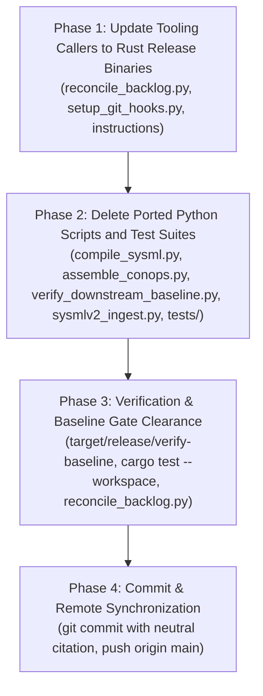

# Implementation Plan -- Deletion of Ported Python Tooling & Migration to Native Rust Toolchain

## 1. Executive Summary & Baseline Ground Truth
- **Repository:** `gintatkinson/dumpiler-01` (`DOWNSTREAM_CUSTOMER_PROJECT`)
- **Current Git Branch:** `main` (commit `bbd3680` -- up to date with `origin/main`)
- **Baseline Health:** 31/31 baseline checks passing (`./target/release/verify-baseline . --no-domain`)
- **Workspace Test Suite:** 100% passing (`cargo test --workspace`, 131 unit, integration, and doc-tests)
- **Problem Statement:** The codebase contains legacy Python scripts and unit tests that have already been completely ported to high-performance, safe native Rust crates under `crates/`. Retaining duplicate Python scripts creates maintenance drift, cognitive bloat, and confusion regarding the authoritative source of truth.
- **Strategic Mandate:** Delete all legacy Python scripts that have been ported to native Rust crates, remove forbidden Python unit tests, and update callers to invoke the compiled release binaries directly.

---

## 2. Ported Files & Deletion Inventory

| Ported Python Script | Native Rust Crate & Binary | Deletion Justification |
|---|---|---|
| `scripts/compile_sysml.py` | `crates/compile-sysml` (`target/release/compile-sysml`) | 100% ported. Full AST parsing, multi-file merging, KerML Clause 8 connection semantics, STPA transpilation, and forward/reverse synchronization are implemented in native Rust. |
| `scripts/assemble_conops.py` | `crates/assemble-conops` (`target/release/assemble-conops`) | 100% ported. ConOps and Mission Intent document assembly from modular units is implemented in native Rust. |
| `scripts/verify_downstream_baseline.py` | `crates/verify-baseline` (`target/release/verify-baseline`) | 100% ported. All 31 baseline verification gates, KaTeX/Mermaid checkers, and Check 31 Dual-Schema SSOT Parity Gate are implemented in native Rust. |
| `skills/spec-orchestrator/scripts/sysmlv2_ingest.py` | `crates/ingest-sysml` (`target/release/ingest-sysml`) | 100% ported. Ground truth OEM ingestion, markdown table parsing, format auto-detection, and SysML AST translation are implemented in native Rust. |
| `tests/test_sysml_compiler_parity.py` | `crates/compile-sysml/tests/` | Violates strict repository rule against unit test files (`tests/`, `test_*.py`). Superseded by Rust workspace integration tests. |
| `tests/test_unbounded_port_regex_reproducer.py` | `crates/compile-sysml/src/lexer/scanner.rs` | Violates strict repository rule against unit test files. Superseded by Rust scanner and parser tests. |

---

## 3. Phased Implementation Roadmap & Micro-Tasks

---

### Phase 1: Update Tooling Callers to Native Rust Binaries

#### Micro-Task 1.1: Direct Callers in `scripts/reconcile_backlog.py`
- **Target File:** `scripts/reconcile_backlog.py`
- **Expected Changes:**
  1. In `main()`, replace pre-flight check call to `verify_downstream_baseline.py` with `./target/release/verify-baseline . --no-domain` (with fallback to `./target/debug/verify-baseline`).
  2. In `_sync_with_schema()`, replace call to `compile_sysml.py --reverse-sync` with `./target/release/compile-sysml --reverse-sync --docs docs`.
- **Verification:** `python3 scripts/reconcile_backlog.py` invokes `./target/release/verify-baseline` and succeeds.
- **3-Layer DoD:**
  - Layer 1 (Data Model): Pre-flight binary paths.
  - Layer 2 (Logic): Direct subprocess execution of compiled release binaries.
  - Layer 3 (Interface): Error message output citing native Rust toolchain.

#### Micro-Task 1.2: Update Git Hooks & Instruction References
- **Target Files:**
  - `scripts/setup_git_hooks.py`
  - `README.md`
  - `AGENTS.md`
  - `CLAUDE.md`
- **Expected Changes:**
  - Update pre-commit hook in `setup_git_hooks.py` to invoke `./target/release/verify-baseline . --no-domain`.
  - Update command references in `README.md`, `AGENTS.md`, and `CLAUDE.md` to remove legacy `python3 scripts/compile_sysml.py` and `python3 scripts/verify_downstream_baseline.py` fallbacks, standardizing on `./target/release/compile-sysml` and `./target/release/verify-baseline . --no-domain`.
- **Verification:** Inspection confirms zero stale references to deleted python scripts.

---

### Phase 2: Delete Ported Python Scripts and Test Suites

#### Micro-Task 2.1: Atomic File Deletion
- **Action:** Delete the 6 ported/redundant files:
  1. `scripts/compile_sysml.py`
  2. `scripts/assemble_conops.py`
  3. `scripts/verify_downstream_baseline.py`
  4. `skills/spec-orchestrator/scripts/sysmlv2_ingest.py`
  5. `tests/test_sysml_compiler_parity.py`
  6. `tests/test_unbounded_port_regex_reproducer.py`
  - If `tests/` contains only `fixtures/` or is empty, clean up accordingly.
- **Verification:** `git status` reflects file deletions.

---

### Phase 3: Full Quality Gate & Baseline Verification

#### Micro-Task 3.1: Verification Quality Gates
- **Actions:**
  1. Run `cargo test --workspace` (assert 100% tests pass).
  2. Run `./target/release/verify-baseline . --no-domain` (assert all 31 baseline checks pass).
  3. Run `python3 scripts/reconcile_backlog.py` (assert backlog reconciliation passes with native Rust verifier).
  4. Verify zero Unicode em dashes (`\u2014`).

---

### Phase 4: Commit & Remote Synchronization

#### Micro-Task 4.1: Commit and Push
- **Action:**
  1. Commit changes with neutral citation:
     `refactor(tooling): delete ported python scripts and standardize on native rust toolchain`
  2. Push to `origin/main`.
  3. Verify `git diff origin/main` is empty.
  4. Present completion walkthrough to the user.

---

## 4. Strict Operating Invariants
1. **Coordinator Direct Writing Lock:** Coordinator writes only `implementation_plan.md`. All code and file modifications must be delegated to dedicated implementer subagents via `invoke_subagent`.
2. **Subagent Governance Preamble:** Every subagent prompt must include the mandatory un-degraded governance preamble terminated by `---GOVERNANCE-END---` and authorized with `PROCEED`.
3. **Immediate Subagent Reclaim:** Every spawned subagent must be terminated immediately upon task completion.
4. **Zero Unicode Em Dashes:** Unicode `\u2014` is strictly forbidden. Use ASCII `--` exclusively.
5. **Commit Message Non-Closure Invariant:** All git commits must use neutral citations: `(#<id>)` or `(refs #<id>)`. Auto-closing keywords are strictly prohibited.
