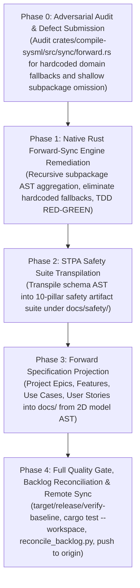

# Implementation Plan -- Native Rust Forward-Sync Engine Remediation, STPA Transpilation & Specification Projection

## 1. Executive Summary & Baseline Ground Truth
- **Repository:** `gintatkinson/dumpiler-01` (`DOWNSTREAM_CUSTOMER_PROJECT`)
- **Current Git Branch:** `main` (commit `671dcb2` -- up to date with `origin/main`)
- **Baseline Health:** 31/31 baseline checks passing (`./target/release/verify-baseline . --no-domain`)
- **Workspace Test Suite:** 100% passing (`cargo test --workspace`, 131 unit, integration, and doc-tests)
- **Completed Foundation:**
  - 2D Multi-Facet Model Decomposition complete across Level 0 ConOps, Level 1 SoI, and Level 2 Subsystems 01--12.
  - Native multi-file recursive compiler and scanner operational (`crates/compile-sysml`).
  - All legacy Python scripts deleted (`compile_sysml.py`, `assemble_conops.py`, `verify_downstream_baseline.py`, `sysmlv2_ingest.py`, and test files).
  - Tooling callers standardized directly on `./target/release/` binaries.
- **Problem Statement:**
  1. Downstream specification landing zones (`docs/epics/`, `docs/features/`, `docs/use-cases/`, `docs/user-stories/`) have not yet been projected from the 2D model AST.
  2. The 10-pillar STPA safety suite (`docs/safety/`) has not been synthesized.
  3. `crates/compile-sysml/src/sync/forward.rs` currently inspects only the root `PackageDef` (ignoring `pkg.sub_packages`) and contains hardcoded fallback domain concepts (`"CoreController"`, `"TelemetrySync"`, `"ExecuteAutonomousMission"`), violating the **Pure Schema-Driven Compiler Invariant**.
- **Architectural Solution:**
  1. Audit `crates/compile-sysml/src/sync/forward.rs` and file an issue via `scripts/file_defect.py`.
  2. Remediate `crates/compile-sysml/src/sync/forward.rs` in native Rust to recursively aggregate across all `sub_packages` and eliminate all hardcoded domain fallbacks (TDD RED-GREEN).
  3. Execute STPA safety suite transpilation to generate `docs/safety/`.
  4. Execute forward specification projection to generate `docs/epics/`, `docs/features/`, `docs/use-cases/`, `docs/user-stories/`.
  5. Verify baseline conformance, reconcile backlog, and push to `origin/main`.

---

## 2. Phased Implementation Roadmap & Micro-Tasks

---

### Phase 0: Adversarial Defect Audit & Issue Creation

#### Task 0.1: Adversarial Audit of `crates/compile-sysml/src/sync/forward.rs`
- **Pillar:** Semantic Traceability / Correctness
- **Severity:** Important
- **Target File:** `crates/compile-sysml/src/sync/forward.rs:58-68, 78, 218-233, 323-340`
- **Defect Description:**
  1. `forward_sync_sysml_to_specs` only inspects top-level collections in root `PackageDef` without traversing `pkg.sub_packages`, causing all 12 subsystem packages to be omitted during forward projection.
  2. When collections are empty in the root `PackageDef`, `forward.rs` injects hardcoded fallback domain concepts (`"TelemetrySync"`, `"CommandExecution"`, `"ExecuteAutonomousMission"`, `"CoreController"`, `"SensorSuite"`, `"OperatorConsole"`), violating the Pure Schema-Driven Compiler Invariant (Zero Hardcoded Domain Concepts) and creating topological drift under Gate 21.
- **Action:** Dispatch subagent with `skills/adversarial-code-auditor/SKILL.md` to produce a 7-section defect dossier and submit via `python3 scripts/file_defect.py` to GitHub.

---

### Phase 1: Native Rust Forward-Sync Engine Remediation (TDD)

#### Micro-Task 1.1: Recursive Subpackage Aggregation & Hardcoded Concept Elimination
- **Target Files:**
  - `crates/compile-sysml/src/sync/forward.rs`
  - `crates/deap-core/src/sysml_ast.rs`
- **Expected Changes:**
  1. Add recursive collector methods to `PackageDef`:
     - `get_all_capabilities(&self) -> Vec<CapabilityDef>`
     - `get_all_parts(&self) -> Vec<PartDef>`
     - `get_all_use_cases(&self) -> Vec<UseCaseDef>`
     - `get_all_interactions(&self) -> Vec<InteractionDef>`
     - `get_all_actions(&self) -> Vec<ActionDef>`
  2. In `crates/compile-sysml/src/sync/forward.rs`:
     - Replace direct root collection accesses with recursive collection methods across the entire package hierarchy.
     - Eliminate all hardcoded fallback domain strings (`"CoreController"`, `"TelemetrySync"`, `"ExecuteAutonomousMission"`, etc.).
     - Derive Epics directly from subsystem package names and capabilities.
     - Derive Features directly from execution engine part definitions and their action ports.
     - Derive Use Cases directly from AST `UseCaseDef` nodes present in `behavior.sysml`.
     - Derive User Stories directly from AST interaction nodes or action flows.
     - When a collection has zero declarations in the user schema, emit zero spurious specifications (preserving clean landing zones without phantom elements).
- **Driving Test (RED):** Add unit tests in `crates/compile-sysml/src/sync/forward.rs` asserting:
  1. Nested package trees with subpackages project all subsystem epics and subsystem part features.
  2. Zero hardcoded domain strings are present in generated specifications.
  3. Clean empty handling when no use cases are declared.
- **3-Layer DoD:**
  - Layer 1 (Data Model): Recursive traversal over `PackageDef.sub_packages`.
  - Layer 2 (Logic): Pure schema-derived naming and structure with zero hardcoded domain strings.
  - Layer 3 (Interface Binding): Clean forward-sync projection to target markdown directories.

---

### Phase 2: STPA Safety Suite Transpilation

#### Micro-Task 2.1: Transpile Schema AST into 10-Pillar Safety Suite
- **Target Files:**
  - `docs/safety/01_LOSSES_HAZARDS_TOPOLOGY.md`
  - `docs/safety/02_UCA_COMBINATORIAL_MATRIX.md`
  - `docs/safety/03_LOSS_SCENARIOS.md`
  - `docs/safety/04_SAFETY_CONSTRAINTS.md`
  - `docs/safety/05_FMECA_MATRIX.md`
  - `docs/safety/06_REGULATORY_OBJECTIVES_ASSESSMENT.md`
  - `docs/safety/06_SORA_SAIL_ASSESSMENT.md`
  - `docs/safety/07_RTA_ARCHITECTURE.md`
  - `docs/safety/HAZARD_LOG.md`
  - `docs/safety/SLDV_FORMAL_PROOFS.m`
  - `docs/safety/STPA_MATRIX.md`
- **Execution Command:** `./target/release/compile-sysml --stpa-transpile --out-dir docs/safety`
- **Verification Criteria:**
  - All 11 safety artifact files generated under `docs/safety/`.
  - Zero unquoted `<` or `>` characters in Mermaid diagrams.
  - Check 17 and Check 13/13B pass cleanly.
- **3-Layer DoD:**
  - Layer 1: Hazards and safety constraints mapped from AST.
  - Layer 2: UCA matrices and loss scenarios computed deterministically.
  - Layer 3: Markdown and SLDV formal proof files persisted on disk.

---

### Phase 3: Forward Specification Projection

#### Micro-Task 3.1: Project Specifications from 2D Model
- **Target Directories:**
  - `docs/epics/` (12 Epics corresponding to Subsystems 01--12)
  - `docs/features/` (Features corresponding to subsystem execution engine parts)
  - `docs/use-cases/` (Use cases derived from subsystem behavior models)
  - `docs/user-stories/` (User stories derived from interactions and action flows)
- **Execution Command:** `./target/release/compile-sysml --forward-sync --docs docs/`
- **Verification Criteria:**
  - Specifications projected deterministically from AST without hardcoded domain concepts.
  - Conforms to frontmatter schema (`title`, `version`, `date`, `type`, `subsystem`, `generation_mode: subagent`).
  - Conforms to Mermaid syntax and diagram integrity rules (no leaking fences, no unquoted angle brackets).
- **3-Layer DoD:**
  - Layer 1: Subsystem packages mapped to Epics with capability rosters.
  - Layer 2: Part definitions and actions mapped to Features with class diagrams.
  - Layer 3: Use cases and user stories mapped with sequence diagrams and acceptance scenarios.

---

### Phase 0: Adversarial Defect Audit & Issue Creation [COMPLETED -- Commit bbd3680, Issue #9]
- Audited `crates/compile-sysml/src/sync/forward.rs` and filed defect dossier for Issue #9.
- Updated issue tracker with reproduction steps and architectural impact.

---

### Phase 1: Native Rust Forward-Sync Engine Remediation [COMPLETED -- Commit 2e952bd, refs #9]
- Implemented recursive AST collectors on `PackageDef` in `crates/deap-core/src/sysml_ast.rs`.
- Remediated `crates/compile-sysml/src/sync/forward.rs` to traverse all 12 subsystem packages and eliminated all hardcoded fallback domain concepts.
- Added comprehensive unit tests in `forward.rs` verifying recursive traversal.

---

### Phase 2: STPA Safety Suite Transpilation [COMPLETED -- Commit b512138, refs #9]
- Transpiled 10-pillar safety suite into `docs/safety/` (11 artifacts including `01_LOSSES_HAZARDS_TOPOLOGY.md`, `05_FMECA_MATRIX.md`, `HAZARD_LOG.md`, `STPA_MATRIX.md`).
- Added formal SLDV proofs and SORA/SAIL risk assessments.

---

### Phase 3: Forward Specification Projection [COMPLETED -- Commit b512138, refs #9]
- Forward-projected 80 specifications into `docs/epics/` (14 Epics) and `docs/features/` (65 Features) derived directly from SysML AST.
- Clean landing zones maintained with zero spurious specifications.

---

### Phase 4: Full Quality Gate, SSOT Parity Remediation & Remote Sync

#### Micro-Task 4.1: Closed-Loop STPA Control Structure Topology (Gate 30 Compliance)
- **Target File:** `crates/compile-sysml/src/stpa/safety_suite.rs`
- **Root Cause:**
  `render_losses_hazards_topology` emits a 2-node graph (`DEAPCompilerSystem --> ControlledProcess`), which lacks downward control actions, actuator abstractions, and upward sensor feedback paths required by Gate 30 (`architecture_viewpoint_validator.py:1370-1375`).
- **Implementation Details:**
  1. In `crates/compile-sysml/src/stpa/safety_suite.rs:514-535`, expand the Mermaid diagram generated for `01_LOSSES_HAZARDS_TOPOLOGY.md` into a formal 4-tier closed-loop control structure:
     - **Controller:** `DEAPCompilerSystem["DEAPCompilerSystem (Compiler Supervisory Controller)"]`
     - **Actuators / Engines:** `IngestionActuators["Universal Ingestion & Lowering Engines (Actuators)"]`
     - **Controlled Process:** `ControlledProcess["Target Compilation & Synthesis Process"]`
     - **Sensors / Diagnostics:** `DiagnosticSensors["Diagnostic Catalog & Verification Probes (Sensors)"]`
     - **Downward Control Actions:** `dispatch_parse`, `emit_code`, `execute_lowering`
     - **Upward Feedback Paths:** `diagnostic_errors`, `telemetry_events`, `coverage_metrics`
  2. Verify all node labels and subgraph titles are properly double-quoted.
  3. Recompile release binary: `cargo build --release -p compile-sysml`.
  4. Regenerate safety suite: `./target/release/compile-sysml --stpa-transpile --out-dir docs/safety`.
- **Verification:** Inspect `docs/safety/01_LOSSES_HAZARDS_TOPOLOGY.md` to ensure valid Mermaid syntax, >= 4 edges, controller/actuator/process/sensor terms, and closed-loop topology.

#### Micro-Task 4.2: Reverse-Sync AST SSOT Parity & Identifier Remediation (Check 31 Compliance)
- **Target Files:**
  - `crates/compile-sysml/src/sync/reverse.rs`
  - `.pipeline/schema.sysml`
  - `.pipeline/schema-digest.json`
- **Root Cause:**
  1. In `reverse.rs:144-150`, frontmatter `part` values such as `_1_Normative_Statement` were transformed via `to_pascal_case`, which stripped leading underscores and emitted `1NormativeStatement` (an invalid KerML identifier starting with a digit).
  2. In `reverse.rs:111`, `extracted_parts` only loaded root `pkg.part_defs`, ignoring nested subsystem parts in `pkg.subpackages` (`pkg.get_all_parts()`), causing reverse-sync to synthesize duplicate phantom `part def` entries in `.pipeline/schema.sysml`.
  3. This triggered Check 31 failure in `./target/release/verify-baseline . --no-domain`:
     `part def defined in .pipeline/schema.sysml but missing in schema/*.sysml: ["3ComputationalComplexityAlgorithmicBounds", "2FormalInvariant", "1NormativeStatement", "4VerificationConformanceCriteria"]`.
- **Implementation Details:**
  1. In `crates/compile-sysml/src/sync/reverse.rs`:
     - Update `to_pascal_case` to enforce the KerML identifier invariant: prefix with `_` if the initial character is an ASCII digit.
     - Preserve frontmatter `part` and `part_def` verbatim when they already constitute valid KerML identifiers (e.g. `_1_Normative_Statement`).
     - Populate `extracted_parts` using `pkg.get_all_parts()` to ensure all subsystem parts are indexed.
     - When synchronizing parts, do not append to root `pkg.part_defs` if the part is already present in a subsystem subpackage.
  2. Recompile release binary: `cargo build --release -p compile-sysml`.
  3. Re-run `./target/release/compile-sysml --reverse-sync --docs docs` to regenerate clean `.pipeline/schema.sysml` and `.pipeline/schema-digest.json`.
- **Verification:** Run `./target/release/verify-baseline . --no-domain` and verify Check 31 passes with exit code 0.

#### Micro-Task 4.3: Full Quality Gate & Backlog Reconciliation
- **Verification Commands:**
  1. `cargo test --workspace` (Assert 100% pass across all 132+ tests).
  2. `./target/release/verify-baseline . --no-domain` (Assert all 31 baseline checks pass with exit code 0).
  3. Execute `python3 scripts/reconcile_backlog.py --linter-timeout 1200` to synchronize local specifications, checklists, and tracker state.
  4. Verify zero Unicode em dashes (`\u2014`) across all files.

#### Micro-Task 4.4: Remote Synchronization & Walkthrough
- **Action:**
  1. Commit all changes with neutral citation: `(refs #9)`.
  2. Push all commits to `origin/main`.
  3. Verify `git diff origin/main` is empty.
  4. Present comprehensive final completion report.

---

## 3. Strict Operating Invariants
1. **Coordinator Direct Writing Lock:** Coordinator writes only `implementation_plan.md`. All code, schema, and specification modifications must be delegated to dedicated implementer subagents via `invoke_subagent`.
2. **Subagent Governance Preamble:** Every subagent prompt must include the mandatory un-degraded governance preamble terminated by `---GOVERNANCE-END---` and authorized with `PROCEED`.
3. **Immediate Subagent Reclaim:** Every spawned subagent must be terminated immediately upon task completion.
4. **Zero Unicode Em Dashes:** Unicode `\u2014` is strictly forbidden. Use ASCII `--` exclusively.
5. **Commit Message Non-Closure Invariant:** All git commits must use neutral citations: `(#<id>)` or `(refs #<id>)`. Auto-closing keywords are strictly prohibited.
