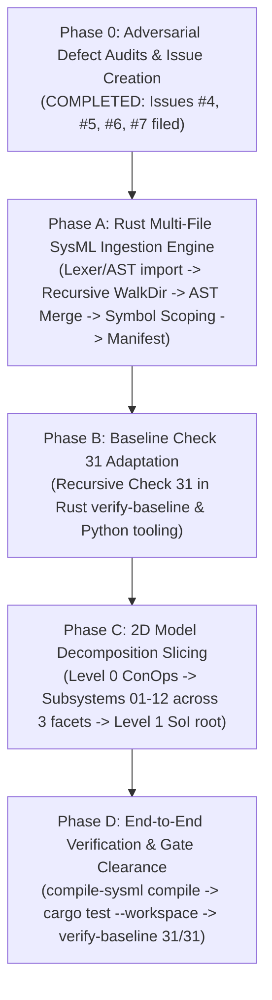

# Implementation Plan -- Multi-File SysML v2 AST Ingestion & 2D Model Decomposition

## 1. Executive Summary & Baseline Ground Truth
- **Repository:** `gintatkinson/dumpiler-01` (`DOWNSTREAM_CUSTOMER_PROJECT`)
- **Current Git Branch:** `main` (commit `7fc2c3d` -- up to date with `origin/main`)
- **Baseline Health:** 31/31 baseline checks passing (`./target/release/verify-baseline . --no-domain`)
- **Workspace Test Suite:** 100% passing (`cargo test --workspace`, 84+ unit and integration tests)
- **Completed Foundation:**
  - Feature 1 (`69968a6`, refs #1 / #425): In-place requirement acceptance criteria attributes.
  - Feature 2 (`482aef4`, refs #2 / #426): AST invariant lowering, derivations (`derived from`), and assertions.
  - Feature 3 (`7fc2c3d`, refs #3 / #427): Encapsulated formal invariant constraints directly within requirement definitions (0 package-root standalone constraints).
- **Adversarial Defect Dossiers Filed:**
  - Issue #4: `[AUDIT] [main.rs]: Shallow Directory Ingestion in find_sysml_in_dir Drops Subdirectories and Sibling Schema Files` (refs #4)
  - Issue #5: `[AUDIT] [scanner.rs]: Nested Block Comment Truncation and Unrestricted Name Misclassification` (refs #5)
  - Issue #6: `[AUDIT] [grammar.rs]: Parser rejects connect keyword in connection declarations breaking semantic traceability` (refs #6)
  - Issue #7: `[AUDIT] [parity_gates.rs]: Silent I/O Error Suppression and Phantom Entry Ingestion in discover_sysml_model_text` (refs #7)
- **Core Problem Statement:** The active model in `schema/model.sysml` is currently a monolithic file of 5,556 lines containing 12 compiler subsystems, 199+ requirements, execution engines, and connectors.
- **Architectural Solution:** Implement 2D Model Decomposition (Hierarchy: Level 0 ConOps, Level 1 System of Interest, Level 2 12 Subsystems; Process Facets: Requirements, Behavior, Architecture) enabled by multi-file recursive AST parsing and linking in the Rust compiler.

---

## 2. Architectural Blueprint: 2D Model Decomposition Matrix

```
+-------------------------------------------------------------------------------------------------+
|                                     THE 2D DECOMPOSITION MATRIX                                 |
+------------------------------------+-----------------------------+------------------------------+
| DIMENSION 1: HIERARCHY             | DIMENSION 2: PROCESS FACET  | TARGET REPOSITORY LOCATION   |
+------------------------------------+-----------------------------+------------------------------+
| Level 0: Operational ConOps        | Operational Context         | schema/conops/               |
|   (External Actors, Missions)      |                             |   actors.sysml               |
|                                    |                             |   activities.sysml           |
|                                    |                             |   threats.sysml              |
|                                    |                             |   operational_modes.sysml    |
|------------------------------------+-----------------------------+------------------------------+
| Level 1: System of Interest (SoI)  | Enclosing System Classifier | schema/model.sysml           |
|   (Top-Level System Classifier)    | Inter-Subsystem Wiring      |                              |
|------------------------------------+-----------------------------+------------------------------+
| Level 2: 12 Subsystems             | Facet 1: Requirements       | schema/subsystems/<subsys>/  |
|                                    |   (Reqs, Invariants, ACs)   |   requirements.sysml         |
|                                    | Facet 2: Behavior           |   behavior.sysml             |
|                                    |   (UseCases, States, Flows) |                              |
|                                    | Facet 3: Architecture       |   architecture.sysml         |
|                                    |   (Engines, Ports, Items)   |                              |
|------------------------------------+-----------------------------+------------------------------+
| Level 3: Internal Components       | Detailed Unit Models        | Allocated within Facet 3     |
+------------------------------------+-----------------------------+------------------------------+
```

### Anti-Pattern Elimination Rules:
1. **Zero Package-Root Standalone Constraints:** Encapsulated in-place in `requirement def` (Feature 3 invariant).
2. **Zero Detached `connections.sysml`:** All 8 inter-subsystem connections are declared inside `part def DEAPCompilerSystem` under OMG KerML Clause 8. All intra-subsystem connections reside inside subsystem execution engines.
3. **Zero Detached `traceability.sysml`:** All traceability links (`satisfy by`, `verify by`, `derived from`) are declared in-place on requirement definitions.
4. **Zero Monolithic Schema Bottlenecks:** Every decomposed file ranges between 50 and 400 lines.

---

## 3. Phased Implementation Roadmap & Micro-Tasks

Execution follows a strict, sequential 5-phase rollout where defects are audited and filed, tooling enablers are built and tested, and schemas are refactored.



---

### Phase 0: Adversarial Defect Audits & Issue Creation (COMPLETED)

- [x] **Task 0.1:** Audit `crates/compile-sysml/src/main.rs:342-357` -> Filed **Issue #4** (`[AUDIT] [main.rs]: Shallow Directory Ingestion in find_sysml_in_dir Drops Subdirectories and Sibling Schema Files`).
- [x] **Task 0.2:** Audit `crates/compile-sysml/src/lexer/scanner.rs:180-220` -> Filed **Issue #5** (`[AUDIT] [scanner.rs]: Nested Block Comment Truncation and Unrestricted Name Misclassification`).
- [x] **Task 0.3:** Audit `crates/compile-sysml/src/parser/grammar.rs:820-825` -> Filed **Issue #6** (`[AUDIT] [grammar.rs]: Parser rejects connect keyword in connection declarations breaking semantic traceability`).
- [x] **Task 0.4:** Audit `crates/verify-baseline/src/checks/parity_gates.rs:25-47` -> Filed **Issue #7** (`[AUDIT] [parity_gates.rs]: Silent I/O Error Suppression and Phantom Entry Ingestion in discover_sysml_model_text`).

---

### Phase A: Rust Multi-File SysML Ingestion Engine (TDD)

#### Micro-Task A.1: Lexer & AST Support for `import` Statements and Scanner Robustness (refs #5)
- **Target Files:**
  - `crates/deap-core/src/sysml_ast.rs`
  - `crates/compile-sysml/src/lexer/token.rs`
  - `crates/compile-sysml/src/lexer/scanner.rs`
  - `crates/compile-sysml/src/semantic/serializer.rs`
- **Expected Changes:**
  - Add `ImportDef` struct (`path: String`, `is_wildcard: bool`, `is_recursive: bool`, `doc: Option<String>`) in `deap-core::sysml_ast`.
  - Add `pub imports: Vec<ImportDef>` to `PackageDef`.
  - Add `TokenKind::Import` to `TokenKind` enum and keyword mapping for `"import"` in `Scanner`.
  - Resolve Issue #5: Support nested block comments (`/* ... /* ... */ ... */`) and single-quoted unrestricted names (`'Flight Control Computer'`) in `Scanner`.
  - Implement serializer output for `import` statements in `to_sysml`.
- **Driving Test (RED):** Unit test `test_lexer_tokenizes_import_statement` and `test_lexer_nested_comments_and_unrestricted_names` in `crates/compile-sysml/src/lexer/scanner.rs`.
- **Verification:** `cargo test -p compile-sysml test_lexer_tokenizes_import_statement`.
- **3-Layer DoD:**
  - Layer 1 (Data Model): `ImportDef` struct and `PackageDef.imports` collection.
  - Layer 2 (Logic): Scanner keyword matching, nested comment depth tracking, and token emission.
  - Layer 3 (Interface Binding): AST serialization roundtrip in `to_sysml`.

#### Micro-Task A.2: Parser Support for `import` Declarations & Inline Connectors (refs #6)
- **Target Files:**
  - `crates/compile-sysml/src/parser/grammar.rs`
- **Expected Changes:**
  - Implement `parse_import_decl` supporting `import Foo::*;`, `import Foo::Bar::*;`, and `import Foo::Bar;`.
  - Resolve Issue #6: Fix `parse_container_item` to parse inline connectors using `connect <source> to <target>;` inside `part def` without demanding `TokenKind::Connection`.
  - Allow parsing multiple top-level packages per compilation unit.
- **Driving Test (RED):** Unit test `test_parse_import_declarations_and_inline_connectors`.
- **Verification:** `cargo test -p compile-sysml test_parse_import_declarations`.
- **3-Layer DoD:**
  - Layer 1 (Data Model): Parsed `ImportDef` and `ConnectionDef` attached to parent AST nodes.
  - Layer 2 (Logic): Recursive descent path parsing, semicolon enforcement, and connector endpoint binding.
  - Layer 3 (Interface Binding): Serializer roundtrip via `SysmlSerializable`.

#### Micro-Task A.3: Recursive File Discovery & Multi-File Package Merging (refs #4)
- **Target Files:**
  - `crates/compile-sysml/src/main.rs`
  - `crates/compile-sysml/src/parser/grammar.rs`
  - `crates/compile-sysml/src/lib.rs`
- **Expected Changes:**
  - Resolve Issue #4: Replace `find_sysml_in_dir` with recursive `discover_sysml_files` using `walkdir::WalkDir`.
  - Implement `merge_package_defs(&mut PackageDef, PackageDef)` to merge packages with matching names and nest subpackages deterministically.
  - Expose `parse_sysml_tree(root_dir: &Path) -> Result<PackageDef, ParseError>`.
- **Driving Test (RED):** Integration test `test_parse_multi_file_sysml_tree` with temporary directory containing multiple `.sysml` files in nested folders.
- **Verification:** `cargo test -p compile-sysml test_parse_multi_file_sysml_tree`.
- **3-Layer DoD:**
  - Layer 1 (Data Model): Unified merged `PackageDef` tree.
  - Layer 2 (Logic): Deterministic lexicographical discovery and recursive package merging.
  - Layer 3 (Interface Binding): CLI entrypoint `--compile` accepting directory paths.

#### Micro-Task A.4: Cross-Package Symbol Table Resolution with `import` Scoping
- **Target Files:**
  - `crates/compile-sysml/src/semantic/symbols.rs`
  - `crates/compile-sysml/src/semantic/validator.rs`
- **Expected Changes:**
  - Index package `imports` in `SymbolTable`.
  - Update `lookup_in_scope` to resolve symbols through wildcard and explicit package imports.
  - Emit diagnostic warnings/errors for ambiguous import collisions (satisfying REQ-0056).
- **Driving Test (RED):** Unit test `test_symbol_table_cross_package_import_lookup`.
- **Verification:** `cargo test -p compile-sysml test_symbol_table_cross_package`.
- **3-Layer DoD:**
  - Layer 1 (Data Model): Symbol entries with origin package tags.
  - Layer 2 (Logic): Two-stage scope resolution (local shadow -> imported namespace -> global fallback).
  - Layer 3 (Interface Binding): `SemanticDiagnostic` emission on unresolved or colliding references.

#### Micro-Task A.5: Multi-File Schema Digest Manifest Recording (REQ-0032)
- **Target Files:**
  - `crates/compile-sysml/src/semantic/digest.rs`
- **Expected Changes:**
  - Add `FileDigestEntry` (`path: String`, `sha256: String`, `bytes: u64`, `lines: usize`, `entities: usize`) and `file_manifest: Vec<FileDigestEntry>` to `SchemaDigest`.
  - Populate manifest for each discovered source file during multi-file compilation.
- **Driving Test (RED):** Unit test `test_schema_digest_multi_file_manifest`.
- **Verification:** `cargo test -p compile-sysml test_schema_digest_multi_file_manifest`.
- **3-Layer DoD:**
  - Layer 1 (Data Model): `FileDigestEntry` JSON serialization.
  - Layer 2 (Logic): File-by-file SHA-256 calculation and entity counting.
  - Layer 3 (Interface Binding): Atomically persisted `.pipeline/schema-digest.json`.

---

### Phase B: Baseline Check 31 Adaptation (TDD) (refs #7)

#### Micro-Task B.1: Recursive Schema Discovery for Check 31 in `verify-baseline` (refs #7)
- **Target Files:**
  - `crates/verify-baseline/src/checks/parity_gates.rs`
- **Expected Changes:**
  - Resolve Issue #7: Update `discover_sysml_model_text` and `check_dual_schema_ssot_parity` in `crates/verify-baseline` to traverse `schema/` recursively using `walkdir::WalkDir`.
  - Handle I/O errors explicitly rather than dropping them silently.
  - Filter out hidden/non-regular files.
  - Concatenate all discovered `.sysml` files in sorted order before regex definition extraction.
- **Driving Test (RED):** Unit test `test_dual_schema_parity_multi_file_passes`.
- **Verification:** `cargo test -p verify-baseline test_dual_schema_parity_multi_file`.
- **3-Layer DoD:**
  - Layer 1 (Data Model): In-memory concatenated multi-file model text.
  - Layer 2 (Logic): Set equality between parsed AST definitions (`part def`, `port def`, `action def`).
  - Layer 3 (Interface Binding): `ParityOutcome::DualSchemaIdentical` exit status.

#### Micro-Task B.2: Parity Gate Alignment in Python Tooling (COMPLETED)
- **Target Files:**
  - `scripts/verify_downstream_baseline.py`
  - `scripts/compile_sysml.py`
- **Expected Changes:**
  - Update `discover_sysml_model` and `check_dual_schema_ssot_parity` in `scripts/verify_downstream_baseline.py` to use recursive globbing (`schema/**/*.sysml`).
- **Driving Test:** Run `./target/release/verify-baseline . --no-domain`.
- **Verification:** Exit code 0 on Check 31.
- **3-Layer DoD:**
  - Layer 1 (Data Model): Python AST dictionary representation.
  - Layer 2 (Logic): Recursive traversal and parity comparison.
  - Layer 3 (Interface Binding): CLI report output.

---

### Phase C: 2D Model Decomposition Slicing (Serial Execution)

#### Micro-Task C.1: Level 0 ConOps Schema Construction (`schema/conops/`)
- **Target Files:**
  - `schema/conops/actors.sysml`
  - `schema/conops/activities.sysml`
  - `schema/conops/threats.sysml`
  - `schema/conops/operational_modes.sysml`
- **Expected Changes:**
  - Define operational performers, activities (`OA-01`..`OA-12`), 9-domain threat matrices, and operational lifecycle modes.
- **Verification:** `cargo run -p compile-sysml -- --schema schema/conops/ --compile` parses cleanly.
- **3-Layer DoD:**
  - Layer 1: ConOps AST definitions (`package ConOps`).
  - Layer 2: Activity and mode transition logic.
  - Layer 3: System-level actor bindings.

#### Micro-Task C.2: Slicing Subsystems 01 through 04
- **Target Directories:**
  - `schema/subsystems/subsystem_01_system_vision/`
  - `schema/subsystems/subsystem_02_universal_schema_ingestion_engine/`
  - `schema/subsystems/subsystem_03_core_metamodel_node_arena/`
  - `schema/subsystems/subsystem_04_complete_sysmlv2_kerml_grammar/`
- **Expected Changes:**
  - Create `requirements.sysml`, `behavior.sysml`, and `architecture.sysml` for Subsystems 01 through 04.
  - Extract requirements (REQ-0001 through REQ-0083) with encapsulated invariants and in-place traceability (`satisfy by`, `verify by`, `derived from`).
- **Verification:** `cargo test --workspace` passes.
- **3-Layer DoD:**
  - Layer 1: Requirements with encapsulated constraints.
  - Layer 2: Use cases, statecharts, and action flows.
  - Layer 3: Execution engine part defs and ports.

#### Micro-Task C.3: Slicing Subsystems 05 through 08
- **Target Directories:**
  - `schema/subsystems/subsystem_05_7d_physical_metrology_flow_networks/`
  - `schema/subsystems/subsystem_06_spatio_temporal_state_solvers/`
  - `schema/subsystems/subsystem_07_formal_safety_traceability_verification/`
  - `schema/subsystems/subsystem_08_level_1c_icd_interconnect_contracts/`
- **Expected Changes:**
  - Create `requirements.sysml`, `behavior.sysml`, and `architecture.sysml` for Subsystems 05 through 08.
  - Extract requirements (REQ-0084 through REQ-0163).
- **Verification:** `cargo test --workspace` passes.
- **3-Layer DoD:**
  - Layer 1: Requirements with encapsulated constraints.
  - Layer 2: Use cases, statecharts, and action flows.
  - Layer 3: Execution engine part defs and ports.

#### Micro-Task C.4: Slicing Subsystems 09 through 12
- **Target Directories:**
  - `schema/subsystems/subsystem_09_downstream_specification_projections/`
  - `schema/subsystems/subsystem_10_multi_target_codegen_simulation_bindings/`
  - `schema/subsystems/subsystem_11_standardized_diagnostic_error_catalog/`
  - `schema/subsystems/subsystem_12_compiler_performance_cli_assurance/`
- **Expected Changes:**
  - Create `requirements.sysml`, `behavior.sysml`, and `architecture.sysml` for Subsystems 09 through 12.
  - Extract requirements (REQ-0164 through REQ-0199).
- **Verification:** `cargo test --workspace` passes.
- **3-Layer DoD:**
  - Layer 1: Requirements with encapsulated constraints.
  - Layer 2: Use cases, statecharts, and action flows.
  - Layer 3: Execution engine part defs and ports.

#### Micro-Task C.5: Level 1 System of Interest Refactoring in `schema/model.sysml`
- **Target Files:**
  - `schema/model.sysml`
- **Expected Changes:**
  - Refactor `schema/model.sysml` to declare `package DEAP_Compiler_System`.
  - Import all 12 subsystem packages (`import Subsystem_X_*::*;`).
  - Declare `part def DEAPCompilerSystem` instantiating all 12 subsystem parts.
  - Bind all 8 inter-subsystem connectors inside `part def DEAPCompilerSystem` (KerML Clause 8 compliant).
  - Remove all package-root standalone `connection def` blocks.
- **Verification:** `cargo run -p compile-sysml -- --compile` compiles multi-file `schema/` cleanly.
- **3-Layer DoD:**
  - Layer 1: System-level enclosing package and imports.
  - Layer 2: System-level part usages.
  - Layer 3: Enclosed inter-subsystem connectors.

---

### Phase D: End-to-End Compilation & Baseline Verification

#### Micro-Task D.1: Full Multi-File SysML Compilation
- **Target Files:**
  - `.pipeline/schema.sysml`
  - `.pipeline/schema-digest.json`
- **Action:** Execute `./target/release/compile-sysml --compile`.
- **Acceptance Criteria:**
  - Clean exit code 0.
  - Output `.pipeline/schema.sysml` generated with 0 syntax or semantic errors.
  - Output `.pipeline/schema-digest.json` updated with full node counts, multi-file manifest, and SHA-256.

#### Micro-Task D.2: Full Workspace Test Suite Execution
- **Action:** Run `cargo test --workspace`.
- **Acceptance Criteria:** 100% of unit, integration, and doc-tests pass across all crates.

#### Micro-Task D.3: Baseline Parity Gate Verification
- **Action:** Run `./target/release/verify-baseline . --no-domain`.
- **Acceptance Criteria:**
  - All 31 checks pass with code 0.
  - Check 31 verifies Dual-Schema SSOT Parity between multi-file `schema/` and `.pipeline/schema.sysml`.

---

## 4. Strict Operating Invariants
1. **Coordinator Direct Writing Lock:** Coordinator writes only `implementation_plan.md`. All code, schema, and specification modifications must be delegated to dedicated implementer subagents via `invoke_subagent`.
2. **Subagent Governance Preamble:** Every subagent prompt must include the mandatory un-degraded governance preamble terminated by `---GOVERNANCE-END---` and authorized with `PROCEED`.
3. **Immediate Subagent Reclaim:** Every spawned subagent must be terminated immediately upon task completion.
4. **Zero Unicode Em Dashes:** Unicode `\u2014` is strictly forbidden. Use ASCII `--` exclusively.
5. **Commit Message Non-Closure Invariant:** All git commits must use neutral citations: `(#<id>)` or `(refs #<id>)`. Auto-closing keywords are strictly prohibited.
