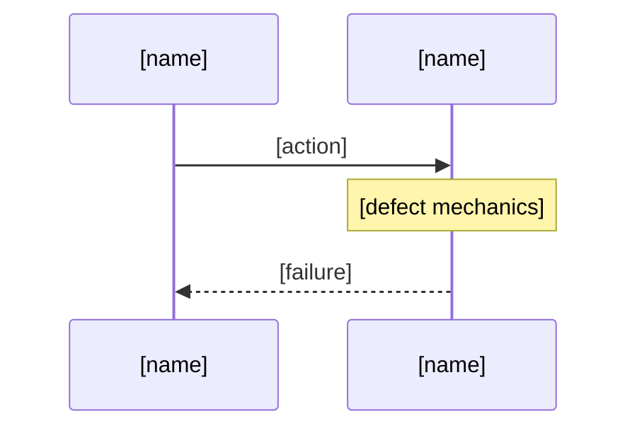
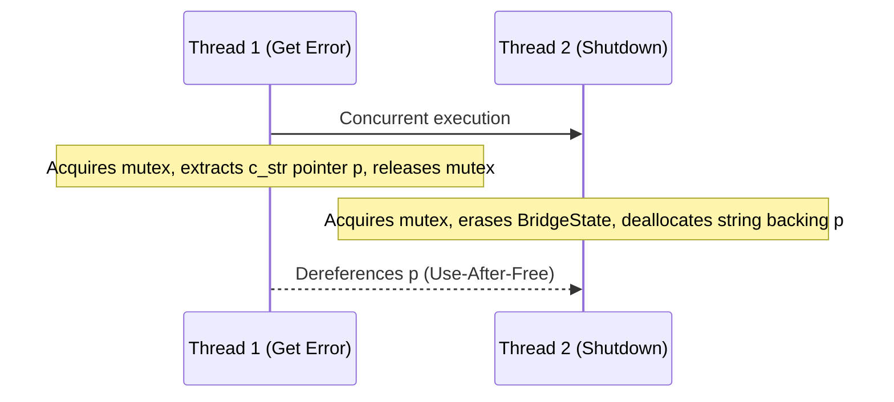

# Adversarial Code Auditor

## 1. Reference

### 1.1 Architecture

Subagent receives: file path, pillar name, mode, repo name. Subagent reads this file, audits the target file, produces compliant output, self-verifies, files via issue tracker (using `gh issue create --body-file` on GitHub, or `glab issue create` / direct REST API v4 on GitLab), returns URLs. Coordinator collects URLs. Coordinator never touches body text.

### 1.2 When to Use

5+ open bugs in related files form a cluster. User provides file paths. Single runtime bugs → `debug-protocol`. Spec gaps → `spec-implementation-auditor`.

### 1.3 Pillars

| Pillar | Focus |
| --- | --- |
| Memory Safety | UAF, double-free, dangling pointers, buffer overflow, signed/unsigned wrap, C++ exception across FFI, NativeFinalizer, mutex/pointer lifetime |
| Resource Lifecycle | Missing dispose(), cache eviction, sync I/O on UI thread, GC churn, socket leaks, HTTP timeouts, GPU overdraw |
| Concurrency | ChangeNotifier post-disposal, async races, state mutation in build(), re-entrant async, missing _disposed, TOCTOU |
| Test Integrity | FFI/DB-dependent tests, sleep loops, bare assert(), missing testWidgets, duplicated fakes, flaky assertions |
| Semantic Traceability | Test assertions mapped to defect invariants from issue body. Tests that pass without exercising the reported symptom. Tests whose assertions don't match the invariants violated. |

### 1.4 Severity

| Severity | Rule |
| --- | --- |
| Critical | Crash, corruption, or resource leak from code paths reachable by current callers. |
| Important | Wrong behavior, degradation under load, correctness risk in edge cases. |
| Suggestion | Forward-looking risk, missing guard for future code, test gap, dead code. NOT a current bug. |
| Nitpick | Style, naming. No correctness impact. |

Constraints: "No validation" is false if any guard exists. Read code before claiming absence. Stubs that cannot throw have no exception risk. Forward-looking = Suggestion.

### 1.5 UML

Critical and Important findings require a Mermaid diagram in Section 4. Select type:

* UAF, double-free, dangling pointer: `sequenceDiagram`
* Exception crossing FFI: `sequenceDiagram`
* Buffer overflow, signed wrap: `classDiagram`
* Missing dispose, leak on error path: `sequenceDiagram`
* Cache eviction, LRU violation: `stateDiagram-v2`
* ChangeNotifier post-disposal: `sequenceDiagram`
* TOCTOU, async race: `sequenceDiagram`
* FFI-dependent test, missing mock: `classDiagram`

Must use Mermaid fenced blocks (```` ```mermaid ````) with valid syntax. No ASCII art. Named lifelines. `alt/loop` fragments for branches. No isolated classes. `stateDiagram-v2` syntax. Trace to file:line from Section 3.

**All Mermaid syntax constraints are defined in `rules/platform-independence.md` and MUST be observed in full.** Most importantly here: no semicolons in `Note` statements or message text, and no curly braces in class member lines. Step D check 7 enforces these mechanically.

### 1.6 Governance & Invariants

- **Commit Message Non-Closure Invariant**: Agents and automated scripts are strictly prohibited from using issue auto-closing keywords (`fix`, `fixes`, `fixed`, `close`, `closes`, `closed`, `resolve`, `resolves`, `resolved` preceding `#<id>`) in git commit messages. All commit messages referencing issues MUST use neutral citations: `(#<id>)` or `(refs #<id>)` to prevent server-side premature auto-closure (`.pipeline/constitution.md:266`, `rules/tracker-source-of-truth.md`).

## 2. Output Format

Every finding MUST produce output matching this skeleton character-for-character in section headers and field labels. Replace `[...]` placeholders with real content. Do not change the structure.

## 1. Context and References

<!-- test-target: [path/to/reproducer_test.py] -->

- **File**: `[path]:[line-line]`
- **Pillar**: [Memory Safety | Resource Lifecycle | Concurrency | Test Integrity | Semantic Traceability]
- **Symptom**: [description]
- **Test-Target**: `[path/to/reproducer_test.py]`

## 2. Root Cause Analysis (5 Whys)

1. **Why [symptom]?** Because [reason].
2. **Why [reason]?** Because [deeper].
3. **Why [deeper]?** Because [deeper still].
4. **Why [deeper still]?** Because [design cause].
5. **Why [design cause]?** Because [root cause].

## 3. Correctness Analysis

[Trace data flow from trigger to failure. Name the invariant violated. Cite file:line references.]

## 4. UML Diagrams

[MANDATORY for Critical/Important. For Suggestion/Nitpick: "N/A -- [severity] severity."]



## 5. Affected Callers / Downstream Impact

[caller] -- [how affected]

## 6. Proposed Correction

```[language]
[code]

```

## 7. Relationship to Existing Issues

Discovered in audit -- new finding.

## Audit Source

Adversarial [Pillar] Audit
SEVERITY: [Critical | Important | Suggestion | Nitpick]
FILE_LOCATION: [path]:[line-line]

## 3. Protocol

Subagents follow these steps in order. No deviation.

### Step A -- Read

1. Read this skill file in full.
2. Read `[FILE_PATH]`.
3. Read `.pipeline/constitution.md`.
4. For Dart files, read `.pipeline/profiles/flutter.md`.

### Step B -- Audit

1. Scan every line of `[FILE_PATH]` through the `[PILLAR]` focus.
2. For each potential defect, answer:
* What exact `file:line` range contains the defect?
* Is it reachable from current callers? (Critical) or future-only? (Suggestion)
* Does the code already have a guard? If yes, acknowledge it.
* Is it a stub that cannot throw or allocate? If yes, do not flag.


3. Classify severity using Section 1.4.
4. If Critical or Important, select diagram type from Section 1.5.

### Step C -- Write

1. For EVERY finding, produce one issue body.
2. Copy the skeleton from Section 2 exactly. Fill in `[...]` placeholders with real values.
3. Section headers and field labels must match the skeleton character-for-character.
4. Section 1: Four bullet points with bold labels (`File`, `Pillar`, `Symptom`, `Test-Target`), preceded immediately by `<!-- test-target: [path/to/reproducer_test.py] -->`. Never collapse into one line.
5. Section 2: Exactly five `[1-5]. **Why [text]?** Because [text].` lines.
6. Section 4: Valid Mermaid block (```` ```mermaid ````) (Critical/Important) or "N/A -- [severity] severity." (Suggestion/Nitpick). No ASCII art.
7. Section 6: Triple-backtick code block with language tag.
8. End with SEVERITY and FILE_LOCATION lines exactly as shown in the skeleton.
9. Identify or scaffold the test target file path (e.g. `tests/test_<name>_reproducer.py` or relevant test suite path) and annotate it in Section 1 via `<!-- test-target: [path/to/reproducer_test.py] -->` and `- **Test-Target**: `[path/to/reproducer_test.py]`` so that `scripts/reconcile_backlog.sh` (or `./target/release/reconcile-backlog`) can automatically discover and execute test targets for filed defects.

### Step D -- Verify

Before filing, run these checks on the body. All must pass.

| # | Check | How to verify |
| --- | --- | --- |
| 1 | Section headers | Count `^## [1-7]\.` must equal 7 |
| 2 | Audit Source line | Contains `## Audit Source` |
| 3 | Severity line | Matches `SEVERITY: (Critical|Important|Suggestion|Nitpick)` |
| 4 | File location line | Matches `FILE_LOCATION: [path]:[line]` |
| 5 | Section 1 bullets | Four lines matching `^[-*] \*\*(File|Pillar|Symptom|Test-Target)\*\*:` |
| 6 | Section 2 Whys | Five lines matching `^[1-5]\. \*\*Why .*\?\*\* Because .*` |
| 7 | Section 4 Critical/Important | Contains Mermaid block (```` ```mermaid ````), AND the offline syntax gate below exits 0 |
| 8 | Section 4 Suggestion/Nitpick | Contains `N/A -- ` |
| 9 | Balanced code blocks | Even number of ````` occurrences |
| 10 | No ASCII art UML | Does NOT contain unescaped `->>` or `→` outside mermaid blocks |
| 11 | Title-format | Matches `\[AUDIT\] \[[file.ext]\]: [description]` |
| 12 | Test Target annotation | Contains `<!-- test-target: [path] -->` matching `<!--\s*test-target:\s*\S+\s*-->` and valid path in `- **Test-Target**:` bullet for automated discovery by `scripts/reconcile_backlog.sh` (or `./target/release/reconcile-backlog`) |

If any check fails, fix the body and re-verify. Do NOT file until all checks pass.

**Test Target Verification**: The subagent MUST verify that the test target file path is identified or scaffolded in the repository (e.g., under `tests/`), matches the syntax parsed by `scripts/reconcile_backlog.sh` (or `./target/release/reconcile-backlog`), and is executable so that defect reconciliation runs autonomously.

**Check 7 is executable and MUST be run -- it is not an eyeball check.** Presence of a
fenced block does not establish validity. An unparseable diagram previously cleared all
eleven checks and was filed on issue #283, where GitHub reported a parse error instead of
rendering Section 4. Run:

```bash
if grep -q '```mermaid' "$BODY_FILE"; then
  # 1. Verify valid diagram header
  HEADER=$(awk '/```mermaid/{flag=1; next} /```/{flag=0} flag && !/^[[:space:]]*%%/{print; exit}' "$BODY_FILE")
  echo "$HEADER" | grep -qE '^(graph|flowchart|sequenceDiagram|classDiagram|erDiagram|stateDiagram)' || {
    echo "check 7 FAILED: Invalid Mermaid diagram header: $HEADER" >&2
    exit 1
  }
  # 2. Verify even number of fences
  FENCE_COUNT=$(grep -c '```' "$BODY_FILE" || true)
  if [ $((FENCE_COUNT % 2)) -ne 0 ]; then
    echo "check 7 FAILED: Uneven number of code fences ($FENCE_COUNT)" >&2
    exit 1
  fi
fi
echo "check 7 passed"
```

The gate is **offline by mandate**. Do NOT substitute a remote renderer: a blocking gate
that depends on a third-party service fails when that service is unavailable or
rate-limits, and it ships specification content to a third party. See
`.pipeline/upstream/pipeline-tooling.md` § *Validation Gates*.

Scope limit: this enforces the documented rules in `rules/platform-independence.md`. It is
not a full Mermaid grammar parser, so a pass is not proof the diagram renders.

### Step E -- File

1. Write the verified body to a dynamically named temporary file (e.g., `/tmp/gh_body_$(uuidgen).md` or `/tmp/gl_body_$(uuidgen).md`) to prevent parallel execution collisions.
2. Resolve `[LABEL]` from the severity assigned in Section 1.4. This mapping is mandatory:

   | Severity | GitHub `[LABEL]` | GitLab Scoped `[LABEL]` |
   | --- | --- | --- |
   | Critical | `bug` | `type::bug` |
   | Important | `bug` | `type::bug` |
   | Suggestion | `enhancement` | `type::feature` |
   | Nitpick | `enhancement` | `type::feature` |

   Section 1.4 defines Suggestion as forward-looking risk that is explicitly **NOT a current bug**. Filing such a finding as `bug` places it in the selection set of `debug-protocol`, whose Step 0 then forbids processing it -- deadlocking that loop. See issue #287.
3. File the issue based on the provider environment:
   - **GitHub (`gh` CLI)**:
     ```bash
     gh issue create --repo [REPO] --title "[AUDIT] [file.ext]: [description]" --label "[LABEL]" --body-file /tmp/gh_body_[ID].md
     ```
   - **GitLab (`glab` CLI)**: When running in GitLab environments with `glab` CLI available:
     ```bash
     glab issue create --repo [REPO] --title "[AUDIT] [file.ext]: [description]" --label "[LABEL]" --description "$(< /tmp/gl_body_[ID].md)"
     ```
   - **GitLab (Direct REST API v4 / curl)**: In containerized or air-gapped GitLab CI environments where `glab` CLI is unavailable, file via `scripts/file_defect.sh` or direct REST API v4 using `curl`:
     ```bash
     SERVER_URL="${GITLAB_URL:-${CI_SERVER_URL:-https://gitlab.com}}"
     PROJECT_ID=$(echo "${CI_PROJECT_PATH:-[REPO]}" | sed 's/\//%2F/g')
     TOKEN="${GITLAB_TOKEN:-${GL_TOKEN:-$CI_JOB_TOKEN}}"
     curl -s --request POST "${SERVER_URL%/}/api/v4/projects/${PROJECT_ID}/issues" \
       --header "PRIVATE-TOKEN: ${TOKEN}" \
       --header "Content-Type: application/json" \
       --data "{\"title\": \"[AUDIT] [file.ext]: [description]\", \"description\": $(jq -Rs . < /tmp/gl_body_[ID].md 2>/dev/null || cat /tmp/gl_body_[ID].md), \"labels\": \"[LABEL]\"}"
     ```
4. Title format: `[AUDIT] [filename.ext]: [Brief description]`
5. If mode is `bug-based` and finding confirms a known issue, post a comment (`gh issue comment` on GitHub, or `glab issue note` / direct notes REST API on GitLab) instead of creating a new issue.
6. **Commit Message Hygiene**: When staging or committing audit artifacts, defect dossiers, or regression tests, all commit messages MUST adhere to the Commit Message Non-Closure Invariant using neutral citations `(#<id>)` or `(refs #<id>)`, strictly avoiding auto-closing keywords.
7. Sleep 1 second between issues.
8. Return: issue URLs with severities.

## 4. Example -- Complete Compliant Output

## 1. Context and References

<!-- test-target: tests/test_bridge_reproducer.py -->

- **File**: `cesium_native_bridge/src/bridge.cpp:56-61`
- **Pillar**: Memory Safety
- **Symptom**: Dart FFI caller reads garbage or crashes after calling bridge_get_last_error when another thread concurrently calls bridge_shutdown on the same handle.
- **Test-Target**: `tests/test_bridge_reproducer.py`

## 2. Root Cause Analysis (5 Whys)

1. **Why does the Dart VM crash?** Because it dereferences a pointer whose backing memory was freed.
2. **Why was the memory freed?** Because bridge_get_last_error returns c_str() and releases the mutex; a concurrent bridge_shutdown erases the BridgeState.
3. **Why return a raw pointer to internal state?** Because the API was designed for zero-copy convenience.
4. **Why is that assumption violated?** Because no ownership protocol or lifetime contract exists across the FFI boundary.
5. **Why was no contract designed?** Because the C FFI pattern chose raw C string returns without ownership semantics.

## 3. Correctness Analysis

Thread T1 calls bridge_get_last_error (line 56), acquires g_statesMutex (line 57), evaluates c_str() on line 60 producing pointer p. The lock_guard destructor at line 61 releases the mutex. Thread T2 enters bridge_shutdown (line 46), acquires the mutex (line 47), erases the map entry (line 48). The unique_ptr destructor frees BridgeState, ~std::string() deallocates the buffer backing p. T1 dereferences p resulting in a use-after-free. Invariant violated: pointer returned across FFI must remain valid at least until the next bridge call.

## 4. UML Diagrams



## 5. Affected Callers / Downstream Impact

Dart FFI caller getLastError() -- receives dangling pointer after concurrent shutdown. Any async error-handling path calling getLastError after tile load failure.

## 6. Proposed Correction

```cpp
int32_t bridge_get_last_error(bridge_handle_t handle, char* out, int32_t size) {
  if (!out || size <= 0) return BRIDGE_ERR_MEMORY;
  std::lock_guard<std::mutex> lock(g_statesMutex);
  auto it = g_states.find(handle);
  const char* src = (it == g_states.end()) ? "Invalid handle" : it->second->lastError.c_str();
  std::strncpy(out, src, static_cast<size_t>(size) - 1);
  out[size - 1] = '\0';
  return BRIDGE_OK;
}

```

## 7. Relationship to Existing Issues

Discovered in audit -- new finding.

## Audit Source

Adversarial Memory Safety Audit
SEVERITY: Critical
FILE_LOCATION: cesium_native_bridge/src/bridge.cpp:56-61

## 5. Coordinator Dispatch

The ONLY text sent to each subagent. Only the three bracketed fields differ.

Execute adversarial-code-auditor skill.
Read skills/adversarial-code-auditor/SKILL.md in full. Follow the Protocol (Section 3) exactly -- Read, Audit, Write, Verify, File.
FILE_PATH: [FILE_PATH] PILLAR: [PILLAR] MODE: [MODE] REPO: [REPO]
Return issue URLs with severities. PROCEED
