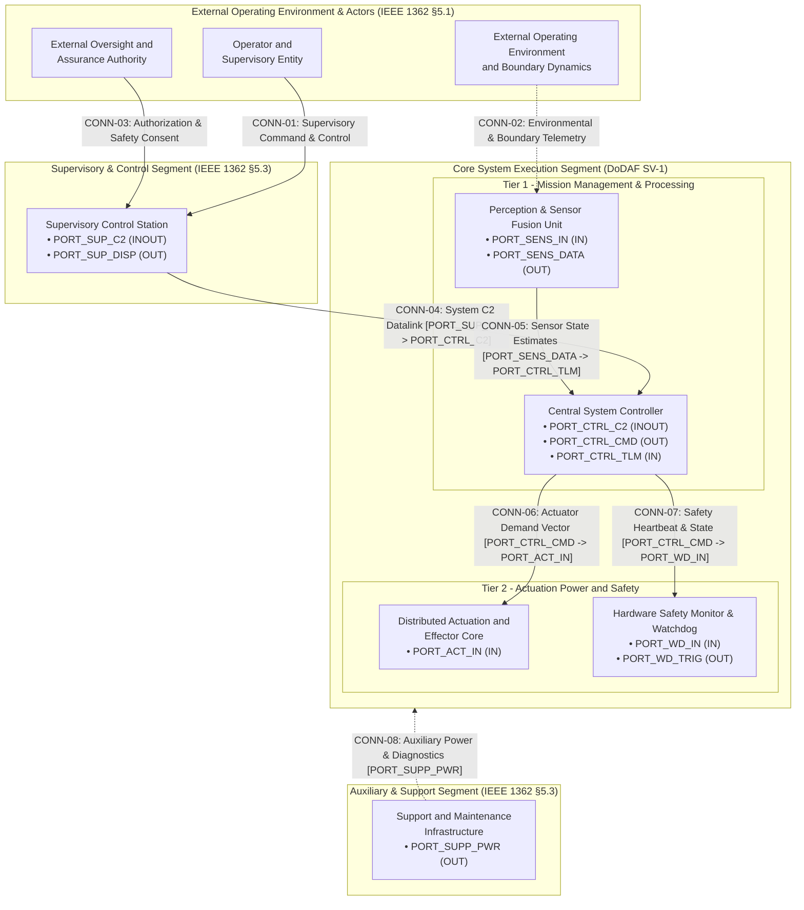
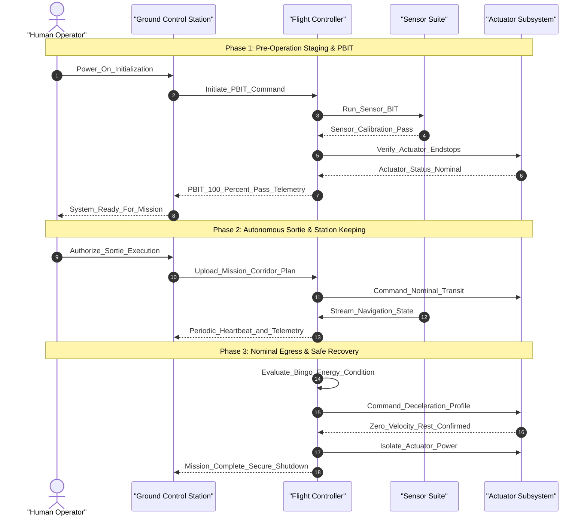
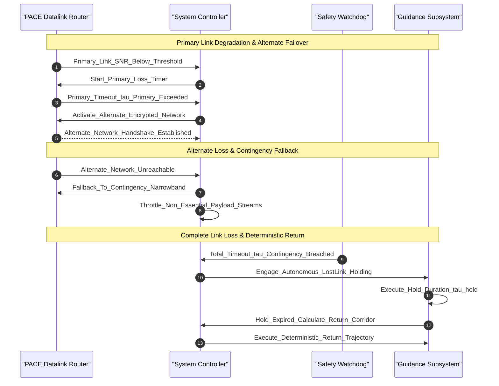
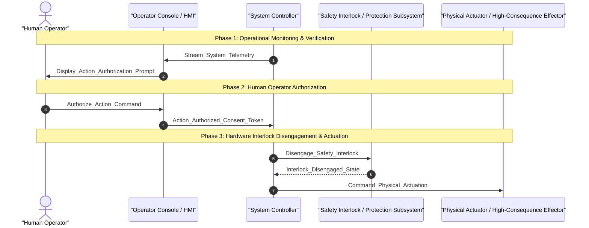

<!-- Copyright Gint Atkinson, gint.atkinson@gmail.com -->

---
name: spec-conops-engineering
description: "Synthesize hierarchical Concept of Operations (docs/conops/units/conops/) and Tactical Mission Intent (docs/conops/units/mission_intent/) specification units adhering to ISO/IEC/IEEE 29148:2018, INCOSE SE Handbook v5.0, NATO STANAG 4586, and MIL-STD-882E with pure schema contracts, zero truncation, and deterministic assembly via scripts/assemble_conops.py."
version: "1.0"
metadata:
  title: "Hierarchical ConOps & Mission Intent Engineering"
  category: specification
  risk: low
---

# Hierarchical Concept of Operations & Mission Intent Engineering (Worker ConOps)

Use this skill as the single canonical workflow for transforming high-level operational concepts, regulatory baselines, system architecture definitions, and normative research inventories into modular, machine-verifiable **Level 1B: Concept of Operations (ConOps)** and **Tactical Mission Intent** specification trees.

In accordance with [`rules/conops-mission-intent-integrity.md`](../../rules/conops-mission-intent-integrity.md), [`rules/sysml-ssot-completeness.md`](../../rules/sysml-ssot-completeness.md), and [`rules/latex-katex-integrity.md`](../../rules/latex-katex-integrity.md), ConOps and Mission Intent specifications bridge high-level operational intent with downstream structural extraction (Level 2 Epics and Features) and Model-Based Design (MBD) synthesis.

All specification units are authored as discrete, modular markdown files under `docs/conops/units/conops/` and `docs/conops/units/mission_intent/` adhering strictly to JSON Schema data contracts (`.pipeline/schemas/conops_specification_schema.json` and `.pipeline/schemas/mission_intent_specification_schema.json`) and compiled into canonical documents via `scripts/assemble_conops.py`.

### Architecture Hierarchy & Standards Governance (INCOSE SEH v5.0 §3.4.4 / ISO/IEC/IEEE 15288:2023 / ISO/IEC/IEEE 29148:2018 §6.4.2)

In accordance with **INCOSE Systems Engineering Handbook v5.0 (§3.4.4 Concept Definition)**, **ISO/IEC/IEEE 15288:2023 (§6.4.2 Stakeholder Needs and Requirements Definition & §6.4.3 Architecture Definition Process)**, and **ISO/IEC/IEEE 29148:2018 (§6.4.2 ConOps & §6.4.3 OpsCon)**, the DEAP specification compilation framework enforces a strict 5-tier architecture hierarchy:
1. **Level 1A: Stakeholder Intent, Normative Baseline & Threat Context**: Normative Research Inventory (`docs/research/RESEARCH_INVENTORY.md`), Failure Mode Registry (`docs/research/FAILURE_MODE_REGISTRY.md`), and regulatory obligations baseline.
2. **Level 1B: Concept of Operations (ConOps) & Tactical Mission Intent**: Operational Activities (`OA-01`..`OA-N`), multi-threaded operational scenarios (`SCN-01`..`SCN-N`), operational information exchanges (`OpTx-01`..`OpTx-N`), METL tasks (`MET-01`..`MET-N`), operational lifecycle modes ($\Phi_{\mathrm{lifecycle}}$), 4D boundary containment mathematics, and High-Level Operational Architecture (OV-1 / OV-2 / SV-1).
3. **Level 1C: Logical & Physical Interface Control Documents (ICD)**: Interface Control Documents (`docs/icd/ICD_01_SYSTEM_INTERFACE_MATRIX.md` and `docs/icd/ICD_02_MASTER_SIGNAL_DICTIONARY.md`), discrete port dictionaries, pinouts, bus topologies, and wire framing.
4. **Level 2: System Requirements Specification (SyRS) & Functional Architecture**: Downstream structural requirements consisting of Epics (`epic-xx`), Features (`feat-xx`), User Stories (`us-xx`), and formal System Use Cases (`uc-xx`).
5. **Level 3: Detailed Design & Model-Based Design (MBD)**: Low-level software and hardware requirements, MATLAB / Simulink / Stateflow / Embedded Coder synthesis models, target source code, and Piece-Part BOM FMECA (MIL-STD-1629A Method 102).

### Strict Level 1B vs. Level 2 Metamodel Abstraction Boundary
- **ConOps Operational Scope (Level 1B)**: ConOps models user operational viewpoints, user classes, operational activities (`OA-xx`), and operational scenarios (`SCN-xx`).
- **Strict Exclusion of Level 2 System Use Cases**: ConOps documents and SV-1 diagrams are strictly forbidden from defining, citing, or injecting formal Level 2 System Use Cases (`uc-xx`). Formal System Use Cases (`uc-xx`) specify technical system functions realizing Level 2 Features and belong strictly in downstream System Requirements Specifications (SyRS Level 2 under `docs/use-cases/`).

> [!TIP]
> This skill enforces mathematical determinism, pure open schema contracts ($N \ge N_{\mathrm{min}}$), open multi-domain threat taxonomies, and 100% public clause citations across all operational and mission intent deliverables.

## Closed-Loop Payload Verification Gate & Anti-Complacency Rule
- **Exit code 0 is NEVER sufficient proof of success.**
- After generating or publishing any ConOps artifact or tracker issue, the agent MUST run live payload inspection (`gh issue view <ID>` or `glab issue view <ID>`) to verify markdown table alignment, LaTeX math blocks, schema citations, and link validity.
- **Optimism bias is prohibited**: agents must cite empirical output of live payload inspection before declaring completion.

---

## Execution Trigger & Pipeline Sequencing

You should invoke this skill as **Phase 0.75 (Worker ConOps - Hierarchical ConOps & Mission Intent Tree Engineer)** within the Master Orchestrator lifecycle (`skills/spec-orchestrator/SKILL.md`):
- **Preceding Phase**: Phase 0.5 (`Normative Research Worker`) has ingested domain standards, mapped public clauses, and synthesized `docs/research/RESEARCH_INVENTORY.md` with the Declared-Total Population Register.
- **Succeeding Phase**: Phase 1 (`Structural Spec Worker`) consumes the operational activities (`OA-*`), operational modes ($\Phi_{\mathrm{lifecycle}}$), and mission essential tasks (`MET-*`) defined here to allocate subsystem capabilities, Epics, and Features.

---

## Step 1: Context Ingestion & Pre-Flight Analysis

The `Worker ConOps` ingests and synthesizes the following foundational inputs:

1. **Normative Research Inventory & Standards Baseline**:
   - Ingest `docs/research/RESEARCH_INVENTORY.md` and `docs/research/FAILURE_MODE_REGISTRY.md`.
   - Extract all applicable standards: ISO/IEC/IEEE 29148:2018 (§6.4.2 ConOps & §6.4.3 OpsCon), INCOSE Systems Engineering Handbook v5.0, NATO STANAG 4586, MIL-STD-882E, RTCA DO-178C / DO-254, and SAE ARP4754A / ARP4761 (domain-specific standards, such as JARUS SORA v2.5, are derived from the active schema).
   - Map all allocated obligations (`OBL-*`) assigned to ConOps and Mission Intent.

2. **System Architecture & Structural Schemas**:
   - Ingest `.pipeline/schema.sysml` and `.pipeline/schema-digest.json` to extract system boundaries, subsystems, and architectural partitions.
   - **Mandatory AST Manifest Ingestion**: Ingest the explicit manifest of all AST `state def` prefix families with 2 or more states ($\ge 2$ states) and AST `part def` nodes with ports, actions, and constraints for Section 6.1 Stateflow synthesis hooks, Section 7 FMECA tables, and **Section 4 Super-System and Subsystem Architecture synthesis**.
   - **Mandatory AST Part Taxonomy Invariant**: Enforce automated extraction of all `part def` blocks from `schema/` and `.pipeline/schema.sysml`. Require ConOps Section 4 to synthesize formal Super-System Architecture (Air Vehicle / Primary Segment, Ground Segment, Launch / Support Segment) and Subsystem Architecture subsections for 100% of declared AST `part def` nodes (100% AST part coverage invariant).
   - Ingest domain schemas under `schema/` (OMG IDL, Protobuf, ARXML, SysML v2).

3. **Safety & Risk Baselines (3-Tier Lifecycle Integration)**:
   - Ingest Tier 1 Functional Hazard Assessment (FHA per SAE ARP4761 §3) and Operational Hazard Analysis (OHA per MIL-STD-882E Task 202) covering declared mission functions (`Propel`, `Navigate`, `Communicate`, `Sense`, `Contain`).
   - Ingest Tier 2 Functional FMECA & STPA (MIL-STD-1629A Method 101) failure modes, hazard rosters, and domain regulatory integrity level profiles (e.g. JARUS SORA Ground Risk Class (GRC) / Air Risk Class (ARC) or standard safety integrity levels derived from the active schema).
   - Extract containment boundaries, emergency failsafe states, and statutory energy reserve requirements.
   - Note: Tier 3 Piece-Part BOM FMECA (MIL-STD-1629A Method 102) is performed during detailed physical engineering (Run 3) and is not required for Run 1 concept formulation.

4. **User Operational Intent**:
   - Ingest operational purpose statements, stakeholder expectations, multi-threaded operational scenarios, and Commander's intent.

---

## Step 2: Discrete Unit Extraction & Schema Contract Mapping

The `Worker ConOps` partitions the specification space into discrete, modular units adhering to `.pipeline/schemas/conops_specification_schema.json` and `.pipeline/schemas/mission_intent_specification_schema.json`.

### 2.1 Concept of Operations Modular Units (`docs/conops/units/conops/`)

The ConOps specification tree consists of 12 canonical modular units:

| Unit Filename | Section Number & Title | JSON Schema Mapping | Mandatory Contents & Invariants |
| :--- | :--- | :--- | :--- |
| `01_METADATA_AND_OVERVIEW.md` | `## 1. Scope, System Identification & Normative Baseline` | `operational_context`, `user_classes` | System ID, domain classification, physical/legal boundaries, stakeholder roster, user classes (UCL-xx). |
| `02_DEFICIENCIES_AND_MOTIVATION.md` | `## 2. Current Situation, Deficiency Analysis & Operational Motivation` | `deficiencies` | Predecessor baseline, technical, operational, and human deficiencies. |
| `03_PROPOSED_CAPABILITIES.md` | `## 3. Proposed Capabilities & Operational Justification (Trade-Offs)` | `proposed_capabilities` | Mission drivers, value propositions, engineering trade-off evaluations. |
| `04_SYSTEM_ARCHITECTURE.md` | `## 4. System Operational Architecture & Physical Subsystem Decomposition` | `system_architecture` / `operational_context` | Super-System Architecture (Air Vehicle, Ground Segment, Launch System) conforming to Option 3 (Compact Subsystem Blocks with Embedded Port Attributes and max 3-column vertical tier partitioning); Subsystem Architecture subsections covering 100% of declared AST `part def` nodes; Port Taxonomy and SSOT Model Binding statement (accepts backward-compatible alias `04_USER_CLASSES_AND_STAKEHOLDERS.md`). |
| `05_OPERATIONAL_STATE_SPACE_AND_RISK.md` | `## 5. Operational State Space, Boundary Containment & Risk Assessment` | `operational_containment_and_risk` | 4D volume mathematical formulation, Boundary Containment Margin ($R_{\mathrm{containment}} \ge R_{\mathrm{min}}$) equation, and boundary containment / risk parameters table. |
| `06_UAF_OPERATIONAL_ACTIVITIES.md` | `## 6. OMG UAF Operational Activity Taxonomy` | `uaf_activities` | Open-ended UAF activity roster (`OA-01`..`OA-N`) with mandatory Gate 24 allocation tags (`/// OperationalAllocation: [OA-XX]`). |
| `07_OPTX_EXCHANGES.md` | `## 7. Operational Information Exchange (Op-Tx) Matrix` | `optx_exchanges` | Information exchange roster (`OpTx-01`..`OpTx-N`) specifying source, destination, data rates, latency limits, criticality; captures high-level operational information exchanges (C2 Commands, Telemetry, Video, Target Tracks, Arming Authorization) and strictly excludes component-internal serial opcode reference tables; enforces 100% Op-Tx sequence parity where declared exchanges are partitioned across canonical operational interaction sequence diagrams (`Diagram 10.1` through `Diagram 10.4`) with zero uncovered Op-Tx exchanges. |
| `08_ENVIRONMENTAL_OPERATING_LIMITS.md` / `08_ENVIRONMENTAL_MIL_STD_810H.md` | `## 8. Environmental Operating Limits & Stress Qualification` | `environmental_envelopes` | Ambient temperature, ingress protection (IP), electromagnetic/RF environment, spatial clearance envelopes. |
| `09_SCENARIOS_AND_TIMELINES.md` | `## 9. Multi-Threaded Operational Scenarios & System Timelines` | `scenarios` | Nominal, degraded, and contingency scenario threads with sequential execution steps and exit criteria; enforces 100% scenario-to-diagram parity where 100% of declared operational scenarios (`SCN-01`..`SCN-N`) MUST include a dedicated `OV-6c` Mermaid sequence diagram (`sequenceDiagram`) detailing multi-threaded lifeline sequences across the canonical scenario spectrum spanning nominal sortie, GNSS-denied navigation, lost C2 link, tactical abort, bingo energy divert, and boundary containment / flight termination. |
| `10_MAINTENANCE_AND_GSE_SUPPORT.md` | `## 10. Maintenance & Sustainment Concepts (O/I/D Maintenance)` | `maintenance` | Three-tier maintenance model: Organizational (O-Level), Intermediate (I-Level), Depot (D-Level). |
| `11_IMPACTS_AND_TRADE_STUDIES.md` | `## 11. Operational Impacts, System Limitations & Documented Trade Studies` | `proposed_capabilities` | Mission drivers, value propositions, engineering trade-off evaluations. |
| `12_EMERGENCY_DECISION_MATRIX.md` | `## 12. 7-Row Emergency Decision & Contingency Matrix` | `emergency_matrix` | Canonical emergency triggers (`EMG-01`..`EMG-07`) with detection mechanisms, failsafe recovery states, max response times, and HITL authority roles. |

### 2.2 Tactical Mission Intent Modular Units (`docs/conops/units/mission_intent/`)

The Tactical Mission Intent specification tree consists of 10 canonical modular units:

| Unit Filename | Section Number & Title | JSON Schema Mapping | Mandatory Contents & Invariants |
| :--- | :--- | :--- | :--- |
| `01_COMMANDERS_INTENT.md` | `## 1. Commander's Intent & Operational Objectives` | `commanders_intent` | Operational purpose, key mission tasks, and desired end state. |
| `02_MISSION_ESSENTIAL_TASK_LIST.md` | `## 2. Mission Essential Task List (METL)` | `metl_tasks` | Doctrinal task list (`MET-01`..`MET-N`) with conditions, quantitative metrics, verification methods, and Gate 24 allocation tags. |
| `03_INCOSE_MOE_MOP_MATH.md` | `## 3. Measures of Effectiveness (MoE) & Measures of Performance (MoP) Metrics` | `incose_moe_mop` | INCOSE SEH v5.0 metrics table with KaTeX mathematical formulas, Threshold and Objective performance values, and engineering units. |
| `04_MULTI_DOMAIN_THREAT_MATRIX.md` | `## 4. Multi-Domain Operational Threat & Contested Environment Matrix` | `threat_matrix` | Open multi-domain threat matrix across Kinetic, Mechanical, Environmental, EW/Cyber, Power/Thermal, Optical, and Human domains with public clause citations. |
| `05_PACE_C2_PLAN.md` | `## 5. PACE C2 Link Communications Plan` | `pace_c2_plan` | 4-tier PACE communications plan (Primary, Alternate, Contingency, Emergency) with frequency bands, bandwidth, heartbeat timeouts, and failover hysteresis. |
| `06_SAFETY_INTERLOCKS.md` | `## 6. Safety Constraints & Subsystem Interlocks` | `safety_interlocks` | Safety constraints, interlock predicates, and subsystem state interlocks (`INT-01`..`INT-N`) derived from AST constraint and state definitions. |
| `07_AIRSPACE_GEOZONES.md` | `## 7. Airspace Deconfliction & U-space Dynamic Geo-Zones` | `airspace_geozones` | Primary boundary perimeter, dynamic exclusion/keep-out zones, and horizontal/vertical separation minima. |
| `08_GO_NO_GO_MATRIX.md` | `## 8. Go/No-Go Decision Matrix` | `go_no_go_matrix` | Operational phase checks (`GNG-01`..`GNG-N`), threshold conditions, sensors/mechanisms, and deterministic Go/No-Go actions. |
| `09_BINGO_ENERGY_MATH.md` | `## 9. Bingo Energy Mathematics & Secondary Divert Protocols` | `bingo_energy_math` | Bingo energy dynamics formulation ($E_{\mathrm{bingo}}(t)$), statutory reserve ratio constraint ($\ge 20\%$), and energy parameter table. |
| `10_OPERATIONAL_ALLOCATION_TAGS.md` | `## 10. Gate 24 MissionTask Traceability Tags` | `allocation_tags` | Comprehensive listing of Gate 24 allocation tags (`/// OperationalAllocation: [MET-XX]`) for cross-model traceability. |

### 2.3 System Architecture Diagram Representation Standard (Option 3)
In accordance with DoDAF v2.02 SV-1, IEEE 1362 §5.3, ISO/IEC/IEEE 15288:2023, INCOSE SE Handbook v5.0 (§3.4.4), and ISO/IEC/IEEE 29148:2018 §6.4.2–§6.4.3, all system interface and super-system architectural diagrams MUST implement **Option 3 (Compact Subsystem Block Representation with Embedded Port Attributes and Vertical Hierarchical Tiers)**:
1. **High-Level Operational Architecture Scope (Level 1B)**: The ConOps (Level 1B) represents High-Level Operational Architecture (OV-1 / OV-2 / High-Level SV-1) partitioned across operational segments (Ground Segment, Air Vehicle Segment, Launch Segment, External Actors) with operational information exchanges (Op-Tx: C2 Commands, Telemetry, Video, Target Tracks, Arming Authorization).
2. **Strict Level 1B vs. Level 2 Boundary**: ConOps contains Operational Activities (`OA-xx`) and Operational Scenarios (`SCN-xx`), and strictly excludes formal System Use Cases (`uc-xx`), which belong in SyRS Level 2.
3. **User Class Taxonomy Disambiguation (`UCL-xx`)**: In accordance with ISO/IEC/IEEE 29148:2018 §5.2.4, operational User Classes MUST use the `UCL-xx` prefix (`UCL-01` through `UCL-N`), strictly isolating stakeholder taxonomy from SyRS Level 2 System Use Cases (`uc-xx`) to prevent downstream agent reasoning collisions and automated sanitization corruption.
4. **Strict Level 1B vs. Level 1C ICD Boundary**: Detailed internal wire-level interconnects, pinouts, RS-485 serial framing, opcodes (0x10, 0x11, etc.), register bitmasks, and CRC-16 equations belong strictly in Level 1C Interface Control Documents (`ICD_01_SYSTEM_INTERFACE_MATRIX.md` and `ICD_02_MASTER_SIGNAL_DICTIONARY.md`), NOT in the ConOps document. ConOps SV-1 diagrams and Section 8 (Op-Tx) capture high-level operational information exchanges and strictly exclude component-internal serial opcode reference tables.
5. **Option 3 Standard: Compact Subsystem Blocks with Embedded Port Attributes & Vertical Hierarchical Tiers**: Subsystems must be represented as unified compact nodes representing high-level operational subsystem interconnections, buses, and architectural segments. Embedding high-level port attributes (`[<b>Name</b><br/>• PORT-... (DIRECTION)]`) is supported for black-box abstraction without causing diagram bloat from isolated port nodes.
6. **Vertical Hierarchical Tier Partitioning (`direction TB`)**: Diagram flow must follow a top-to-bottom layout (`flowchart TD` / `direction TB`) partitioned into vertical subsystem tiers with a maximum of 3 columns horizontally (max 3-column vertical tier partitioning), eliminating unconstrained horizontal sprawl.
7. **Decoupled Operational Abstraction & Figure 4.9 Guidance**: ConOps SV-1 diagrams (e.g. Figure 4.1 / Figure 4.9) capture high-level operational subsystem interconnections, buses, and architectural segments per IEEE 1362 §5.3 and DoDAF SV-1. They do NOT mandate 1:1 parity with detailed pinout-level wire connections or private internal LRU child ports from Level 1C ICDs (`ICD_01_SYSTEM_INTERFACE_MATRIX.md`). Specifically, ConOps SV-1 / Figure 4.9 represents operational subsystem interconnections, whereas detailed wire contracts (`CONN-01`..`CONN-N` pinout pairs) are defined at Level 1C (ICD).
8. **Traceable Direct Interconnects**: Connection links (`CONN-01`..`CONN-N`) must route directly between subsystem blocks, citing the relevant port interfaces in the link label.

---

## Step 3: Standalone Unit Authoring & File System Layout

The `Worker ConOps` writes individual modular files under the dedicated unit directories:

```
docs/conops/
└── units/
    ├── conops/
    │   ├── 01_METADATA_AND_OVERVIEW.md
    │   ├── 02_DEFICIENCIES_AND_MOTIVATION.md
    │   ├── 03_PROPOSED_CAPABILITIES.md
    │   ├── 04_SYSTEM_ARCHITECTURE.md
    │   ├── 05_OPERATIONAL_STATE_SPACE_AND_RISK.md
    │   ├── 06_UAF_OPERATIONAL_ACTIVITIES.md
    │   ├── 07_OPTX_EXCHANGES.md
    │   ├── 08_ENVIRONMENTAL_OPERATING_LIMITS.md (or 08_ENVIRONMENTAL_MIL_STD_810H.md)
    │   ├── 09_SCENARIOS_AND_TIMELINES.md
    │   ├── 10_MAINTENANCE_AND_GSE_SUPPORT.md
    │   ├── 11_IMPACTS_AND_TRADE_STUDIES.md
    │   └── 12_EMERGENCY_DECISION_MATRIX.md
    └── mission_intent/
        ├── 01_COMMANDERS_INTENT.md
        ├── 02_MISSION_ESSENTIAL_TASK_LIST.md
        ├── 03_INCOSE_MOE_MOP_MATH.md
        ├── 04_MULTI_DOMAIN_THREAT_MATRIX.md
        ├── 05_PACE_C2_PLAN.md
        ├── 06_SAFETY_INTERLOCKS.md
        ├── 07_AIRSPACE_GEOZONES.md
        ├── 08_GO_NO_GO_MATRIX.md
        ├── 09_BINGO_ENERGY_MATH.md
        └── 10_OPERATIONAL_ALLOCATION_TAGS.md
```

### Unit Authoring Invariants:
1. **Zero Unresolved Placeholder Tokens**: No unit file may contain raw placeholder tokens (e.g. `{{SYSTEM_IDENTIFIER}}`, `{{OA_01_NAME}}`). All values must be concretely resolved.
2. **Zero Empty Files**: Every unit file must contain non-empty, substantive specification content.
3. **No Header Metadata Duplication**: Individual unit files should focus purely on section markdown headings and content; master document metadata is managed during assembly.

---

## Step 4: Pure Open Schema Generation & Architectural Invariants

The `Worker ConOps` must strictly enforce the following repository rules:

### 4.1 Pure Open Schema Contract ($N \ge N_{\mathrm{min}}$)
- Per [`rules/conops-mission-intent-integrity.md`](../../rules/conops-mission-intent-integrity.md), all table schemas and list structures are open-ended collections.
- Static row ceilings, hardcoded array caps, or truncation heuristics are strictly forbidden.
- Minimum cardinality constraints ($N_{\mathrm{min}}$) must be satisfied:
  * Emergency Decision Matrix: $N \ge 7$ canonical triggers (`EMG-01` through `EMG-07`).
  * PACE C2 Plan: $N \ge 4$ tiers (`Primary`, `Alternate`, `Contingency`, `Emergency`).
  * METL Tasks: $N \ge 1$ task entries.
  * Threat Matrix: $N \ge 1$ threat entries.
  * UAF Activities: $N \ge 1$ activity entries.

### 4.2 Open Multi-Domain Threat Taxonomy
The threat matrix (`04_MULTI_DOMAIN_THREAT_MATRIX.md`) must cover multi-domain threats across all canonical operational domains:
1. **Kinetic**: Projectiles, collisions, interceptors, physical debris.
2. **Mechanical**: Structural fatigue, actuator jamming, motor bearing seizure, propeller delamination.
3. **Power / Thermal**: Battery thermal runaway, ESC over-temperature, power distribution rail collapse.
4. **Environmental**: Severe turbulence, icing, icing-induced pitot freeze, lightning strike, volcanic ash.
5. **EW / Cyber**: GNSS jamming/spoofing, RF link interception, telemetry injection, malicious firmware ingress.
6. **Optical**: Laser blinding of electro-optical sensors, camera lens saturation, optical tracking denial.
7. **Signature / Acoustic**: Acoustic emission harmonics, infrared signature, radar cross-section observability.
8. **Human Factors**: Operator fatigue, command input disparity, unauthorized override attempts.
9. **CBRN**: Chemical plumes, toxic particulate, hazardous contamination.

### 4.3 KaTeX Mathematical Rendering Integrity
Per [`rules/latex-katex-integrity.md`](../../rules/latex-katex-integrity.md):
- **Display Math Blocks**: All mathematical formulations must be placed inside dedicated display blocks using `$$ \begin{aligned} ... \end{aligned} $$` on separate newlines.
- **Pure Symbolic Math**: Do NOT embed physical unit macros (e.g. `\text{ m}`, `\text{ m/s}`, `\text{ J}`) inside LaTeX math blocks. Units must be defined in the accompanying parameter table.
- **No Table Math Delimiters**: Never use `$ ... $` or `$$ ... $$` math delimiters inside Markdown table cells. Use standard plain text and Unicode characters (e.g., `h_max m`, `deg`, `m/s`, `J`, `tau_max ms`).
- **Parameter Definitions & Engineering Units Tables**: Display equations must be immediately followed by a parameter definition table specifying symbols, values, units, and engineering descriptions.

- **Pure Schema-Driven Mathematical Formulation Invariant**:
  All mathematical equations and parameter definition tables in ConOps derive 100% and exclusively from AST nodes (`constraint def`, `calc def`, and attribute constraints) present in the user-provided SysML schemas in `schema/`.
- **Universal Formatting Contract**: Every mathematical constraint rendered as a display block `$$ \begin{aligned} ... \end{aligned} $$` must be followed by a parameter definition table specifying symbols, values, units, and descriptions extracted directly from the schema AST node attributes.
- **Zero Pre-Baked Equations**: The compiler contains ZERO pre-baked equations.

### 4.4 Mandatory AST Subsystem Architecture Invariant & Primary System Architecture Diagram (IEEE 1362 §5.3 / DoDAF SV-1 / ISO 29148 §6.4.2–§6.4.3 / ISO 15288:2023 / INCOSE SEH v5.0 §3.4.4)
Per IEEE 1362-1998 §5.3 (Operational Environment & System Architecture), DoDAF v2.02 SV-1 (Systems Interface Description), ISO/IEC/IEEE 29148:2018 §6.4.2–§6.4.3 (ConOps & OpsCon Architecture), ISO/IEC/IEEE 15288:2023 (§6.4.2 & §6.4.3), INCOSE Systems Engineering Handbook v5.0 §3.4.4 & §3.3, and the Pure Schema-Driven Compiler Invariant:

- **100% AST Part Coverage & Mathematical Parity Invariant**: ConOps Section 4 must synthesize formal Super-System Architecture and dedicated Subsystem Architecture subsections for 100% of declared `part def` nodes present in the SysML AST in exact lockstep mathematical parity with the primary SV-1 architecture diagram.
- **Strict Level 1B vs. Level 2 Metamodel Abstraction Boundary**: ConOps models Operational Activities (`OA-xx`) and Operational Scenarios (`SCN-xx`), and strictly excludes formal Level 2 System Use Cases (`uc-xx`), which belong in SyRS Level 2. Operational User Classes MUST use the `UCL-xx` prefix (`UCL-01`..`UCL-N`) per ISO 29148 §5.2.4, strictly isolating stakeholder taxonomy from SyRS Level 2 System Use Cases (`uc-xx`).
- **Level 1B Operational Architecture Scope & Level 1C ICD Distinction**: ConOps (Level 1B) represents High-Level Operational Architecture (OV-1 / OV-2 / High-Level SV-1 / Figure 4.9) partitioned across operational segments derived dynamically from the SysML AST in schema/ (along with External Actors) with operational information exchanges (Op-Tx: supervisory commands, telemetry, payload streams, status, authorization). ConOps Figure 4.9 captures high-level operational subsystem interconnections, buses, and architectural segments per IEEE 1362 §5.3 and DoDAF SV-1. It does NOT mandate 1:1 parity with detailed pinout-level wire connections or private internal LRU child ports from Level 1C ICDs (`ICD_01_SYSTEM_INTERFACE_MATRIX.md`). Detailed internal wire-level interconnects, pinouts, RS-485 serial framing, opcodes (0x10, 0x11, etc.), register bitmasks, and CRC-16 equations belong strictly in Level 1C Interface Control Documents (`ICD_01_SYSTEM_INTERFACE_MATRIX.md` and `ICD_02_MASTER_SIGNAL_DICTIONARY.md`), NOT in the ConOps document. Section 8 (Op-Tx) captures high-level operational information exchanges and strictly excludes component-internal serial opcode reference tables.
- **Primary System Architecture Diagram & Super-System Architecture (Section 4.7 / Figure 4.9 ConOps SV-1 Guidance)**:
  1. **Dynamic AST Segment Synthesis & Decomposition (IEEE 1362 §5.3 / DoDAF SV-1)**: 100% Line Replaceable Unit (LRU) and subsystem identification partitioned across top-level operational segments derived 100% from top-level packages or segment blocks declared in the user's SysML AST in `schema/` with black-box abstraction. Top-level operational segments and Mermaid layout subgraphs in the SV-1 diagram derive dynamically from the schema AST rather than pre-baked domain topologies.
  2. **Discrete Port Definitions (SysML v2 Port Taxonomy)**: All external and internal subsystem interfaces MUST declare explicit ports with directionality (`PORT-<SUBSYS>-<NAME> (IN/OUT/INOUT)`) and high-level bus interconnects. ConOps Figure 4.9 captures high-level operational subsystem interconnections, buses, and architectural segments per IEEE 1362 and DoDAF SV-1, and does NOT mandate 1:1 parity with detailed pinout-level wire connections or private internal LRU child ports from Level 1C ICDs (`ICD_01_SYSTEM_INTERFACE_MATRIX.md`).
  3. **Exhaustive Item Flows & Traceable Connections (ISO 29148 §6.4.3 / IEEE 1362 §5.3)**: Every connection link in the architecture diagram MUST be explicitly labeled with an identifier (`CONN-01`..`CONN-N`) and flow payload covering:
     - **Information / Signal Exchanges**: Telemetry streams, supervisory commands, sensor feeds, discrete safety lines (Op-Tx: supervisory commands, telemetry, payload streams, status, authorization).
     - **Electrical Energy Transfers**: Regulated DC power distribution rails, battery charging buses.
     - **Mechanical / Aerodynamic Interfaces**: Physical mounting interfaces, environmental separation envelopes, aerodynamic forces.
     Operational diagrams (Figure 4.9) capture high-level subsystem interconnections and buses; detailed pin-to-pin wiring contracts and serial framing are deferred to Level 1C ICDs.
  4. **System Boundary & External Actor Interfaces (IEEE 1362 §5.1 / ISO 29148 §6.4.2)**: Explicit boundary encapsulation enclosing the system segments and formal external actor interfaces (Supervisory Operators, Range Safety Officers, GNSS constellations, Environmental dynamics).
  5. **Strict Exclusion of Internal Software Modules (DoDAF SV-4)**: ConOps SV-1 operates strictly at the physical and logical subsystem / LRU boundary. Internal software execution classes, internal algorithms, class methods, and function signatures belong in Level 2 detailed design / DoDAF SV-4 and are strictly prohibited in the Level 1B ConOps SV-1 diagram. Detailed physical wire pinouts, signal dictionaries, ICD connection matrices (Level 1C), and internal software classes/methods (Level 2) are strictly decoupled from Level 1B operational architecture.
   6. **Option 3 Standard: Compact Subsystem Blocks with Embedded Port Attributes, Vertical Hierarchical Tiers & Segment Layout Enforcement**:
      - **Embedded Port Attributes**: All subsystem blocks MUST embed their discrete ports as bulleted attributes inside the subsystem node definition (`[<b>Name</b><br/>• PORT-... (DIRECTION)]`), rather than rendering individual ports as separate downstream child nodes or nested single-component subgraphs. All node label lines MUST NOT exceed 35 characters and must be wrapped with `<br/>` per Rule E2.
      - **Vertical Hierarchical Tier Partitioning (`direction TB`) & Rule E3 Tiering**: Subgraphs and segment partitions MUST enforce top-to-bottom vertical layout (`direction TB`) with a maximum of 3 columns horizontally (max 3-column vertical tier partitioning). For large subsystem counts (15–25 subsystems), subsystems within a segment MUST be partitioned into 5–6 functional tiers of at most 3 nodes per row (`Tier_1` through `Tier_N`) chained with internal invisible rank spacers (`~~~`). Flat horizontal layout (`direction LR`), flat declaration of > 3 subsystems in a segment without tier subgraphs, or untiered horizontal chaining is strictly prohibited to prevent unreadable horizontal diagram sprawl (Rule E3).
      - **Dynamic AST Segment Vertical Chaining Pattern**: Top-level operational segments and Mermaid layout subgraphs in the SV-1 diagram derive 100% from top-level packages or segment blocks declared in the user's SysML AST in `schema/`. Dynamic vertical spacers (`~~~`) MUST be generated between declared AST segments in top-to-bottom sequence (e.g. `External_Actors ~~~ Segment_1`, `Segment_1 ~~~ Segment_2`, ...). Omitting rank spacers between segments causes Dagre to place all segments on Rank 0 (collapsing onto a single horizontal line across Markdown/Mermaid renderers).
      - **100% Mathematical Parity with Section 4.8 Allocation Table**: Every subsystem block in the SV-1 diagram embeds the exact set of typed logical and physical ports (`• PORT-... (DIRECTION)`) matching the Section 4.8 Physical & Logical Interface Allocations table rows 1:1, derived deterministically from 100% of declared AST `part def` nodes in exact lockstep.
      - **Direct Traceable Interconnects**: Directed connection links (`CONN-01`..`CONN-N`) route directly between compact subsystem nodes and external actors using directed flows (`-->`), strictly avoiding bidirectional links (`<-->` or `<==>`) which trigger Dagre rank collapse onto a single horizontal line (Rule E3).
   7. **Canonical Compliant Mermaid SV-1 Diagram Template**: The architecture diagram MUST be authored using a compliant Mermaid flowchart (`flowchart TD` or `flowchart TB`) declaring segment subgraphs, discrete port nodes, internal tier subgraphs with `~~~` spacers, mandatory inter-segment vertical spacers, and directed connection links (`CONN-XX`).
   8. **Operational Architecture Scope (Section 4.7)**: Section 4.7 represents High-Level Operational Architecture (OV-1 / OV-2 / High-Level SV-1) partitioned across operational segments derived dynamically from the schema AST (and External Actors) with operational information exchanges (Op-Tx: supervisory commands, telemetry, payload streams, status, authorization). ConOps Figure 4.9 captures high-level operational subsystem interconnections, buses, and architectural segments. It does NOT mandate 1:1 parity with detailed pinout-level wire connections or private internal LRU child ports from Level 1C ICDs (`ICD_01_SYSTEM_INTERFACE_MATRIX.md`). Detailed internal wire-level interconnects, pinouts, RS-485 serial framing, opcodes (0x10, 0x11, etc.), register bitmasks, and CRC-16 equations belong strictly in Level 1C Interface Control Documents (`ICD_01_SYSTEM_INTERFACE_MATRIX.md` and `ICD_02_MASTER_SIGNAL_DICTIONARY.md`), NOT in the ConOps document.

#### Figure 4.1: Canonical ConOps SV-1 Primary System Architecture Diagram Template (Option 3: Compact Blocks & Vertical Tiers)


- **Super-System Segment Allocation Matrix (Table 4.2 / Section 4.2)**:
  Physical subsystems, computational nodes, and functional elements must be allocated across operational segments enforcing clear physical and organizational ownership boundaries. Table 4.2 MUST include the `SSOT Ground Truth Source & Citation` column as column 3 (between `Operational Segment` and `Primary Functional Role`):
  `| Subsystem Part | Operational Segment | SSOT Ground Truth Source & Citation | Primary Functional Role |`
  Every row must provide direct machine-resolvable links to Level 0 schema documents and SysML AST part bindings (e.g. `[schema/<source_file>](schema/<source_file>#anchor) ("OEM Clause Title") | SysML v2: \`part def <NodeName>\``).

- **Subsystem Architecture & AST Part Allocation (Subsection 4.3 / Section 4.8)**:
  For EVERY declared AST `part def` node $p \in \text{AST}$, Section 4 must contain a dedicated subsection (`#### 4.3.x {part.name} Subsystem Architecture` / `#### 4.8.x {part.name} Subsystem Architecture`) specifying:
  1. **Functional Purpose & Scope**: Primary operational mission role derived from AST doc comments and actions.
  2. **Physical & Logical Interface / Port Allocations**: Declared input, output, and bidirectional ports (`PORT-... (IN/OUT/INOUT)`) and high-level bus interconnects in 100% lockstep parity with the SV-1 diagram. Detailed wire pinouts, register layouts, and serial framing are deferred to Level 1C ICD.
  3. **Power, Mass & Resource Envelopes**: Operating electrical power draw, mass partition budget ($m_{\mathrm{alloc}}$), and thermal operating envelopes.
  4. **Operational Role & Statechart Integration**: Lifecycle mode allocation ($\Phi_{\mathrm{lifecycle}}$) and active operational states.
  5. **Safety Invariants, Containment Interlocks & FMECA Linkage**: Watchdog interlocks, emergency trigger containment bindings (`EMG-01`..`EMG-07`), and safety criticalities.
  6. **SSOT Ground Truth Mapping**: Mandatory 6th bullet providing direct machine-resolvable links to Level 0 schema documents and SysML AST part bindings: `- **SSOT Ground Truth Mapping:** [schema/<source_file>](schema/<source_file>#anchor) ("OEM Clause Title") | SysML v2: \`part def <NodeName>\``. Every subsystem entry in Subsection 4.3 must contain this 6th bullet.
- **Section 4 Review Checklist for Worker ConOps**:
  The `Worker ConOps` MUST verify the following before finalizing Section 4:
  - [ ] **Table 4.2 SSOT Column Mandate**: Table 4.2 (`### 4.2 Super-System Segment Allocation Matrix`) includes the `SSOT Ground Truth Source & Citation` column as column 3 (between `Operational Segment` and `Primary Functional Role`), and every allocated subsystem cites an authoritative Level 0 schema document and SysML AST part binding.
  - [ ] **Subsection 4.3 6th Bullet Mandate**: Every subsystem entry in Subsection 4.3 (`### 4.3 Subsystem Architecture (100% AST Part Coverage)`) contains the mandatory 6th bullet: `- **SSOT Ground Truth Mapping:** [schema/<source_file>](schema/<source_file>#anchor) ("OEM Clause Title") | SysML v2: \`part def <NodeName>\`` providing direct machine-resolvable links to Level 0 schema documents and SysML AST part bindings.
  - [ ] **100% AST Part Coverage**: 100% of declared AST `part def` nodes have dedicated subsections in Subsection 4.3 in lockstep mathematical parity with the SV-1 diagram.
  - [ ] **Option 3 Compact Blocks & Vertical Tiers**: Mermaid SV-1 diagram implements Option 3 with embedded port attributes and vertical layout (`direction TB`) capped at 3 horizontal columns.
- **Zero-Omission Rule**: Omitting any declared AST `part def` is strictly forbidden and triggers compiler validation failure during `assemble_conops.py` assembly.
- **Level 1B Operational Boundary & Section 8 Op-Tx Exclusions**: Section 4.8 and Section 8 (Op-Tx) capture high-level operational information exchanges (Op-Tx: C2 Commands, Telemetry, Video, Target Tracks, Arming Authorization) and strictly exclude component-internal serial opcode reference tables, register bitmasks, RS-485 serial framing, and CRC-16 equations, which belong strictly in Level 1C Interface Control Documents (`ICD_01_SYSTEM_INTERFACE_MATRIX.md` and `ICD_02_MASTER_SIGNAL_DICTIONARY.md`).


### 4.5 100% Public Clause Citations
- Every threat mitigation, normative requirement, and operational task must cite authoritative public standards clauses (e.g. `ISO/IEC/IEEE 29148:2018 §6.4.2`, `IEEE Std 1558-2020 §4.5`, `RTCA DO-178C §6.3.1`, `MIL-STD-882E §4.4`, or domain-specific standards derived from the active schema).
- Speculative or un-cited additions are strictly forbidden.

### 4.6 Section 5 PACE C2 Link Communications Plan Template & Schema-Driven Extraction Guidelines
Per [`rules/sysml-ssot-completeness.md`](../../rules/sysml-ssot-completeness.md) and [`rules/conops-mission-intent-integrity.md`](../../rules/conops-mission-intent-integrity.md):
- **Zero Hardcoded Synthetic Timeouts Invariant**: Agents and Worker ConOps are strictly forbidden from hardcoding synthetic timeout constants (such as `tau_loss = 5.0 s`, `tau_reacquire = 15.0 s`, `tau_escalate = 30.0 s`) or ungrounded generic protocol standards (e.g. NATO STANAG 4586) into Section 5 PACE templates and generated artifacts.
- **Parametric Schema-Driven Extraction**:
  1. All PACE communications tiers (`Primary`, `Alternate`, `Contingency`, `Emergency`) must extract link medium characteristics, frequency bands ($f_{\mathrm{band}}$), data rates ($\text{Rate}_{\mathrm{nom}}$), and heartbeat timeout thresholds ($\tau_{\mathrm{timeout},i}$) dynamically from schema definitions in `schema/` (e.g., OMG IDL, Protobuf, ARXML, SysML v2 port contracts) and SysML `state def` timing constraints.
  2. Public clause citations must reference authoritative, grounded standards declared in `docs/research/RESEARCH_INVENTORY.md` (e.g., `IEEE Std 1558-2020 §4.5`, `MIL-STD-188-220E §5.3`, `MIL-STD-882E §4.3`, `NIST SP 800-82r3 §5.2`).
- **Parametric Failover Transition Dynamics Equation**:
$$
\begin{aligned}
\Delta t_{\mathrm{loss}}(t) &= t - t_{\text{last\_valid\_rx}} \\
\mathrm{State}(t) &= \begin{cases}
\mathrm{Tier}_i & \text{if } \Delta t_{\mathrm{loss}} < \tau_{\mathrm{timeout},i} \\
\mathrm{Tier}_{i+1} & \text{if } \Delta t_{\mathrm{loss}} \ge \tau_{\mathrm{timeout},i} \quad \text{for } t \ge t_{\mathrm{fail}} + \tau_{\mathrm{hysteresis},i+1}
\end{cases}
\end{aligned}
$$

- Parameter Definitions & Engineering Units:

| Parameter | Symbol | Units | Constraint / Rule | Description |
| :--- | :--- | :--- | :--- | :--- |
| Active Link Loss Duration | Delta t_loss | s | Measured Online | Measured elapsed duration since last authenticated frame |
| Primary Heartbeat Timeout | tau_timeout_Primary | s | tau_timeout_Primary > 0 | Timeout triggering fallback to Alternate tier extracted from schema |
| Alternate Heartbeat Timeout | tau_timeout_Alternate | s | tau_timeout_Alternate > tau_timeout_Primary | Timeout triggering fallback to Contingency tier extracted from schema |
| Contingency Heartbeat Timeout | tau_timeout_Contingency | s | tau_timeout_Contingency > tau_timeout_Alternate | Timeout triggering fallback to Emergency tier extracted from schema |
| Emergency Heartbeat Timeout | tau_timeout_Emergency | s | tau_timeout_Emergency > tau_timeout_Contingency | Timeout initiating definitive failsafe sequence extracted from SysML state def |
| Re-acquisition Hysteresis Window | tau_hysteresis | s | tau_hysteresis > 0 | Continuous stable link duration required before up-tier promotion |

### 4.7 Section 9/10 Operational Sequence Diagram Templates & Deterministic Safety Interlock Invariants (DoDAF OV-6c / ISO 29148 §6.4.2)
Per [`rules/sysml-ssot-completeness.md`](../../rules/sysml-ssot-completeness.md) §3 and MIL-STD-882E §4.4:
- **100% Scenario-to-Diagram Parity Invariant (Diagram 7 / OV-6c Lifeline Sequences)**:
  100% of declared operational scenarios (`SCN-01`..`SCN-N`) MUST include a dedicated `OV-6c` Mermaid sequence diagram (`sequenceDiagram`) detailing multi-threaded lifeline sequences and message exchanges between operational performers. Operational scenarios lacking an accompanying `sequenceDiagram` block fail Gate 30 under check ID `conops-ov6c-missing-scenario-diagram`.
- **Canonical Scenario Spectrum**:
  Operational scenarios MUST cover the canonical scenario spectrum spanning:
  1. **Nominal Sortie**: End-to-end mission lifecycle from pre-operation staging through autonomous state trajectory execution, on-station mission processing, precision recovery, and controlled shutdown.
  2. **GNSS-Denied Navigation**: Resilient sensor fusion, optical flow, visual-inertial odometry, and dead-reckoning fallback under satellite navigation denial.
  3. **Lost C2 Link**: Tiered PACE communications failover hierarchy, heartbeat loss timeout, autonomous holding patterns, and deterministic lost-link return protocols.
  4. **Tactical Abort**: Dynamic threat avoidance, operator supervisory veto, and controlled ingress abort.
  5. **Bingo Energy Divert**: Closed-loop energy margin evaluation, secondary recovery site selection, and statutory reserve preservation.
  6. **Boundary Containment / Flight Termination**: Critical boundary excursion detection, boundary containment margin enforcement, and failsafe termination.
- **Strict Prohibition of Autonomous High-Consequence Actuation**: Autonomous generation of irreversible physical actuation, high-energy discharge, or safety-critical effector commands without prior human operator authorization/consent is strictly prohibited across all specification tiers. Any sequence diagram attempting uncommanded or unauthorized physical actuation is immediately rejected under rule `factual-grounding-temporal-safety-violation`.
- **Mandatory Temporal Precedence of Human Consent**:
  In every Mermaid sequence diagram (`sequenceDiagram`) representing high-consequence operations or safety-critical actuation, an explicit Human-in-the-Loop (HITL) operator authorization command / consent token (e.g. `Operator ->> Console: Authorize_Action_Command`, `Console ->> SystemController: Action_Authorized_Consent_Token`) MUST temporally precede any physical interlock disengagement or actuation signal (`SystemController ->> SafetyInterlock: Disengage_Safety_Interlock`, `SystemController ->> PhysicalActuator: Command_Physical_Actuation`).
- **Abstract Temporal Safety Invariant Rule**: High-consequence or irreversible physical actuation commands require temporal predecessor human operator consent tokens if mandated by system safety requirements.

#### Figure 9.1: SCN-01 Nominal Lifecycle Flow


#### Figure 9.2: SCN-03 PACE Tiered Failover Hierarchy


#### Figure 9.3: SCN-05 Deterministic High-Consequence Safety Interlock Protocol


- **Mermaid & KaTeX Formatting Invariants**:
  1. Sequence diagram blocks MUST declare `sequenceDiagram` as the very first line inside ```` ```mermaid ````.
  2. All participant names and notes containing special characters, hyphens, slashes, or colons must be properly enclosed in double quotes.
  3. Every Mermaid block MUST be strictly closed with matching ```` ``` ```` on a newline.
  4. Display math formulations must use `$$ \begin{aligned} ... \end{aligned} $$` on separate newlines with no bare alignment `&` outside aligned blocks.

### 4.8 Canonical Op-Tx Operational Interaction Sequence Architecture & Parity Invariant (Diagram 10.1 - 10.4 / OMG UAF Op-Tx / ISO 29148 §6.4.2)
Per OMG UAF v2.0 Operational Information Views (Op-Tx) and ISO/IEC/IEEE 29148:2018:
- **100% Op-Tx Interaction Sequence Parity Invariant**: All declared operational information exchanges (`OpTx-01`..`OpTx-N`) in Section 7 MUST be realized across canonical operational sequence diagrams partitioned under `Diagram 10.1` through `Diagram 10.4`. If sequence diagrams exist in Section 7 but some declared Op-Tx exchanges are omitted from all sequence diagrams, the compiler emits a finding flagging the uncovered Op-Tx exchanges (`conops-optx-sequence-unrealized`).
- **Canonical 4-Part Op-Tx Interaction Architecture**:
  1. **Diagram 10.1: Command, Control & Supervisory Interaction Sequence**: Captures C2 uplink directives (`OpTx-09`), consolidated telemetry downlink (`OpTx-08`), external regulatory/deconfliction updates (`OpTx-14`), compressed video feeds (`OpTx-15`), and diagnostic blackbox offload (`OpTx-16`).
  2. **Diagram 10.2: Sensor Perception, Navigation & Payload Data Flow Sequence**: Captures primary sensor state telemetry (`OpTx-01`), external positioning/nav reference feeds (`OpTx-05`), raw payload sensor streaming (`OpTx-06`), and processed feature telemetry (`OpTx-07`).
  3. **Diagram 10.3: Real-Time Core Control & Actuation Feedback Loop Sequence**: Captures power resource and BMS telemetry (`OpTx-04`), closed-loop actuator control demand vectors (`OpTx-02`), and actuator state/thermal feedback (`OpTx-03`).
  4. **Diagram 10.4: Safety Monitoring, Watchdog Interlock & Failsafe Containment Sequence**: Captures controller watchdog heartbeat strobe (`OpTx-10`), statutory broadcast remote ID telemetry (`OpTx-13`), emergency failsafe triggers (`OpTx-11`), and failsafe squib/containment actuation lines (`OpTx-12`).
- **Domain-Neutral Performer Invariant**: All sequence diagrams in Section 7 MUST reference exclusively generic systems engineering performers (`OperatorConsole`, `CoreController`, `SensorSuite`, `ActuatorSubsystem`, `PayloadSubsystem`, `SafetyWatchdog`).

---

## The 3-Tier Multi-Run Safety & Threat Derivation Lifecycle

Safety, threat, and hazard derivation in DEAP follows a strict three-tier, multi-run architectural lifecycle to eliminate circular dependency deadlocks between operational concept definition and physical component selection:

### Tier 1 (Run 1: Mission Intent / Concept Formulation)
- **Primary Methodologies**: Functional Hazard Assessment (FHA) under **SAE ARP4761 §3** and Operational Hazard Analysis (OHA) under **MIL-STD-882E Task 202**.
- **Derivation Mechanism**: Threats and operational hazards are derived systematically from declared **Mission Functions** (`Propel`, `Navigate`, `Communicate`, `Sense`, `Contain`) and **Operating Domains** (`Kinetic`, `Mechanical`, `Power/Thermal`, `Environmental`, `EW`, `Cyber`, `Optical`, `Signature`, `Human Factors`, `CBRN`) using standardized hazard guide words:
  * `Loss`: Complete absence or cessation of the required mission function.
  * `Degraded`: Sub-nominal capacity, reduced bandwidth, or inadequate control authority.
  * `Intermittent`: Sporadic, discontinuous, or jittery functional execution.
  * `Uncommanded`: Inadvertent, unrequested, or anomalous functional activation.
- **Resolution & Scope Rule**: Run 1 **does NOT require piece-part BOM FMECA** (which creates a fatal circular dependency deadlock before physical hardware components are architected and selected). Instead, Run 1 strictly enforces 100% complete FHA and OHA functional hazard coverage across all declared mission functions and operational threat domains.

### Tier 2 (Run 2: ConOps / Logical Architecture & SysML)
- **Primary Methodologies**: Functional Failure Mode, Effects, and Criticality Analysis (FMECA) under **MIL-STD-1629A Method 101** and System-Theoretic Process Analysis (**STPA**).
- **Derivation Mechanism**: Failure modes and safety constraints are derived from logical subsystem blocks, data bus interfaces (e.g., CAN, Ethernet, Serial), inter-subsystem control loops, and operational activity transitions (`OA-*`).
- **Focus**: Logical interface boundaries, feedback loop delays, unsafe control actions (UCAs), and loss of functional redundancy.

### Tier 3 (Run 3: Detailed Engineering & Physical BOM)
- **Primary Methodologies**: Piece-Part Hardware Failure Mode, Effects, and Criticality Analysis (FMECA) under **MIL-STD-1629A Method 102**.
- **Derivation Mechanism**: Calculates quantitative failure rates ($\lambda$) and criticality metrics ($C_r$) for specific physical hardware components, commercial-off-the-shelf (COTS) parts, electrical interconnects, and circuit components based on empirical reliability handbooks (e.g. MIL-HDBK-217F, NPRD-2016).

### Derivation-Annotation Contract (Phase 0 Safety Engineering)
All analytical content across safety engineering deliverables (`docs/safety/STPA_MATRIX.md`) and operational safety assessments is an engineering derivative of the SSOT fact base, never an un-anchored fact itself. Every derived analytical cell (System Losses, Hazards, UCAs, Loss Scenarios, Safety Constraints, FMECA, Domain Regulatory Objectives) MUST carry four mandatory annotations:
1. **Input Anchors**: Precise citations of upstream SSOT document, section, and clause (or explicit silent source set declaration where product documentation is silent).
2. **Methodology Citation**: Authoritative governing methodology standard:
   - **Leveson STPA** for Losses (**L**), Hazards (**H**), Unsafe Control Actions (**UCA**), Loss Scenarios (**LS**), and Safety Constraints (**SC**).
   - **MIL-STD-1629A / SAE ARP4761** for FMECA Severity (**S**), Occurrence (**O**), Detection (**D**), and Criticality / Risk Priority Number (**RPN**).
   - **Domain Regulatory Objectives & Integrity Level Mapping** (replacing hardcoded SORA/GRC/ARC requirement; e.g., JARUS SORA v2.5 SAIL/OSO-01..24, DO-178C DAL, ISO 26262 ASIL derived from the active schema).
   - **ASTM F3269-17** for Run-Time Assurance (RTA) Safety Net monitors and MATLAB / Simulink / Stateflow / Embedded Coder synthesis hooks.
3. **Derivation Grade**: Explicit classification of analytical provenance:
   - `Directly Evidenced`: Direct empirical evidence from ingested SSOT schemas or normative requirements.
   - `Analytically Derived`: Formally computed or deduced via domain engineering logic.
   - `Declared Assumption`: Explicit engineering assumption when upstream sources are silent.
4. **Caveat**: Mandatory where upstream product documents are silent, recording:
   - The specific derivation attempt made.
   - The silent source set identified.
   - The downstream architectural impact and verification requirement.

---

## Step 5: Deterministic Modular Assembly Engine

Once all unit files are written and verified, execute the deterministic assembly engine:

```bash
python3 scripts/assemble_conops.py --input-dir docs/conops/units/ --output-dir docs/conops/ --verify
```

and compile the master specification documents:

```bash
python3 scripts/assemble_conops.py --input-dir docs/conops/units/ --output-dir docs/conops/
```

### Assembly Engine Responsibilities:
1. **Unit Integrity Verification**: Validates that all unit markdown files exist, are non-empty, and contain zero unresolved `{{...}}` placeholder tokens.
2. **Metadata Table Injection**: Synthesizes the standard document metadata header table at lines 1–10.
3. **Table of Contents (TOC) Synthesis**: Automatically parses H2 and H3 headings and generates a verified Markdown TOC.
4. **Internal Link & Anchor Validation**: Confirms 100% of internal anchor links (`#slug`) resolve cleanly to existing headings with zero broken links.
5. **Deterministic Output Emission**: Emits `docs/conops/CONOPS.md` and `docs/conops/MISSION_INTENT.md`.

---

## Step 6: Multi-Gate Verification & Backlog Synchronization

Before completing Phase 0.75, the `Worker ConOps` must execute and pass all required parity gates:

1. **Gate 26 Verification (ConOps & Mission Intent Completeness Validator)**:
   ```bash
   python3 -m unittest tests.test_conops_and_mission_intent_validators
   ```
   - Asserts all 12 mandatory sections exist in `CONOPS.md` and all 10 mandatory sections exist in `MISSION_INTENT.md`.
   - Validates boundary containment margin calculation ($R_{\mathrm{containment}} \ge R_{\mathrm{min}}$).
   - Validates Bingo energy statutory reserve ratio ($E_{\mathrm{reserve}} / E_{\mathrm{capacity}} \ge 0.20$).
   - Validates 7-row emergency matrix determinism (`EMG-01`..`EMG-07`).
   - Validates METL task allocations.

2. **Gate 28 & Gate 29 Verification**:
   - Verify that all ConOps-allocated obligations in `docs/research/RESEARCH_INVENTORY.md` are witnessed in `docs/conops/CONOPS.md` and `docs/conops/MISSION_INTENT.md` per `obligation_witness_validator.py` (Gate 29).
   - Verify coverage metrics per `coverage_digest_validator.py` (Gate 28).

3. **Untracked Infrastructure & Pre-Commit Check**:
   ```bash
   UNTRACKED_INFRA=$(git ls-files --others --exclude-standard docs/conops/ skills/ rules/ scripts/)
   if [ -n "$UNTRACKED_INFRA" ]; then
     git add docs/conops/ skills/ rules/ scripts/
   fi
   ```

4. **Tracker Issue Registration & Label Bootstrapping**:
   - Bootstrap tracker labels if not present:
     * GitHub: `gh label create conops --color 0e8a16 --description "Level 1B Concept of Operations & Mission Intent" --force`
     * GitLab: `glab label create --name "type::conops" --color "#0E8A16" --description "Level 1B Concept of Operations & Mission Intent"`
   - Register issues with full bodies (`--body-file docs/conops/CONOPS.md` and `--body-file docs/conops/MISSION_INTENT.md`).

5. **Commit & Return Control**:
   - Stage and commit the generated ConOps and Mission Intent artifacts:
     ```bash
     git add docs/conops/
     git commit -m "feat(conops): synthesize hierarchical Concept of Operations and Tactical Mission Intent suite"
     ```
   - Report completion and generated artifact paths back to the Master Orchestrator.
