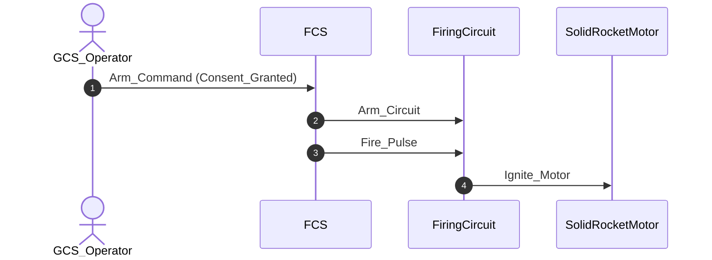

# Payload Deployment Use Case

## Human Authorized Ignition Sequence

```mermaid
sequenceDiagram
    autonumber
    actor Pilot as GCS_Operator
    participant Autopilot as FCS
    participant SafeArm as FiringCircuit
    participant Motor as SolidRocketMotor

    Pilot ->> Autopilot: Arm_Command (Consent_Granted)
    Autopilot ->> SafeArm: Arm_Circuit
    Autopilot ->> SafeArm: Fire_Pulse
    SafeArm ->> Motor: Ignite_Motor
```
